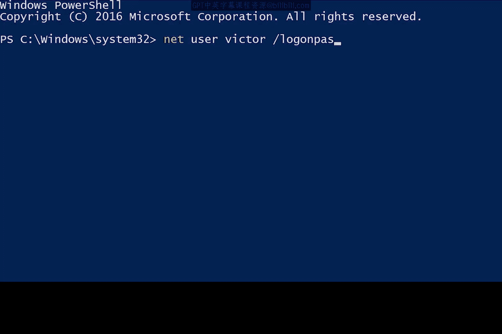

# 130：Windows密码管理 🔑

在本节课中，我们将学习如何在Windows系统中管理用户密码。密码是保护用户账户和计算机安全的重要部分，它确保只有账户所有者本人才能访问其账户和数据。我们将介绍通过图形用户界面（GUI）和命令行（PowerShell）两种方式来设置和重置密码。

## 密码的重要性与基本原则

上一节我们介绍了用户账户管理的基础，本节中我们来看看如何通过密码来增强账户的安全性。

密码为我们的用户账户和计算机增加了安全层。它确保只有马蒂本人知道访问她账户的“魔法秘密”，而其他任何人，甚至是计算机的管理员，都无法知晓。

设置密码时，必须确保只有你自己知道这个密码。请记住，如果你正在管理一台计算机上其他人的账户，你不应该知道他们的密码是什么。相反，你应该让用户自己输入密码。

## 通过图形界面（GUI）管理密码

接下来，我们将学习如何使用图形化工具来重置用户密码。

要重置图形用户界面中的密码，让我们回到计算机管理工具。在“本地用户和组”下，右键单击一个用户名，例如这个名为“Sarah”的账户。点击“属性”。

然后，在这里，我们只需勾选这个名为“用户下次登录时须更改密码”的复选框。我将点击“应用”并确定。这样，当用户登录该账户时，他们将被强制更改密码。

如果用户忘记了密码，你可以选择通过右键单击并选择“设置密码”来手动为他们设置一个新密码。不过，这种方法有一些注意事项，例如可能会失去对某些凭据的访问权限。你可以在本视频后的补充阅读材料中了解更多关于此选项的信息。

## 通过PowerShell命令行管理密码

上一节我们介绍了图形界面的操作方法，本节中我们来看看如何使用更高效的命令行工具。

要在PowerShell中更改本地密码，我们将使用DOS风格的`net`命令。虽然有一个原生的PowerShell命令可以用来设置密码，但它使用起来稍微复杂一些，需要一些简单的脚本知识。目前，我们将坚持使用更简单（尽管功能稍弱）的`net`命令。

`net`命令可以做许多不同的事情，更改本地用户密码只是其中之一。如果你想了解更多关于`net`命令的功能，可以查看补充阅读材料中的命令文档。由于这是一个旧的DOS风格命令，你也可以在命令行界面中使用`/?`参数来获取命令帮助。

以下是更改用户密码的命令格式：

```cmd
net user [用户名] [密码]
```


使用此命令的最佳方式是使用星号`*`，而不是在命令行中直接写出密码。如果你使用星号，`net`命令会暂停并提示你输入密码，像这样：

```cmd
net user Sarah *
```

为什么这种方法更好？想象一下，你正在更改密码，就在那一刻，有人走到你身后瞥了一眼你的屏幕。你的密码就不再是秘密了。

你还应该知道，在许多环境中，用户在机器上运行的命令通常会被记录在日志文件中，并发送到中央日志服务。因此，最好避免任何类型的密码以这种方式被记录。

不过，你是否注意到星号方法存在一个问题？没错，如果我使用此命令为其他人更改密码，我就会知道他们的密码，这并不好。

## 强制用户在下次登录时更改密码

因此，我们将采取在图形界面中相同的做法：强制用户在下次登录时更改默认密码。这需要使用`/logonpasswordchg:yes`参数。

所以，我将强制维克托在下次登录时更改他的密码，命令如下：

```cmd
net user Victor /logonpasswordchg:yes
```



`/logonpasswordchg:yes`参数意味着下次维克托登录这台计算机时，他将必须更改他的密码。抱歉了，维克托。

## 总结


本节课中我们一起学习了Windows系统中的密码管理。我们了解了密码安全的基本原则，掌握了通过图形用户界面（GUI）重置密码和强制用户下次登录时更改密码的方法。同时，我们也学习了如何使用PowerShell中的`net`命令来执行相同的操作，并强调了在命令行中使用星号`*`输入密码以增强安全性的最佳实践。记住，作为管理员，保护用户密码的私密性是至关重要的。