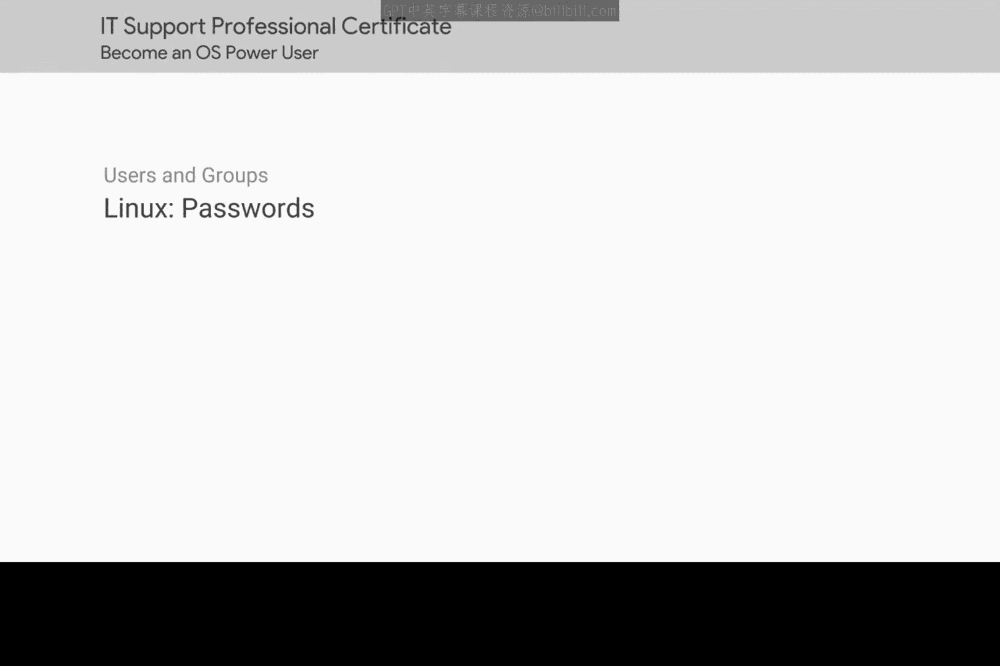

# 131：用户密码管理 🔑

在本节课中，我们将学习如何在Linux系统中管理用户密码，包括如何修改密码、了解密码的存储机制以及如何强制用户更改密码。



## 修改用户密码

在Linux系统中修改密码，只需运行`passwd`命令即可。让我们尝试修改当前用户的密码。

```bash
passwd
```

执行此命令后，系统会提示您输入当前密码，然后输入并确认新密码。

## 密码存储机制

当您设置密码时，系统会对其进行安全加密，然后存储在一个名为`/etc/shadow`的特权文件中。此文件仅允许root用户读取，以防止他人窥探。

```bash
# 查看 /etc/shadow 文件（需要root权限）
sudo cat /etc/shadow
```

即使您获得了该文件的访问权限，也无法解密其中存储的密码，因为它们经过了单向哈希处理。

## 强制用户更改密码

如果您是计算机管理员，并希望强制某个标准用户更改其密码（类似于我们在Windows系统中的操作），可以使用`passwd`命令配合`-e`或`--expire`标志。

以下是具体操作步骤：


```bash
# 强制用户“username”在下次登录时更改密码
sudo passwd -e username
```

此命令将立即使指定用户的密码过期，并强制他们在下次登录时设置新密码。

## 总结

本节课中，我们一起学习了Linux系统中的用户密码管理。我们掌握了使用`passwd`命令修改密码的方法，了解了密码在`/etc/shadow`文件中的安全存储机制，并学会了如何使用`passwd -e`命令强制用户更新密码，这些都是系统管理员日常维护工作中的重要技能。