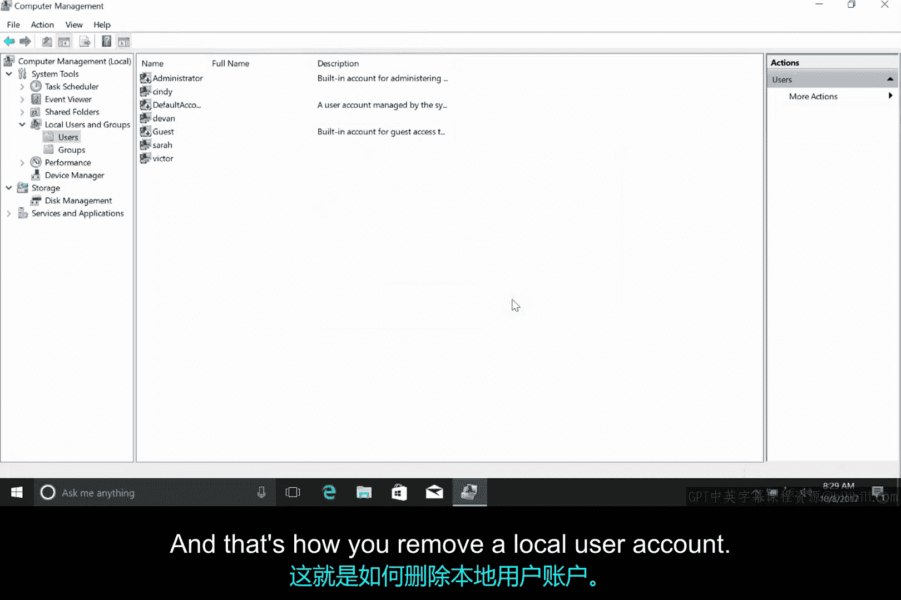
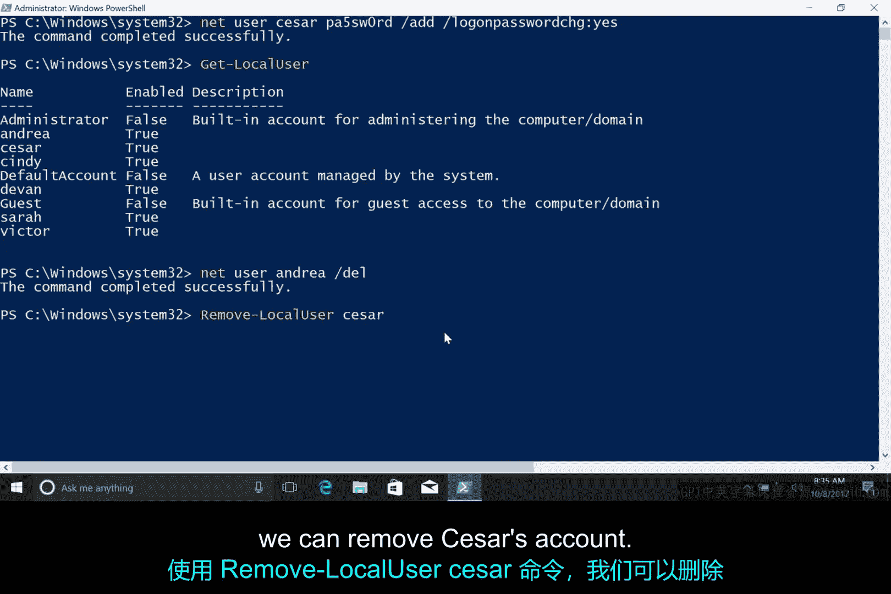

# 132：Windows添加和删除用户 👥

在本节课中，我们将要学习如何在Windows操作系统中添加和删除本地用户账户。我们将涵盖使用图形界面（GUI）和命令行界面（CLI）两种方法来完成这些任务。

## 使用图形界面管理用户

上一节我们介绍了如何查看用户信息及其权限层级，本节中我们来看看如何通过图形界面添加和移除用户。

要添加一个新用户，我们需要打开计算机管理工具。在“本地用户和组”选项下，右键点击并选择“新用户”。随后，系统会要求我们设置用户名、全名和密码。遵循良好的密码设置实践，我们应设置一个默认密码，并强制用户在首次登录时更改它。因此，我们需要勾选“用户下次登录时须更改密码”的选项，然后点击“创建”。

以下是使用图形界面添加用户的步骤：
1.  打开“计算机管理”工具。
2.  导航至“本地用户和组” -> “用户”。
3.  在右侧窗格右键点击，选择“新用户”。
4.  填写用户名、全名和初始密码。
5.  勾选“用户下次登录时须更改密码”。
6.  点击“创建”按钮。

要删除一个用户，操作同样简单。只需在用户列表中找到目标账户，右键点击并选择“删除”。系统会显示一个警告信息，提示用户名是唯一的，即使删除后重新创建同名账户，新账户也无法访问原账户的资源。确认后即可删除。

## 使用命令行界面管理用户

现在，让我们转向命令行界面。通过CLI添加和删除本地用户账户，将使用我们之前修改密码时用到的 `net` 命令，只是参数不同。与之前类似，PowerShell也有一个原生命令 `New-LocalUser`，但使用它需要一些脚本知识。如果你想了解 `New-LocalUser`，可以查阅补充阅读材料。现在我们回到 `net` 命令。

要添加一个新本地用户，我们只需使用 `/add` 参数。将这个参数附加到我们之前用过的命令上，就能指示 `net` 创建账户。我们仍然可以使用星号 `*` 作为密码参数，以便在命令行中安全地输入密码。

让我们测试一下，为“Andrea”创建一个新账户。命令是：`net user Andrea * /add`。创建完成后，我们可以运行 `Get-LocalUser` 命令来列出所有用户账户，以确认操作成功。

这里存在一个小问题，正如之前在密码课程中提到的：这个账户是为Andrea创建的，但我们知道密码。我们不希望知道她的密码，因为这意味着我们可以用她的身份登录。我们需要确保Andrea将密码更改为一个我们不知道的密码。为此，我们将使用 `/logonpasswordchg:yes` 参数来标记她的账户，要求其在首次登录时更改密码。命令是：`net user Andrea /logonpasswordchg:yes`。

实际上，我们可以将创建账户和强制更改密码的命令合并执行。让我们为“Caesar”创建一个账户：`net user caesar * /add /logonpasswordchg:yes`。现在，当我们再次运行 `Get-LocalUser` 时，应该能看到两个新创建的账户。

接下来，让我们删除刚刚创建的这些账户。我将向你展示如何使用 `net` 命令和 `Remove-LocalUser` 命令来完成删除，这两个命令的效果完全相同。

以下是使用命令行删除用户的步骤：
1.  使用 `net` 命令删除用户：`net user [用户名] /delete`
2.  使用 PowerShell 的 `Remove-LocalUser` 命令删除用户：`Remove-LocalUser -Name [用户名]`

例如，要删除Andrea的账户，可以运行：`net user Andrea /delete`。要删除Caesar的账户，可以运行：`Remove-LocalUser -Name Caesar`。执行后，账户就被移除了。

请注意这些命令遵循的模式。`net user` 的例子看起来和创建新用户时很像，只是将“添加”操作换成了“删除”操作。在第二个例子中，`Remove-LocalUser` 命令则对应着 `Get-LocalUser` 或 `New-LocalUser`。随着你学习更多CLI命令，你会开始注意到这类模式。能够识别这些模式将帮助你发现可以执行的新操作，并记住那些很久没做过的任务。

## 课程总结

本节课中我们一起学习了在Windows系统中管理本地用户账户的两种核心方法。我们掌握了通过图形界面（计算机管理工具）和命令行界面（`net user` 及 `Remove-LocalUser` 命令）来添加和删除用户。关键点在于创建用户时应遵循安全实践，强制用户在首次登录时更改默认密码。理解命令行中参数的模式（如 `/add` 与 `/delete`）对于高效使用CLI工具至关重要。