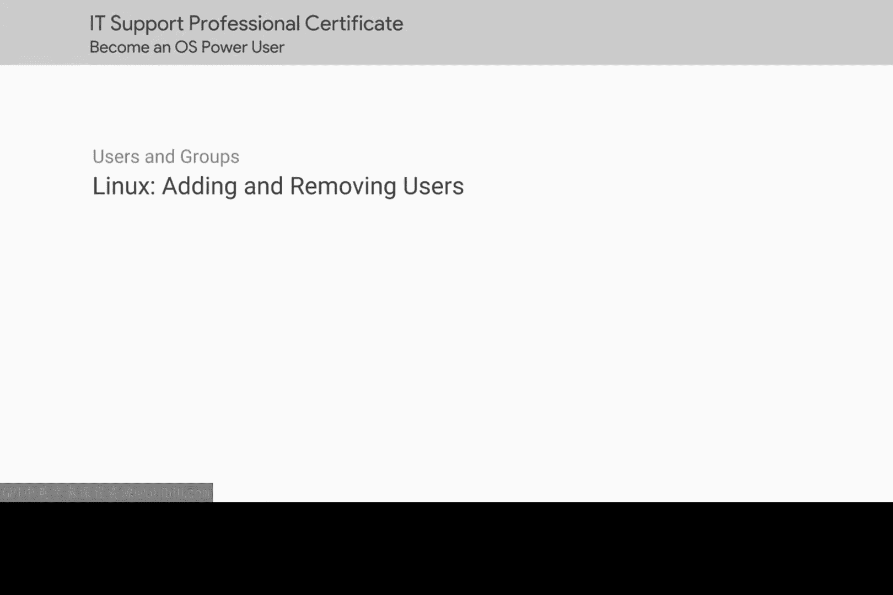
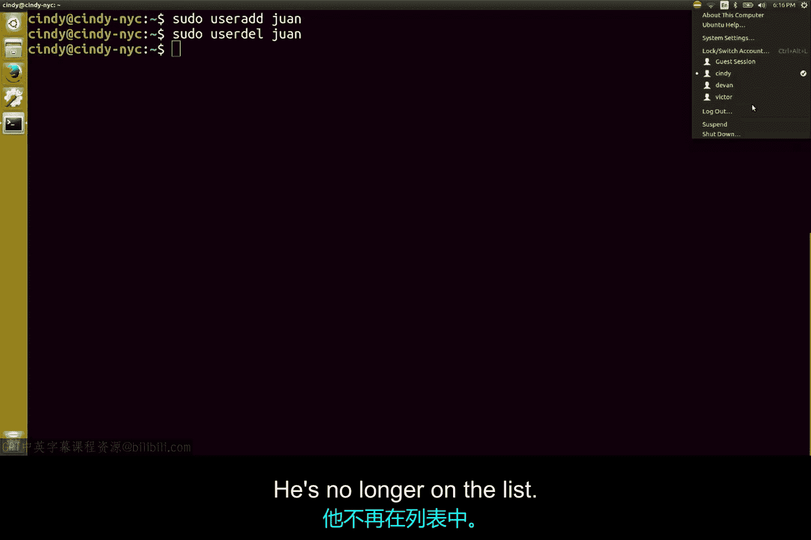

# 133：Linux用户管理

在本节课中，我们将学习如何在Linux系统中添加和删除用户。这是系统管理的基础操作，对于维护系统安全和组织用户至关重要。



## 添加新用户

上一节我们介绍了Linux系统的基本概念，本节中我们来看看如何创建一个新用户。

在Linux中添加新用户，可以使用 `useradd` 命令。其基本语法是：
```bash
sudo useradd [用户名]
```
例如，要添加一个名为 `user1` 的用户，命令如下：
```bash
sudo useradd user1
```
此命令会为用户设置基本配置并创建一个家目录。

我们可以通过检查 `/etc/passwd` 文件或使用 `id` 命令来验证用户是否创建成功。
```bash
id user1
```

为了增强安全性，我们通常希望新用户在首次登录时更改密码。这可以通过将 `useradd` 命令与 `passwd` 命令结合使用来实现。以下是具体步骤：

首先，为用户设置一个初始密码：
```bash
sudo passwd user1
```
然后，强制用户在下次登录时修改密码：
```bash
sudo passwd --expire user1
```

## 删除用户

了解了如何添加用户后，接下来我们学习如何删除一个不再需要的用户账户。

要删除一个用户，可以使用 `userdel` 命令。其基本语法是：
```bash
sudo userdel [用户名]
```
例如，要删除用户 `user1`，命令如下：
```bash
sudo userdel user1
```
执行此命令后，该用户将从系统用户列表中移除。我们可以再次使用 `id user1` 命令来验证，系统会提示用户不存在。

默认情况下，`userdel` 命令不会删除用户的家目录和邮件池。如果需要同时删除这些文件，可以添加 `-r` 选项：
```bash
sudo userdel -r user1
```



## 总结

本节课中我们一起学习了Linux用户管理的基础操作。我们掌握了使用 `useradd` 命令添加新用户，并使用 `passwd` 命令管理用户密码策略。同时，我们也学会了使用 `userdel` 命令来删除用户账户，并了解了删除用户文件的相关选项。

这些命令是每位IT支持专业人员工具箱中的必备工具，熟练掌握它们有助于有效管理系统访问权限和维护安全。

接下来，我们将深入探索Linux文件权限的奇妙世界。敬请期待。😊