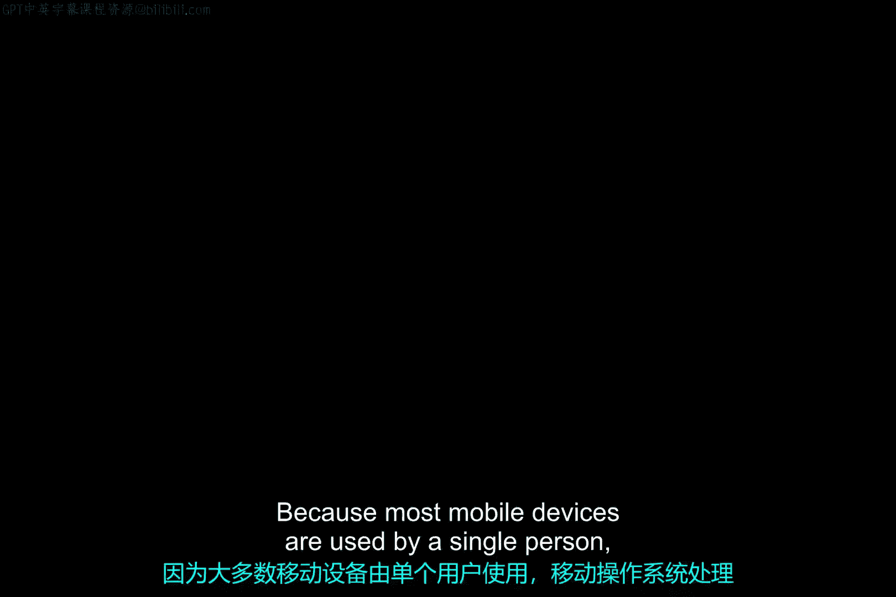
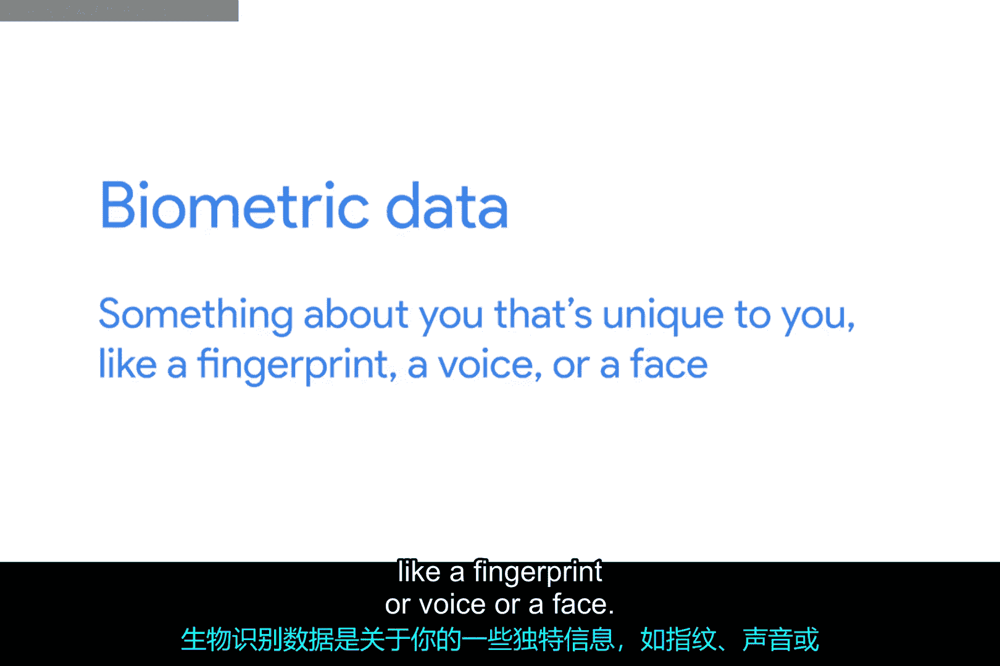

# 134：移动用户与账户管理 🧑‍💻

在本节课中，我们将学习移动操作系统如何处理用户账户，了解其与桌面操作系统的区别，并探讨保护移动设备数据安全的基本方法。

## 移动设备账户管理的特殊性

上一节我们介绍了传统操作系统的用户账户。本节中我们来看看移动设备有何不同。

由于大多数移动设备由单个人使用，其操作系统处理用户账户的方式与我们讨论过的其他操作系统略有不同。以车载GPS设备为例，你可能完全不需要输入用户名或向GPS设备分配账户。运行GPS设备的操作系统中仍然存在用户账户，但你永远不需要看到或处理它们。

另一方面，考虑运行iOS或Android的智能手机或平板电脑。这些设备在初始设置时会要求你输入一次用户名和密码。但之后每次使用设备时，你可能不需要重新输入该密码。

## 主账户与用户配置文件

在设置过程中使用的初始账户称为**主账户**。此账户用于在设备上创建你的用户配置文件。用户配置文件类似于移动设备中的用户账户，它包含你的所有账户、偏好设置和应用程序。

在iOS和Android中，主账户可用于将设置和数据同步到云端。当你更换设备或使用以前用过的主账户设置新移动设备时，如果之前有数据备份到云端，你将可以选择恢复数据和应用程序。不过暂时不用担心这一点，我们将在后续视频中详细讨论同步和备份。

此外，在iOS和Android中，用户配置文件可以登录到其他附加账户。这些可以是额外的电子邮件账户、社交媒体账户或其他类型的账户。如果获得许可，移动设备上的应用程序可以使用这些账户进行**单点登录**。

这意味着，这些应用程序不会要求你输入另一个用户名和密码，而是允许你使用已登录的账户进行身份验证。这些应用程序无法访问你的凭据，但你可以授权它们使用这些凭据。请查看安全课程以了解更多关于SSO的工作原理。

## IT支持中的账户设置实践

作为IT支持专家，你可能会帮助最终用户在其移动设备上设置这些账户。但切勿向他人索要密码。务必让最终用户自己输入密码。如果有人向你透露了密码，应鼓励他们更改该密码。

大多数移动设备仅支持一个用户配置文件，并且设计为供单个人使用。一些Android设备确实支持多个用户配置文件，具体工作原理请查看补充阅读材料。

## 移动设备的安全考量

回想一下使用台式机、笔记本电脑或服务器等较大设备时，默认情况下必须输入用户名和密码才能访问。大多数移动操作系统不会要求你每次使用设备时都重新输入主账户密码。这虽然方便，但也意味着任何拿起该设备的人都能访问你所有的个人和工作数据。

即使设备上没有私人数据，该设备也可能有权访问机密或特权系统，这同样会造成严重后果。移动操作系统通常有多种保护数据的方法。

以下是几种常见的设备访问控制方式：
*   你可以为设备设置密码、PIN码或解锁图案。
*   一些智能手机使用指纹传感器、面部识别或其他类型的生物识别数据来授予设备访问权限。
*   生物识别数据是指你独有的特征，如指纹、声音或面部。

我们将在安全课程中进一步讨论生物识别数据。为了保护业务数据，一些组织使用**移动设备管理**策略来要求移动设备必须被锁定。移动设备管理系统用于应用和执行有关设备必须如何配置和使用的规则。我们将在未来的视频中详细讨论MDM。

## 总结

本节课中我们一起学习了移动操作系统用户账户管理的独特方式，包括主账户、用户配置文件以及单点登录的概念。我们还了解了作为IT支持人员在协助设置账户时应遵循的安全实践，并探讨了保护移动设备数据的多种方法，如密码、PIN、图案和生物识别技术，最后简要提及了企业环境中可能用到的移动设备管理策略。