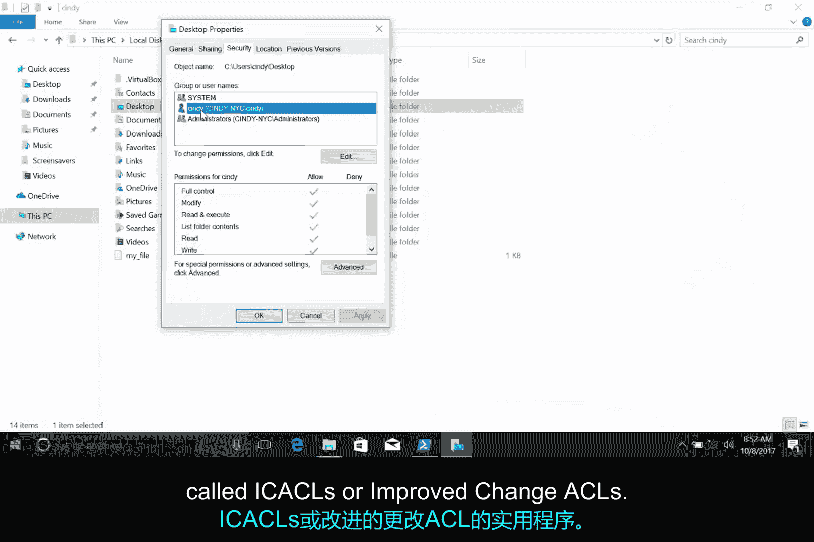
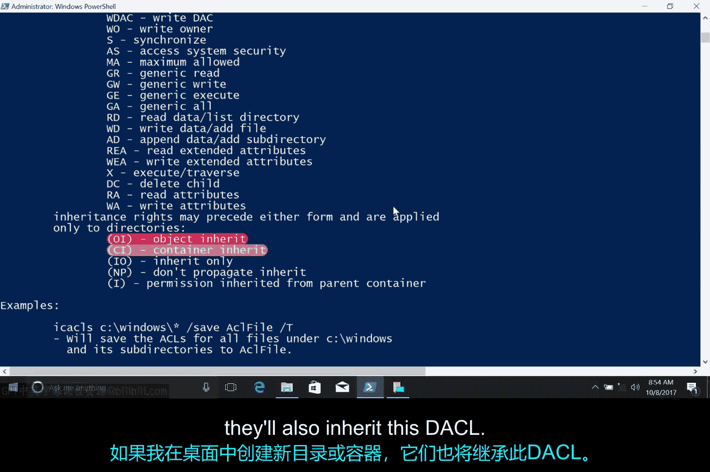

# 136：Windows文件权限 🔐

在本节课中，我们将要学习Windows操作系统中的文件权限。文件权限是计算机安全中的一个重要概念，它确保只有需要访问特定文件和目录的用户才能获得相应的权限。

---

## 概述

文件权限是计算机安全的重要组成部分。我们只希望将特定文件和目录的访问权限授予需要它的用户。在思考用户应如何访问文件和文件夹的同时，我们也应考虑权限概念如何延伸到生活的其他领域。例如，您可能将社交媒体帖子的查看权限限制在您信任的人，或者将家门钥匙的副本交给亲戚以备紧急情况。您将在本课程的最后一课中了解更多安全原则。现在，我们将专注于一个基础构建模块：文件权限。

---

## Windows中的访问控制列表

在Windows中，文件和目录权限通过访问控制列表（ACLs）进行分配。具体来说，我们将使用自主访问控制列表（DACLs）。Windows文件和文件夹也可以分配系统访问控制（SACLs）。SACLs用于告诉Windows，每次有人访问文件或文件夹时，都应使用事件日志进行记录。这是一个更高级的主题，您可以在下一篇补充阅读中详细了解。

您可以将DACL视为一份关于谁可以使用文件以及他们被允许对该文件执行哪些操作的说明。每个文件或文件夹都有一个所有者和一个或多个DACL。

---

## 查看文件权限

让我们在Windows资源管理器中查看一个示例。我已打开我的主目录。如果我们右键单击“桌面”并选择“属性”，可以看到桌面目录的属性对话框。然后，如果我们转到“安全”选项卡，可以在此处看到权限窗口。顶部框包含用户和组的列表，底部框则列出了分配给每个用户或组的权限。

这些权限各自有什么作用？根据权限是分配给文件还是目录，其作用会略有不同。别担心，很快您就会明白。让我们逐一介绍这些权限。

以下是每个权限的详细说明：

*   **读取**：读取权限允许您查看文件是否存在，并允许您读取其内容。它还允许您读取目录中的文件和目录。
*   **读取和执行**：读取和执行权限允许您读取文件，并且如果文件是可执行的，您可以运行该文件。读取和执行权限包含读取权限，因此如果您选择“读取和执行”，“读取”将自动被选中。
*   **列出文件夹内容**：“列出文件夹内容”是目录上“读取和执行”权限的别名。选中其中一个将同时选中另一个。这意味着您可以读取和执行该目录中的文件。
*   **写入**：写入权限允许您对文件进行更改。您可能会感到惊讶，但您可以在没有文件读取权限的情况下拥有文件的写入权限。写入权限还允许您在目录中创建子目录并向文件写入内容。
*   **修改**：修改权限是一个总括性权限，包括读取、执行和写入。
*   **完全控制**：拥有完全控制权限的用户或组可以对文件执行任何操作。它包括修改权限的所有权限，并增加了获取文件所有权和更改其ACL的能力。

现在，当我们单击我的用户名时，可以看到Cindy的权限，这表明我被允许拥有所有这些访问权限。

---

## 使用Icacls工具

如果我们想查看分配给文件的ACL，可以使用一个名为`icacls`（或“改进的更改ACL”）的实用程序来查看和更改ACL。



让我们先看看我的桌面。所以，输入命令：
```cmd
icacls Desktop
```
这看起来很有用，但它是什么意思？我可以看到有权访问我桌面的用户账户，并且可以看到我的账户是其中之一，但其余这些内容呢？

这些字母代表我们之前讨论过的每个权限。

让我们看看`icacls`的帮助信息，我敢打赌这会解释清楚。所以输入：
```cmd
icacls /?
```
好的，这里描述了每个字母的含义。`F`显示我对我的桌面文件夹拥有完全控制权。`icacls`将此称为完全访问，我们之前在图形用户界面中将其视为“完全控制”。这些是相同的权限。

这些其他字母是什么意思？正如我们从`icacls`帮助中看到的，NTFS权限可以被继承。`OI`表示对象继承，`CI`表示容器继承。如果我在我的桌面文件夹内创建新的文件或对象，它们将继承此DACL。如果我在桌面中创建新的目录或容器，它们也将继承此DACL。

如果您想了解更多关于NTFS中ACL继承的信息，请查看下一篇补充阅读。

---

## 总结



在本节课中，我们一起学习了Windows文件权限的基础知识。我们了解了访问控制列表（ACL）和自主访问控制列表（DACL）的概念，并通过图形界面和`icacls`命令行工具查看了具体的权限设置。我们还详细解释了读取、写入、修改、完全控制等核心权限的含义，以及权限继承（OI/CI）的概念。理解并正确设置文件权限是管理计算机安全和数据访问控制的关键一步。