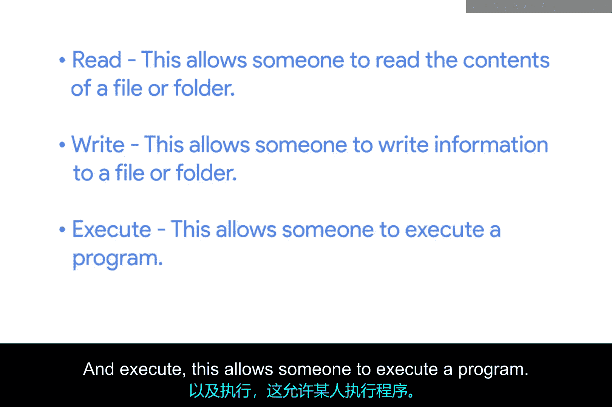
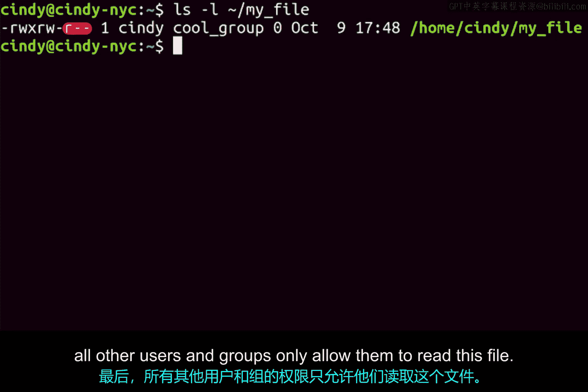

# 137：Linux文件权限详解 🔐

在本节课中，我们将要学习Linux系统中的文件权限机制。理解权限是管理Linux系统安全的基础，它决定了谁可以读取、写入或执行系统中的文件和目录。

## 概述

正如我们已经了解到的，Linux中的文件和文件夹拥有不同的权限设置，以防止未经授权的用户查看或修改它们。Linux权限系统灵活而强大，允许我们根据用户角色（如文件所有者、所属组成员或其他所有用户）来设置特定的访问权限。



## Linux的三种基本权限

Linux系统为每个文件和目录定义了三种基本权限。以下是这三种权限的详细说明：

*   **读取**：允许用户读取文件的内容或列出目录中的内容。
*   **写入**：允许用户向文件中写入信息，或在目录中创建、删除文件。
*   **执行**：允许用户将文件作为程序来运行，或进入某个目录。

## 使用 `ls -l` 命令查看权限

上一节我们介绍了三种基本权限，本节中我们来看看如何查看一个文件的具体权限设置。我们可以使用 `ls` 命令并加上 `-l`（长格式）标志来查看文件的详细信息，包括其权限。

```
ls -l example_file.txt
```

执行上述命令后，你可能会看到类似这样的输出：
`-rwxrw-r-- 1 cindy cool 0 Jan 1 12:34 example_file.txt`

输出结果的第一部分（如 `-rwxrw-r--`）就代表了文件的类型和权限。这里总共有10个字符。

第一个字符表示**文件类型**。在这个例子中，`-` 表示我们查看的是一个普通文件。有时你可能会看到 `d`，这代表一个目录。

随后的九个字符是我们的**实际权限位**。它们被分为三组，每组三个字符。

## 权限位的分组与含义

理解了权限的表示方法后，我们来详细解读这三组权限分别代表什么。每组三个字符（一个“三元组”）对应一类用户的权限。

*   第一个三元组（第2-4位）代表**文件所有者**的权限。
*   第二个三元组（第5-7位）代表文件**所属用户组**的权限。
*   第三个三元组（第8-10位）代表**其他所有用户**的权限。

在每个三元组中：
*   `r` 代表可读。
*   `w` 代表可写。
*   `x` 代表可执行。

类似于二进制，如果一个权限位被设置（即不是 `-`），我们就说该权限是**启用**的。如果该位是 `-`，则表示该权限被**禁用**。

## 权限示例详解

让我们结合之前的例子 `-rwxrw-r--` 来具体分析一下。



*   **所有者权限 (`rwx`)**：第一个三元组是 `rwx`。这指的是文件所有者（在此例中是 `cindy`，你可以在 `ls -l` 输出的“所有者”字段看到）的权限。这意味着所有者 `cindy` 可以**读**、**写**和**执行**这个文件。
*   **组权限 (`rw-`)**：第二个三元组是 `rw-`。这是文件所属组（此例中是 `cool` 组）的权限。这意味着 `cool` 组内的成员可以**读**和**写**这个文件，但**不能执行**它。
*   **其他用户权限 (`r--`)**：第三个三元组是 `r--`。这是所有其他用户和组的权限。这意味着既不是所有者 `cindy` 也不属于 `cool` 组的用户，只能**读**这个文件，不能写入或执行。

## 总结

本节课中我们一起学习了Linux文件权限的核心概念。我们了解到权限分为读、写、执行三种，并通过 `ls -l` 命令的输出，学会了如何解读代表文件类型和权限的10个字符。关键在于理解这九个权限位被分为三组，分别对应所有者、所属组和其他用户的权限。虽然初看可能有些复杂，但随着练习，你会逐渐熟练掌握。如果需要复习，随时可以回顾本节课的内容。