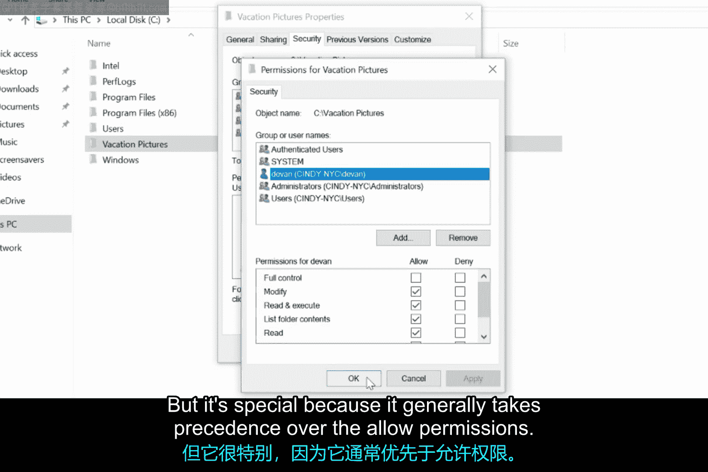
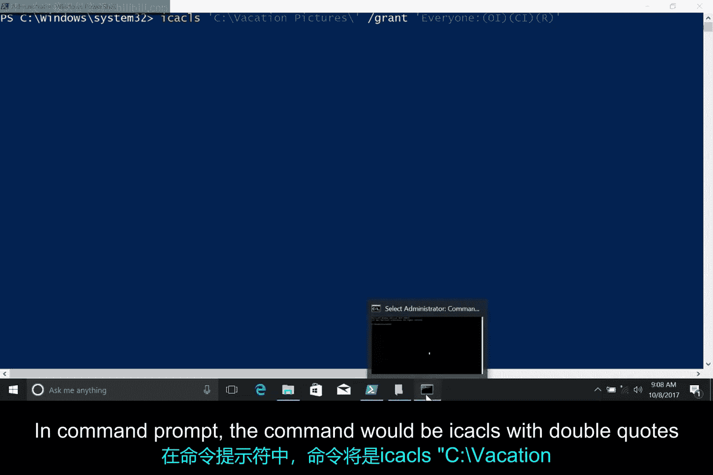
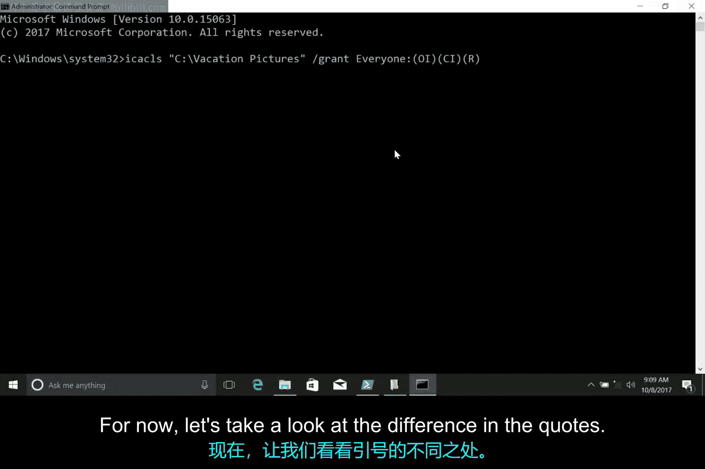
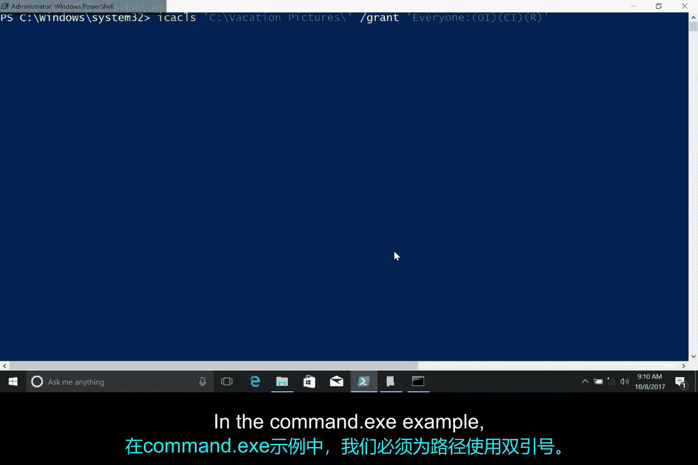
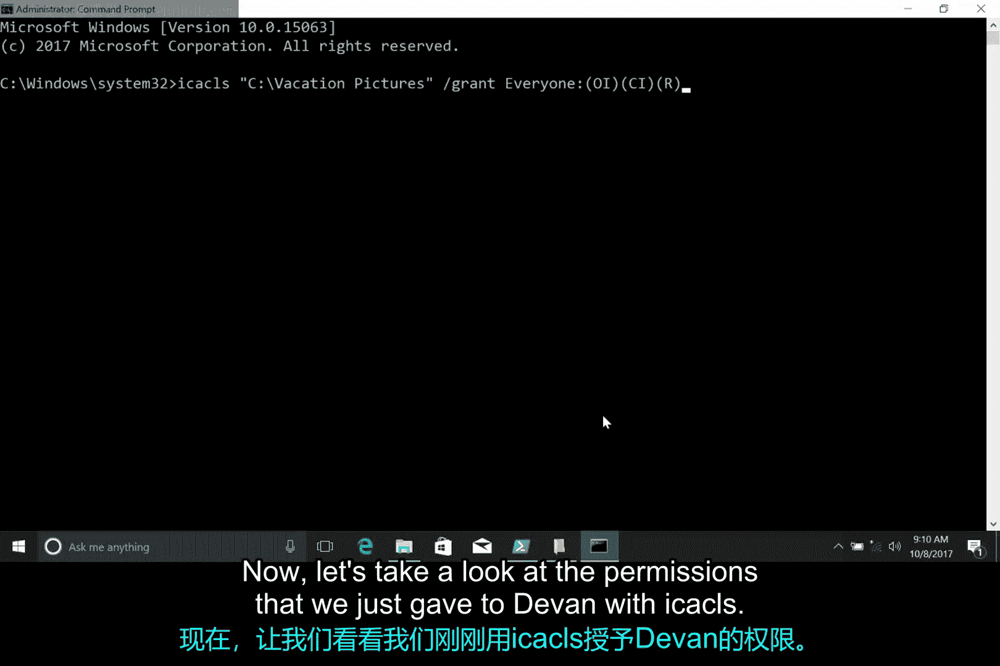
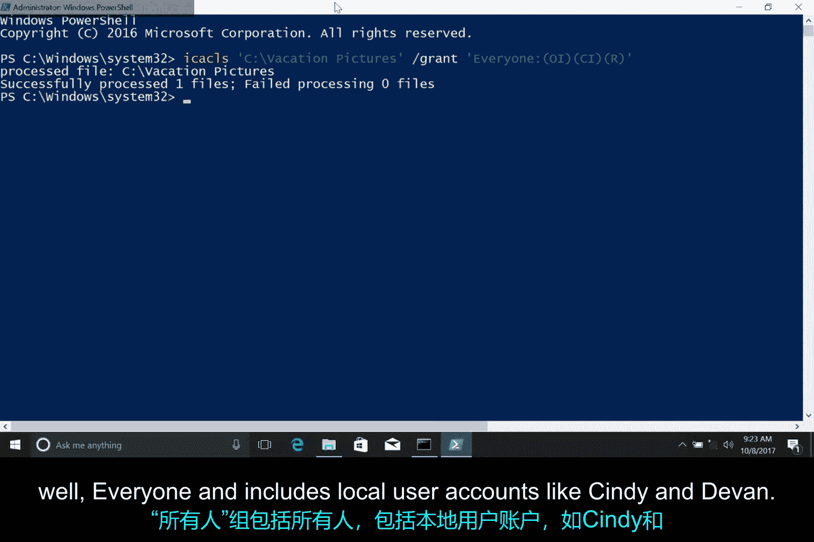
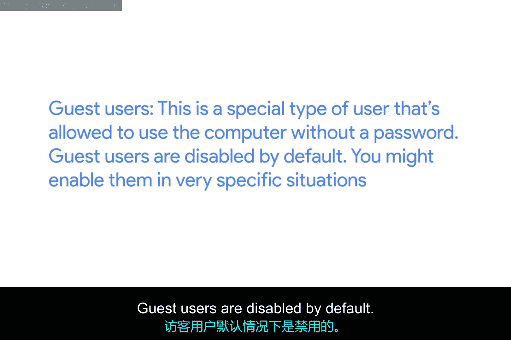
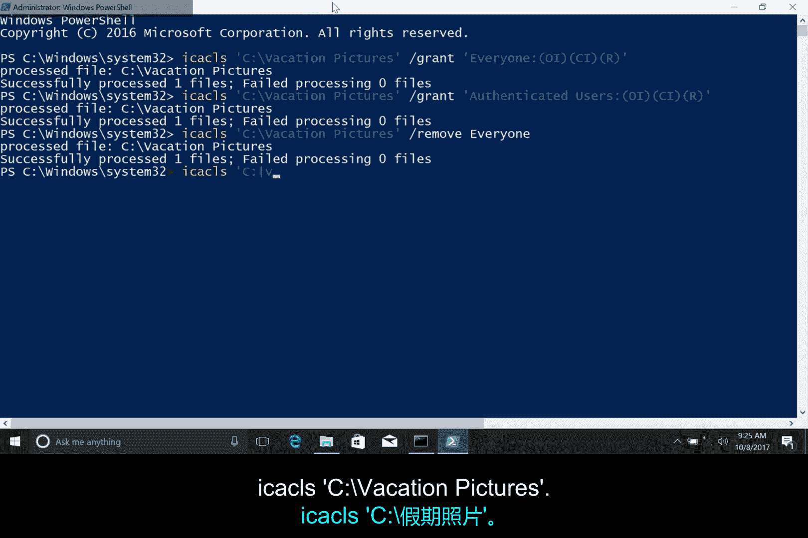

# 138：Windows修改权限 🛠️

在本节课中，我们将学习如何在Windows操作系统中修改文件和文件夹的权限。我们已经了解了如何查看权限，现在将进一步学习如何更改这些权限，以控制不同用户对资源的访问。

## 从图形界面修改权限

上一节我们介绍了如何查看权限，本节中我们来看看如何通过图形用户界面（GUI）修改权限。

假设我想允许家庭中的另一位成员查看电脑上存放家庭照片的文件夹。具体操作如下：

在我的本地磁盘C上，有一个名为“Vacation Pictures”的文件夹，我想与机器上的另一个用户Devin共享。

以下是操作步骤：
1.  右键点击目标文件夹。
2.  选择“属性”。
3.  切换到“安全”选项卡。
4.  点击“编辑”按钮来修改文件权限。

此时，我可以看到添加组或用户名的选项。点击“添加”按钮。

系统会要求输入要添加的用户名。我输入“Devin”，然后点击“检查名称”以验证输入是否正确。

验证通过后，点击“确定”。将Devin添加到访问控制列表（ACL）后，我可以点击他的用户名，然后勾选希望授予他的权限对应的“允许”复选框。



例如，我们可以给Devin“修改”权限，这样他也能向此文件夹添加图片。

我们一直忽略了这个“拒绝”复选框。你可能已经猜到，“拒绝”意味着不允许某项权限。它的特殊之处在于，其优先级通常高于“允许”权限。

假设Devin所在的组拥有访问此文件夹的权限。如果我们明确勾选了Devin用户名下的“拒绝”框，那么即使他所在的组有访问权限，Devin本人也无法访问。如果你想了解更多关于权限优先级的信息，可以查阅补充阅读材料。

## 使用命令行界面修改权限

在图形界面中修改权限非常直观，现在让我们看看如何在命令行界面（CLI）中完成同样的操作。

我们将回到 `icacls` 命令。在接下来的示例中，我们将在PowerShell中运行 `icacls`。`icacls` 命令是为PowerShell之前的命令提示符设计的，其参数使用的特殊字符可能会让PowerShell产生混淆。

通过用单引号包围 `icacls` 的参数，我是在告诉PowerShell不要尝试将这些参数解释为代码。如果你在 `cmd.exe` 中运行这些命令，则需要移除单引号才能正常工作。

让我们对比一下在PowerShell和 `cmd.exe` 中的命令格式。



在PowerShell中，命令如下：
```powershell
icacls ‘C:\Vacation Pictures’ /grant Everyone:(OI)(CI)R
```

在命令提示符（cmd.exe）中，命令如下：
```cmd
icacls “C:\Vacation Pictures” /grant Everyone:(OI)(CI)R
```



在PowerShell示例中，我们添加单引号是为了让PowerShell忽略括号，并且因为路径中包含空格。在 `cmd.exe` 示例中，路径必须使用双引号，并且不再需要单引号来隐藏括号。

理解了命令格式的差异后，现在让我们看看刚才用 `icacls` 命令授予Devin的权限。



很好，我看到Vacation Pictures目录为Devin添加了一个新的访问控制项（ACE），赋予了他修改权限。我们可以看到，在Vacation Pictures中创建的任何新文件或文件夹都将继承此权限。



## 应用实例：调整组权限

掌握了基本命令后，让我们通过一个实际场景来应用它。

假设我们希望任何有权使用此计算机的人都能看到这些图片，但不希望他们添加或删除照片。我们应该授予他们什么权限？

是的，我们希望授予他们对Vacation Pictures文件夹的“读取”权限。让我们使用特殊的“Everyone”组来授予目录读取权限。

命令如下：
```powershell
icacls ‘C:\Vacation Pictures’ /grant Everyone:(OI)(CI)R
```

“Everyone”组确实包含了所有人，包括像Cindy和Devin这样的本地用户账户、访客用户（这是一种允许无需密码使用计算机的特殊用户类型，默认情况下是禁用的，你可能只在非常特定的情况下启用它）。



现在，任何可以使用这台计算机的人都能浏览Devin和我整理的照片了。



实际上，我可能并不真的希望所有人都能看到我的度假照片，也许我只希望那些在计算机上设有密码的人才能查看。

在这种情况下，我想使用“Authenticated Users”组。该组不包括访客用户。所以，首先让我们添加一个新的访问控制项。

命令如下：
```powershell
icacls ‘C:\Vacation Pictures’ /grant “Authenticated Users”:(OI)(CI)R
```

现在，移除“Everyone”组的权限。
```powershell
icacls ‘C:\Vacation Pictures’ /remove Everyone
```

最后，使用 `icacls` 验证权限是否按我们的意图设置。
```powershell
icacls ‘C:\Vacation Pictures’
```

很好。我们可以看到“Authenticated Users”已被添加，而“Everyone”已被移除。



## 总结

本节课中我们一起学习了在Windows中修改权限的两种主要方法。我们首先通过图形界面逐步完成了添加用户和设置权限的过程，理解了“允许”和“拒绝”权限的优先级。接着，我们深入命令行，学习了如何在PowerShell和命令提示符中使用 `icacls` 命令来授予和移除权限，并通过实际例子演示了如何为“Everyone”组和“Authenticated Users”组配置不同的访问级别。这些技能是管理文件安全和共享资源的基础。接下来，让我们看看如何在Linux系统中修改权限。