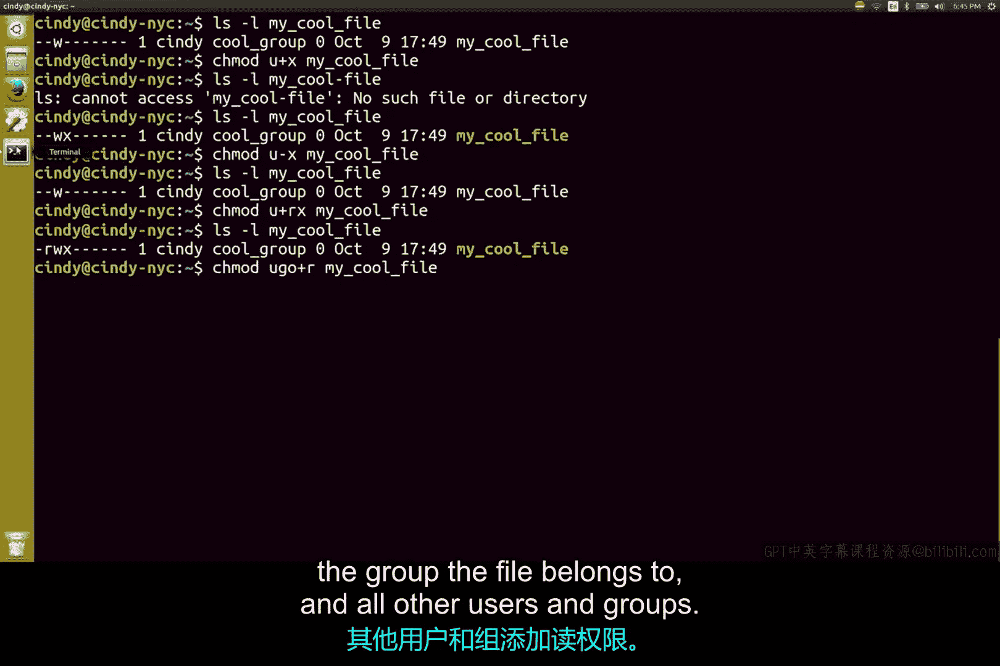
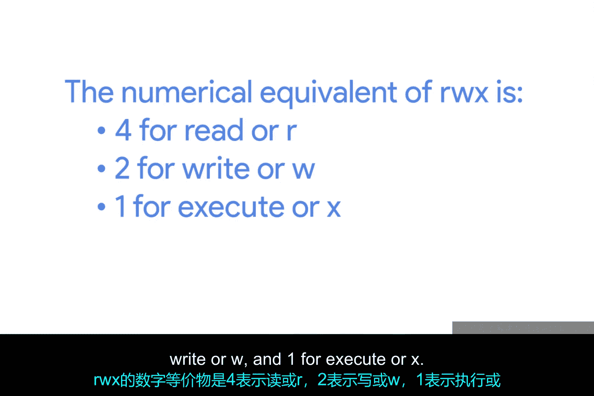
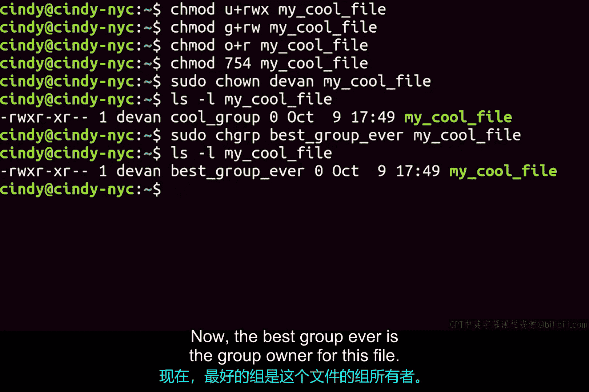

Linux权限管理：第2课：修改文件权限与所有权

在本节课中，我们将学习如何在Linux系统中修改文件和目录的权限与所有权。这是系统管理和安全配置的基础技能。

在Linux中，我们使用 `chmod`（change mode）命令来修改权限。首先，需要选择你想要更改的权限集合：文件所有者（用 `u` 表示）、文件所属组（用 `g` 表示）或其他用户（用 `o` 表示）。要添加或移除权限，只需使用加号（`+`）或减号（`-`）符号，后面跟上权限标识。

以下是使用符号格式修改权限的示例：

执行命令 `chmod u+x my_cool_file`。这条命令表示，我们要修改 `my_cool_file` 的权限，给文件所有者（`u`）添加执行（`x`）权限。

如果你想移除权限，操作类似。执行命令 `chmod u-x my_cool_file`。这里只是将加号（`+`）换成了减号（`-`），非常简单。

如果你想为一个文件同时添加多个权限，可以这样做：

`chmod u+rx my_cool_file`

这条命令表示，我们要为文件所有者（`u`）添加读取（`r`）和执行（`x`）权限。

你也可以同时对多个权限集合进行操作。执行命令：

`chmod ugo+r my_cool_file`

这条命令表示，我们要为文件所有者（`u`）、所属组（`g`）以及其他所有用户（`o`）添加读取（`r`）权限。

上面这种使用 `r`、`w`、`x` 和 `u`、`g`、`o` 来表示权限和用户的 `chmod` 格式，被称为**符号格式**。

我们还可以使用数字格式来修改权限，这种方法通常更快、更简洁，尤其适合一次性修改所有权限。数字格式中，读取（`r`）的数值是 **4**，写入（`w`）是 **2**，执行（`x`）是 **1**。要设置权限，我们将目标权限集合所需的数值相加。

让我们来看一个例子：

命令 `chmod 754 my_cool_file` 中的第一个数字 `7` 代表所有者的权限，第二个数字 `5` 代表所属组的权限，第三个数字 `4` 代表其他用户的权限。

那么，`7` 和 `5` 这些数字是怎么来的呢？记住，你需要将权限数值相加。`4`（读） + `2`（写） + `1`（执行） = `7`，这代表 `rwx` 权限。因此，文件所有者可以读、写和执行这个文件。

你能猜出 `5` 代表什么吗？没错，`4`（读） + `1`（执行） = `5`，代表 `r-x` 权限，即可读和可执行。

现在你可以看到，数字格式比符号格式更快捷。相比于运行一长串符号命令，我们只需运行 `chmod 754 my_cool_file` 即可一次性更新所有权限。

无论使用符号格式还是数字格式，你都可以修改权限，选择你觉得最方便的一种即可。

除了权限，你还可以更改文件的所有者和所属组。`chown`（change owner）命令允许你更改文件的所有者。

让我们将文件的所有者改为 `devon`：

`chown devon my_cool_file`

很好，现在 `devon` 是这个文件的所有者了。

要更改文件所属的组，可以使用 `chgrp`（change group）命令。

`chgrp bestgroup my_cool_file`

很好，现在 `bestgroup` 是这个文件的所属组了。

熟练掌握权限的查看和修改可能需要一些时间。你可以在一些文件上练习修改权限，直到完全掌握。权限管理是计算机安全的重要基石，在你作为IT支持专家的整个职业生涯中都会频繁使用到它。

在本节课中，我们一起学习了如何使用 `chmod` 命令的符号格式和数字格式来修改Linux文件权限，以及如何使用 `chown` 和 `chgrp` 命令来更改文件的所有者和所属组。这些是进行系统管理和维护安全访问控制的核心操作。