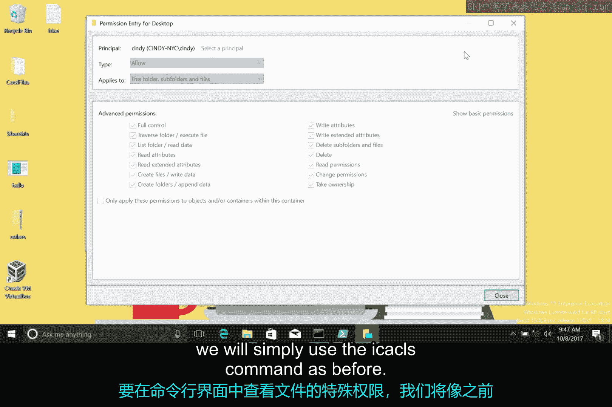
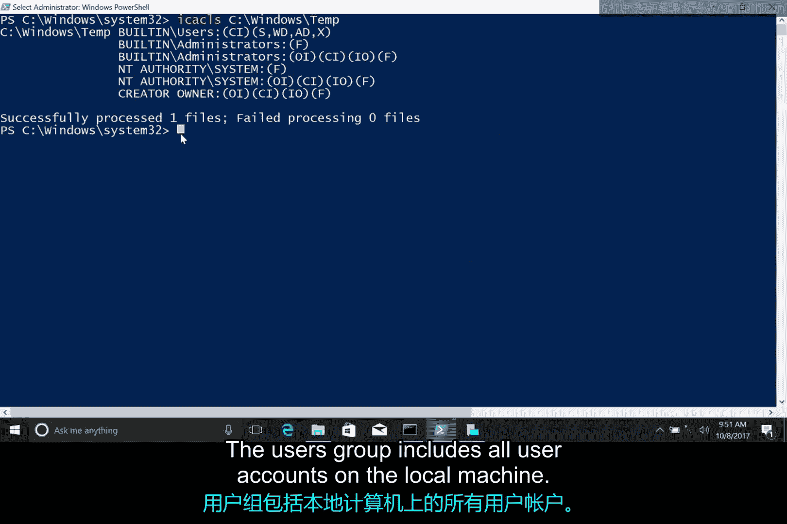
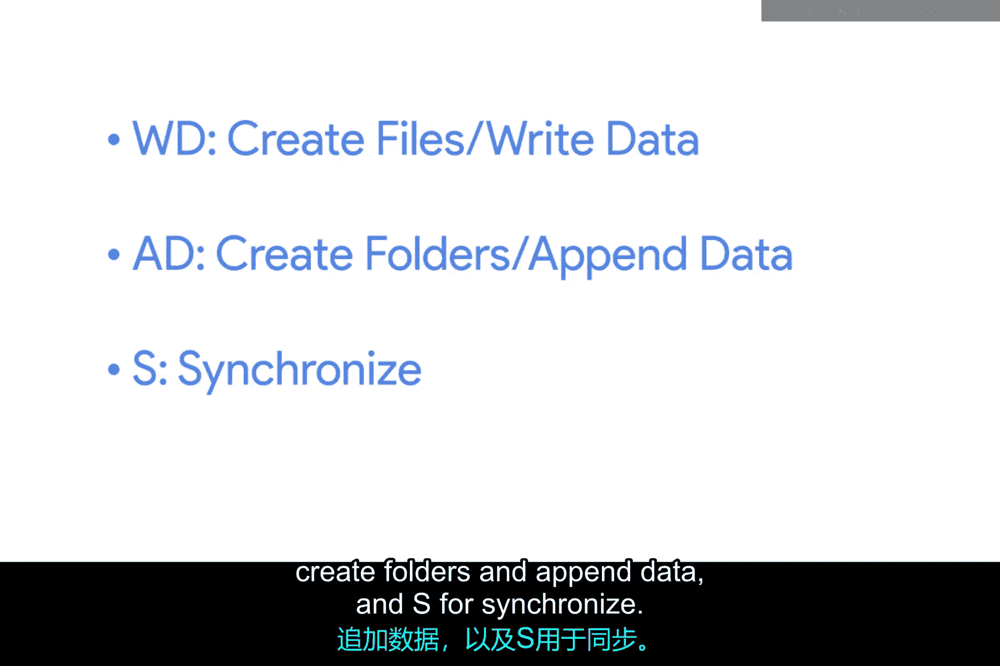
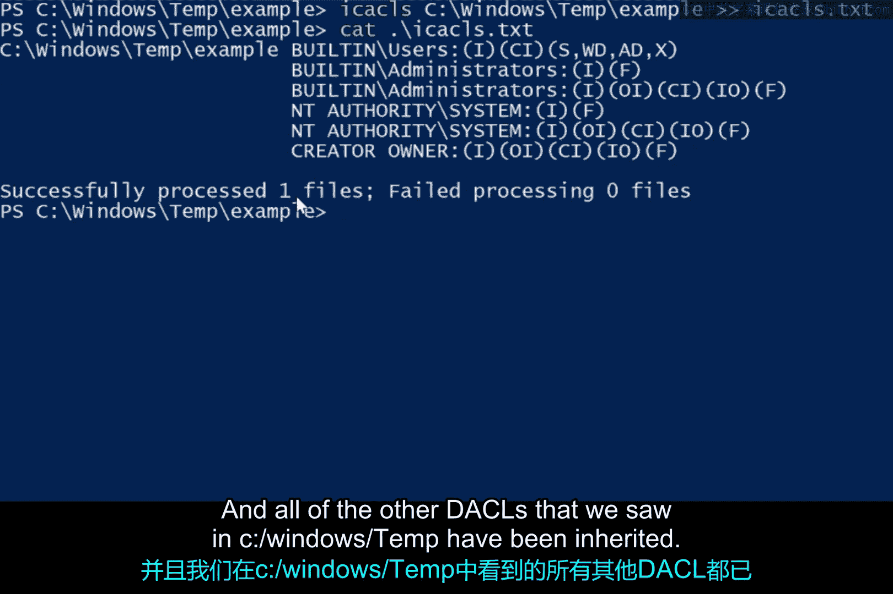

**Windows权限管理：第2课：特殊权限详解**

在本节课中，我们将学习Windows NTFS文件系统中的特殊权限。我们将了解特殊权限与基本权限的关系，并通过一个实际案例来掌握如何配置复杂的访问控制。

---

您可能已经注意到，之前在图形界面中查看权限时，权限列表里有一个“特殊权限”的复选框。

我们目前查看和设置的权限被称为**基本权限**。

实际上，基本权限是**特殊权限**或**特定权限**的集合。例如，当您为文件设置“读取”权限时，您实际上是在设置多个特殊权限。

接下来，让我们看看有哪些可用的特殊权限。

以下是查看特殊权限列表的方法：

我将点击权限设置下的“高级”选项卡。

当我点击一个用户名，然后进入“高级权限设置”时，我可以看到该文件上启用的所有特殊权限列表。

当我们选择“读取”这样的基本权限时，我们实际上启用了以下特殊权限：`列出文件夹/读取数据`、`读取属性`、`读取扩展属性`、`读取权限`和`同步`。这些只是经过微调的权限。您可以像修改其他基本权限一样修改这些特殊权限。

您可以在本视频后的补充阅读材料中，了解更多关于不同类型特殊权限的信息。

在大多数情况下，基本权限已能满足您的需求。



但有时，您需要创建一个不完全遵循简单模式的文件或文件夹。让我们来看一个命令行界面中的例子。

要在CLI中查看文件的特殊权限，我们将像之前一样使用 `icacls` 命令。

让我们看一个比我的桌面文件夹更有趣的例子。执行命令：
```cmd
icacls C:\Windows\Temp
```
这个目录用于存放系统中所有用户的临时文件。

我们希望系统上的每个人都能在此处创建文件和文件夹。

您可能认为我们应该为此使用“修改”或“完全控制”权限，但我们不希望用户能够删除彼此的文件。

首先，让我们查看分配给此文件夹的一些DACL（自主访问控制列表），并弄清楚如何实现这一点。

本地管理员和操作系统的计算机帐户对此文件夹及其内的所有文件和文件夹拥有完全权限。

我们看到一个新的描述符 `(OI)`，这表示此DACL条目**仅继承**。这意味着它将被继承，但不应用于此容器（即 `C:\Windows\Temp` 本身）。

“Users”组包含本地计算机上的所有用户帐户。



我们将授予用户以下特殊权限：
*   **`WD`**：创建文件/写入数据
*   **`AD`**：创建文件夹/追加数据
*   **`S`**：同步



您可以在接下来的补充阅读中看到，这些特殊权限包含在“修改”基本权限中。

与“修改”基本权限不同，我们**没有**授予用户删除文件或文件夹的能力。

但我们确实希望用户能够删除他们自己的文件和文件夹，那么该如何实现呢？

请注意“创建者所有者”条目。“创建者所有者”是一个特殊的用户，它代表DACL条目所应用到的任何文件的所有者。

在此目录及所有子目录中，任何文件或文件夹的所有者都对其拥有完全控制权。这很好。

现在，我将在 `C:\Windows\Temp` 中创建一个文件夹和文件，看看应用了哪些DACL条目。

让我们运用所学的输出重定向知识，将 `icacls` 命令的输出记录到一个文件中。

执行命令：
```cmd
mkdir C:\Windows\Temp\Example
icacls C:\Windows\Temp\Example > permissions.txt
```
现在，让我们查看创建的文件，以观察 `icacls` 的输出。

很好。我创建了文件，因此我对它们拥有完全控制权。

并且我们在 `C:\Windows\Temp` 中看到的所有其他DACL条目都已被继承。



---

**总结**

本节课中，我们一起学习了Windows NTFS文件系统的特殊权限。我们了解到基本权限是特殊权限的集合，并通过 `C:\Windows\Temp` 目录的案例，实践了如何组合特殊权限来实现精细的访问控制（如允许用户创建文件但禁止删除他人文件）。您可以看到，使用NTFS DACL中的特殊权限可能很复杂，但它也能让您创建真正强大、完全符合您确切需求的权限集。