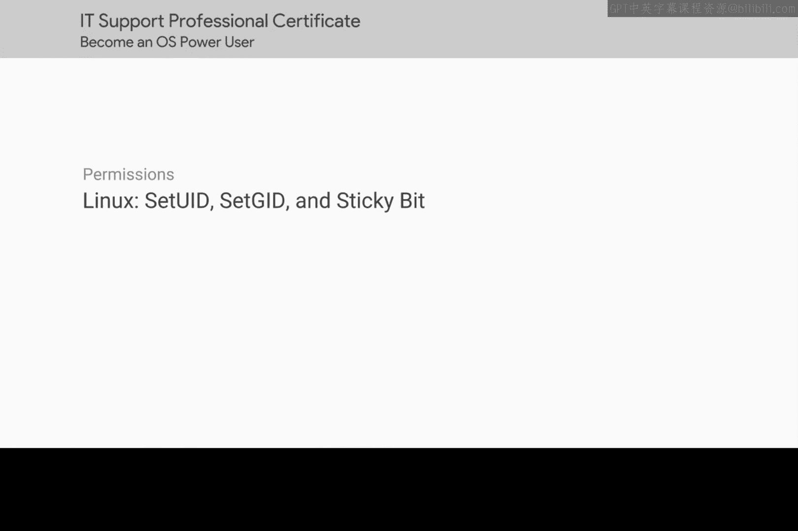
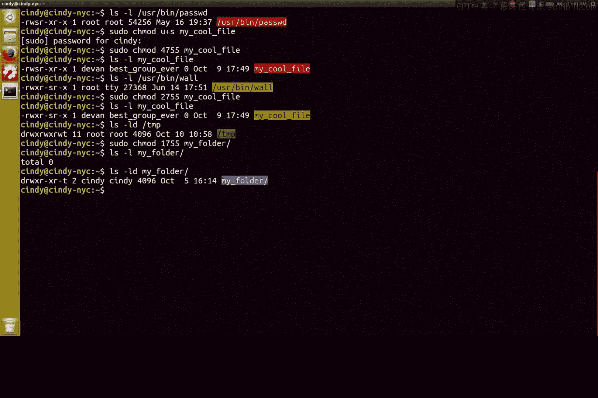

# 141：特殊权限位详解 🔐



在本节课中，我们将要学习Linux系统中的特殊权限位。这些权限位允许我们实现一些常规权限无法完成的精细控制，例如让普通用户能够执行需要更高权限的任务，而无需直接授予他们这些权限。

## 概述

Linux的标准权限（读、写、执行）有时不足以满足所有需求。例如，某些命令需要修改由`root`用户拥有的文件，但我们又不希望将`root`权限授予普通用户。为了解决这类问题，Linux引入了三种特殊权限位：`setuid`、`setgid`和粘滞位。

上一节我们介绍了标准文件权限，本节中我们来看看这些特殊权限位如何扩展权限控制的能力。

## Setuid（设置用户ID）权限

`setuid`权限允许用户以文件所有者的权限来执行该文件，而不是以执行者的权限。一个典型的例子是`passwd`命令。

当用户需要更改自己的密码时，会运行`passwd`命令。该命令需要将加密后的密码写入`/etc/shadow`文件，而此文件归`root`所有，普通用户通常没有写入权限。`setuid`权限解决了这个问题。

我们可以通过`ls -l`命令查看`/usr/bin/passwd`的权限：

```bash
ls -l /usr/bin/passwd
```

输出中，权限字段的“用户执行位”位置显示为`s`（而不是`x`），这表示`setuid`位已启用。

```
-rwsr-xr-x 1 root root 68208 May 28  2023 /usr/bin/passwd
```

这意味着当任何用户执行`passwd`命令时，该进程实际上是以文件所有者（`root`）的权限运行的，因此能够写入`/etc/shadow`文件。

### 如何设置Setuid位

设置`setuid`位有两种方式：符号法和数字法。

以下是设置方法：
*   **符号法**：使用 `u+s`
    ```bash
    chmod u+s filename
    ```
*   **数字法**：在标准的三位权限数字前加上`4`。例如，设置权限为`4755`（`rwsr-xr-x`）。
    ```bash
    chmod 4755 filename
    ```

## Setgid（设置组ID）权限

与`setuid`类似，`setgid`权限允许用户以文件所属组的权限来执行文件。这对于需要共享组权限的程序非常有用。

例如，查看`wall`命令（用于向所有终端发送消息）的权限：

```bash
ls -l /usr/bin/wall
```

你可能会看到类似以下的输出，其中组权限的执行位是`s`：

```
-rwxr-sr-x 1 root tty 35000 May 28  2023 /usr/bin/wall
```

这里的`s`表示`setgid`位已启用。当任何用户运行`wall`命令时，它将以`tty`组的权限执行，从而能够向所有终端设备写入消息。

### 如何设置Setgid位

设置`setgid`位的方法与`setuid`类似。

以下是设置方法：
*   **符号法**：使用 `g+s`
    ```bash
    chmod g+s filename
    ```
*   **数字法**：在标准的三位权限数字前加上`2`。例如，设置权限为`2755`（`rwxr-sr-x`）。
    ```bash
    chmod 2755 filename
    ```

## 粘滞位（Sticky Bit）

粘滞位主要用于目录。它为目录设置了一个特殊的保护：**任何用户都可以在目录中创建和修改文件，但只有文件的所有者或`root`用户才能删除该目录下的文件**。这常用于共享临时目录，如系统的`/tmp`目录。

查看`/tmp`目录的权限：

```bash
ls -ld /tmp
```



你会注意到权限字段的末尾有一个`t`：

```
drwxrwxrwt 15 root root 4096 Jan 1 12:00 /tmp
```

这个`t`表示粘滞位已启用。因此，所有用户都可以在`/tmp`中创建文件，但无法删除其他用户创建的文件。

### 如何设置粘滞位

设置粘滞位同样有符号法和数字法。

以下是设置方法：
*   **符号法**：使用 `+t`
    ```bash
    chmod +t directory_name
    ```
*   **数字法**：在标准的三位权限数字前加上`1`。例如，设置目录权限为`1777`（`drwxrwxrwt`）。
    ```bash
    chmod 1777 directory_name
    ```

## 总结

本节课中我们一起学习了Linux的三种特殊权限位：
1.  **`setuid`**：允许用户以文件所有者的身份执行程序。**数字表示为`4`**。
2.  **`setgid`**：允许用户以文件所属组的身份执行程序（对目录而言，可使在其中创建的文件继承目录的组）。**数字表示为`2`**。
3.  **粘滞位**：用于目录，确保用户只能删除自己拥有的文件。**数字表示为`1`**。

这些权限位虽然不常在日常操作中使用，但对于理解系统如何安全地管理用户权限、实现共享目录以及允许特定命令提升权限至关重要。用户访问控制、组权限和文件权限是计算机安全的核心概念。目前，你是在单机尺度上学习权限管理。在后续关于系统管理和IT基础设施服务的课程中，你将学习跨网络的多用户访问控制等更深入的内容。

现在，恭喜你！你已经为构建计算机安全知识体系迈出了坚实的第一步。在下一个模块，我们将转换话题，探讨操作系统如何管理软件。

接下来，你将完成两个关于Windows和Bash权限的评估。完成后，建议你在进入下一个模块前稍作休息。