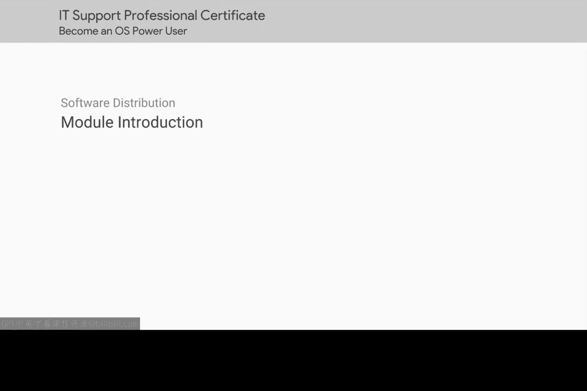

# 142：软件包管理模块介绍 🎯

在本模块中，我们将学习如何在Windows和Linux操作系统中管理软件包。软件包的安装与维护是IT支持工作中几乎每天都会遇到的任务，因此掌握其工作原理至关重要。

## 概述 📋

恭喜你，你已经完成了本课程一半的内容。在此之前，你已经学习了如何在Windows和Linux文件系统中进行导航，也掌握了用户与组的管理，以及权限与访问控制的基础知识。做得很好。

接下来，我们将学习软件包的概念，以及Windows和Linux系统上主要的软件包管理器。在IT支持岗位上，安装和维护软件包是你几乎每天都要进行的工作。因此，你需要熟悉这些操作在Windows和Linux操作系统上是如何进行的。让我们开始吧。

## 核心概念 💡

软件包管理器是用于自动化软件安装、升级、配置和移除的工具。它们极大地简化了系统管理。

*   **软件包**：通常是一个包含了程序文件、元数据（如版本、依赖关系）和安装脚本的压缩文件。
*   **包管理器**：一个用于与软件包仓库交互、解决依赖关系并执行安装或卸载操作的程序。

## 总结 ✨

本节课我们一起回顾了已学的知识，并介绍了即将学习的核心主题——软件包管理。理解并熟练使用Windows和Linux各自的包管理器，是成为一名高效IT支持专家的关键技能。在接下来的课程中，我们将深入探讨具体的操作与实践。