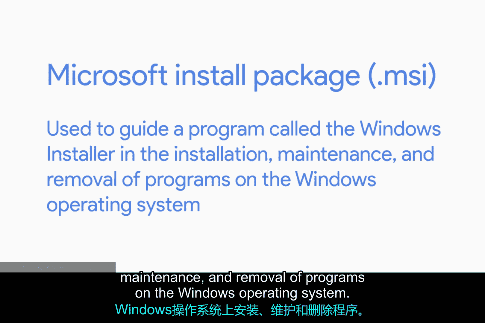
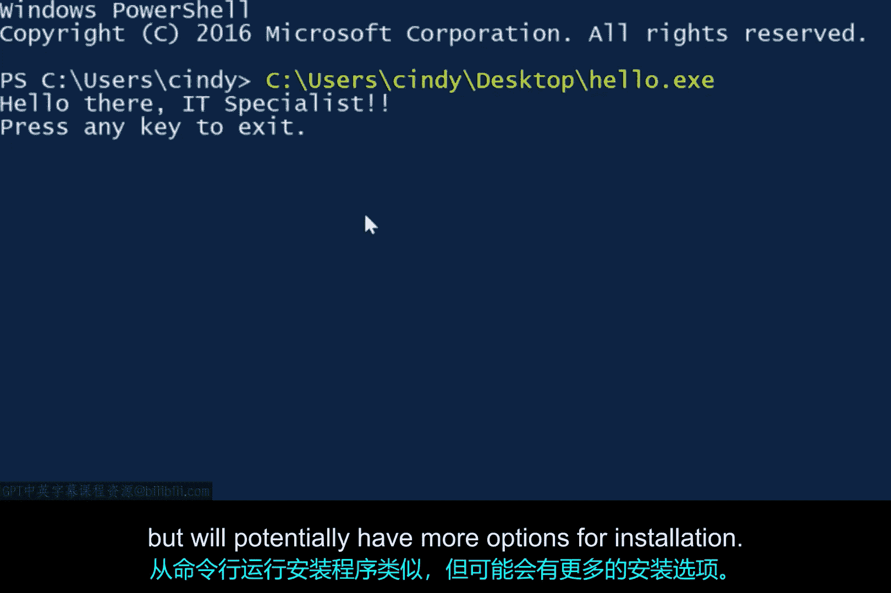

# 143：Windows软件包安装与管理

在本节课中，我们将学习软件包的基本概念，并重点探讨在Windows操作系统中软件是如何被打包和安装的。我们将了解不同的软件包格式及其应用场景，并学习如何通过图形界面和命令行两种方式进行安装。

你是否曾想过，我们是如何从应用商店或互联网获取软件包并将其安装到设备上的？不必再疑惑。开发者和制作我们所用软件的组织通常会为我们精心打包好软件。在大多数情况下，我们只需点击“安装”，软件包便会自动完成安装。

软件包的形式多种多样，就像为他人包装礼物一样。你可以将其放入盒子或袋子中，但真正重要的是里面的内容。开发者使用软件编译工具以不同方式打包软件，但最终结果都是一个软件包。在接下来的内容中，我们将讨论在IT支持工作中会遇到的一些最常见软件包类型。

## Windows中的软件包格式

在Windows系统中，软件通常被打包为 **.EXE** 或可执行文件。可执行文件包含计算机运行时要执行的指令，例如“将文件从这里复制到那里”、“安装此程序”，或更泛泛地“执行此操作”。可执行文件的概念并非Windows独有，但Windows有其特殊的实现形式，即EXE文件。

它们是根据微软的**可移植可执行**格式创建的。虽然我们不会深入探讨PE格式的细节，但需要知道的是，EXE文件不仅包含计算机要执行的指令，还可能包含程序可能使用的文本、计算机代码、图像，以及一种称为**MSI文件**的东西。

一个**微软安装包**用于指导名为“Windows安装程序”的程序在Windows操作系统上执行程序的安装、维护和移除工作。

除了使用图形用户界面安装向导引导用户安装程序外，Windows安装程序还使用MSI文件来创建说明，以便在用户想要卸载程序时知道如何移除它。

Windows可执行文件通常用作启动Windows安装程序的引导程序。在这种情况下，它们可能只包含一个MSI文件和一些启动Windows安装程序并读取它的指令。或者，可执行文件也可以用作独立的自定义安装程序，不包含MSI文件或不使用Windows安装程序。如果以这种方式打包，EXE文件将需要包含操作系统安装程序所需的所有指令。

## 选择安装方式：MSI与自定义安装程序

那么，何时使用MSI文件和Windows安装程序，何时使用包含类似`setup.exe`的自定义安装程序的可执行文件呢？这是很好的问题。

如果你希望对Windows安装软件时采取的操作进行精确、细粒度的控制，你可能会选择自定义安装程序路线。然而，这可能会很棘手，尤其是在管理代码依赖项时。另一方面，使用由MSI文件引导的Windows安装程序会为你处理许多簿记和设置工作，但它对软件的安装方式有一些相当严格的规则。

从Windows 8开始，微软引入了一个名为**Windows应用商店**的平台来分发程序。Windows应用商店是一个应用程序仓库，你可以从中下载和安装通用Windows平台应用。这些是可以在任何兼容的Windows设备上运行的应用程序。这些程序使用一种称为**APPX**的格式来打包其内容，并充当分发单元。我们不会详细讨论APPX包，但知道它们的存在为你提供了另一种打包软件的选择是很好的。

## 安装软件包：图形界面与命令行

我们在之前的课程中学习了如何安装EXE包。要通过图形用户界面安装EXE，我们只需双击可执行文件，然后按照提供的安装过程进行操作，这个过程可能由可执行文件本身或Windows安装程序引导。这相当简单。

但是，如何从命令行安装软件呢？首先，为什么需要这样做呢？准备好，因为你即将发现，在IT支持的许多场景中，从命令行安装可执行文件非常方便，包括自动安装。你可能希望编写脚本或使用配置管理工具自动安装某些软件，而无需人工在安装向导中点击按钮。

那么，如何从命令行安装可执行文件呢？答案是：**视情况而定**。

我知道这个答案不太令人满意。从命令行运行EXE文件相当简单：你打开命令提示符或PowerShell，切换到可执行文件所在的目录，然后输入其名称。你也可以直接从文件系统中的任何位置键入EXE的绝对路径，例如：
`C:\Users\Cindy\Desktop\Hello.EXE`

从命令行运行安装程序与此类似，但根据安装程序的不同，可能会有更多的安装选项。你可能会有用于静默安装的标志（屏幕上不显示任何内容，软件包安静地安装），或者获得一个参数让计算机在安装包后自动重启。

你可以查看使用Microsoft自解压程序创建的软件包的选项，以更好地理解我们所讨论的内容。一个给定的安装程序可能有这些用于从命令行安装的选项，但它们因供应商而异。微软软件包的可用选项可能与Mozilla软件包的选项不同。

**专业提示**：尝试在从命令行运行软件包时使用 **`/?`** 参数，以查看该软件包可能支持哪些类型的子命令。如果软件包没有任何与帮助相关的选项，你最好的选择是查看供应商的文档，了解他们的软件包支持哪些类型的安装。

## 总结

本节课中，我们一起学习了软件包在Windows系统中的核心概念。我们了解了**.EXE可执行文件**和**MSI安装包**的区别与用途，知道了Windows安装程序的作用。我们还探讨了从Windows 8引入的**APPX**打包格式。最后，我们比较了通过图形界面和命令行安装软件的方法，并学习了如何使用命令行参数（如静默安装`/S`和帮助`/?`）来更灵活地控制安装过程。理解这些知识将帮助你在IT支持工作中更有效地管理和部署软件。