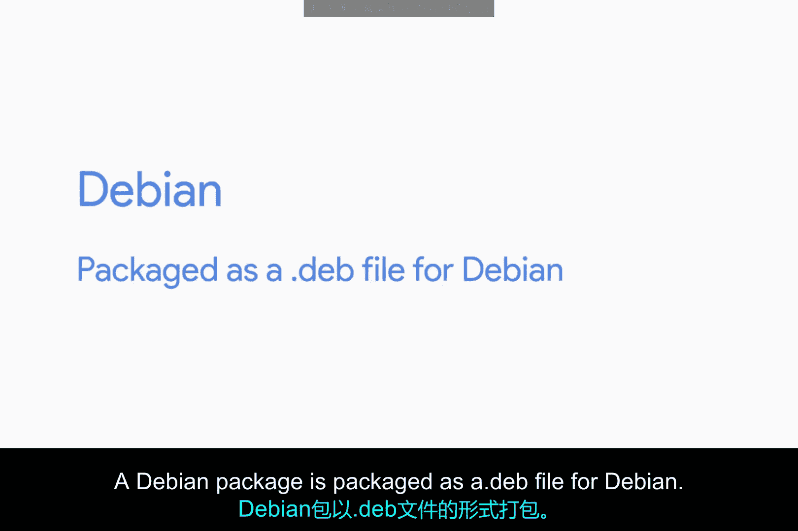
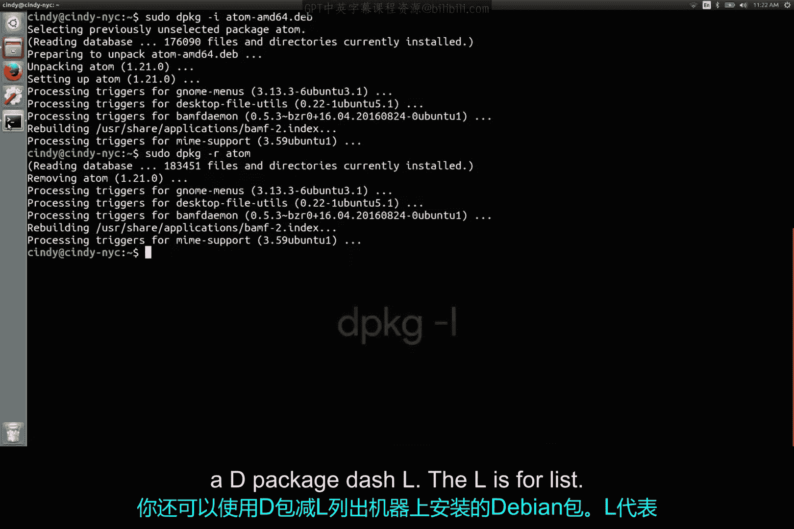

# 144：Linux软件包管理

在本节课中，我们将要学习Linux系统中的软件包管理。我们将了解不同Linux发行版使用的软件包类型，并重点学习如何安装、移除和查询Debian格式的软件包。

## Linux软件包类型概述

Linux系统拥有众多不同的发行版，每个发行版可能使用不同类型的软件包。

例如，在Red Hat Linux发行版中，使用的软件包是RPM（Red Hat Package Manager）格式。我们不会在本课程中详细讲解如何操作RPM包，但你需要知道，当你在不同的Linux发行版上工作时，软件包类型可能会发生变化。

如果你有兴趣了解更多关于RPM包的信息，我已在视频后的补充阅读材料中提供了一个链接。

## 聚焦Debian软件包



在本课程中，我们将使用Debian软件包，这也是Ubuntu系统所使用的格式。

一个Debian软件包被打包为一个以 **.deb** 结尾的文件。

你已经在前期的“技术支持基础”课程中，学习了如何使用包管理器的帮助来安装Linux软件包。我们将在后续视频中更深入地探讨包管理器，但现在，让我们专注于如何安装一个独立的Debian软件包。

在某些情况下，你必须处理独立的Debian软件包，特别是当开发者将他们的软件打包并发布在不同的网站上时。

## 安装与移除独立Debian包

要安装一个Debian软件包，你需要使用 **`dpkg`**（Debian package）命令。

这里有一个开源文本编辑器Atom的独立安装包。让我们使用 `dpkg` 命令来安装它。我们必须使用 **`-i`** 标志来表示安装（install）。

```bash
dpkg -i package_name.deb
```

安装完成。现在它已经安装在这台电脑上了。

如果我们想要移除一个软件包，该怎么做呢？为此，我们使用 **`-r`** 或移除（remove）标志。

```bash
dpkg -r package_name
```

以上就是你安装和移除独立Debian软件包的方法，相当简单，对吧？



## 查询已安装的软件包

你也可以使用 **`dpkg -l`** 命令来列出机器上已安装的Debian软件包。这里的 **`-l`** 代表列表（list）。

输出的列表上有很多程序，看起来有些杂乱。

你能想到我们之前学过的哪个命令可以帮助我们搜索某个特定的软件包是否已安装吗？

没错，就是 **`grep`** 命令。假设我们想搜索刚刚安装的atom包（请注意，我刚刚卸载了它，所以我会快速地重新安装一下）。

现在，让我们运行 `dpkg -l | grep atom`。

```bash
dpkg -l | grep atom
```

这里，我们将 `dpkg -l` 命令的输出通过管道（`|`）传递给了 `grep`。请记住，管道命令会获取一个命令的标准输出（在这里是 `dpkg -l` 的输出），然后将其发送到它连接到的下一个命令的标准输入（在这里是 `grep`）。

运行这个命令后，它显示Atom确实在已安装的软件包列表中。只需记住，在使用 `grep` 时，它会列出名称中包含搜索词的所有其他结果。

## 课程总结

本节课中，我们一起学习了如何在Linux中管理Debian格式的软件包。我们了解了不同发行版的包类型差异，并掌握了使用 **`dpkg`** 命令进行安装（`-i`）、移除（`-r`）和查询（`-l` 结合 `grep`）独立软件包的核心操作。通过结合管道命令，我们能更高效地筛选和管理已安装的软件。