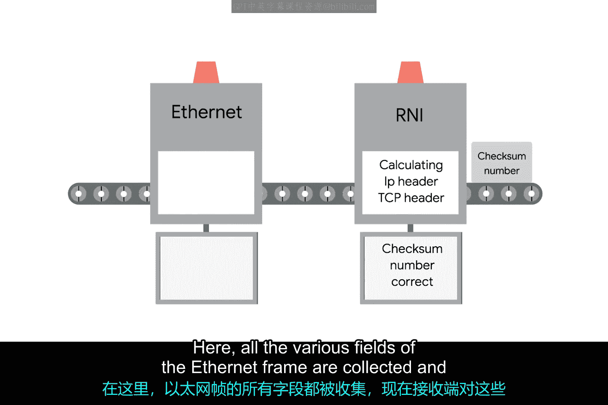

# 015：剖析以太网帧 🔍

在本节课中，我们将通过剖析以太网帧来完善你对网络基础知识的理解。掌握这些基础知识是构建坚实的网络知识体系的第一步，这对于IT支持工作至关重要。

## 概述

数据包是一个总括性术语，代表通过网络链路发送的任何一组二进制数据。这个术语不绑定于任何特定的方式或技术，它只代表一个概念：一组从A点发送到B点的数据。在以太网层面，数据包被称为以太网帧。

## 以太网帧的结构

一个以太网帧是一个高度结构化的信息集合，以特定的顺序呈现。这样，物理层的网络接口可以将链路上传输的比特流转换为有意义的数据，反之亦然。以太网帧的几乎所有部分都是必需的，并且大多数部分具有固定的大小。

### 前导码

以太网帧的第一部分称为前导码。前导码长8字节（64位），本身可以分为两个部分。

以下是前导码的组成部分：
*   **前7个字节**：一系列交替的1和0。这部分作用包括作为帧之间的缓冲区，以及供网络接口用来同步其内部时钟，以调节发送数据的速度。
*   **最后1个字节**：称为SFD，即帧起始定界符。它向接收设备发出信号，表示前导码结束，实际的帧内容即将开始。

### 地址与类型字段

紧接在帧起始定界符之后的是目标MAC地址。这是预期接收者的硬件地址，随后是源MAC地址，即帧的起源地址。请记住，每个MAC地址长48位（6字节）。

以太网帧的下一部分称为以太类型字段。它长16位，用于描述帧内容的协议。我们稍后会深入探讨这些协议是什么。

值得注意的是，在以太类型字段的位置，你也可能发现一个VLAN头部。它表明该帧本身是一个VLAN帧。如果存在VLAN头部，以太类型字段则跟在它后面。

VLAN代表虚拟局域网。这是一种技术，允许你在同一物理设备上运行多个逻辑局域网。任何带有VLAN标签的帧，只会从配置为转发该特定标签的交换机接口发出。这样，你可以拥有一个像多个局域网一样运行的单一物理网络。VLAN通常用于隔离不同类型的流量，例如，你可能会看到公司的IP电话在一个VLAN上运行，而所有桌面电脑在另一个VLAN上运行。

### 数据载荷与帧校验序列

在此之后，你会找到以太网帧的数据载荷。在网络术语中，载荷是指被传输的实际数据，即所有非头部的部分。传统以太网帧的数据载荷长度可以在46到1500字节之间。它包含了来自更高层（如IP层、传输层和应用层）的所有实际被传输的数据。

在数据之后，我们有一个称为帧校验序列的部分。这是一个4字节（32位）的数字，代表整个帧的校验和值。这个校验和值是通过对帧执行循环冗余校验计算得出的。

循环冗余校验是数据完整性的一个重要概念，广泛应用于计算领域，而不仅仅是网络传输。CRC本质上是一种数学变换，它使用多项式除法来创建一个代表更大数据集的数字。任何时候你对一组数据执行CRC，都应该得到相同的校验和数字。

将其包含在以太网帧中的原因，是让接收端的网络接口能够推断它接收到的数据是否完好无损。

## 数据发送与校验过程

上一节我们介绍了以太网帧的各个组成部分，本节中我们来看看数据发送和校验的实际过程。

当设备准备发送一个以太网帧时，它会收集我们刚刚介绍的所有信息，如目标和源MAC地址、数据载荷等。然后，它对这些数据执行CRC计算，并将得到的校验和数字作为帧校验序列附加在帧的末尾。

然后，这些数据通过链路发送并在另一端被接收。在这里，以太网帧的各个字段被收集起来，接收端现在对这些数据执行CRC计算。

如果接收端计算出的校验和与帧校验序列字段中的校验和不匹配，数据将被丢弃。这是因为在传输过程中，一定量的数据必定已经丢失或损坏。然后，由更高层的协议来决定是否应该重新传输该数据。以太网本身只报告数据完整性，不执行数据恢复。

## 总结

本节课中，我们一起学习了以太网帧的详细结构，包括前导码、地址字段、类型/标签字段、数据载荷以及至关重要的帧校验序列。我们了解了循环冗余校验如何确保数据在传输过程中的完整性。理解这些基础概念是掌握更复杂网络协议和进行故障排除的关键。