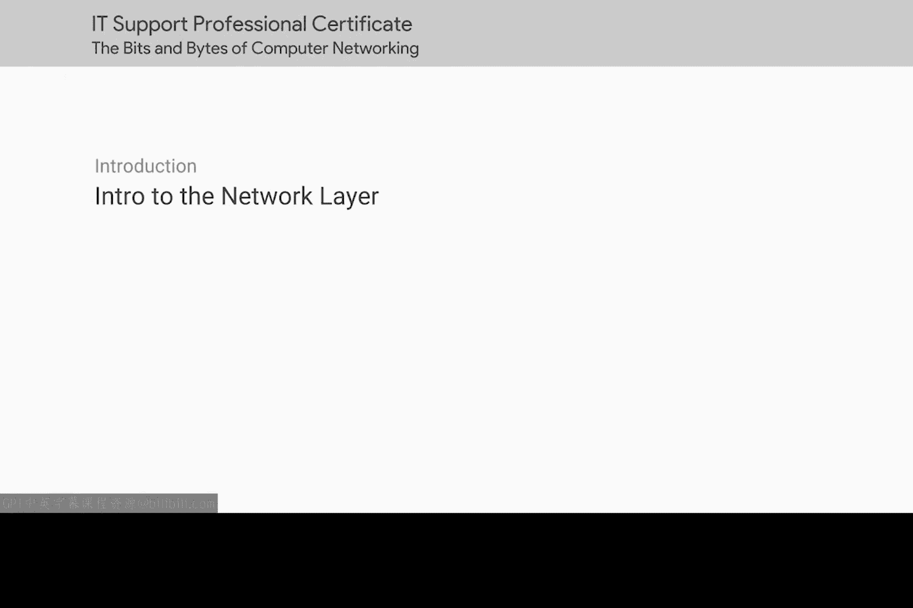

# 017：网络层介绍 🌐

在本节课中，我们将要学习网络层的基本概念。网络层是计算机网络的核心，它负责在不同网络之间传输数据，使得全球范围内的计算机能够相互通信。我们将从局域网通信的基础出发，逐步深入到跨网络通信的技术。

## 概述

上一节我们介绍了计算机如何在短距离或单一局域网内进行通信。本节中，我们来看看如何实现数据跨越多个网络进行远距离通信。这是互联网每天被数十亿人使用的关键技术基础。

计算机能够在近乎瞬间的速度下跨越巨大距离进行通信。这是一项非凡的技术进步，构成了数十亿人每天使用互联网的基础。

## 网络层的作用

网络层的主要职责是促进数据在不同网络之间的传输。它使得通信能够跨越很远的距离。

在接下来的课程中，我们将重点介绍允许数据跨越多个网络的技术。

## 本模块学习目标

在本模块结束时，你将能够描述IP寻址方案以及子网划分的工作原理。

以下是本模块将涵盖的核心内容：

*   你将学习如何进行基本的二进制运算，以便描述子网。
*   你还将能够演示封装的工作原理，以及像ARP这样的协议如何允许网络的不同层进行通信。
*   最后，你将初步理解路由协议的基础知识以及互联网的工作原理。

## 总结

本节课中，我们一起学习了网络层的引入及其在跨网络通信中的核心作用。我们明确了本模块的学习目标，包括IP寻址、子网划分、二进制运算、封装、ARP协议以及路由和互联网的基础知识。现在，请继续观看下一个视频，我们将正式开始深入学习。