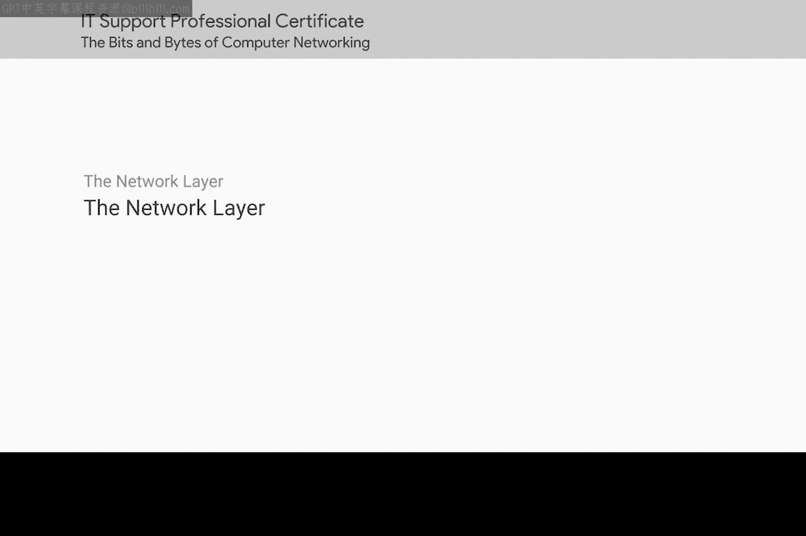
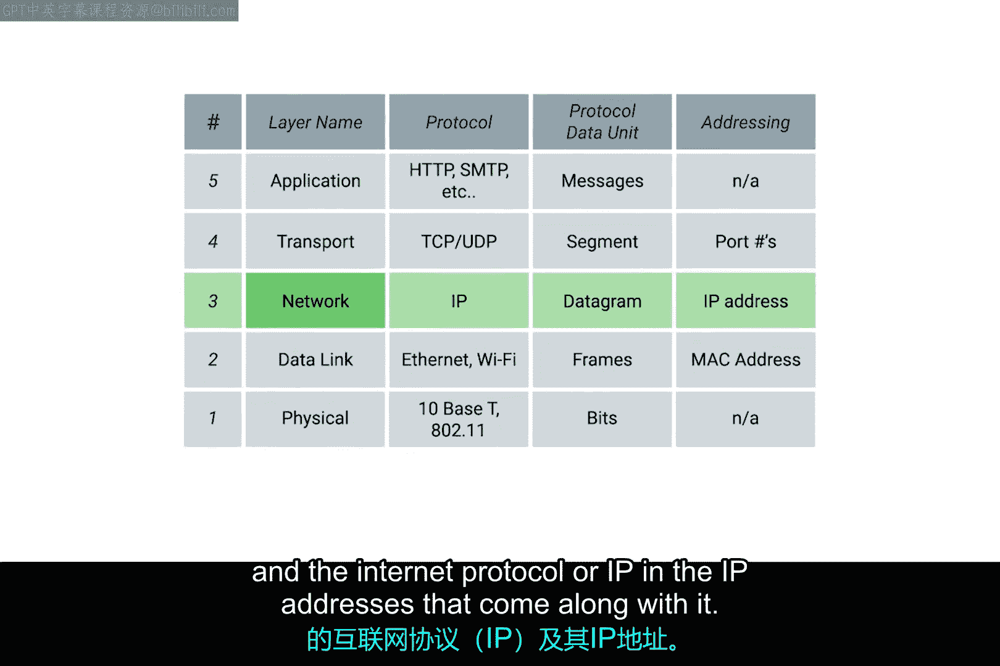

# 018：网络层与IP协议

在本节课中，我们将学习网络层的作用，理解为何需要IP地址来替代MAC地址进行大规模网络通信，并详细介绍IP数据报的结构。

## 概述：从MAC地址到IP地址

在局域网中，节点可以通过其物理MAC地址进行通信。交换机能够快速学习连接到其端口的MAC地址，从而在小型网络中高效地转发数据。

然而，MAC地址的寻址方案扩展性不佳。全球每一个网络接口都有一个唯一的MAC地址，但这些地址并非按任何系统性的方式排列。我们无法知道某个MAC地址在地球上的具体位置，因此它不适合远距离通信。

此外，当我们稍后介绍ARP协议时，你会发现节点了解彼此物理地址的方式，除了在单个网段内，无法扩展到更广的范围。

显然，我们需要另一种解决方案。这就是**网络层**以及**互联网协议**。IP协议引入了**IP地址**，它能够在大规模网络中有效地定位设备。

## IP数据报的封装

上一节我们了解了MAC地址的局限性，本节中我们来看看IP数据报是如何在网络中传输的。

IP数据报本身是网络层的数据包。为了在物理链路上传输，它需要被封装在数据链路层的帧中。具体来说，在以太网中，IP数据报被放置在以太网帧的**载荷**部分。

这个过程可以表示为：
**以太网帧 = 帧头 + IP数据报（载荷） + 帧尾**

通过这种封装方式，网络层的数据得以借助数据链路层的服务，跨越不同的物理网络进行传递。

## IP数据报头详解

理解了封装过程后，现在我们来深入剖析IP数据报本身的结构。IP数据报的头部包含多个字段，这些字段共同决定了数据包的路由和处理方式。

以下是IP数据报头部的主要字段及其作用：

*   **版本**：指明使用的IP协议版本（如IPv4或IPv6）。
*   **头部长度**：指示IP头部的长度。
*   **服务类型**：用于指定数据包的服务质量要求。
*   **总长度**：定义整个IP数据报（头部+数据）的总长度。
*   **标识、标志、片偏移**：这三个字段共同用于处理数据报的**分片**与**重组**。当数据报大小超过网络链路的**最大传输单元**时，它会被分割成多个片段，这些字段确保接收方能正确地将它们重新组装起来。
*   **生存时间**：数据包在被丢弃前可以经过的最大路由器跳数。每经过一个路由器，该值减1，防止数据包在网络中无限循环。
*   **协议**：标识封装在IP数据报载荷中的是哪种高层协议的数据（例如，TCP或UDP）。
*   **头部校验和**：用于检测IP头部在传输过程中是否出现错误。
*   **源IP地址**：发送数据包的设备的IP地址。
*   **目的IP地址**：接收数据包的设备的IP地址。
*   **选项**：可选字段，用于安全、路由记录等特殊处理。

## 总结

本节课中，我们一起学习了网络层和IP协议的核心知识。我们首先认识到MAC地址在广域网通信中的局限性，从而引入了具有层次化结构的IP地址。接着，我们了解了IP数据报如何被封装在以太网帧中进行传输。最后，我们详细解析了IP数据报头部的各个关键字段，包括版本、地址、生存时间以及用于分片控制的标识、标志和片偏移等。掌握这些概念是理解互联网如何工作的基础。