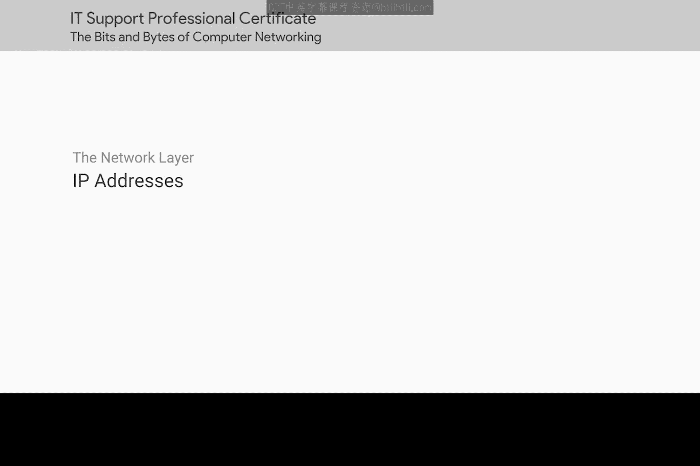
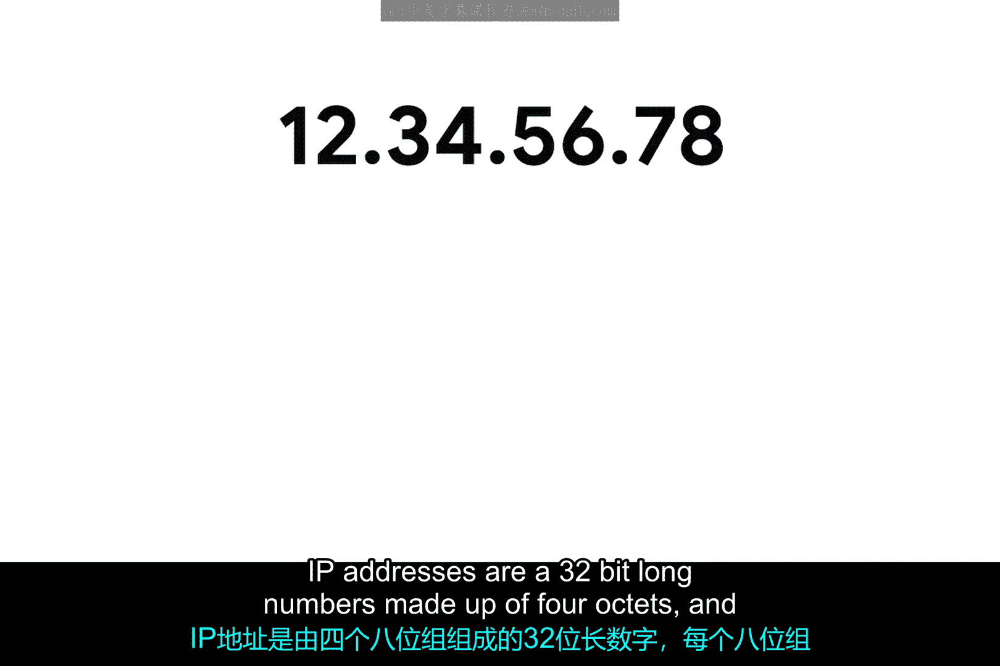
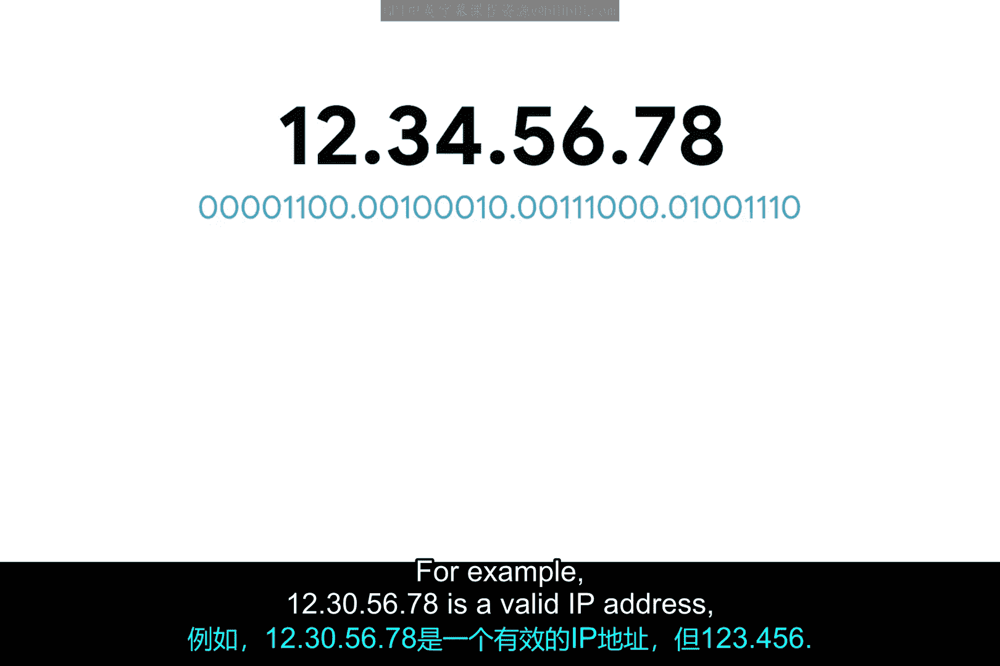
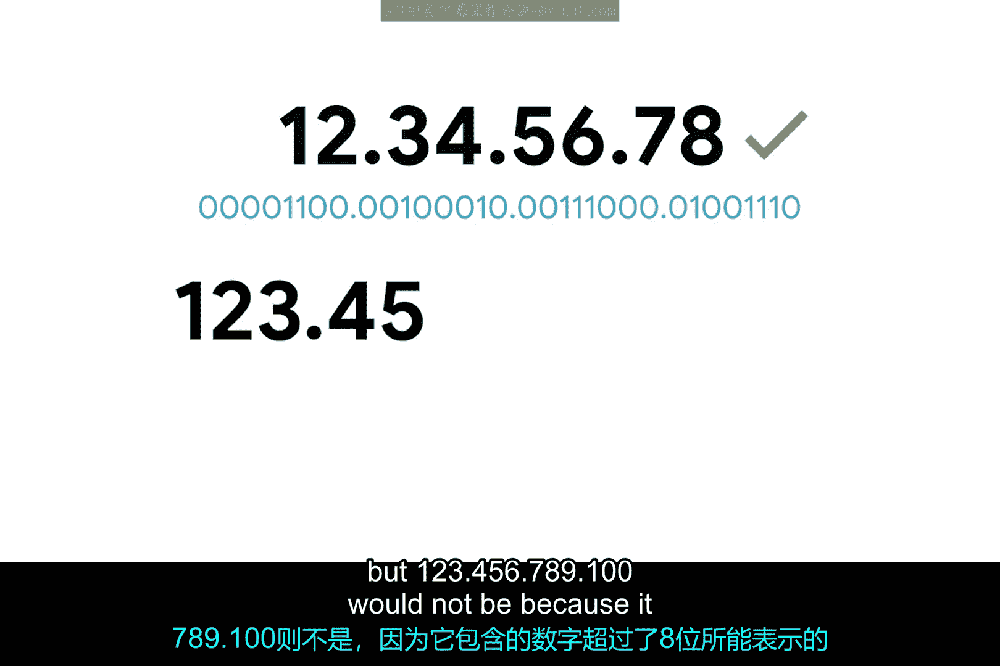
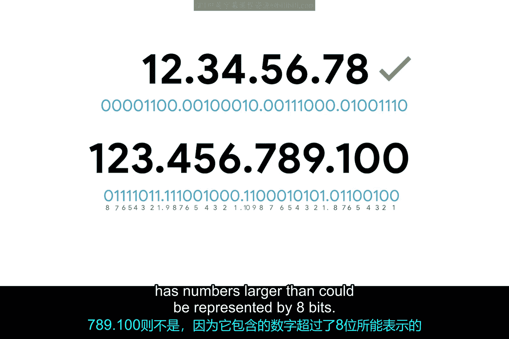
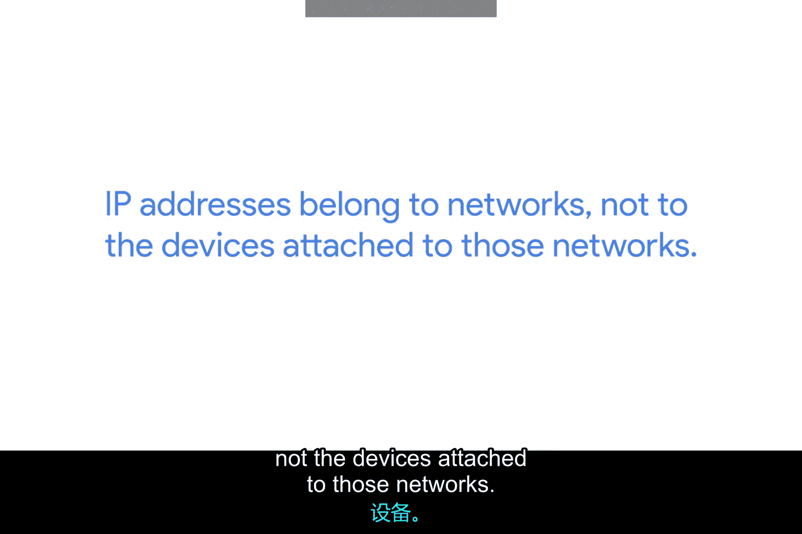
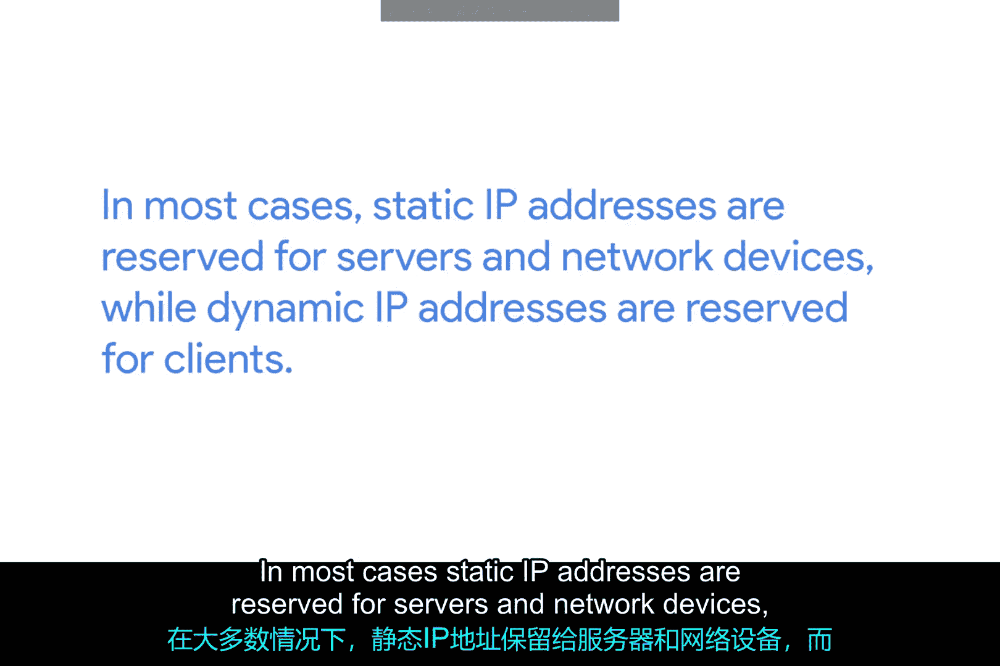
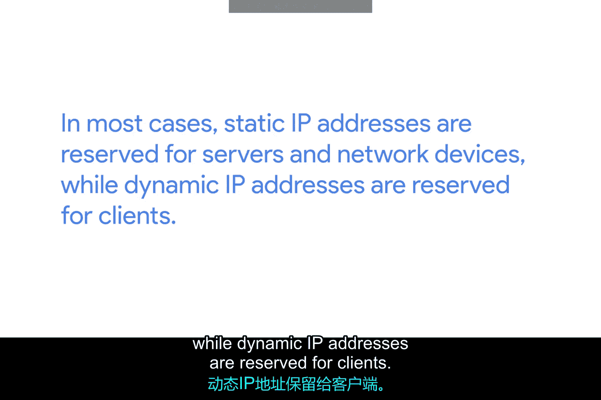

# 019：IP地址详解 🖧

在本节课中，我们将要学习计算机网络中的一个核心概念：IP地址。我们将了解IP地址的构成、表示方法、分配方式以及动态与静态地址的区别。

---

## IP地址的构成与表示

上一节我们介绍了网络通信的基本概念，本节中我们来看看IP地址的具体构成。

IP地址是32位长的数字，由四个八位组（octet）组成。每个八位组通常用十进制数表示。

八位数据（即一个八位组）可以表示从0到255的所有十进制数。例如，`12.34.56.78` 是一个有效的IP地址，而 `123.456.789.100` 则无效，因为它包含了无法用8位表示的数字（大于255）。这种表示格式被称为**点分十进制记法**。

其结构可以用以下公式表示：
**IP地址 = 八位组1 . 八位组2 . 八位组3 . 八位组4**
其中，每个八位组满足：**0 ≤ 八位组值 ≤ 255**

---

## IP地址的层次化分配

了解了IP地址的格式后，我们来看看它是如何分配的。IP地址的分配方式与MAC地址不同，它具有层次结构。

IP地址以大的区块形式分配给各种组织和公司，而不是由硬件制造商决定。这意味着IP地址比物理地址（MAC地址）更具层次性，也更容易存储相关信息。

我们可以用一个高级别的例子来理解：IBM公司拥有所有以数字9作为第一个八位组的IP地址。这意味着，如果一个互联网路由器需要确定将目的地为 `9.0.0.1` 的数据包发送到哪里，它只需要知道将其发送到IBM的某个路由器即可。IBM的路由器会处理后续的投递过程。

---

## IP地址属于网络，而非设备

一个关键概念是，IP地址属于**网络**，而非连接到该网络的**设备**。

因此，无论你在何处使用你的笔记本电脑，它的MAC地址始终相同。但是，当你在咖啡馆上网时，它被分配的IP地址会与在家时不同。咖啡馆的局域网或你家的局域网会各自负责在设备开机时为其分配一个IP地址。

---

## 动态与静态IP地址

在日常使用中，获取IP地址通常是一个不可见的过程。你将在后续课程中了解更多相关技术。目前，请记住，在许多现代网络中，你可以连接一个新设备，并通过一项称为**动态主机配置协议**的技术自动为其分配一个IP地址。

以下是对两种分配方式的介绍：

**动态IP地址**
通过DHCP自动分配的IP地址称为动态IP地址。这种方式方便快捷，适用于大多数客户端设备。

**静态IP地址**
与动态地址相反，静态IP地址必须在节点上手动配置。在大多数情况下，静态IP地址是为服务器和网络设备保留的，而动态IP地址则保留给客户端使用。

当然，也存在某些情况下这种分配方式不成立的特例。

---

## 总结

本节课中我们一起学习了IP地址的核心知识。我们了解到IP地址是一个32位的点分十进制数字，它属于网络而非设备，并且以层次化的方式进行分配。我们还区分了动态分配与静态配置的IP地址，前者通常用于客户端，后者则多用于服务器和网络基础设施。理解这些概念是掌握网络通信基础的关键一步。