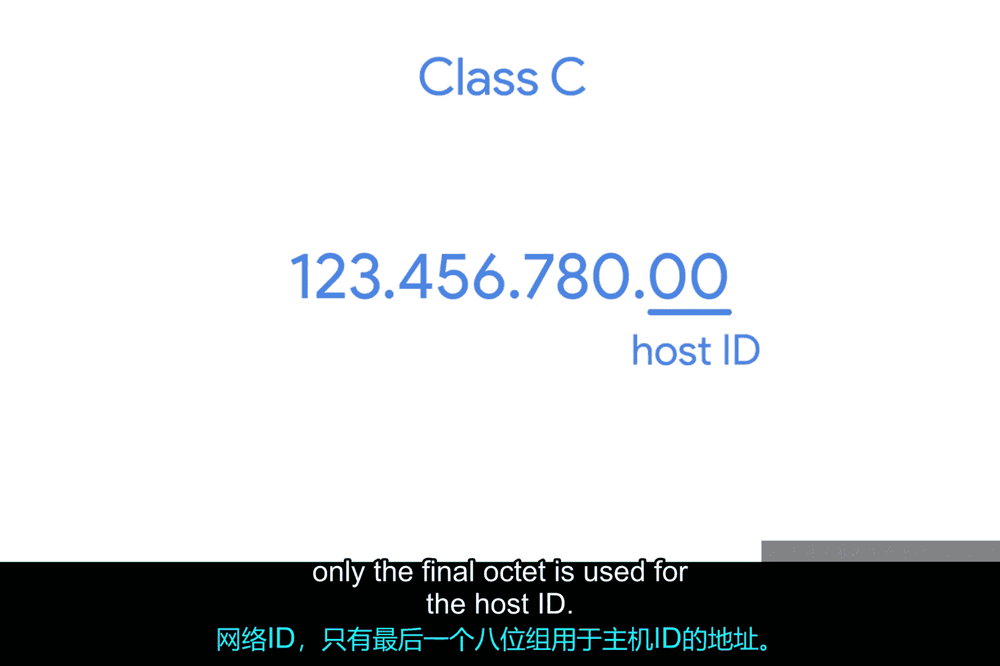
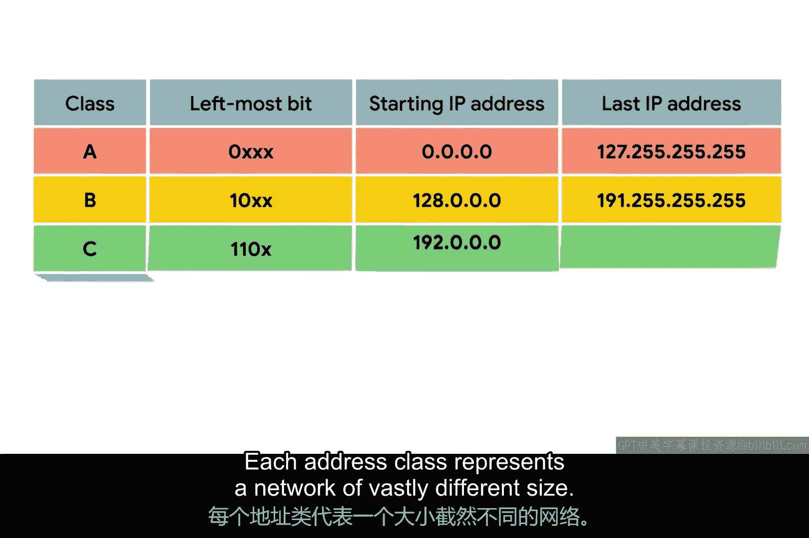
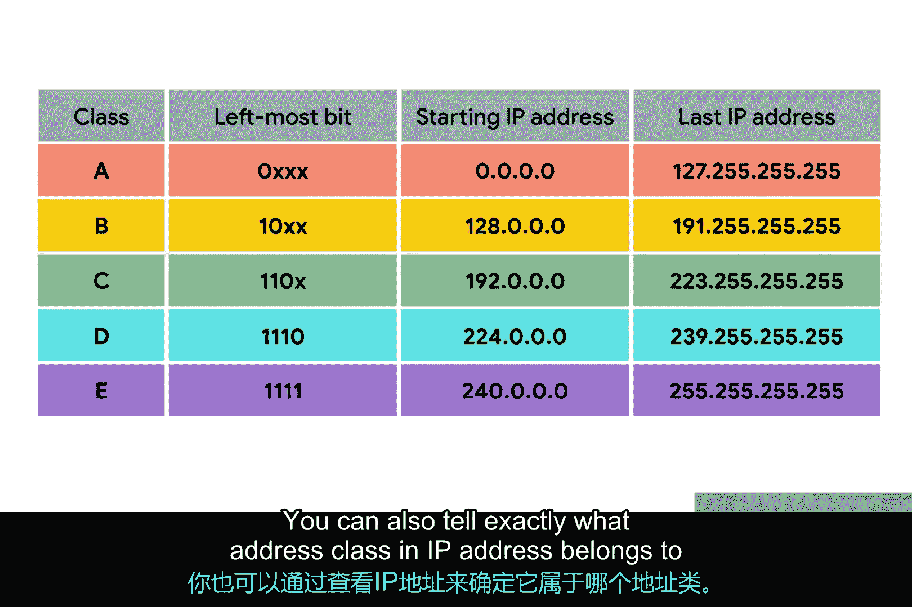
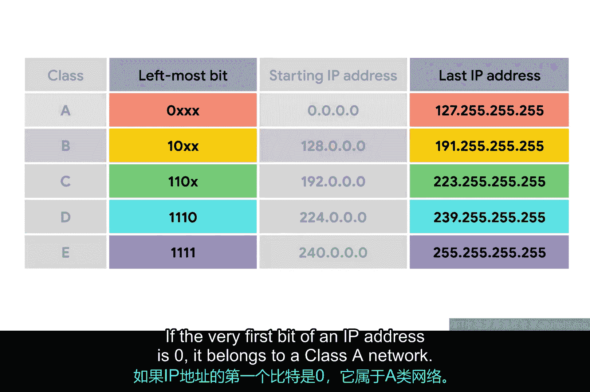
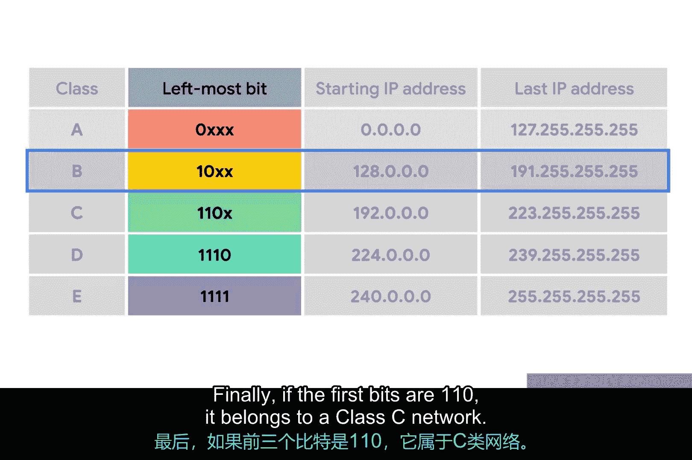
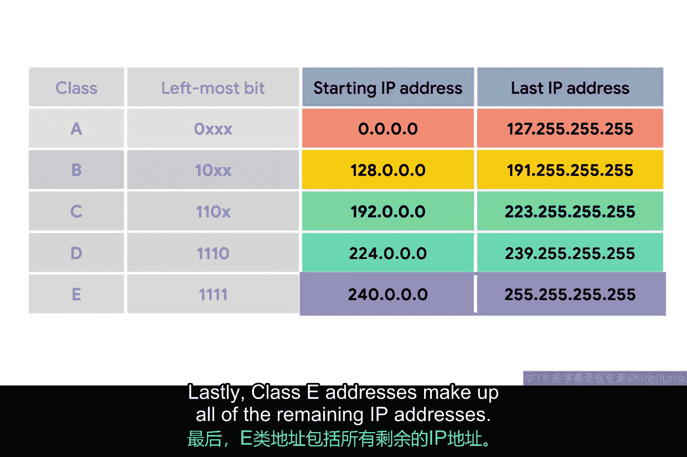

# 021：IP地址分类详解 🌐

在本节课中，我们将要学习IP地址的核心结构——地址分类系统。我们将了解IP地址如何被划分为网络部分和主机部分，以及A、B、C、D、E五类地址的具体定义和识别方法。理解这些概念是掌握网络通信和IP寻址的基础。

## IP地址的基本结构

IP地址可以被划分为两个部分：**网络ID**和**主机ID**。

之前我们提到过，IBM公司拥有所有第一个点分十进制数值为9的IP地址。如果我们以IP地址`9.100.100.100`为例，那么**网络ID**就是第一个八位组（`9`），而**主机ID**则是第二、第三和第四个八位组（`100.100.100`）。

## 地址分类系统简介

地址分类系统是一种定义全球IP地址空间如何划分的方式。它决定了IP地址中哪一部分代表网络，哪一部分代表主机。

以下是三种主要的地址类别：

*   **A类地址**：第一个八位组用于**网络ID**，后三个八位组用于**主机ID**。
*   **B类地址**：前两个八位组用于**网络ID**，后两个八位组用于**主机ID**。
*   **C类地址**：前三个八位组用于**网络ID**，只有最后一个八位组用于**主机ID**。

## 不同地址类的网络规模

每个地址类别代表着规模差异巨大的网络。

例如，一个A类网络拥有总共24位的主机ID空间。这换算出来是 **2^24** 即 **16,777,216** 个独立地址。

相比之下，一个C类网络只有8位的主机ID空间。这换算出来是 **2^8** 即 **256** 个地址。

## 如何识别地址类别

仅通过观察一个IP地址，你就能准确判断它属于哪个地址类别。判断依据是IP地址二进制形式的前几位。

以下是识别规则：

*   如果一个IP地址的**第一位**是`0`，它属于**A类网络**。
*   如果IP地址的**前两位**是`10`，它属于**B类网络**。
*   如果IP地址的**前三位**是`110`，它属于**C类网络**。

## 点分十进制表示法中的识别

由于人类不擅长直接思考二进制，了解这些规则如何对应到我们熟悉的点分十进制表示法很有帮助。

每个八位组是8位，这意味着每个八位组的值在0到255之间。

*   如果第一位必须是`0`（如A类地址），那么第一个八位组可能的十进制值范围是 **0到127**。因此，任何第一个点分十进制数在此范围内的IP地址都是A类地址。
*   类似地，B类地址被限制为第一个八位组值在 **128到191** 之间。
*   C类地址的第一个八位组值在 **192到223** 之间。

## 其他地址类别

你可能会注意到，这并没有覆盖所有可能的IP地址。这是因为还有另外两个IP地址类别。

*   **D类地址**：总是以二进制位`1110`开头，用于**多播**。多播允许单个IP数据报同时发送给整个网络。这些地址的十进制值范围在 **224到239** 之间。
*   **E类地址**：由所有剩余的IP地址组成，但它们是**未分配的**，仅用于测试目的。其第一个八位组值从240开始。

## 总结与展望

本节课中，我们一起学习了经典的IP地址分类系统。我们了解了A、B、C类地址如何划分网络ID和主机ID，以及如何通过二进制前缀或点分十进制范围来识别它们。我们还简要介绍了用于多播的D类地址和保留的E类地址。

在实际应用中，这个分类系统在很大程度上已被一种称为**CIDR（无类别域间路由）** 的系统所取代。但地址分类系统在许多方面仍然存在，对于任何寻求全面网络教育的人来说，理解它都非常重要。别担心，我们将在未来的课程中详细讲解CIDR。