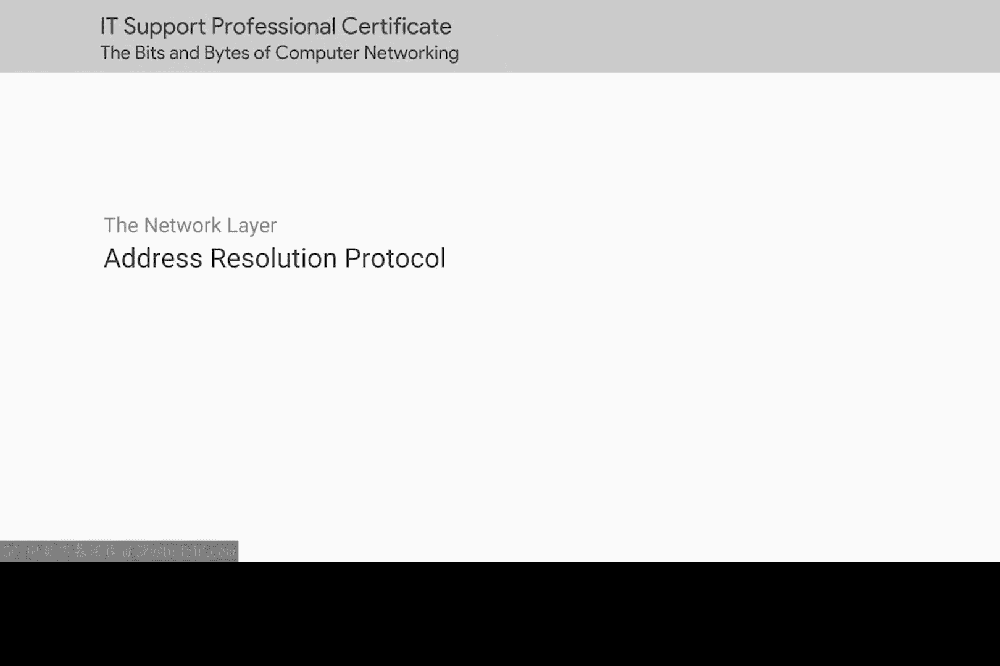
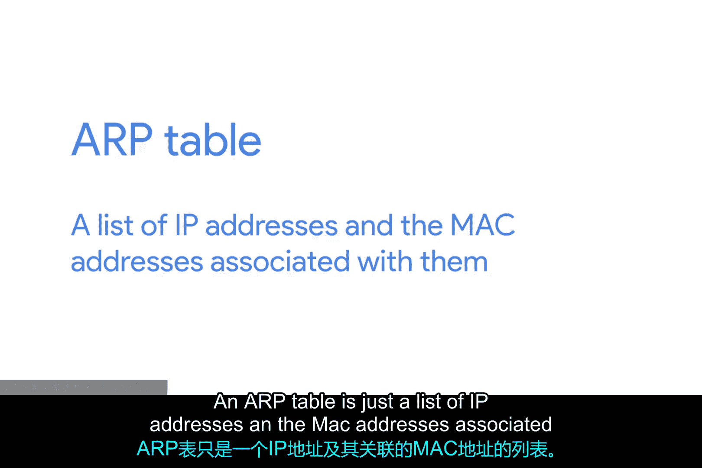
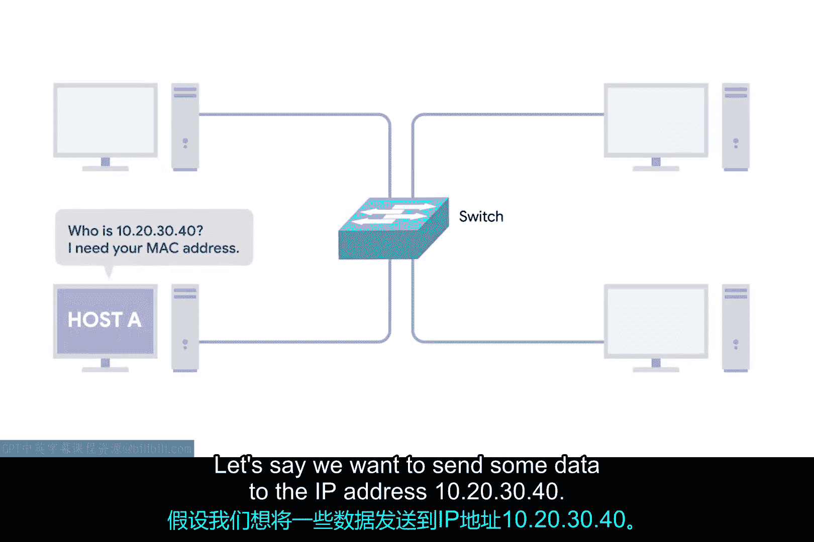
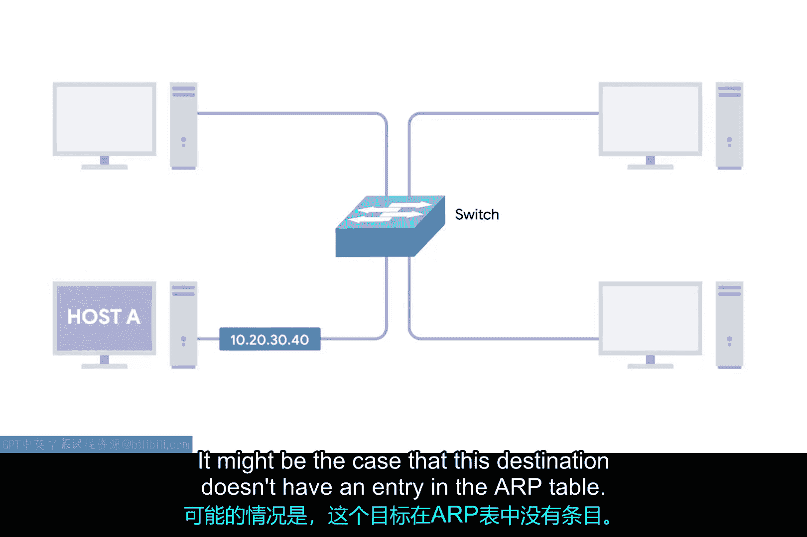
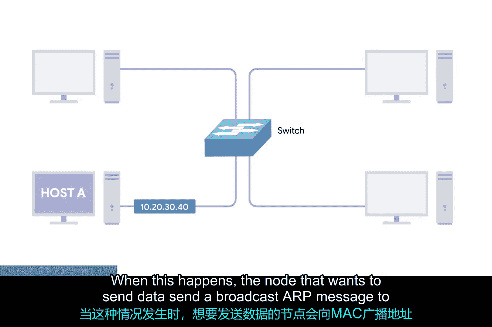
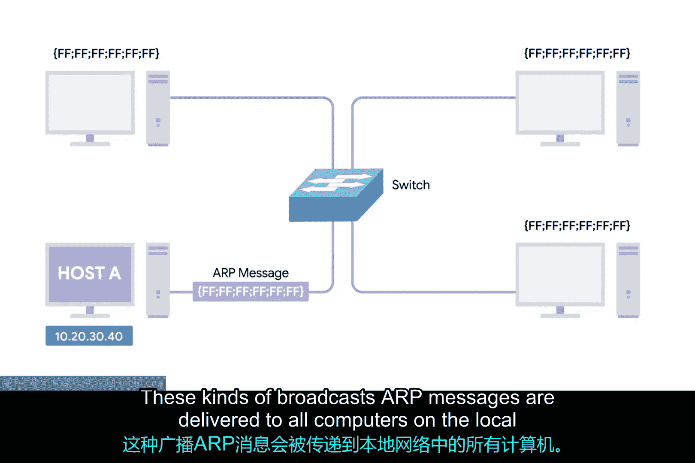
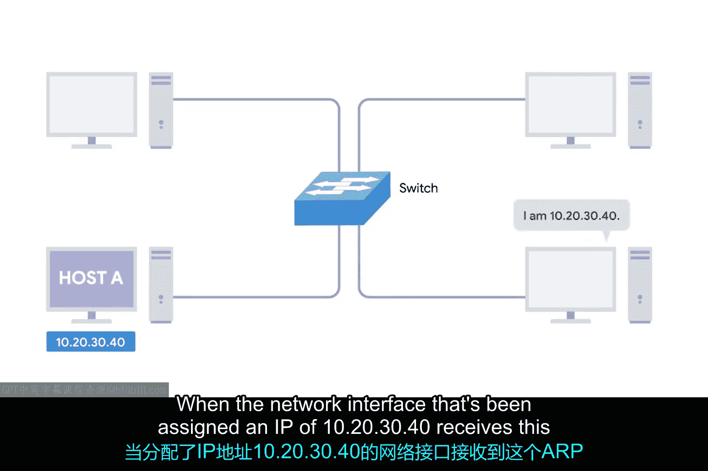
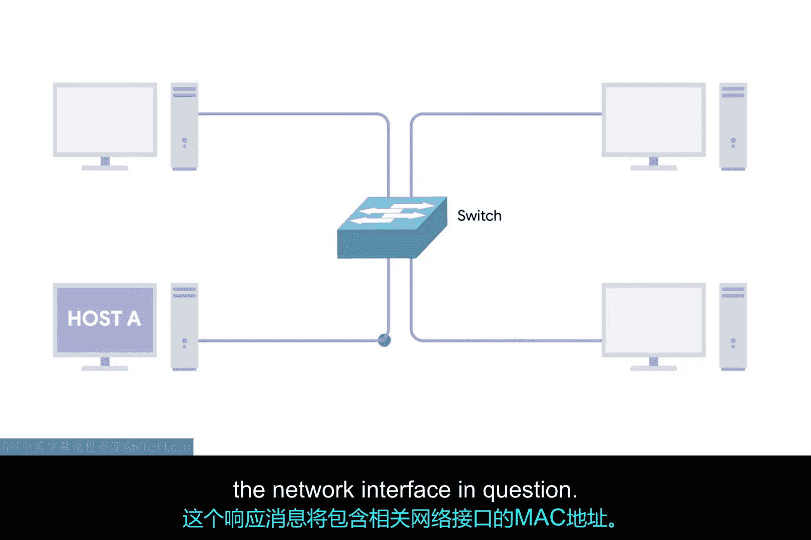
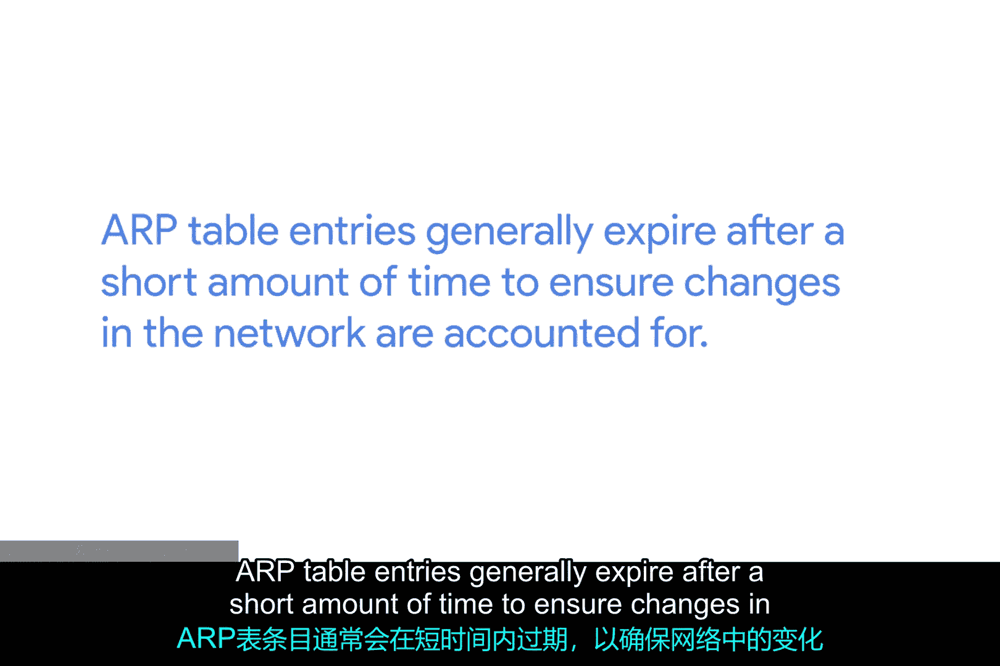

# 022：地址解析协议（ARP）🔍



在本节课中，我们将要学习地址解析协议（ARP）。我们已经了解了MAC地址在数据链路层的作用以及IP地址在网络层的作用。现在，我们需要讨论这两种独立的地址类型如何相互关联。

## ARP的作用


上一节我们介绍了网络层和数据链路层的不同地址。本节中我们来看看它们是如何协同工作的。ARP是一个协议，用于发现具有特定IP地址的节点的硬件地址。当一个IP数据报完全形成后，它需要被封装在一个以太网帧中。

这意味着发送设备需要一个目的MAC地址来完成以太网帧头。几乎所有连接到网络的设备都会维护一个本地ARP表。一个ARP表只是一个IP地址及其关联的MAC地址的列表。





## ARP的工作流程



以下是ARP解析地址的基本过程：



1.  **检查ARP表**：当一台设备（例如IP为`10.0.0.1`）需要向目标IP地址（例如`10.20.30.40`）发送数据时，它首先会检查自己的本地ARP表。
    ```bash
    # 在命令行中查看ARP表的示例（Windows系统）
    arp -a
    ```



2.  **发送ARP广播请求**：如果目标IP地址（`10.20.30.40`）在ARP表中没有对应的条目，发送设备会向MAC广播地址（`FF:FF:FF:FF:FF:FF`）发送一个ARP广播请求。这种广播消息会被传递到本地网络上的所有计算机。



3.  **接收ARP响应**：当被分配了IP地址`10.20.30.40`的网络接口收到这个ARP广播时，它会发回一个ARP响应。这个响应消息将包含该网络接口的MAC地址。



4.  **完成封装并更新缓存**：现在，发送计算机知道了在目的硬件地址字段中填入哪个MAC地址，以太网帧就可以准备发送了。它很可能还会将这个IP-MAC对应关系存储在其本地ARP表中，这样下次需要与该IP通信时就不必再发送ARP广播了，非常方便。

## ARP表的管理

ARP表条目通常在一小段时间后就会过期，以确保网络中的变化能被及时反映。因此，不要期望ARP条目会永久保存，就像我期望你能坚持完成下一个未评分的测验一样。



本节课中我们一起学习了地址解析协议（ARP）的核心概念和工作流程。我们了解到，ARP通过广播请求和单播响应的方式，动态地将网络层的IP地址解析为数据链路层所需的MAC地址，从而实现了跨层通信。理解ARP是理解局域网内设备如何相互寻址的关键一步。