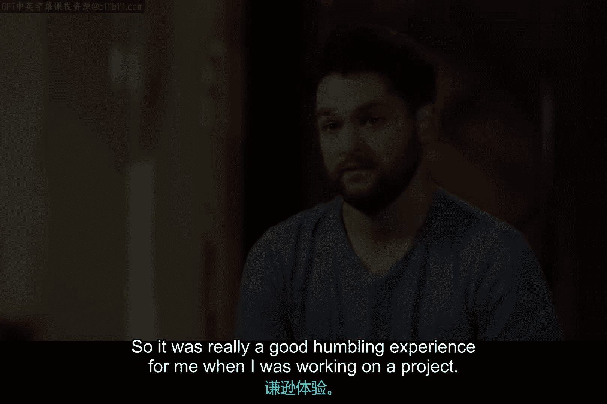

# 023：塞尔吉奥的职业故事

在本节课中，我们将通过谷歌网络工程师塞尔吉奥的职业故事，了解IT支持领域的职业发展路径、核心工作内容以及所需的关键技能与心态。

---

## 课程概述

塞尔吉奥分享了他从对技术产生兴趣，到成长为一名专业网络工程师的经历。他的故事涵盖了技术热情的起源、问题解决的乐趣、关键技能的发展，以及一次深刻的工作教训。这为初学者理解IT支持工作的实际面貌和职业成长提供了生动的范例。

## 从兴趣到职业

上一节我们了解了IT支持领域的概况，本节中我们来看看一个具体的职业成长故事。塞尔吉奥的职业生涯始于童年时期对拆卸和组装事物的热爱。

他最初喜欢螺丝刀、电钻等模拟工具。随着年龄增长，他将兴趣转向了电脑。打开电脑机箱后，内部的风扇、灯光和复杂电路虽然令他困惑，但也激发了他的好奇心。他意识到，只要以正确的方式组装回去，就能与电脑互动并运行游戏。这成为了他技术之旅的起点。

高中毕业后，塞尔吉奥决定将这份兴趣发展为真正的热情，并深入学习了相关技术的工作原理。

## 工作的核心乐趣：解决问题

从兴趣入门后，职业的核心价值逐渐显现。对塞尔吉奥而言，工作中最喜爱的部分是解决问题。

他非常享受看到数据从一台设备传输到另一台设备的过程，理解事物之间如何通信，并最终让客户享受到技术带来的便利。这种从技术原理到实际应用的全链条理解，带来了巨大的成就感。

## 技能发展与工具箱

在职业道路上，持续学习至关重要。塞尔吉奥在工作中积累了多种不同的工具和技能。

他感觉自己像一把“瑞士军刀”，能够灵活运用各种经验来解决当前面临的问题。这种能力的积累是IT支持专业人员价值的重要体现。

以下是IT专业人员需要发展的几类核心技能：

*   **技术硬技能**：如网络配置、系统排错、安全策略实施。
*   **问题解决能力**：分析复杂情况并找到根本原因。
*   **沟通与协作**：与团队和客户有效交流。

## 一次关键的职业教训

在职业生涯早期，一次项目经历给塞尔吉奥上了重要的一课。他刚开始担任初级网络技术员时，负责为一个警察部门升级防火墙。

**防火墙**是网络的关键安全设备和入口点。项目完成后，团队以为一切顺利，直到深夜接到电话告知系统出现故障。他们发现升级失败，导致电子邮件和警务通信中断。

这次经历让他深刻认识到，自己所从事的工作影响深远，可能关乎人们的生命安全，既能造成损害，也能带来益处。这对他而言是一次宝贵的、令人谦逊的成长经历。

> **关键概念**：**防火墙** 是一种网络安全系统，它根据预设的安全规则监控并控制进出网络的数据流。其核心功能可以用一个简单的决策逻辑表示：
> `if (数据包符合安全规则) { 允许通过 } else { 拒绝或丢弃 }`

## 课程总结

本节课我们一起学习了塞尔吉奥从技术爱好者成长为谷歌网络工程师的路径。他的故事揭示了IT支持工作的几个关键方面：始于对技术的内在兴趣，核心价值在于解决问题和创造连接，需要不断积累多样化的技能，并且肩负着重要的责任。这次失败的防火墙升级项目尤其提醒我们，IT工作具有真实世界的影响力，要求从业者具备高度的责任心和严谨的态度。