# 024：子网划分 🧩

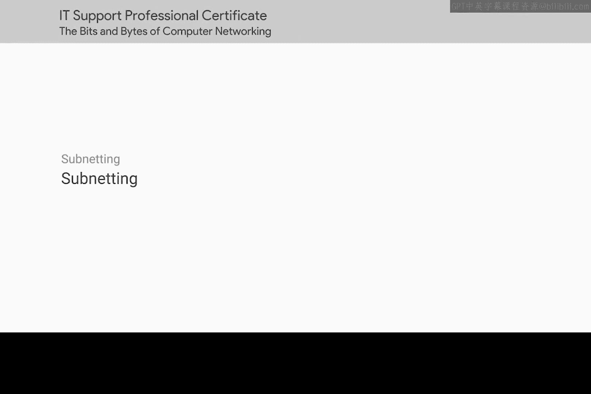

在本节课中，我们将要学习子网划分。子网划分是将一个大型网络分割成多个独立小型子网的过程。通过学习，你将能够理解子网划分的必要性，并掌握其核心工作原理。

## 概述 📋

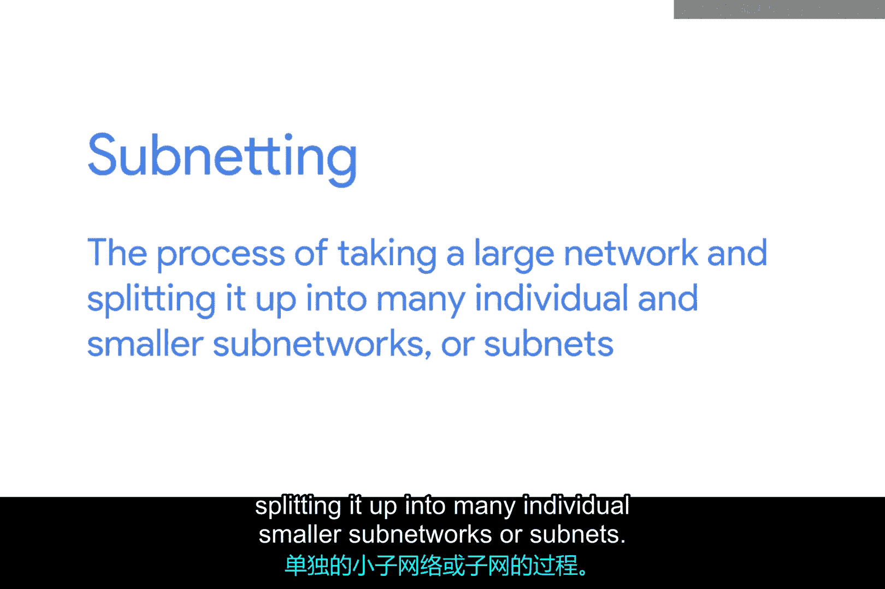

上一节我们介绍了IP地址类别，它们将全球IP地址空间划分为不同的网络。本节中我们来看看子网划分。子网划分解决了单一网络（尤其是A类网络）规模过大、难以管理的问题。通过子网划分，我们可以将一个庞大的网络分割成多个更小、更易于管理的子网络。

## 为什么需要子网划分？ 🤔

你可能还记得上一课的内容，地址类别为我们提供了一种将全球IP空间划分为独立网络的方法。

例如，如果你想与IP地址 `9.100.100.100` 通信，互联网上的核心路由器知道这个IP属于 `9.0.0.0` 这个A类网络。

它们通过查看**网络ID**，将消息路由到负责该网络的网关路由器。网关路由器是特定网络的入口和出口路径，这与可能只与其他核心路由器对话的核心互联网路由器不同。

一旦你的数据包到达 `9.0.0.0` 这个A类网络的网关路由器，该路由器就负责通过查看**主机ID**将数据传送到正确的系统。

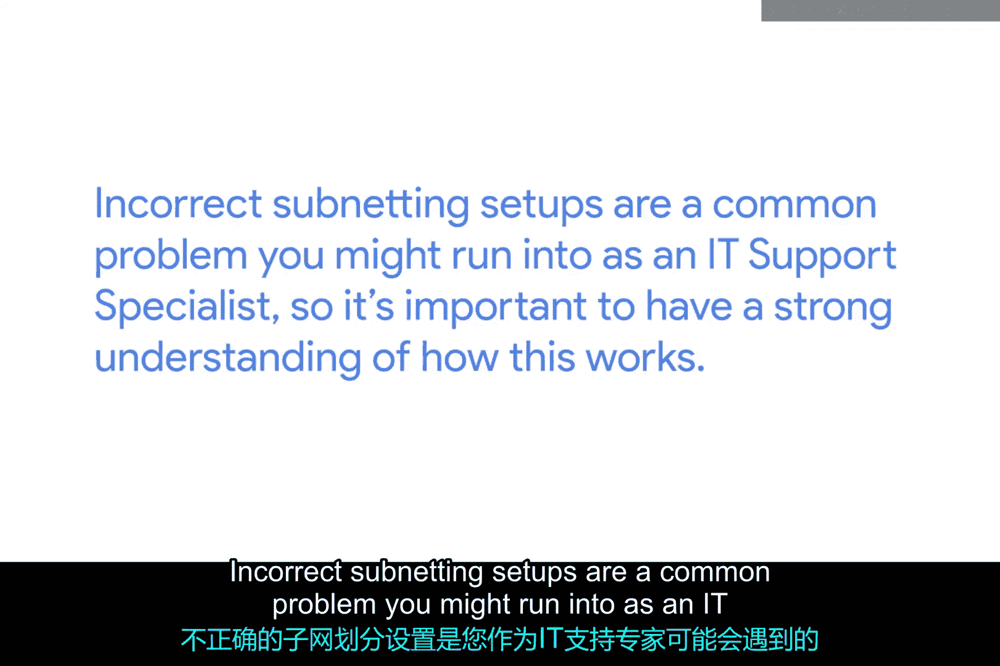

这一切都讲得通，直到你想起一个A类网络包含 `16,777,216` 个独立IP地址。让这么多设备连接到同一个路由器是根本不可能的。

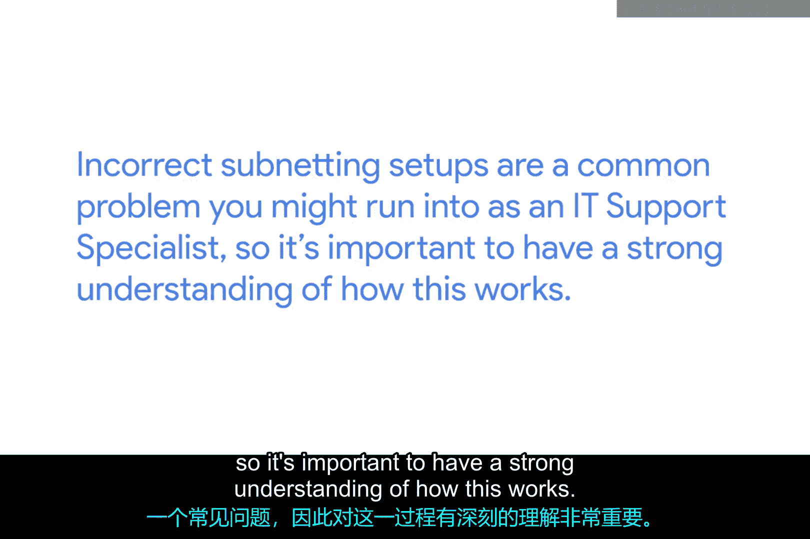

这就是子网划分发挥作用的地方。通过子网划分，你可以将大型网络分割成许多更小的网络。这些独立的子网都将拥有自己的网关路由器，作为每个子网的入口和出口点。

## 子网掩码与CIDR表示法 🔧

为了进行子网划分，我们需要引入一个关键概念：**子网掩码**。子网掩码用于区分IP地址中的网络部分和主机部分。它是一串32位的二进制数，其中网络部分用连续的“1”表示，主机部分用连续的“0”表示。

传统的地址类别（A、B、C类）使用固定的子网掩码：
*   A类：`255.0.0.0` 或 `/8`
*   B类：`255.255.0.0` 或 `/16`
*   C类：`255.255.255.0` 或 `/24`

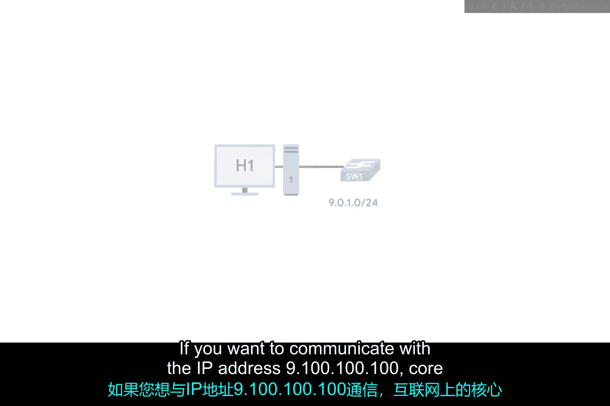

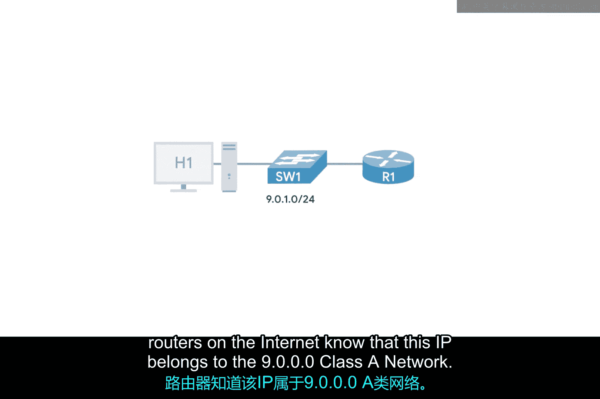

然而，固定的类别划分不够灵活。因此，我们使用**CIDR（无类别域间路由）** 表示法，它提供了比普通子网划分更大的灵活性。CIDR表示法在IP地址后加上一个斜杠和数字（例如 `/24`），这个数字代表子网掩码中“1”的个数，即网络前缀的长度。

**公式**：`IP地址 / 网络前缀长度`， 例如：`192.168.1.0/24`

通过改变网络前缀的长度，我们可以创建大小不同的子网，更高效地利用IP地址空间。

## 基础二进制计算 🧮

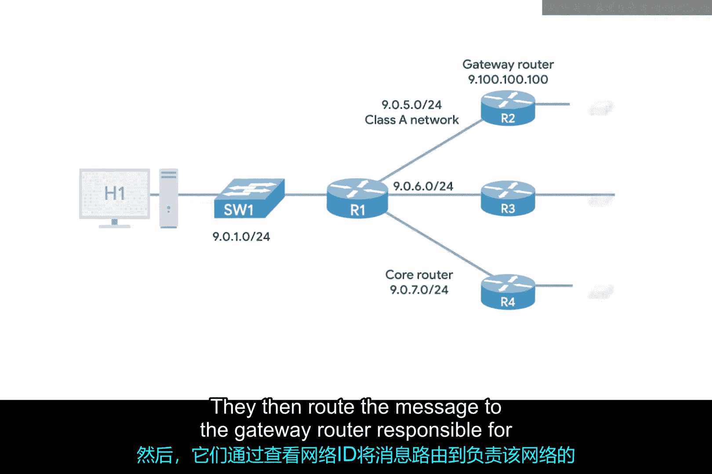

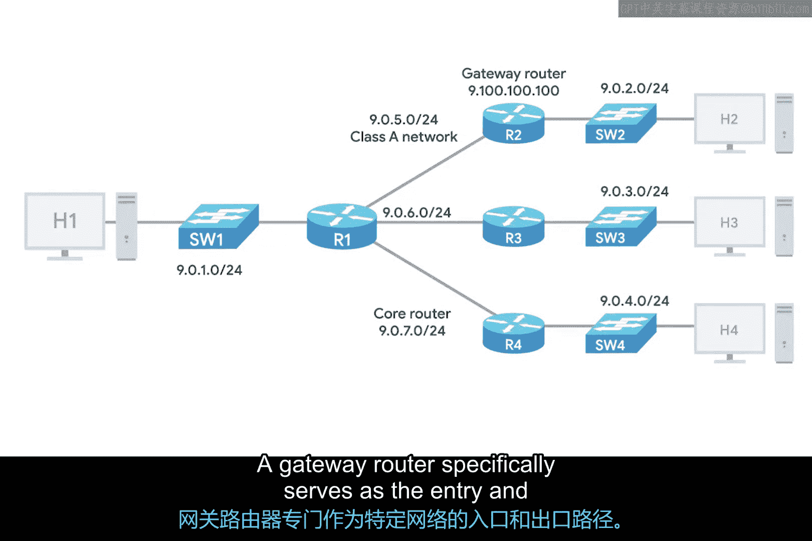

要深入理解子网划分和CIDR，掌握一些基础的二进制数学技巧很有帮助。子网掩码和IP地址的计算本质上是对应二进制位的“与”运算。

**核心计算示例**：
给定一个IP地址 `192.168.1.100` 和子网掩码 `255.255.255.0`（即 `/24`）：
1.  将两者转换为二进制。
2.  对每一位进行逻辑“与”运算（1 AND 1 = 1， 其他情况为0）。
3.  得到的结果就是该IP地址所在的**网络地址**。

```
IP地址:   11000000.10101000.00000001.01100100 (192.168.1.100)
子网掩码: 11111111.11111111.11111111.00000000 (255.255.255.0)
与运算结果: 11000000.10101000.00000001.00000000 (192.168.1.0) -> 网络地址
```

了解如何根据主机位的数量（子网掩码中“0”的个数）计算一个子网内可用的主机数量也很重要。

**公式**：`可用主机数 = 2^(主机位数量) - 2`

减去的2个地址分别是**网络地址**（主机位全0）和**广播地址**（主机位全1），这两个地址不能分配给具体设备。

## 总结 🎯

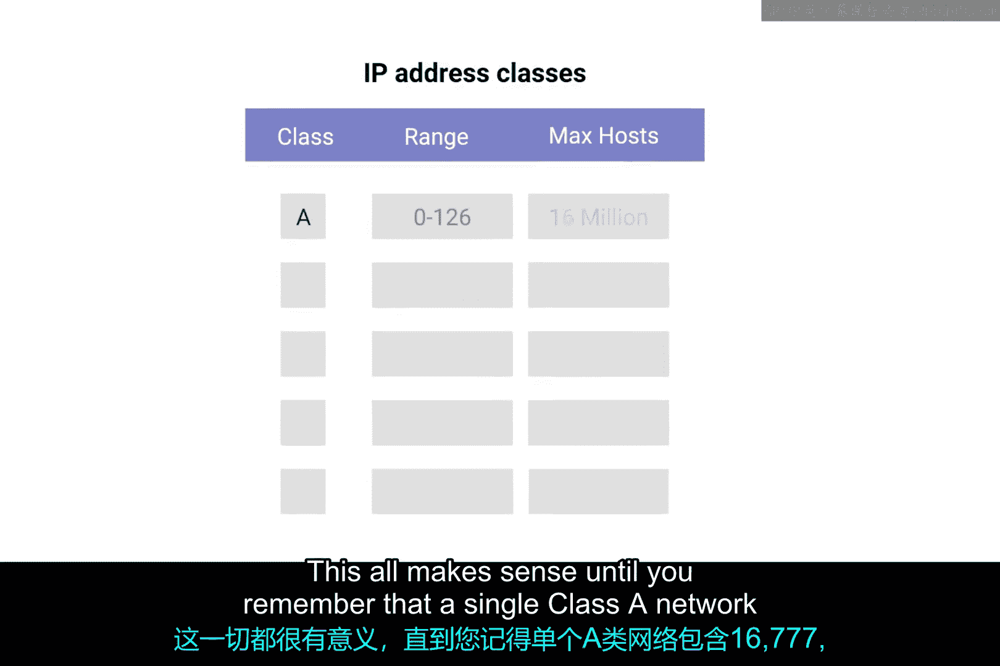

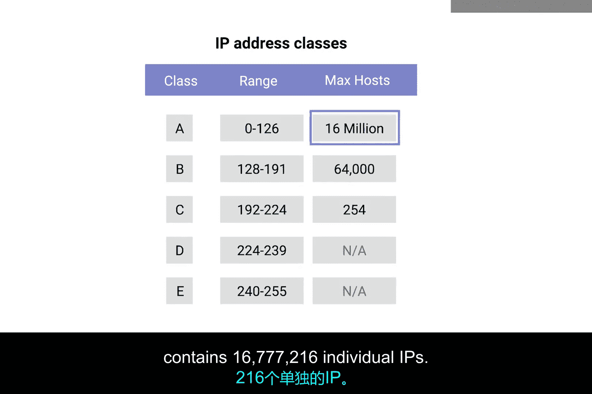

本节课中我们一起学习了子网划分的核心知识。我们首先回顾了IP地址类别的局限性，引出了子网划分的必要性——将大型网络分割为更易管理的小型子网。接着，我们探讨了实现子网划分的关键工具：**子网掩码**和更灵活的**CIDR表示法**。最后，我们介绍了理解这些概念所必需的基础二进制计算，包括如何使用子网掩码计算网络地址，以及如何计算一个子网内的可用主机数量。

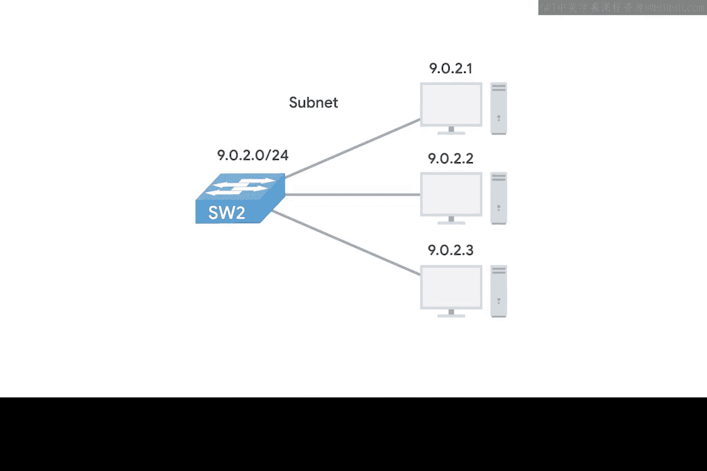

作为IT支持专家，不正确的子网设置是一个常见问题，因此牢固理解其工作原理至关重要。掌握这些知识将帮助你更好地设计、管理和排查网络问题。