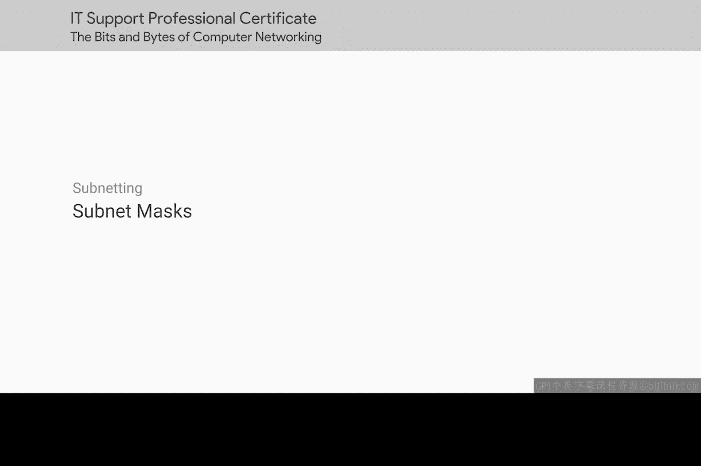
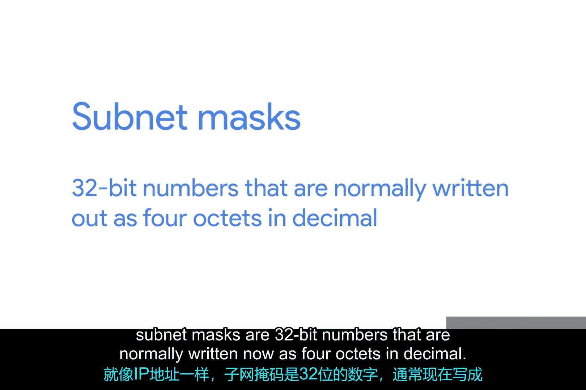
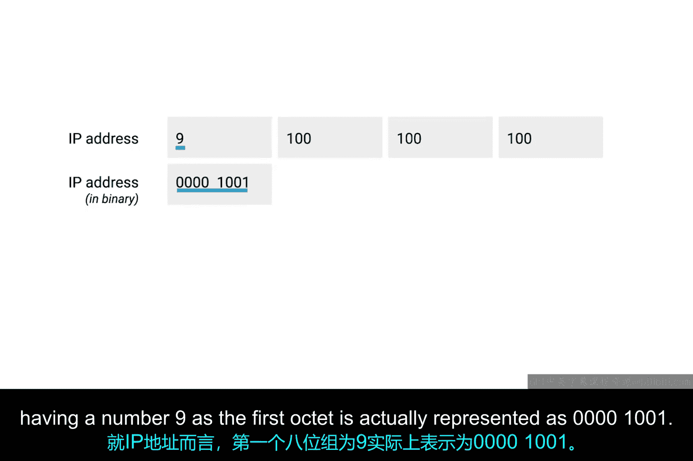
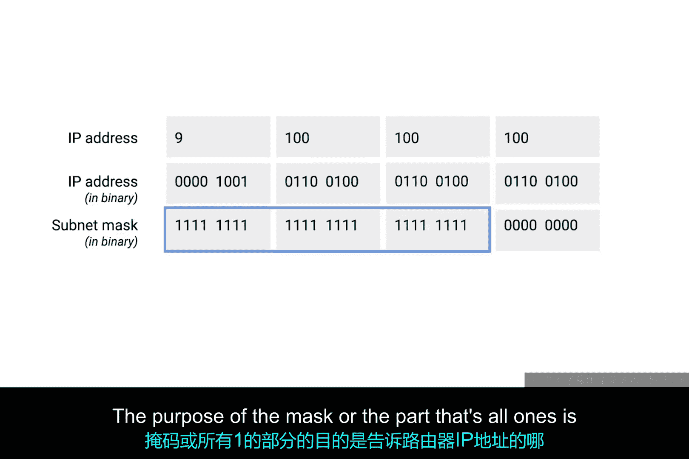
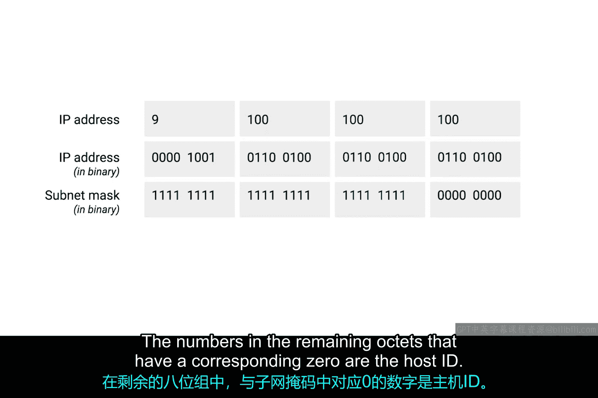
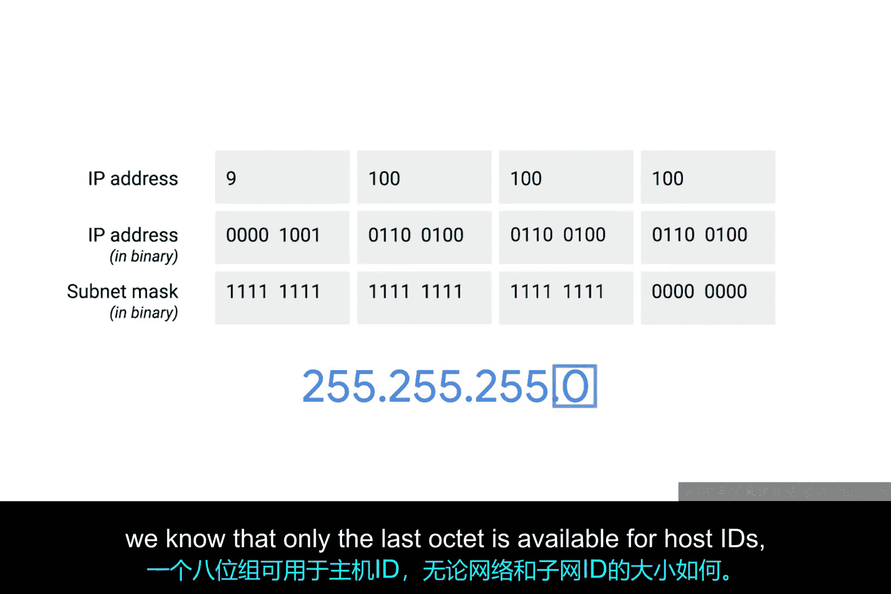
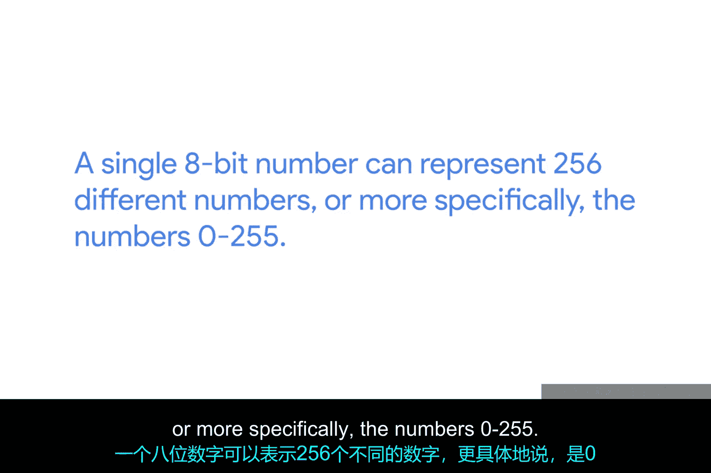
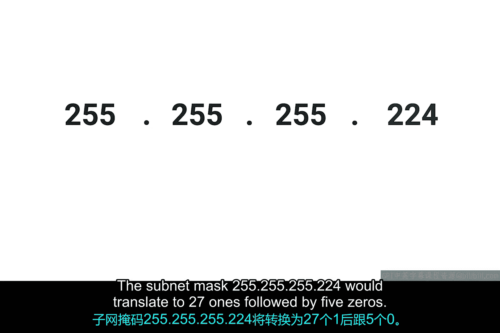
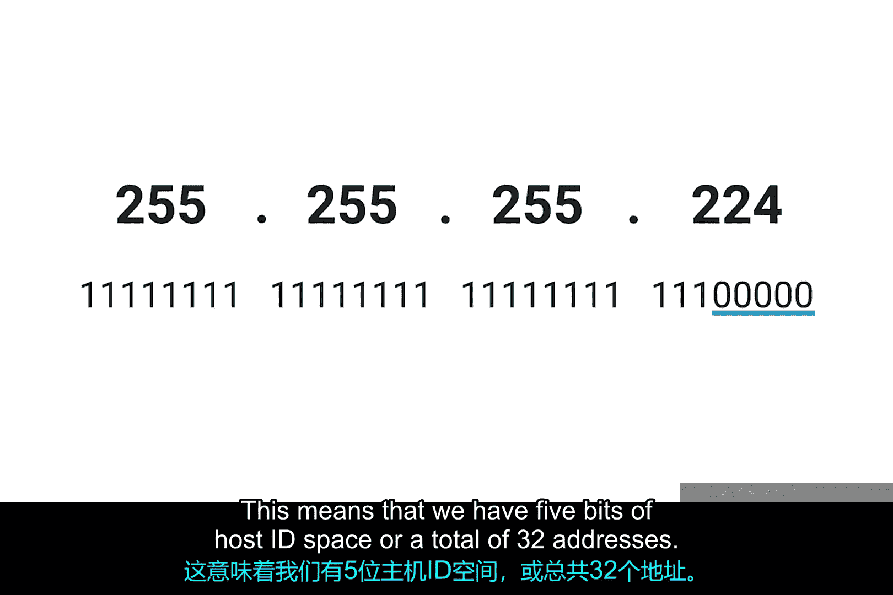
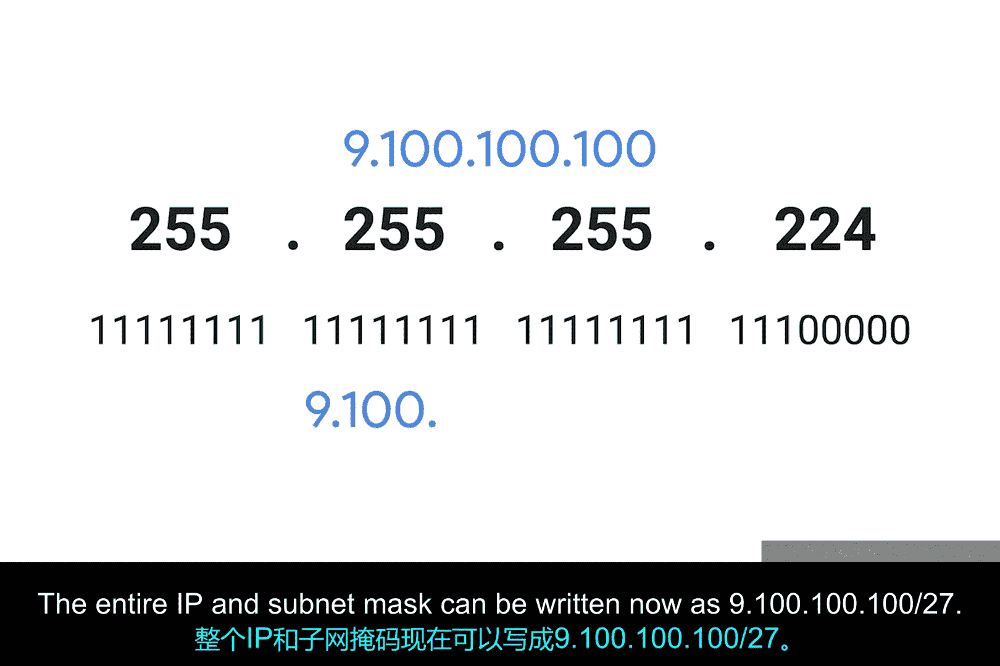

# 025：子网掩码详解 🧩

在本节课中，我们将要学习子网掩码的概念。子网掩码是IP网络中用于区分网络地址、子网地址和主机地址的关键工具。理解子网掩码的工作原理对于网络配置和故障排除至关重要。

## 概述

到目前为止，我们已经学习了网络ID（用于标识网络）和主机ID（用于标识单个主机）。如果我们希望进一步划分网络，就需要引入第三个概念：子网ID。

你可能还记得，IP地址只是一个32位的数字。在没有子网划分的世界里，这些位中的一部分用于网络ID，另一部分用于主机ID。在划分子网的世界里，原本属于主机ID的一部分位实际上被用于子网ID。

通过一个IP地址可以解析出这三个ID，我们现在拥有了一个单一的32位数字，它能够准确地跨越许多不同的网络进行传递。

在互联网层面，核心路由器只关心网络ID，并使用它来将数据报发送到该网络的相应网关路由器。然后，该网关路由器拥有一些额外的信息，可以用来将数据报发送到目标机器或路径上的下一个路由器。最后，主机ID由最后一个路由器用来将数据报传递给预期的接收机器。

## 子网掩码的计算

子网ID是通过所谓的子网掩码来计算的。就像IP地址一样，子网掩码也是32位数字，通常写成四个十进制八位组。

理解子网掩码工作原理的最简单方法是将其与IP地址进行比较。请注意，接下来的内容比较密集。我们将要深入一些复杂的材料，但正确理解子网掩码的工作原理至关重要，因为它们经常被误解。子网掩码常常被当作神奇的数字一带而过，人们只是记住一些常见的值，而没有完全理解背后的原理。在本课程中，我们确实希望确保你离开时能获得全面的网络教育，所以即使子网掩码起初看起来有些棘手，坚持下去，你很快就能掌握。要知道，在下一个视频中，我们将介绍二进制数学的一些额外基础知识，在复习完材料后，你可以自由地再看一遍这个视频。按照你自己的节奏学习，你会在合适的时间内掌握它。

让我们再次使用IP地址 `9.100.100.100`。你可能记得，IP地址的每一部分都是一个八位组，这意味着它由8位组成。数字9的二进制表示是 `1001`。但由于每个八位组需要8位，我们需要在前面填充一些零。就IP地址而言，第一个八位组为数字9实际上表示为 `00001001`。同样，数字100作为一个8位数是 `01100100`。因此，IP地址 `9.100.100.100` 的完整二进制表示是许多1和0的组合。

## 子网掩码的结构

子网掩码是一个二进制数，它有两个部分。开头部分是掩码本身，是一串1，之后全是0。子网掩码（即数字中全是1的部分）告诉我们在计算主机ID时可以忽略什么。全是0的部分告诉我们需要保留什么。

让我们使用常见的子网掩码 `255.255.255.0`。这将转换为 **24个1** 后面跟着 **8个0**。

掩码（即全是1的部分）的目的是告诉路由器IP地址的哪一部分是子网ID。

你可能还记得，我们已经知道如何获取IP地址 `9.100.100.100` 的网络ID。对于一个A类网络，我们知道这只是第一个八位组。这给我们留下了最后三个八位组。让我们取出剩下的八位组，并想象它们以二进制形式放在子网掩码旁边。在剩余八位组中，与子网掩码中对应的位为1的数字部分属于子网ID。在剩余八位组中，与子网掩码中对应的位为0的数字部分属于主机ID。

## 子网的大小

子网的大小完全由其子网掩码定义。例如，对于子网掩码 `255.255.255.0`，我们知道只有最后一个八位组可用于主机ID，无论网络和子网ID的大小是多少。

一个8位数可以表示256个不同的数字，更具体地说，是数字0到255。这里需要指出，一般来说，一个子网通常只能容纳比可用主机ID总数少两个的地址。

再次使用子网掩码 `255.255.255.0`，我们知道可用于主机ID的八位组可以包含数字0到255，但0通常不被使用，255通常保留为子网的广播地址。这意味着实际上只有数字1到254可以分配给主机。虽然这种“总数减二”的方法几乎总是正确的，但一般来说，你会将子网中可用的主机数量称为整个数字。所以，即使知道有两个地址不可用于分配，你仍然会说8位主机ID空间有256个可用地址，而不是254个。这是因为那些其他的IP仍然是IP地址，即使它们没有直接分配给该子网上的节点。

现在，让我们看一个子网掩码，它的边界不在整个八位组或8位地址上。子网掩码 `255.255.255.224` 将转换为 **27个1** 后面跟着 **5个0**。这意味着我们有5位主机ID空间，总共有32个地址。

## 子网掩码的简写表示法

这引出了子网掩码的一种简写方式。假设我们正在处理老朋友 `9.100.100.100`，子网掩码为 `255.255.255.224`。由于该子网掩码代表27个1后面跟着5个0，一种更快的引用方式是使用符号 `/27`。整个IP和子网掩码可以写成 `9.100.100.100/27`。

这两种表示法没有哪一种比另一种更常见，因此理解两者都很重要。

## 总结

本节课中我们一起学习了子网掩码的核心概念。我们了解到子网掩码是一个32位的二进制数，用于从IP地址中划分出网络部分和主机部分，并进一步定义了子网。关键点包括：
*   子网掩码通过 **1的连续序列** 标识网络和子网部分，通过 **0的连续序列** 标识主机部分。
*   子网大小由主机部分的位数决定，可用地址数通常为 `2^n - 2`（n为主机位数），但通常按 `2^n` 来描述地址块。
*   子网掩码有两种常见表示法：点分十进制（如 `255.255.255.0`）和CIDR前缀长度表示法（如 `/24`）。

理解子网掩码是掌握IP寻址和网络规划的基础。如果觉得内容复杂，可以随时回顾本教程。在接下来的学习中，掌握二进制基础将有助于你更深入地理解这些概念。