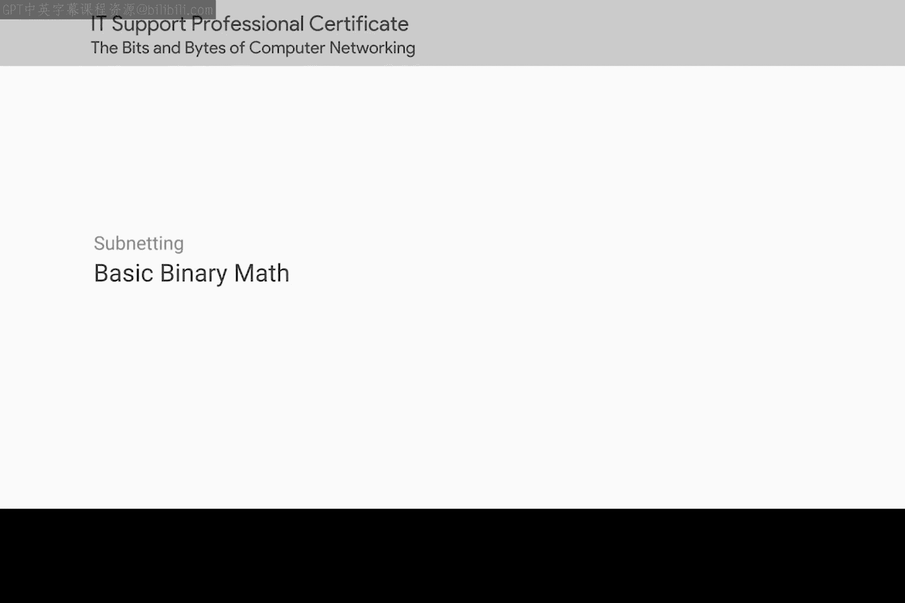
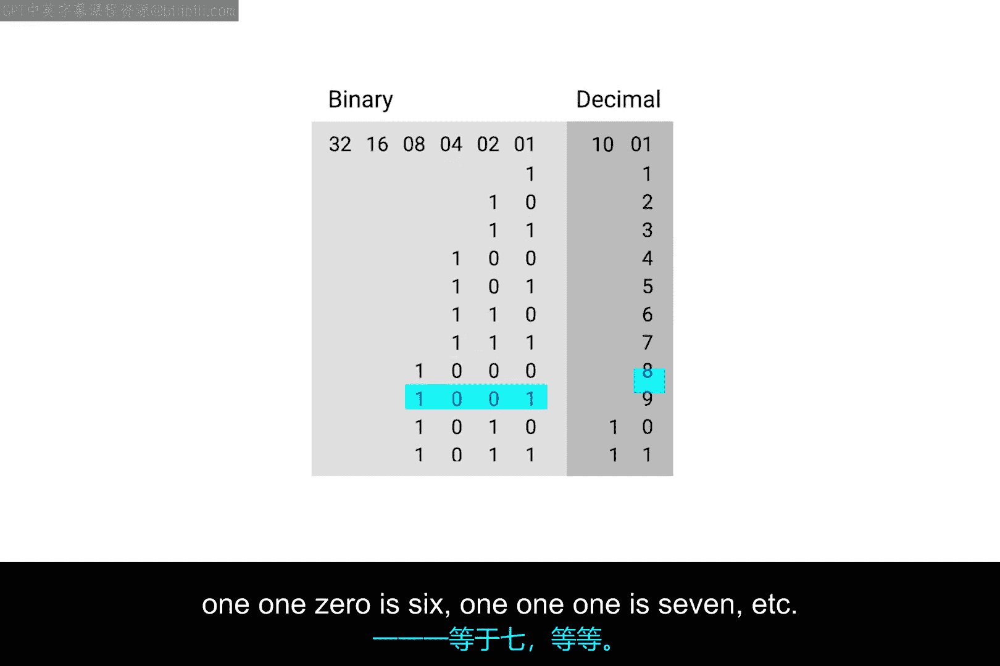
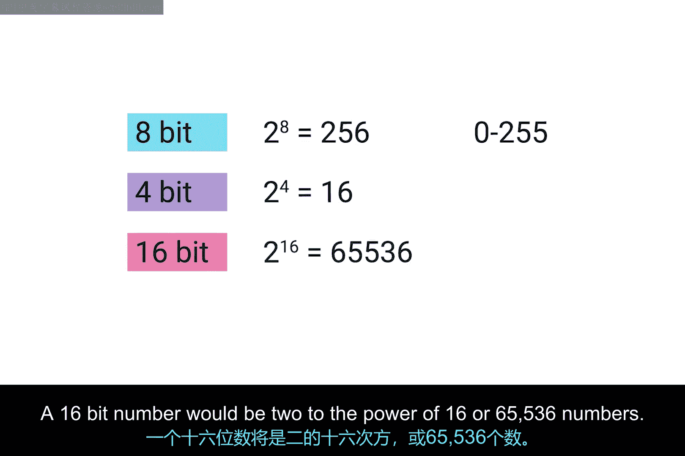
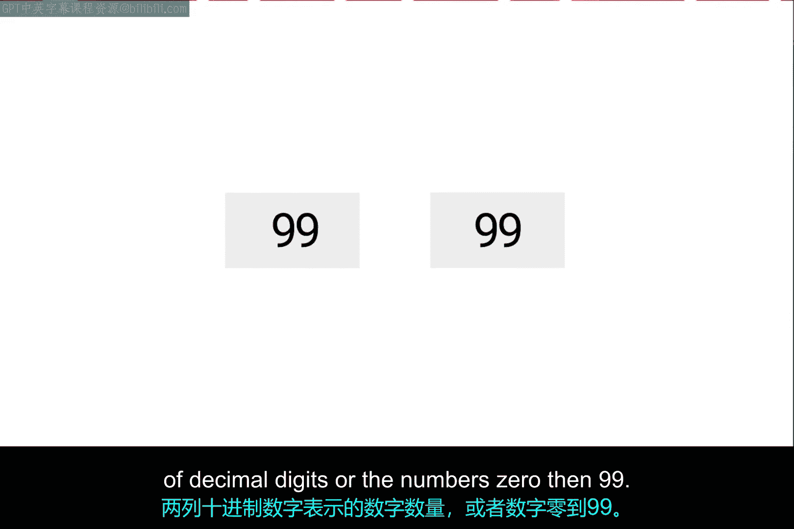
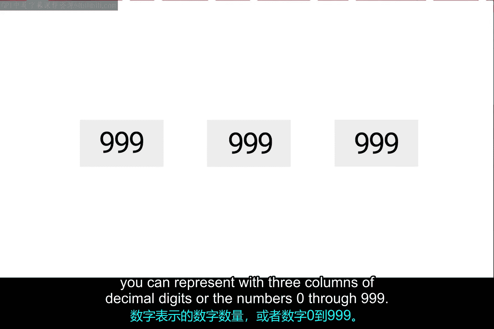
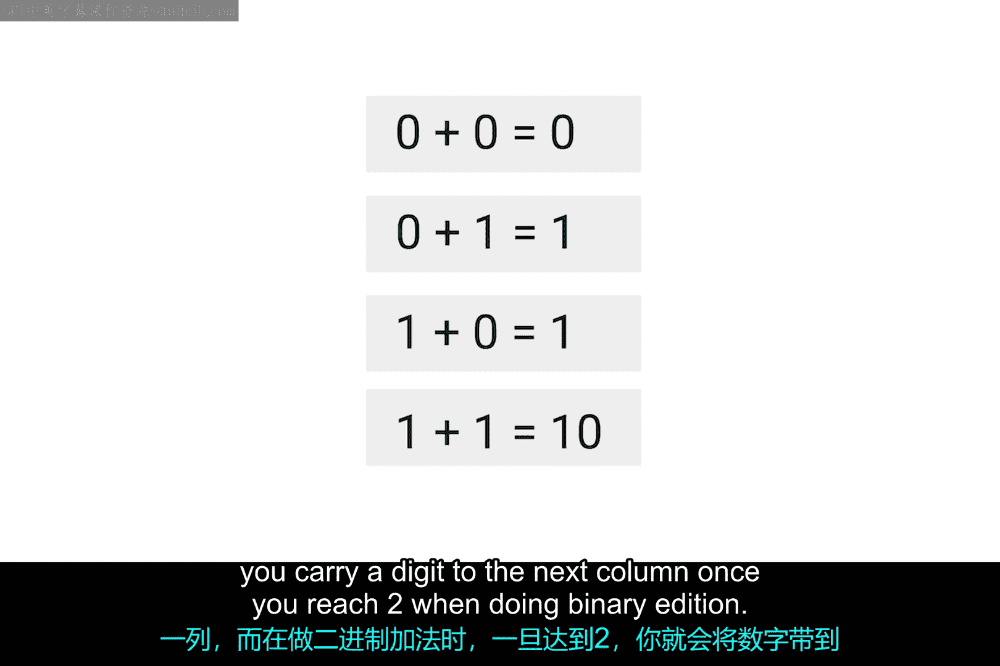
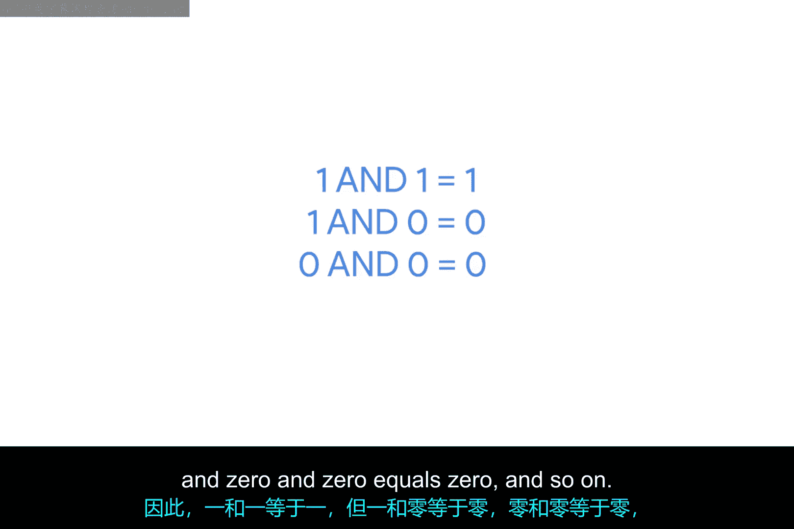
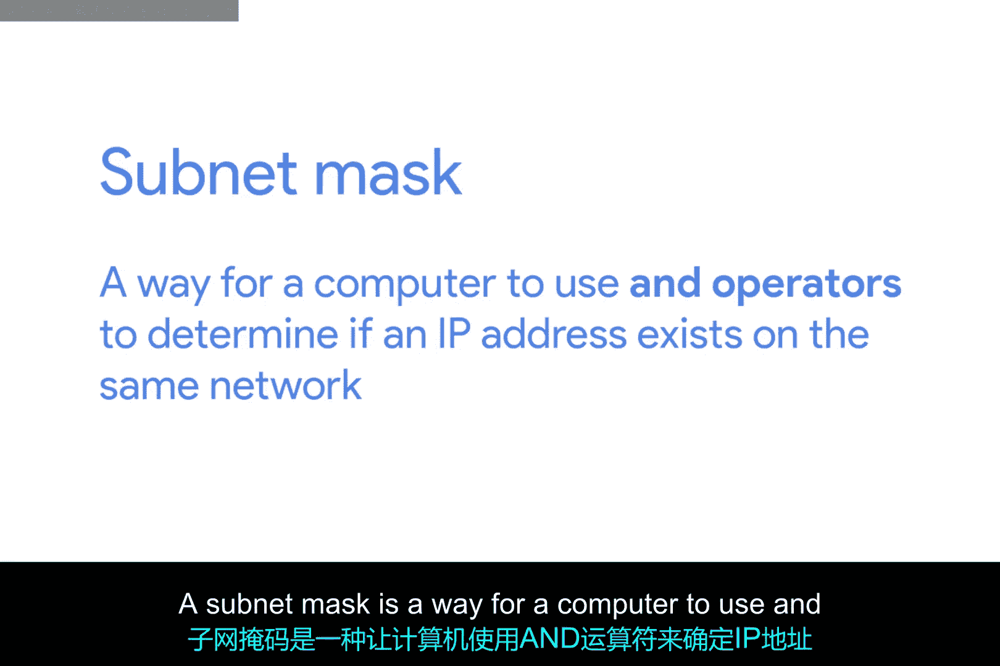
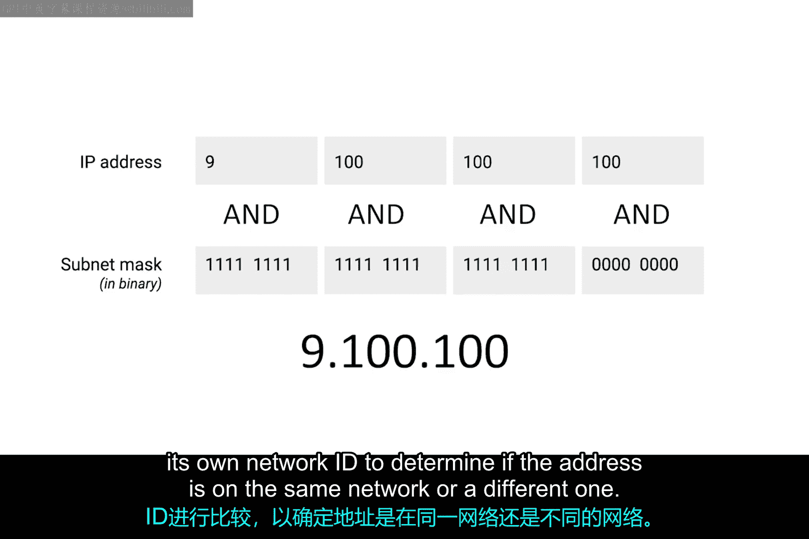

# 026：基本二进制数学 🧮

在本节课中，我们将要学习二进制数学的基础知识。二进制是计算机理解世界的语言，虽然它看起来与日常使用的十进制不同，但其背后的计数和基本运算逻辑是相通的。理解二进制是理解计算机网络、IP地址和子网掩码等概念的关键。

## 概述

二进制数字初看可能令人望而生畏，因为它们与十进制数字看起来截然不同。但就基础而言，二进制数字的计数、加法或减法背后的数学原理与十进制数字完全相同。需要明确指出的是，数字本身没有不同种类，数字是普适的，只是表示它们的符号系统不同。

人类很可能因为我们大多数人都有10根手指和10个脚趾，所以决定使用一个包含10个独立数字的系统来表示所有数字。数字0、1、2、3、4、5、6、7、8和9可以组合起来表示任何存在的整数。因为在十进制系统中总共使用了10个数字，所以另一种称呼是“基数为10”。

由于处理器内部逻辑门工作方式的限制，计算机更容易仅用0和1来思考事物。这也被称为二进制或“基数为2”。你可以用二进制表示所有整数，就像用十进制一样，只是看起来有些不同。

## 二进制计数 🔢

上一节我们介绍了二进制的基本概念，本节中我们来看看如何用二进制计数。

当你用十进制计数时，你会遍历所有数字直到用完，然后添加一个具有更高位权的新列。让我们从0开始计数，直到9。一旦数到9，我们基本上就重新开始。我们在新列中添加一个1，然后在原始列中从0重新开始。我们一遍又一遍地重复这个过程来计数所有整数。

二进制计数完全一样。只是你只有两个数字可用。你从0开始，这与十进制的0相同。然后你增加一次。现在，你有了1，这与十进制中的1相同。既然我们已经用完了可用的数字，是时候添加一个新列了，所以现在我们有了数字10，这与十进制中的2相同。

以下是二进制与十进制计数的对应关系：
*   0（二进制） = 0（十进制）
*   1（二进制） = 1（十进制）
*   10（二进制） = 2（十进制）
*   11（二进制） = 3（十进制）
*   100（二进制） = 4（十进制）
*   101（二进制） = 5（十进制）
*   110（二进制） = 6（十进制）
*   111（二进制） = 7（十进制）

这与我们处理十进制的方式完全相同，只是我们可用的数字更少。

## 比特与表示范围 🧮

在接触各种计算技术时，你经常会遇到比特（bits）或1和0的概念。有一个简单的技巧可以计算出一定数量的比特可以表示多少个十进制数字。

如果你有一个8位数字，你可以直接计算 **2^8**。结果是256，这让你知道一个8位数字可以表示256个十进制数字，或者换句话说，可以表示0到255之间的数字。

以下是不同位数能表示的数字数量：
*   一个4位数字：**2^4 = 16** 个数字。
*   一个16位数字：**2^16 = 65，536** 个数字。

为了将这一点与你可能已经知道的知识联系起来，这个技巧不仅适用于二进制，它适用于任何数字系统，只是基数会改变。

你可能还记得，我们也可以称二进制为基数为2，十进制为基数为10。你需要做的就是用基数替换掉公式中被提升到列数次幂的那个数。

例如，我们取一个基数为10、有两列数字的数。这将转化为 **10^2**。10的2次方等于100，这正好是你可以用两列十进制数字表示的数字数量，即0到99之间的数字。

类似地，**10^3** 是1000，这正好是你可以用三列十进制数字表示的数字数量，即0到999之间的数字。

## 二进制加法 ➕

不仅在不同基数下的计数方式相同，像加法这样的简单算术运算也是如此。事实上，二进制加法比任何其他基数的加法都要简单，因为你只有四种可能的情况。

以下是二进制加法的四种基本规则：
*   **0 + 0 = 0**，就像十进制一样。
*   **0 + 1 = 1**。
*   **1 + 0 = 1**，这看起来也应该很熟悉。
*   **1 + 1 = 10**，这看起来有点不同，但仍然应该能理解。在做十进制加法时，一旦达到10，你就向下一列进位。在做二进制加法时，一旦达到2，你就向下一列进位。

## 逻辑运算符：OR 与 AND 🔧

加法被称为运算符，计算机使用许多运算符来进行计算。其中两个最重要的运算符是 **OR**（或）和 **AND**（与）。

在计算机逻辑中，1代表真（True），0代表假（False）。

**OR** 运算符的工作方式是查看每个数字。如果其中任何一个为真，则结果为真。基本公式是 **X OR Y = Z**，可以理解为：如果X或Y为真，则Z为真，否则为假。因此，**1 OR 0 = 1**，但 **0 OR 0 = 0**。

**AND** 运算符做它听起来做的事情，只有当两个值都为真时才返回真。因此，**1 AND 1 = 1**，但 **1 AND 0 = 0**，**0 AND 0 = 0**，依此类推。

## 子网掩码的实际应用 🌐

现在，你可能想知道我们为什么要介绍所有这些内容。这不是为了迷惑你，这一切都是为了帮助进一步解释子网掩码。

子网掩码是计算机使用 **AND** 运算符来确定一个IP地址是否存在于同一网络上的方法。这意味着主机ID部分也就知道了，因为它将是剩下的任何部分。

让我们使用我们最喜欢的IP地址 **9.100.100.100** 和我们最喜欢的子网掩码 **255.255.255.0** 的二进制表示。一旦你将一个放在另一个上面，并对每一列执行二进制 **AND** 运算，你会注意到结果是IP地址的网络ID和子网ID部分，即 **9.100.100.0**。

刚刚执行此操作的计算机现在可以将结果与其自己的网络ID进行比较，以确定该地址是在同一网络上还是在不同的网络上。

## 总结

本节课中我们一起学习了二进制数学的基础知识。我们了解到二进制（基数为2）和十进制（基数为10）只是表示相同数字的不同符号系统。我们学习了如何用二进制计数，以及如何计算一定比特数能表示的数字范围。我们还探讨了二进制加法和两个关键的逻辑运算符：**OR** 和 **AND**。最后，我们看到了这些概念如何应用于理解子网掩码的工作原理，即计算机通过 **AND** 运算来确定IP地址的网络部分。掌握这些基础知识是深入理解计算机网络和IT支持的关键一步。