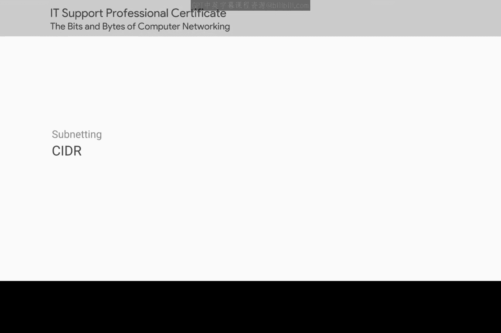
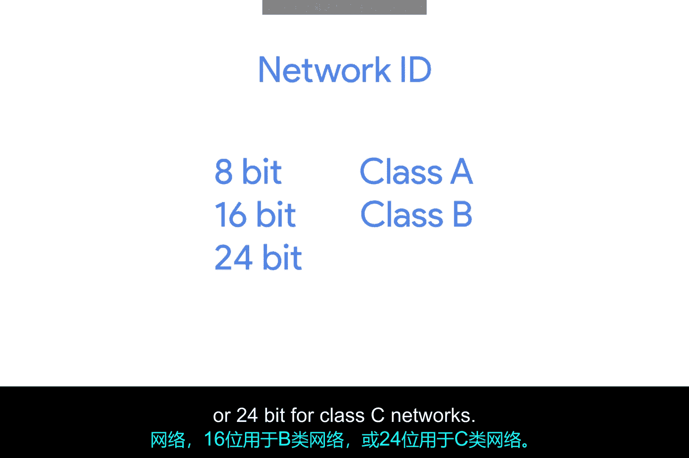
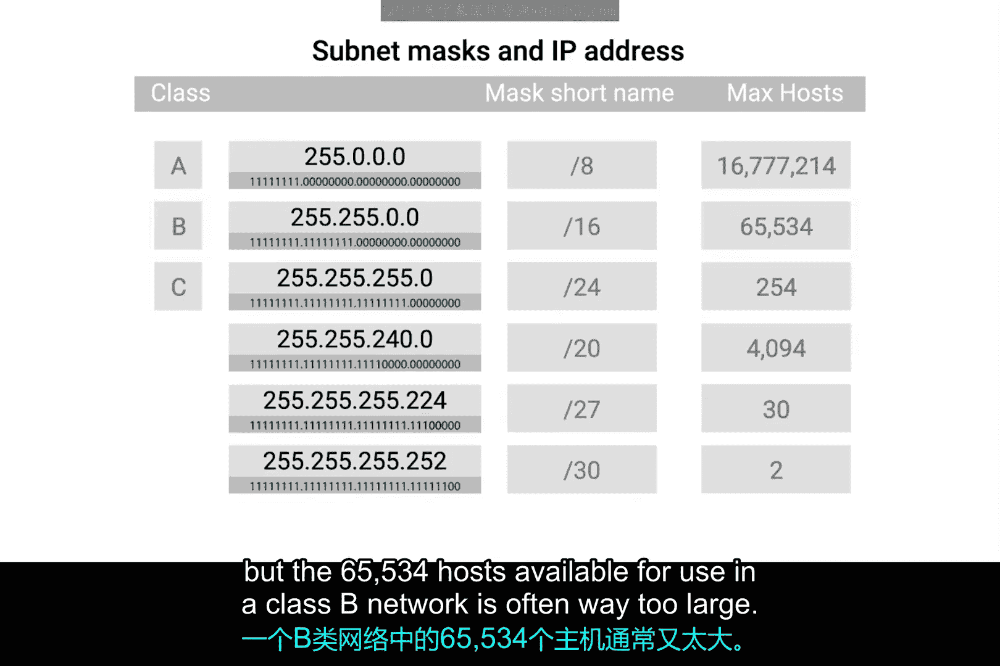
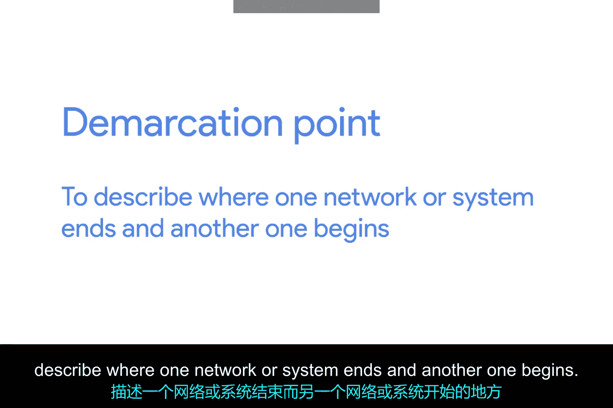
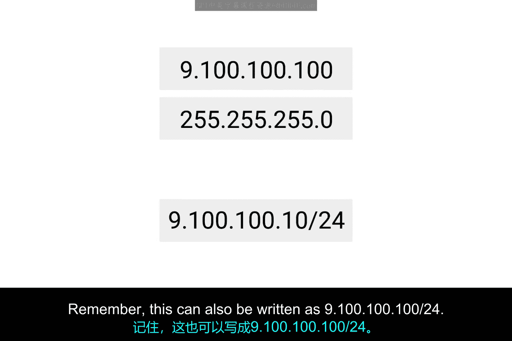
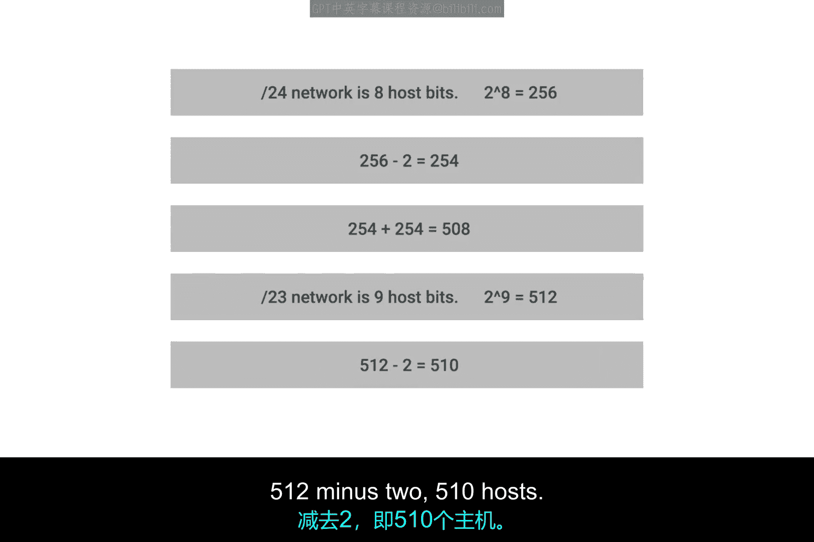

# 027：无类别域间路由（CIDR）🚀

在本节课中，我们将要学习IP地址分配技术的一个重要演进：无类别域间路由（CIDR）。我们将了解传统地址分类和子网划分的局限性，以及CIDR如何通过更灵活的方式来组织和管理IP地址空间。

## 概述

IP地址分类是划分全球互联网IP空间的首次尝试。当人们发现地址分类本身不足以有效组织一切时，子网划分被引入。但随着互联网持续增长，传统的子网划分方法也无法跟上需求。

## 地址分类的局限性

上一节我们介绍了IP地址的基本结构，本节中我们来看看传统地址分类方法的具体问题。

在传统的子网划分和地址分类体系中，网络ID的长度是固定的：
*   A类网络的网络ID总是**8位**。
*   B类网络的网络ID总是**16位**。
*   C类网络的网络ID总是**24位**。

这意味着全球可能只存在254个A类网络，但同时存在297,152个潜在的C类网络。这会导致路由表中存在大量条目。

更重要的是，这些网络的大小并不总是适合大多数企业的需求。一个C类网络的254个主机地址对许多用例来说太小，而一个B类网络可用的65,534个主机地址又往往太大。

许多公司最终需要多个相邻的C类网络来满足需求。这意味着路由表中会有一堆C类网络的条目，而这些网络实际上都被路由到同一个地方。

## CIDR的引入

鉴于传统方法的僵化，一种更灵活的方案应运而生。这就是CIDR，即无类别域间路由。

CIDR是一种更灵活的描述IP地址块的方法。它通过使用子网掩码来划分网络，扩展了子网划分的概念。“划分”意味着设定边界。在讨论计算机网络时，你经常会听到“分界点”这个术语，用来描述一个网络或系统结束而另一个开始的地方。

在我们之前的模型中，我们依赖网络ID、子网ID和主机ID来将IP数据报传送到正确的位置。在CIDR中，网络ID和子网ID被合并为一个。

## CIDR表示法与优势

CIDR为我们提供了之前子网划分视频中讨论过的简写斜线表示法。这种斜线表示法也被称为CIDR表示法。

CIDR基本上完全放弃了地址分类的概念，允许一个地址仅由两个独立的ID来定义。让我们以IP地址 `9.100.100.100` 和子网掩码 `255.255.255.0` 为例。记住，这也可以写成 `9.100.100.100/24`。

在一个我们不再关心此IP地址类别的世界里，我们只需要子网掩码告诉我们的信息来确定网络ID。在本例中，网络ID是 `9.100.100`。主机ID保持不变。

这种做法不仅简化了路由器和其他网络设备思考IP地址各部分的方式，还允许更任意的网络大小。以前，网络大小是静态的（只有A类、B类或C类），只有子网可以有不同的尺寸。CIDR允许网络本身具有不同的大小。

在此之前，如果一家公司需要的地址超过单个C类网络所能提供的，他们将需要整个第二个C类网络。有了CIDR，他们可以将该地址空间合并成一个连续的块，例如使用 `/23` 的网络掩码（即 `255.255.254.0`）。这意味着路由器现在只需要在其路由表中知道一个条目，就可以将流量传送到这些地址，而不是两个。

同样重要的是，这种做法还能获得额外的可用主机ID。请记住，每个网络总是会丢失两个主机ID。所以，如果一个 `/24` 网络有 2^8（256）个潜在主机，你实际上只有 256 - 2 = 254 个可分配的地址。如果你需要两个这种大小的网络，你总共有 254 + 254 = 508 个主机。而一个单独的 `/23` 网络，则是 2^9 = 512，512 - 2 = 510 个主机。

## 总结

在本节课中，我们一起学习了CIDR如何解决传统IP地址分类和子网划分的局限性。我们了解到CIDR通过合并网络ID和子网ID，并使用灵活的斜线表示法（如 `/24`），实现了对IP地址空间更高效、更灵活的管理。这使得路由表更精简，并能更好地适应不同规模组织的需求。

---

花点时间把这个记到脑子里。然后当你准备好后，在进入下一课的路由内容之前，我们有一个简短的非计分测验。