# 029：基本路由概念

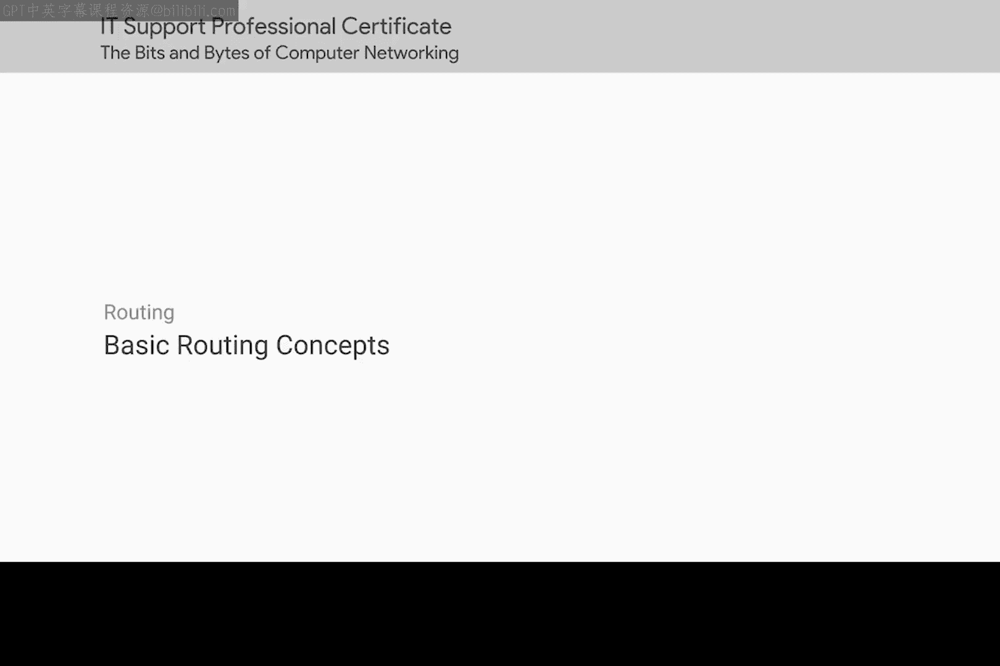

## 概述

在本节课中，我们将要学习路由的基本概念。路由是互联网能够将全球数百万个独立网络连接在一起，并允许数据在它们之间流动的核心技术。我们将了解路由器如何工作、路由表的作用、主要的网络协议，以及一些重要的网络地址概念。掌握这些知识对于IT支持专家诊断和解决网络问题至关重要。

互联网是一项令人印象深刻的技术成就。它将数百万个独立网络编织在一起，允许通信几乎在世界任何地方进行。现在，你可以从几乎任何其他地方访问数据，通常只需几分之一秒。实现这种跨网络通信，让你能访问地球另一端数据的方式，就是通过路由。

## 路由的基本原理

从非常高的层面来看，路由既非常简单又非常复杂。理解路由是什么以及路由器如何工作实际上相当简单，但在其表面之下，路由是一个非常复杂且技术先进的课题。关于这个主题已经出版了整本整本的书籍。如今，大多数复杂的路由问题几乎完全由互联网服务提供商和最大的公司处理。我们将为你提供路由的基本概述，为你提供全面的网络教育，因为无论从事什么工作，理解它都是一个重要的话题，但我们的介绍绝不会是详尽无遗的。

从一个非常基本的观点来看，**路由器**是一种根据流量的目标地址来转发流量的网络设备。

路由器是一种至少有两个网络接口的设备，因为它必须连接到两个网络才能完成其工作。

## 路由的基本步骤

以下是路由器处理数据包的基本步骤：

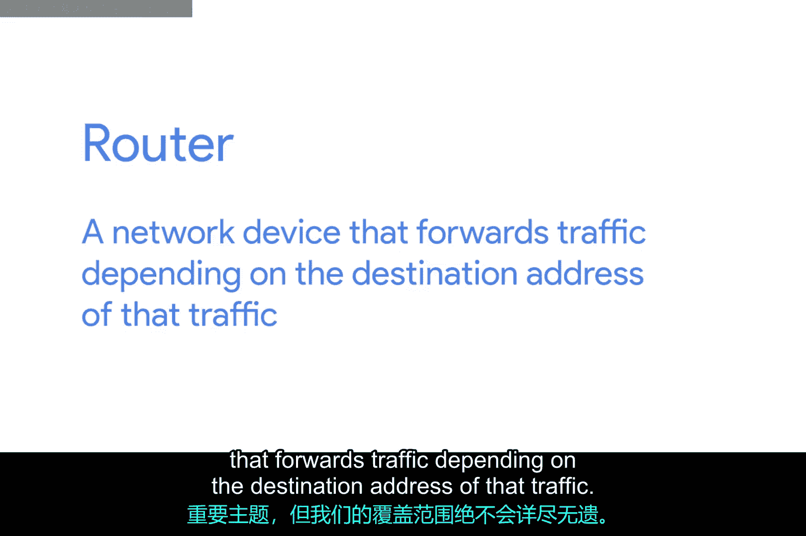

1.  路由器在其一个接口上接收到一个数据包。
2.  路由器检查该数据包的目标IP地址。
3.  路由器在其路由表中查找该IP地址所属的目标网络。
4.  路由器根据路由表中的附加信息，确定通往远程网络的最短路径，并通过相应的接口转发该数据包。

这些步骤会根据需要重复多次，直到流量到达其目的地。

## 路由示例：两个网络

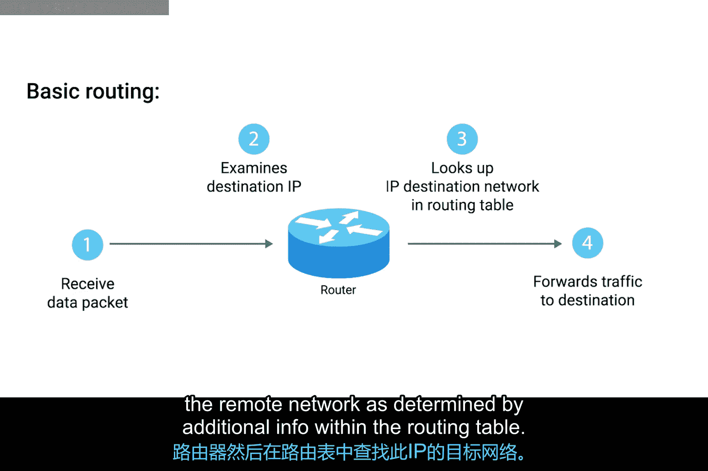

让我们想象一个连接了两个网络的路由器。我们将第一个网络称为网络A，并为其分配地址空间 `192.168.1.0/24`。我们将第二个网络称为网络B，并为其分配地址空间 `10.0.0.0/24`。

路由器在每个网络上都有一个接口。在网络A上，它的IP地址是 `192.168.1.1`；在网络B上，它的IP地址是 `10.0.0.254`。请记住，IP地址属于网络，而不是网络上的单个节点。

网络A上一台IP地址为 `192.168.1.100` 的计算机向地址 `10.0.0.10` 发送一个数据包。这台计算机知道 `10.0.0.10` 不在其本地子网上，因此它将此数据包发送到其网关（即路由器）的MAC地址。

路由器在网络A上的接口接收到了这个数据包，因为它看到目标MAC地址属于自己。

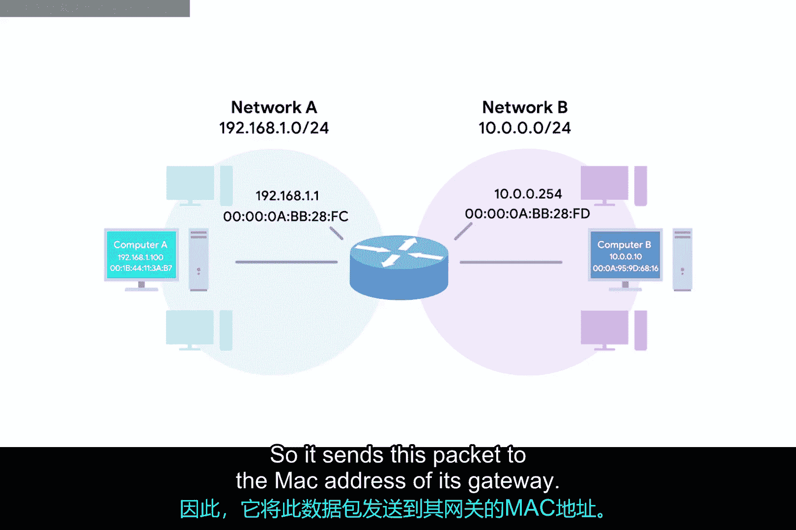

接着，路由器剥离数据链路层的封装，留下网络层的内容，即**IP数据报**。

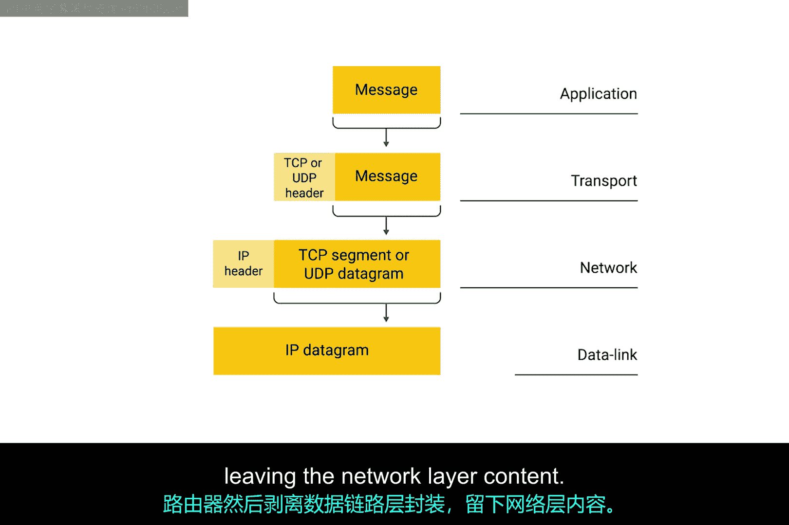

现在，路由器可以直接检查IP数据报头部中的目标IP字段。

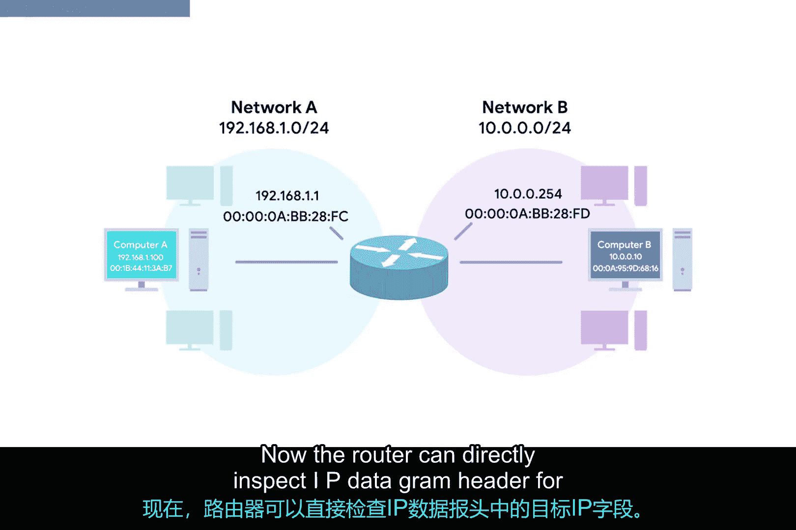

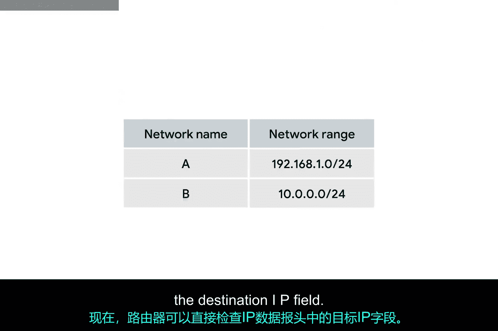

它找到了目标IP `10.0.0.10`。路由器查看其路由表，发现网络B（即 `10.0.0.0/24` 网络）是该目标IP的正确网络。它还看到这个网络只有一跳之遥。实际上，由于是直接连接的，路由器甚至在它的ARP表中存有这个IP的MAC地址。

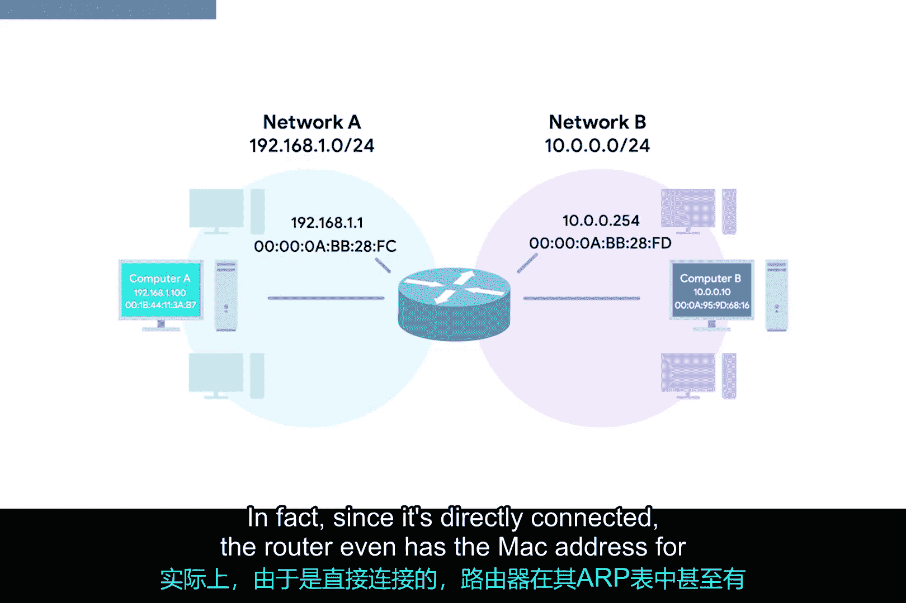

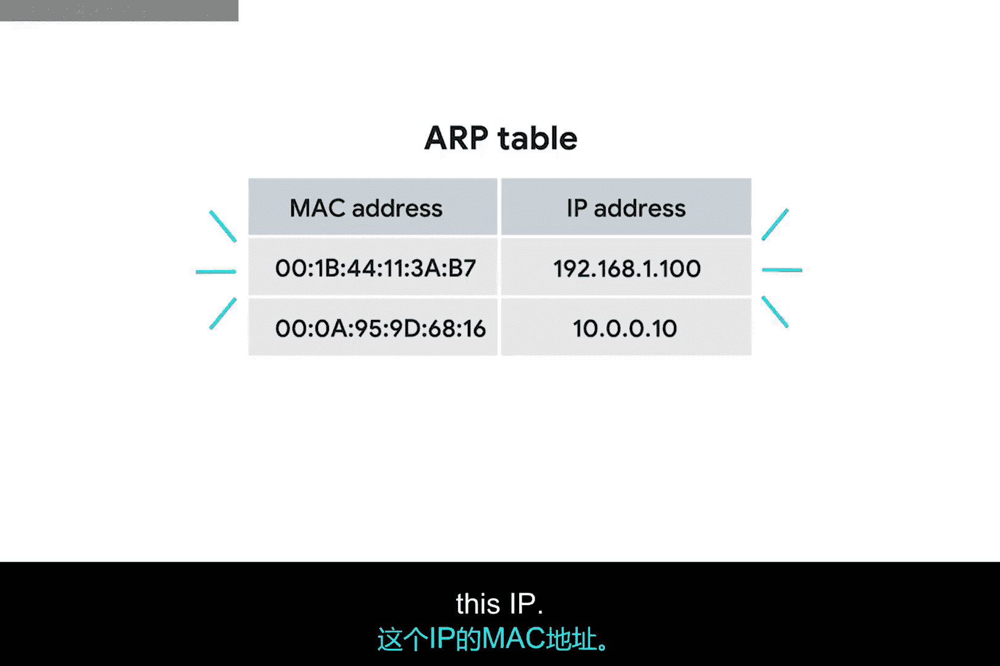

接下来，路由器需要构建一个新的数据包以转发到网络B。它从第一个IP数据报中取出所有数据并进行复制。

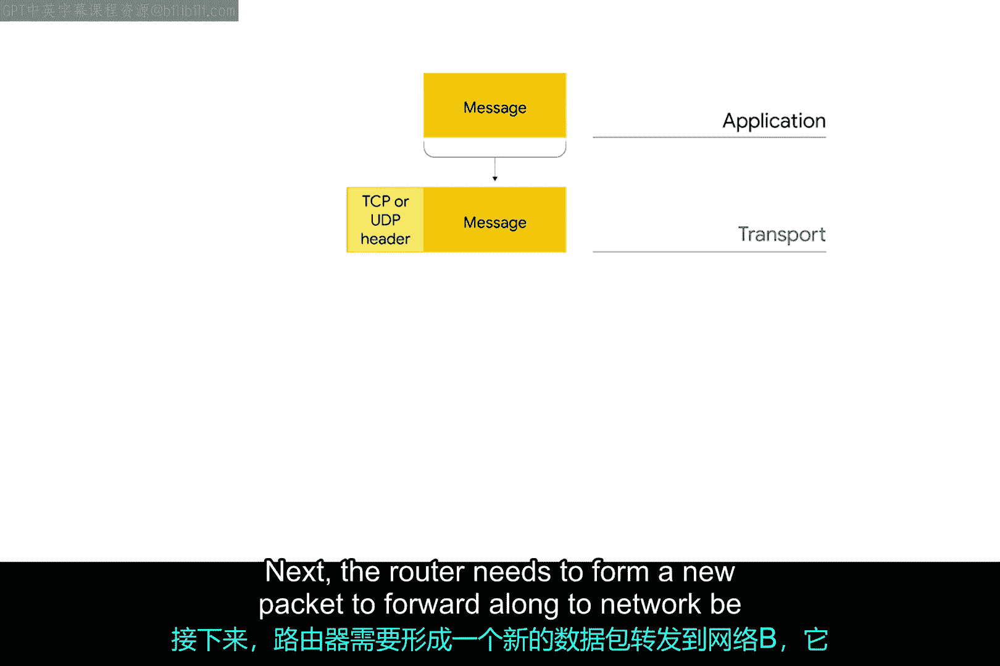

但它将TTL字段减1，并计算一个新的校验和。然后，它将这个新的IP数据报封装在一个新的以太网帧内。这次，它将自己在网络B上的接口的MAC地址设置为源MAC地址。由于它在ARP表中有 `10.0.0.10` 的MAC地址，它将其设置为目标MAC地址。

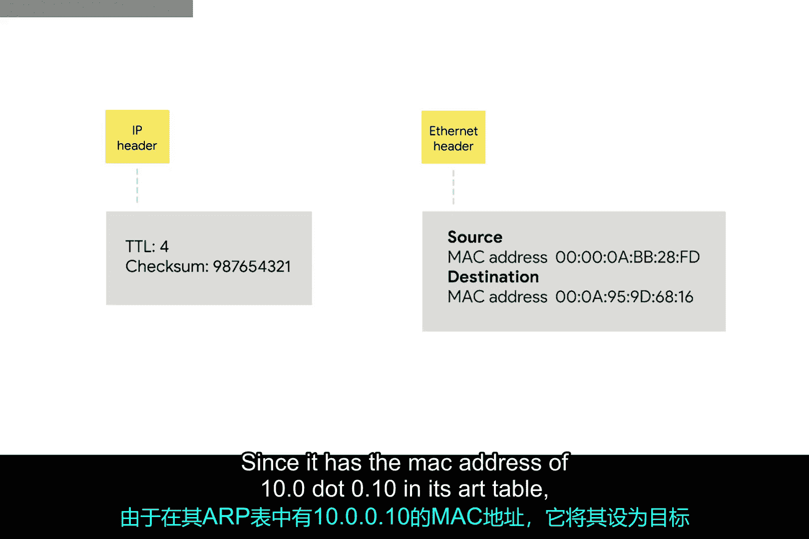

最后，数据包从其网络B的接口发出，数据最终被传送到位于 `10.0.0.10` 的节点。

这是一个相当基础的路由工作原理示例。

## 路由示例：三个网络

现在，让我们让它稍微复杂一点，引入第三个网络。其他一切保持不变。我们拥有地址空间为 `192.168.1.0/24` 的网络A，以及地址空间为 `10.0.0.0/24` 的网络B。连接这两个网络的路由器在网络A上仍有IP `192.168.1.1`，在网络B上仍有IP `10.0.0.254`。

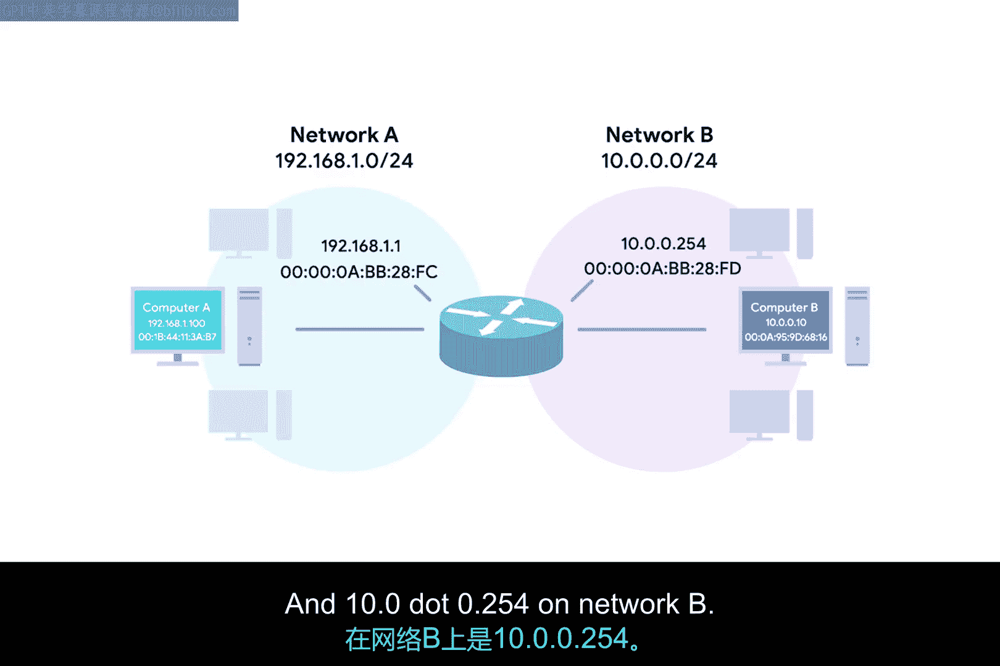

但让我们引入第三个网络，网络C，其地址空间为 `172.16.1.0/23`。有第二个路由器连接网络B和网络C。它在网络B上的接口IP为 `10.0.0.1`，在网络C上的接口IP为 `172.16.1.1`。

这一次，我们位于 `192.168.1.100` 的计算机想要发送一些数据到IP为 `172.16.1.100` 的计算机。我们将跳过数据链路层的细节，但要记住它当然仍在发生。

位于 `192.168.1.100` 的计算机知道 `172.16.1.100` 不在其本地网络上，因此它将数据包发送到其网关，即网络A和网络B之间的路由器。

同样，路由器检查此数据包的内容。它看到目标地址是 `172.16.1.100`，通过查询其路由表，它知道到达 `172.16.1.0/23` 网络的最快路径是通过IP为 `10.0.0.1` 的另一个路由器。

路由器将TTL字段减1，并将其发送给 `10.0.0.1` 的路由器。然后，这个路由器执行相同的操作，知道目标IP `172.16.1.100` 是直接连接的，并将数据包转发到其最终目的地。

这就是路由的基础。

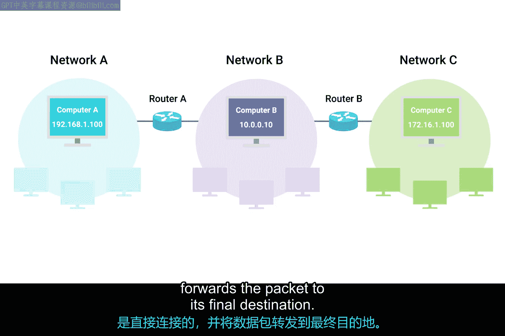

## 互联网路由的规模

我们的示例与互联网上的实际工作方式之间的唯一区别是规模。路由器通常连接到远不止两个网络。通常，你的流量在到达最终目的地之前可能需要穿越十几个路由器。

最后，为了防止中断，核心互联网路由器通常以网状结构连接，这意味着一个数据包可能有许多不同的路径可以选择。

尽管如此，概念都是相同的：路由器检查目标IP，查看其路由表以确定哪条路径最快，然后沿着该路径转发数据包。这个过程一遍又一遍地发生，构成了互联网上每时每刻的每一个数据包、每一比特流量。

## 总结

在本节课中，我们一起学习了路由的基本概念。我们了解到路由器是一种根据目标IP地址转发数据的设备，它通过查询路由表来决定数据包的最佳转发路径。我们通过两个和三个网络的例子，逐步分析了数据包从源到目的地的转发过程，包括检查目标IP、查询路由表、更新TTL和重新封装帧等关键步骤。最后，我们认识到互联网路由的核心原理与此相同，只是规模更大、路径更多样。理解这些基础知识是诊断更复杂网络问题的第一步。