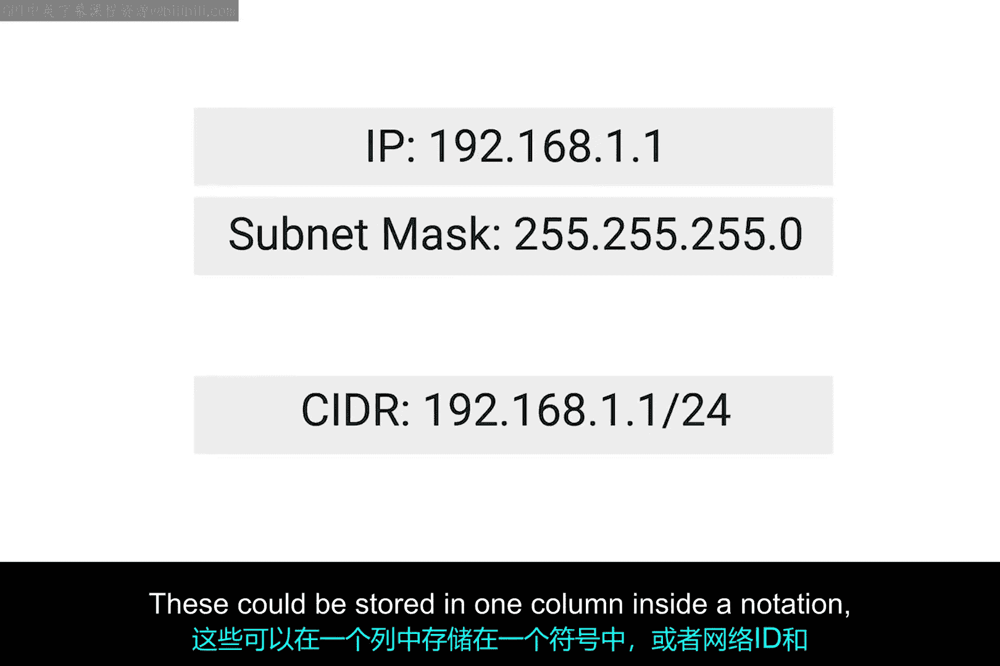
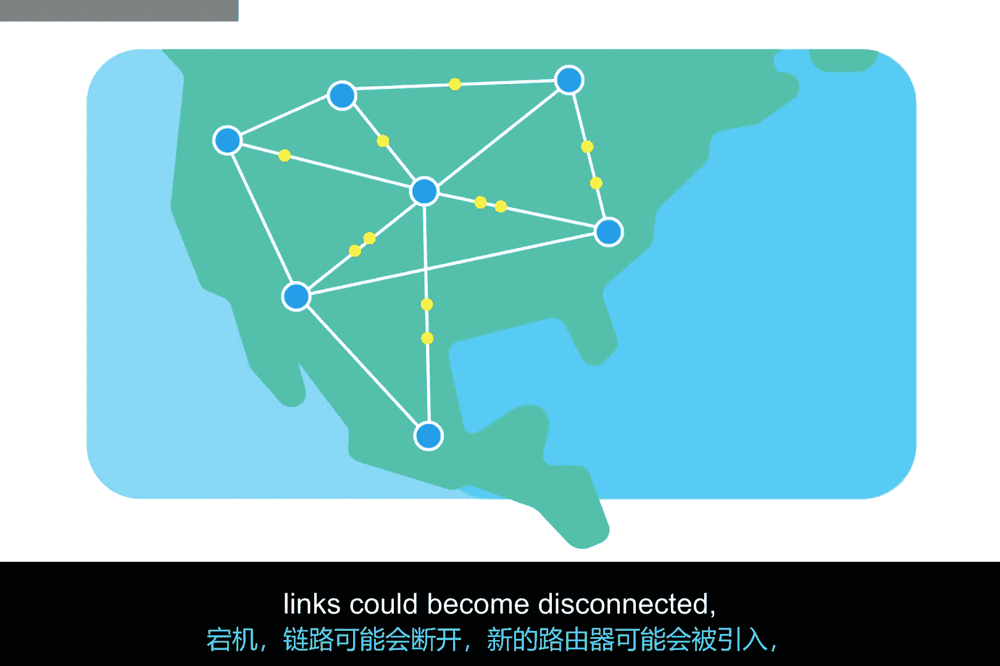

# 030：路由表详解 🧭

在本节课中，我们将要学习路由表的核心概念。路由表是路由器用来决定数据包转发路径的关键数据结构。理解路由表是掌握网络路由工作原理的基础。

## 路由表简介

上一节我们介绍了路由的基本概念，本节中我们来看看路由表的具体构成。路由本身是一个简单的概念，路由表也并不复杂。

早期的路由器就是当时的普通计算机。它们拥有两个网络接口，用于桥接两个网络，并配有一个需要手动更新的路由表。事实上，当今所有主流操作系统在传输数据前，仍然会查询一个路由表。如果你有一台具备两个网络接口的计算机和一个手动更新的路由表，今天你仍然可以构建自己的路由器。

## 路由表的通用结构

路由表的具体形式因路由器的品牌和类别而异，但它们都有一些共同点。最基本的路由表包含四列。

以下是路由表的核心列及其功能：

*   **目标网络**：此列包含路由器已知的每一个网络对应的条目。这只是一个远程网络的定义，包括网络ID和子网掩码。它们可以存储在一列中（CIDR表示法），或者网络ID和子网掩码分列存储。无论如何，概念相同：路由器拥有一个网络的定义，因此知道哪些IP地址可能位于该网络上。
*   **下一跳**：这是数据在发往目标网络时应送达的下一个路由器的IP地址。或者，它可能直接声明网络是直连的，无需任何额外的跳转。
*   **总跳数**：这是理解路由以及路由表在像互联网这样的复杂网络上如何工作的关键部分。从点A到点B通常会有许多不同的路径。路由器总是试图选择最短的可能路径，以确保数据的及时交付。但到达目标网络的最短路径可能会随时间变化，有时变化很快。中间路由器可能宕机，链路可能断开，可能引入新路由器，流量拥塞可能导致某些路由变得太慢而无法使用。我们将在后续视频中了解路由器如何知道最短路径。目前，重要的是知道对于每个下一跳和每个目标网络，路由器都必须跟踪该目标当前的距离。
*   **接口**：路由器还必须知道应该通过它的哪个接口将匹配目标网络的流量转发出去。

## 路由表的工作流程与规模

在大多数情况下，路由表相当简单。真正令人印象深刻的是，许多核心互联网路由器的路由表拥有数百万行。路由器在将数据包转发到最终目的地的途中，必须为流经它的每一个数据包查询这些路由表。

同样令人印象深刻的是，你已经学习了这么多关于路由器、路由和路由表的知识。做得很好。

## 总结

本节课中我们一起学习了路由表。我们了解到路由表是存储网络路径信息的关键工具，它包含目标网络、下一跳地址、总跳数和出接口等核心列。无论是简单的家庭网络还是庞大的互联网核心，路由表都是数据能够准确、高效到达目的地的基石。