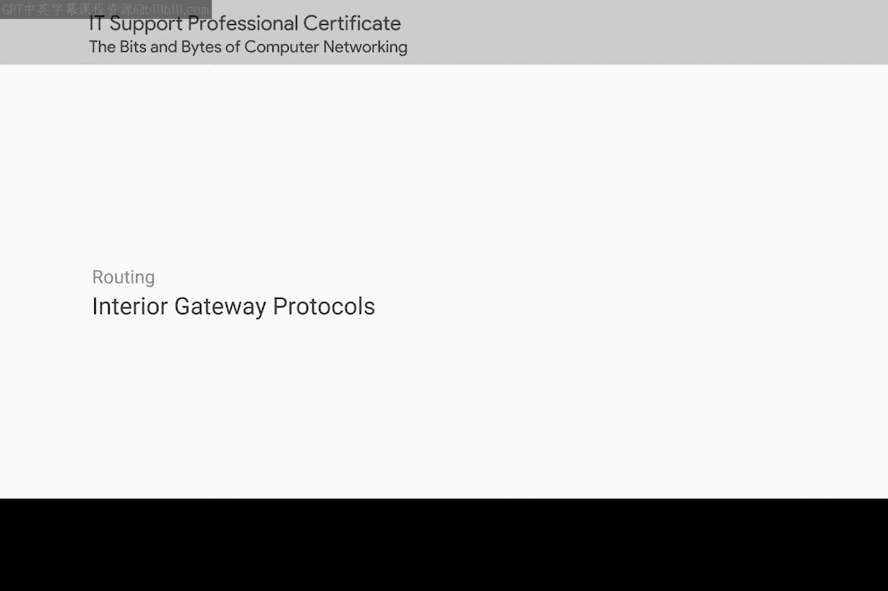
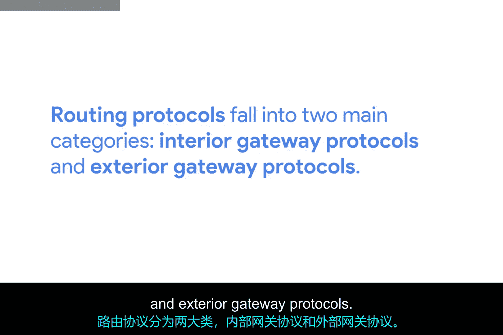
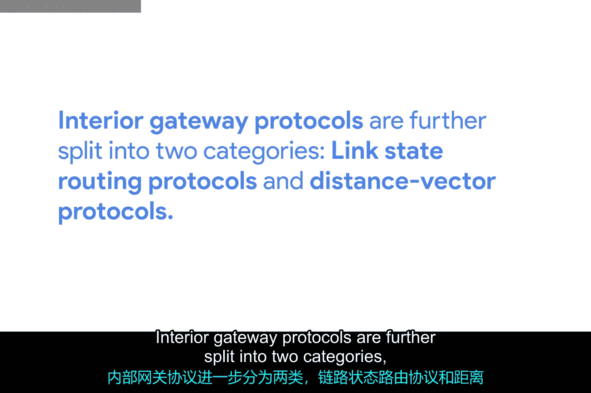
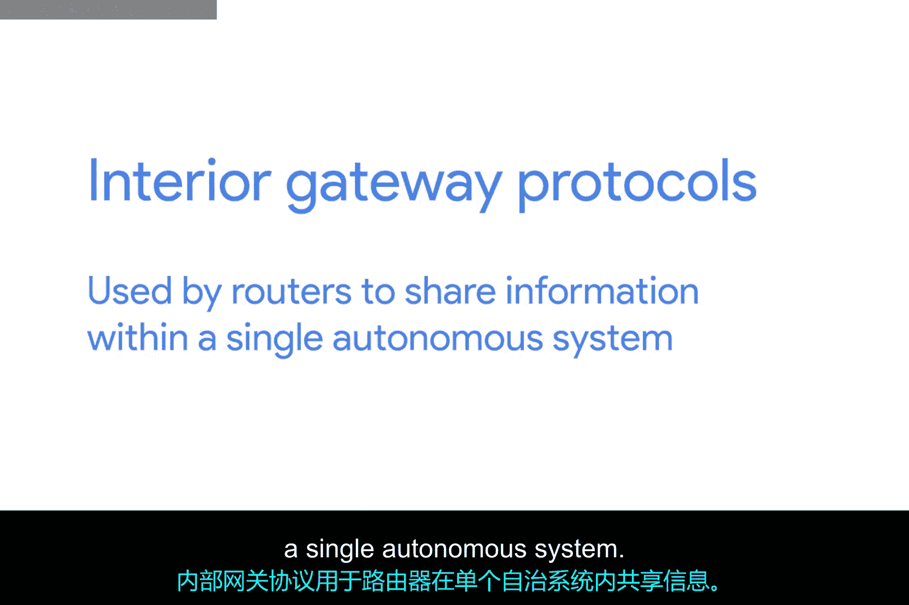
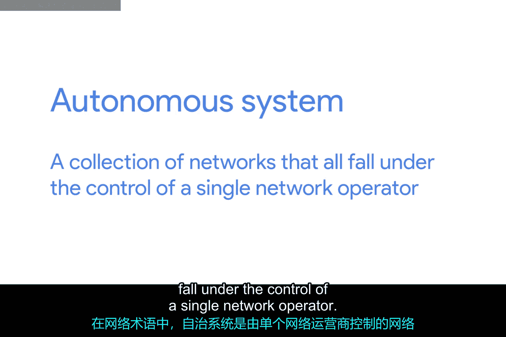
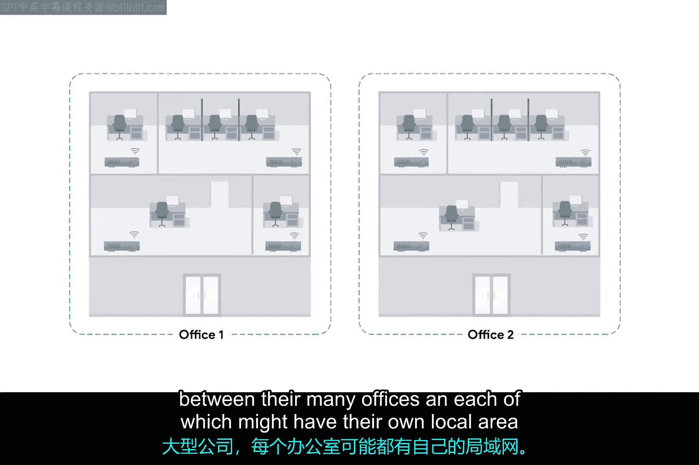
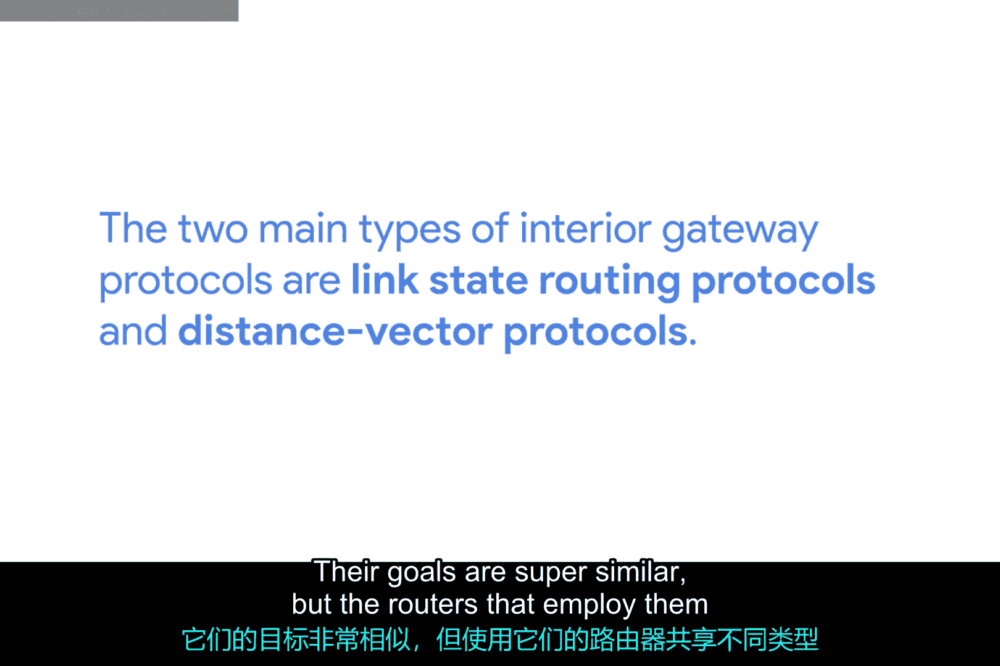
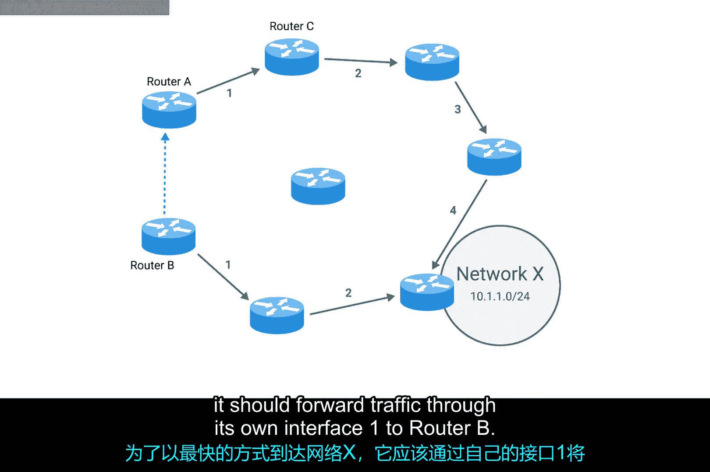
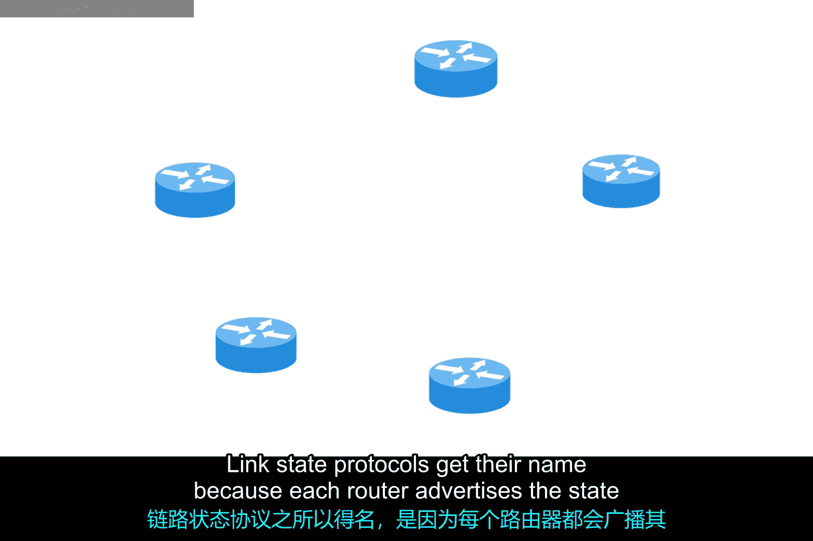
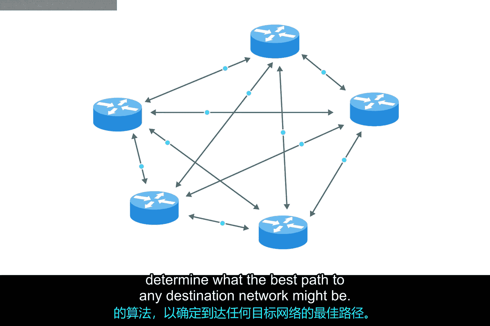

# 031：内部网关协议 🚦

在本节课中，我们将要学习路由器如何通过内部网关协议（IGP）来交换信息并动态更新路由表，以找到到达目标网络的最佳路径。我们将重点介绍距离向量协议和链路状态协议这两类主要的内部网关协议，并解释它们的工作原理与区别。

我们已经介绍了路由的基本工作原理以及路由表是如何构建的，这两个都是相当基础的概念。路由的真正魔力在于，路由表能够持续更新关于到达目标网络最快路径的新信息。本节视频中我们将学习的协议，将帮助你在支持的任何网络中识别路由问题。

为了了解周围网络世界的情况，路由器使用被称为路由协议的特定协议。这些是路由器之间相互通信以分享各自所掌握信息的特殊协议。正是通过这种方式，地球一端的路由器最终能够了解到到达地球另一端某个网络的最佳路径。

路由协议主要分为两大类：内部网关协议和外部网关协议。内部网关协议又进一步分为两类：链路状态路由协议和距离向量协议。

## 内部网关协议概述

上一节我们介绍了路由协议的分类，本节中我们来看看内部网关协议。内部网关协议被路由器用来在单个自治系统内部共享信息。用网络术语来说，一个自治系统是指所有网络都处于单一网络运营商控制之下的集合。

以下是两个典型的自治系统例子：
*   一个需要在众多办公室之间路由数据的大型企业，每个办公室可能都有自己的局域网。
*   互联网服务提供商部署的众多路由器，其覆盖范围通常是全国性的。

你可以将此与外部网关协议进行对比，后者用于在独立的自治系统之间交换信息。预告一下，我们将在后续的视频中介绍外部网关协议。

## 距离向量协议

内部网关协议的两种主要类型是链路状态路由协议和距离向量协议。它们的目标非常相似，但采用它们的路由器为了完成任务，会共享不同类型的数据。

距离向量协议是一种较旧的标准。使用距离向量协议的路由器基本上只是获取它的路由表（即它所知的每个网络及其以跳数计的距离的列表），然后将这个列表发送给每个邻居路由器（即每个直接连接到它的路由器）。在计算机科学中，列表被称为向量。这就是为什么一个只发送网络距离列表的协议被称为距离向量协议。

使用距离向量协议时，路由器对自治系统的整体状态了解并不多。它们只掌握一些关于其直接邻居的信息。

为了基本了解距离向量协议的工作原理，让我们看看两个路由器如何影响彼此的路由表。

假设路由器A的路由表中有一系列条目，其中一个条目是针对网络X（10.1.1.0/24）。路由器A认为到达网络X的最快路径是通过它自己的接口2（路由器C连接在此）。路由器A知道，通过接口2将目的地为网络X的数据发送给路由器C意味着需要4跳才能到达目的地。

与此同时，路由器B距离网络X只有2跳，这反映在它的路由表中。路由器B使用距离向量协议，将其路由表的基本内容发送给路由器A。路由器A看到网络X距离路由器B只有2跳。即使加上从路由器A到路由器B的额外一跳，这也意味着网络X距离路由器A只有3跳。掌握了这个新信息后，路由器A更新其路由表以反映这一点：为了以最快方式到达网络X，它应该通过自己的接口1将流量转发给路由器B。

现在，距离向量协议相当简单，但它们不允许路由器掌握太多关于其直接邻居之外网络状态的信息。因此，路由器对远离它的网络变化可能反应较慢。

## 链路状态协议

正因为距离向量协议的局限性，链路状态协议最终被发明出来。使用链路状态协议的路由器采用更复杂的方法来确定到达网络的最佳路径。

链路状态协议得名于每个路由器都会通告其每个接口的链路状态。这些接口可能连接到其他路由器，也可能是直接连接到网络的连接。关于每个路由器的信息会被传播到自治系统上的所有其他路由器。这意味着系统中的每个路由器都知道系统中所有其他路由器的每一个细节。

然后，每个路由器利用这个庞大得多的信息集，并对其运行复杂的算法，以确定到达任何目标网络的最佳路径可能是什么。

链路状态协议需要更多的内存来保存所有这些数据，同时也需要更强的处理能力。这是因为它必须对这些数据运行算法，以确定更新路由表的最快路径。随着多年来计算机硬件变得更强大、更便宜，链路状态协议已在很大程度上使距离向量协议过时了。

## 总结

本节课中我们一起学习了内部网关协议。我们了解到，路由器通过内部网关协议在自治系统内部共享信息。距离向量协议通过交换简单的距离列表（向量）来工作，但信息有限；而链路状态协议则通过传播详细的链路状态信息，使每个路由器都能构建完整的网络拓扑图，并通过算法计算出最优路径，虽然对资源要求更高，但更为先进和高效。下一节，我们将讨论外部网关协议。