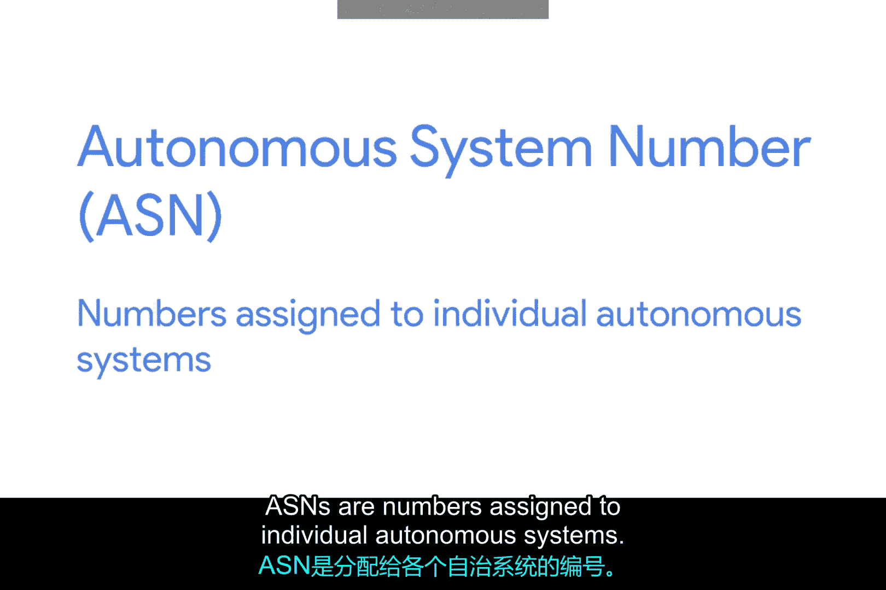

# 032：外部网关协议 🌐

在本节课中，我们将学习外部网关协议（Exterior Gateway Protocols）的基本概念。外部网关协议是互联网能够正常运作的关键，它负责在不同组织管理的自治系统之间交换路由信息。我们将了解自治系统、自治系统编号以及核心互联网路由器如何利用这些信息来引导流量。

## 什么是外部网关协议？

外部网关协议用于在代表自治系统边缘的路由器之间通信数据。

由于使用内部网关协议共享数据的路由器都处于同一组织的控制之下，当路由器需要跨不同组织共享信息时，它们会使用外部网关协议。

外部网关协议是当今互联网如此运作的真正关键。

## 互联网与自治系统

互联网是一个由众多自治系统在最高层级上构成的巨大网状结构。核心互联网路由器需要了解各个自治系统，以便正确地转发流量。

由于自治系统是已知且定义明确的网络集合，将数据送达自治系统的边缘路由器是核心互联网路由器的首要目标。

## 自治系统编号（ASN）的管理

IANA（互联网号码分配局）是一个非营利组织，负责管理IP地址分配等事务。如果没有一个单一的权威机构来处理这类问题，互联网将无法正常运行，否则任何人都可能尝试使用他们想要的任何IP地址空间，这将导致网络彻底混乱。

除了管理IP地址分配，IANA还负责分配ASN（自治系统编号）。ASN是分配给各个自治系统的数字。

就像IP地址一样，ASN也是32位数字。但与IP地址不同的是，ASN通常只用一个十进制数字表示，而不是分成可读的字节段。这主要有两个原因：

1.  **网络与主机标识的需求**：IP地址需要能够为每个数字表示网络ID部分和主机ID部分。通过将数字分成四个8位的部分更容易实现这一点，尤其是在地址类别主导网络的早期。
    *   **公式/概念**：`IP地址 = 网络ID + 主机ID`
2.  **更新机制不同**：ASN本身不需要为了表示更多网络或主机而改变。只需要更新核心互联网路由表，让其知道该ASN代表什么即可。

其次，ASN被人查看的频率远低于IP地址。因为查看IP地址（如 `9.100.100.100`）并知道 `9.0.0.0/8` 地址空间属于IBM可能很有用。而ASN代表整个自治系统，只需能查到ASN 19604属于IBM就足够了。

## 知识范围与重要性

除非有一天你在互联网服务提供商工作，否则对于IT领域的大多数人来说，深入了解外部网关协议的工作原理超出了必要的范围。

但是，掌握自治系统、ASN以及核心互联网路由器如何在它们之间路由流量的基础知识，对于理解互联网的一些基本构建模块非常重要。

---

**本节课总结**：本节课我们一起学习了外部网关协议的基础知识。我们了解到，外部网关协议用于在不同组织管理的自治系统之间交换路由信息，是互联网互联互通的核心。我们还认识了IANA在分配自治系统编号（ASN）中的角色，以及ASN与IP地址在表示和用途上的关键区别。理解这些概念有助于我们构建对互联网底层运作机制的基本认知。