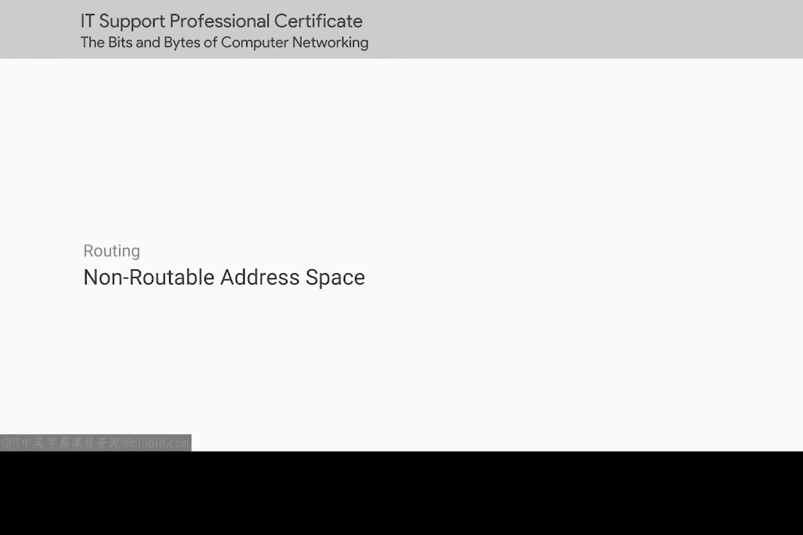
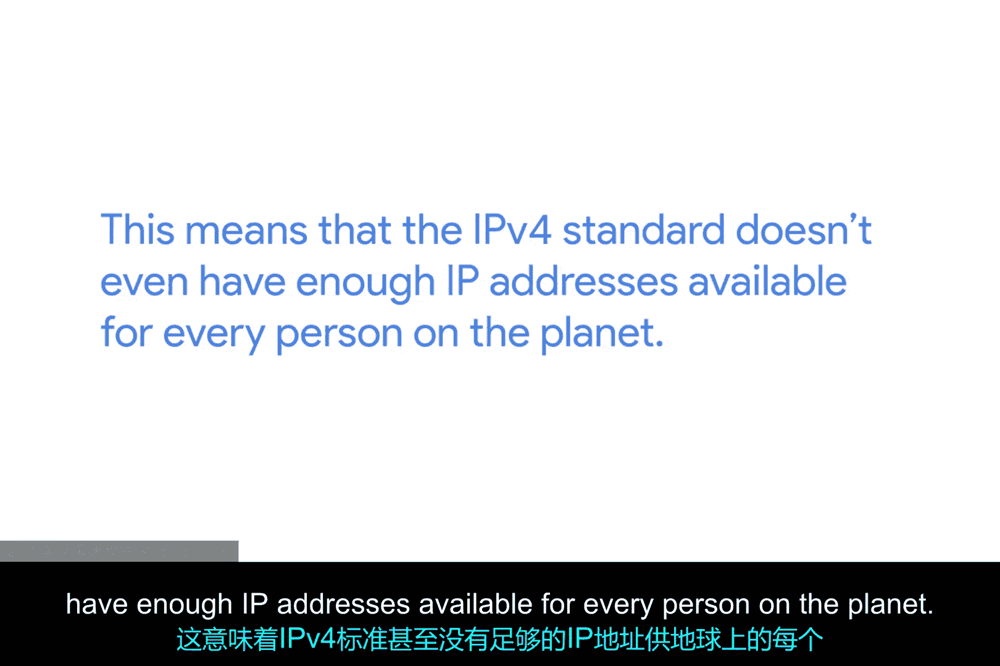

# 033：不可路由的地址空间 🏠

在本节课中，我们将学习一个关键的网络概念：**不可路由的地址空间**。我们将了解它为何被创建，它解决了什么问题，以及它的具体地址范围是什么。

---

## 历史背景与IPv4的局限

上一节我们介绍了IP地址的基本概念。本节中，我们来看看IPv4地址耗尽的问题。

早在1996年，互联网的增长速度就已明显不可持续。最初定义IP协议时，IP地址被定义为一个**32位**的数字。

一个32位的数字可以表示 **2^32 = 4,294,967,295** 个唯一的地址。这听起来很多，但截至2017年，地球上有约75亿人口。这意味着IPv4标准甚至无法为地球上的每个人提供一个IP地址。它也无法满足大型科技公司运营所需的、拥有成千上万台计算机的数据中心的需求。

## RFC 1918与不可路由地址空间

为了解决地址短缺问题，**RFC 1918** 在1996年发布。RFC代表“征求意见稿”，是互联网维护者们就标准规范达成共识的一种长期方式。

RFC 1918定义了一系列网络，这些网络被称为**不可路由地址空间**。顾名思义，这些地址范围是为任何人预留的，但**核心路由器不会将发往这些地址的数据包路由到互联网上**。

并非连接到互联网的每台计算机都需要与其他所有计算机通信。不可路由地址空间允许此类网络中的节点相互通信，但任何网关路由器都不会尝试将流量转发到这类网络。

## 不可路由地址的范围

这听起来限制很大，确实如此。在未来的模块中，我们将介绍一种称为**NAT（网络地址转换）** 的技术，它允许不可路由地址空间中的计算机与互联网上的其他设备通信。但现在，我们先单独讨论不可路由地址空间。

RFC 1918定义了三段永远不会被核心路由器路由的IP地址范围。这意味着它们不属于任何人，任何人都可以使用。事实上，由于它们与互联网流量传输的方式隔离，使用这些地址构建内部网络的人数没有限制。

以下是三个主要的不可路由地址空间范围：

*   **10.0.0.0/8**
*   **172.16.0.0/12**
*   **192.168.0.0/16**

这些范围可供任何人免费用于其内部网络。需要指出的是，**内部网关协议**会路由这些地址空间，因此它们适合在**自治系统**内部使用，但**外部网关协议**则不会。

---

## 总结

本节课中我们一起学习了**不可路由的地址空间**。我们了解到，由于IPv4地址即将耗尽，RFC 1918标准预留了特定的地址段（10.0.0.0/8， 172.16.0.0/12， 192.168.0.0/16）供内部网络使用，这些地址在公共互联网上不可路由，从而缓解了地址短缺压力，并为构建私有网络提供了基础。

本模块涵盖了大量内容，恭喜你坚持学习！接下来，我们将探讨传输层和应用层，但在此之前，还有一个小测验。你可以的！记住，你随时可以返回复习所需的内容。