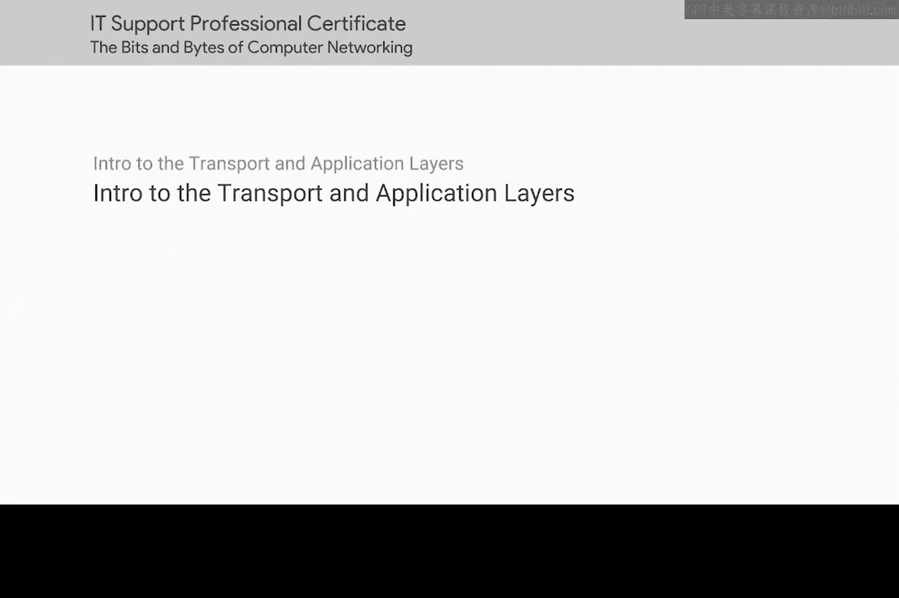
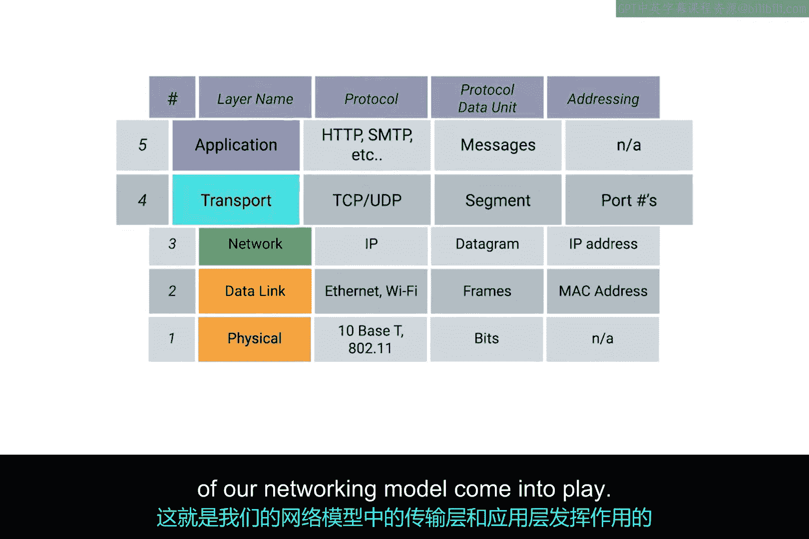
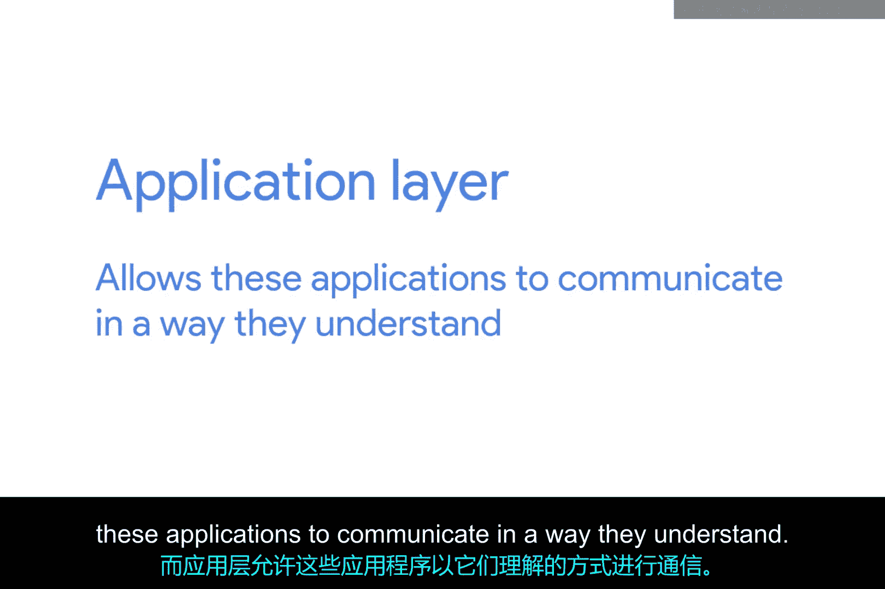

# 035：传输层与应用层介绍 🚀

在本节课中，我们将要学习网络模型中至关重要的两个上层：传输层与应用层。我们将了解它们如何协同工作，使得运行在不同计算机上的应用程序能够相互通信。

---

我们网络模型的前三层帮助我们描述了网络上的单个节点如何与同一网络或其他网络上的节点通信。

但我们尚未讨论单个计算机程序之间如何相互通信。

现在，是时候深入探讨这个问题了，因为这正是计算机网络的根本目标。我们将计算机联网在一起，不仅仅是为了让它们能够互相发送数据，更是为了让运行在这些计算机上的程序能够互相发送数据。

---

这正是我们网络模型中的传输层和应用层发挥作用的地方。

---

简而言之，**传输层**允许网络流量被引导至特定的网络应用程序，而**应用层**则允许这些应用程序以它们能理解的方式进行通信。

---

在本模块结束时，你将能够描述TCP端口和套接字，并识别TCP报文头的不同组成部分。你还将能够说明面向连接和无连接协议之间的区别，并解释TCP如何用于确保数据的完整性。

你准备好进入下一课了吗？传输层即将登场，我们课堂上见。

---

## 总结

本节课中，我们一起学习了传输层与应用层在网络模型中的核心作用。传输层负责将数据准确地送达目标应用程序，而应用层则定义了应用程序间通信的规则。理解这两层是掌握计算机网络如何支持应用程序间通信的关键。