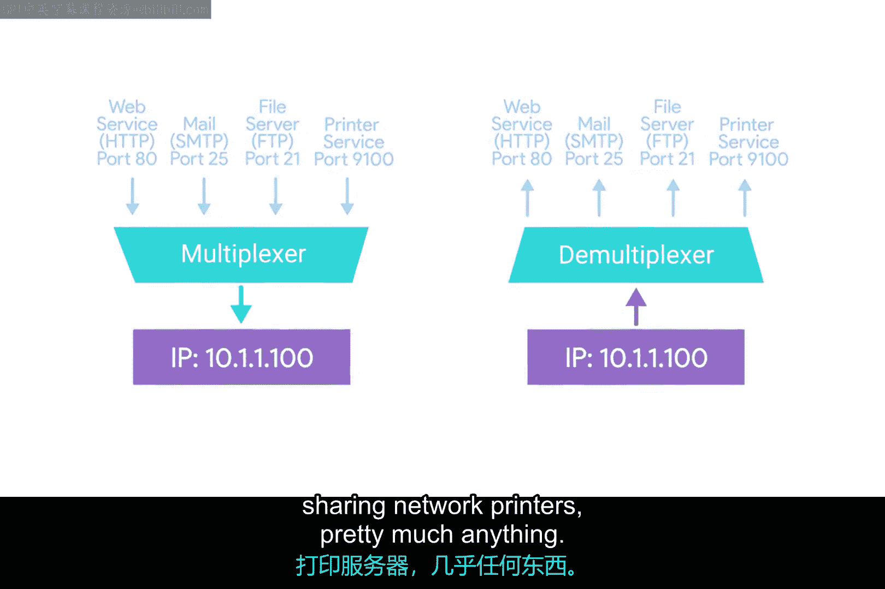
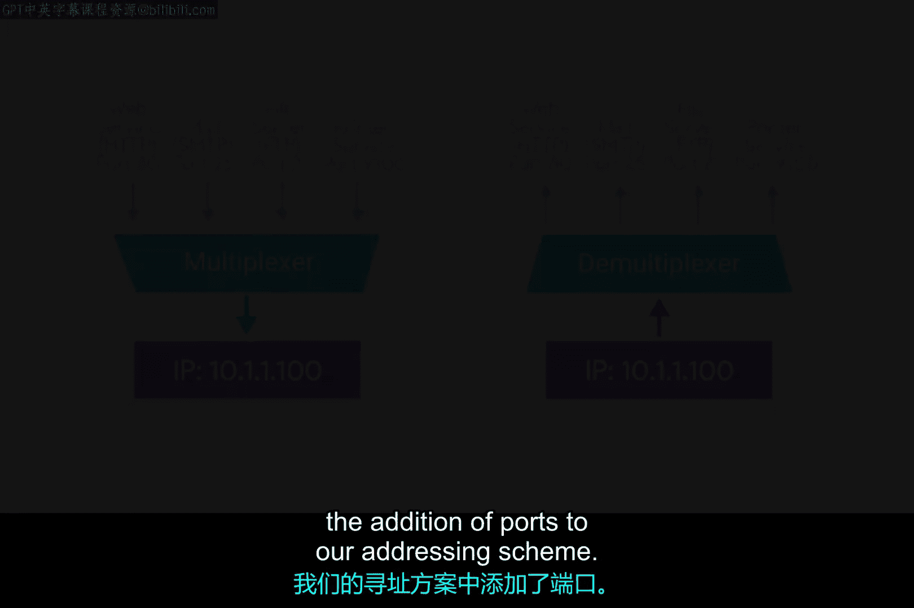

# 036：传输层详解 🚀

在本节课中，我们将学习计算机网络传输层的核心功能。传输层负责确保网络通信的可靠性，其关键职责包括多路复用与多路分解、建立持久连接以及通过错误检查与数据验证来保障数据完整性。通过本课，你将理解这些概念的工作原理及其在实际网络中的应用。

## 多路复用与多路分解 🔄

上一节我们介绍了传输层的基本职责，本节中我们来看看其核心功能之一：多路复用与多路分解。传输层通过这一能力，使其在网络协议栈中独树一帜。

**多路复用** 指网络节点能够将流量导向多个不同的接收服务。**多路分解** 是相同的概念，但发生在接收端，即将所有指向同一节点的流量分发到正确的接收服务中。

传输层通过 **端口** 来处理多路复用与多路分解。端口是一个16位数字，用于将流量引导至网络计算机上运行的特定服务。

以下是端口与寻址的关键点：

*   **客户端与服务器**：服务器或服务是运行在计算机上等待数据请求的程序。客户端是请求这些数据的程序。不同的网络服务在特定端口上监听传入的请求。
*   **端口示例**：例如，HTTP（未加密的网页流量）的传统端口是 **80**。如果我们想向IP地址为 `10.1.1.100` 的计算机上的Web服务器请求网页，流量将被导向该计算机的 **80** 端口。
*   **套接字地址**：端口通常以冒号写在IP地址之后，例如 `10.1.1.100:80`。这种写法被称为 **套接字地址** 或套接字号。
*   **多服务主机**：同一台设备可能运行多个服务。例如，它可能同时运行FTP（文件传输协议）服务器，FTP传统上监听 **21** 端口。因此，连接到同一IP上的FTP服务器，地址为 `10.1.1.100:21`。

在企业IT环境中，单台服务器常通过多路复用技术托管多种业务应用（如内部网站、邮件服务器、文件服务器、打印服务器），这都得益于端口寻址机制。

## 传输控制协议与用户数据报协议 ⚖️

了解了寻址方式后，我们来看看传输层两种主要的通信协议：TCP和UDP。它们是数据传输方式的两种不同选择。

**TCP（传输控制协议）** 是一种面向连接的协议。它在数据传输前通过“三次握手”建立稳定连接，确保数据按序、可靠地送达，并提供错误检查和重传机制。TCP适用于要求高可靠性的应用，如网页浏览、电子邮件。

**UDP（用户数据报协议）** 是一种无连接的协议。它直接发送数据而不预先建立连接，不保证数据顺序或送达，但速度更快、开销更小。UDP适用于实时性要求高、可容忍少量数据丢失的应用，如视频流、在线游戏。

## 三次握手与TCP标志位 🤝

对于可靠的TCP连接，其建立过程的核心是“三次握手”。这个过程使用TCP报文头中的标志位来协调通信。

以下是三次握手的步骤：

1.  **SYN**：客户端向服务器发送一个设置了 **SYN**（同步）标志位的报文，发起连接。
2.  **SYN-ACK**：服务器收到后，回复一个同时设置了 **SYN** 和 **ACK**（确认）标志位的报文，表示同意建立连接。
3.  **ACK**：客户端最后发送一个 **ACK** 标志位报文进行确认。至此，双向连接建立成功，可以开始数据传输。

## 防火墙基础 🔥

最后，我们探讨一下防火墙如何利用传输层信息保护网络安全。防火墙是位于网络边界的安全系统，它根据预设规则检查进出网络的数据包，决定允许或阻止其通过。

防火墙可以检查数据包的多种信息，包括：
*   **源IP地址与目标IP地址**
*   **源端口与目标端口**
*   **协议类型**（如TCP或UDP）

通过分析这些传输层及网络层的信息，防火墙能有效控制网络访问，阻止恶意流量，是网络安全的重要基石。

---

本节课中我们一起学习了传输层的核心机制。我们理解了**多路复用**与**多路分解**如何通过**端口**（如 `10.1.1.100:80`）实现单台主机运行多项服务。我们比较了面向连接、可靠的 **TCP** 与无连接、高效的 **UDP** 之间的区别。我们详细分析了TCP建立连接的 **三次握手** 过程及其使用的 **SYN**、**ACK** 等标志位。最后，我们了解了**防火墙**如何利用IP地址、端口和协议类型来实施访问控制，保障网络安全。掌握这些概念是理解现代计算机网络通信的基础。