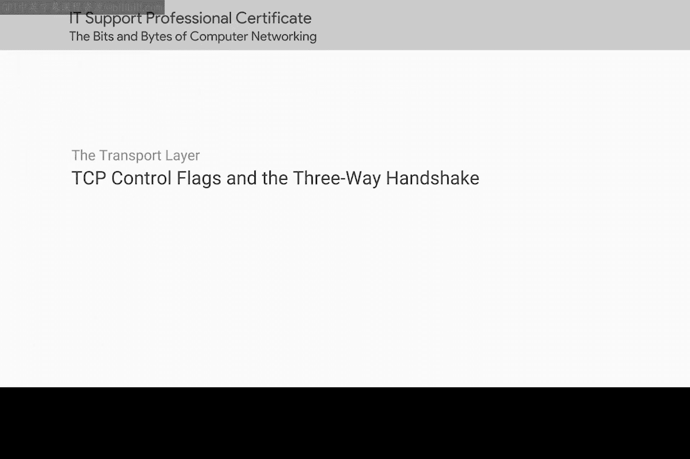
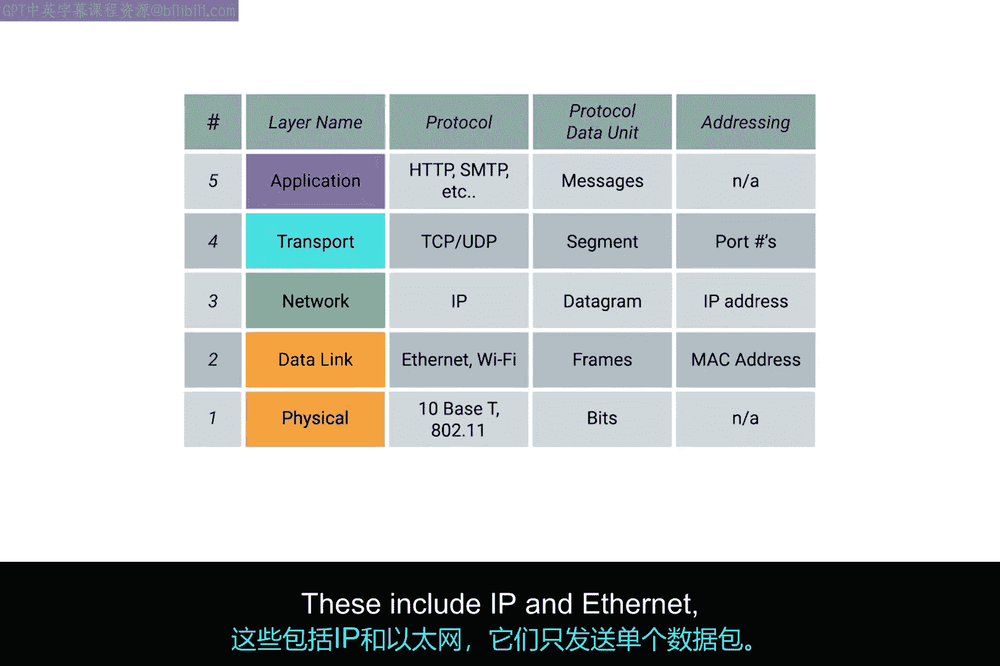
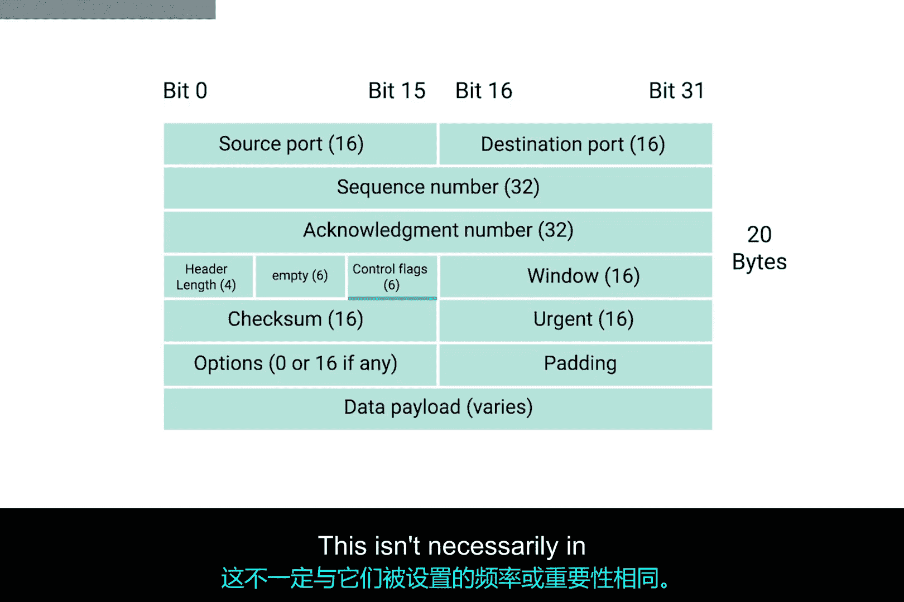
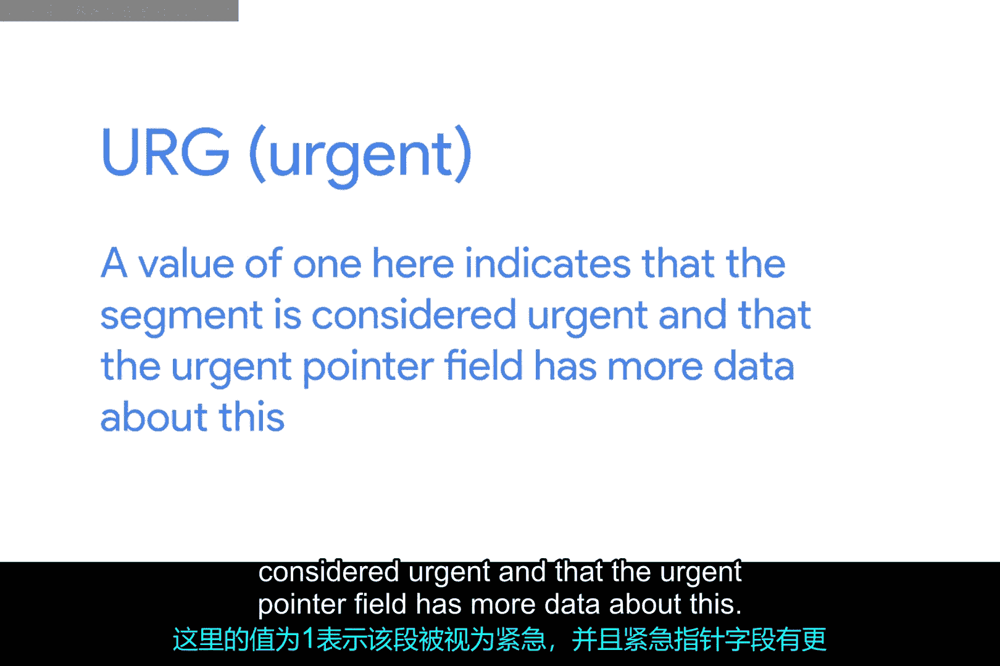
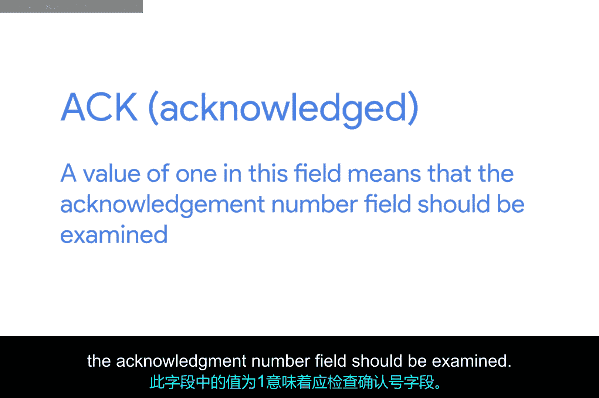
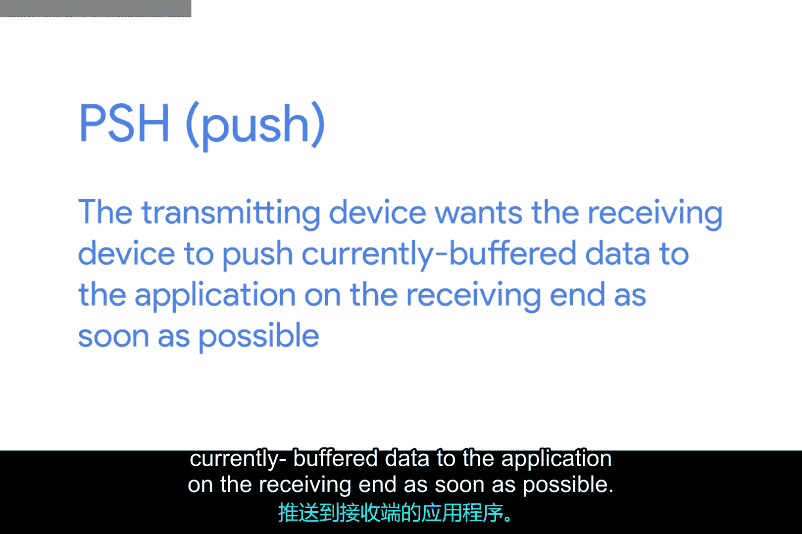
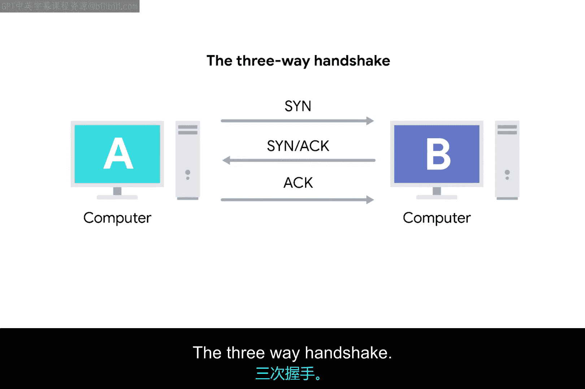
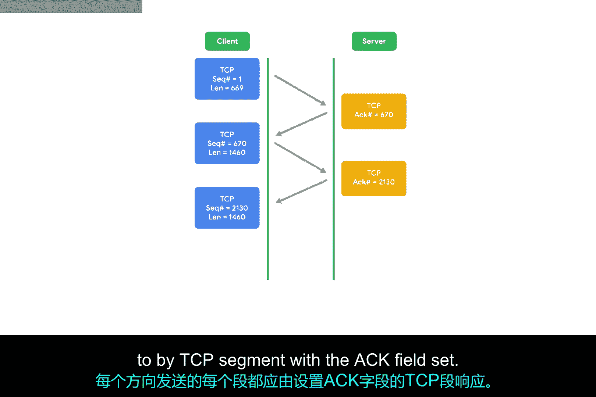
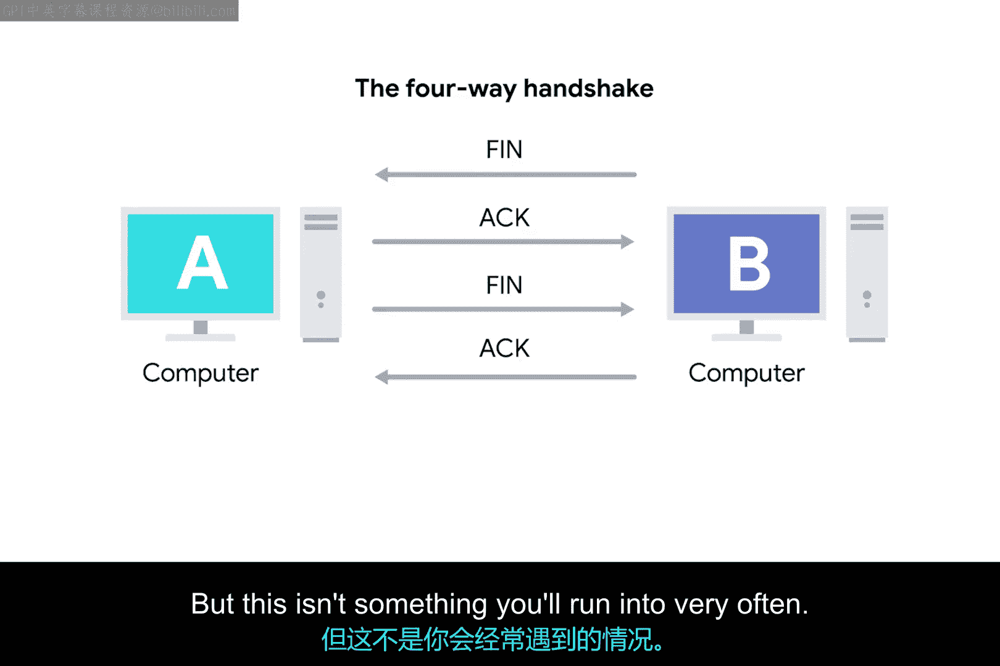

# 038：TCP控制标志与三次握手 🖧

在本节课中，我们将学习TCP协议如何通过特定的控制标志来建立和终止连接。理解这个过程对于IT支持专家诊断网络流量异常至关重要。

## TCP连接概述

TCP是一种协议，它建立连接以发送长链的数据段。这与网络模型中较低层的协议形成对比，例如IP和以太网协议，它们只发送独立的数据包。

上一节我们介绍了TCP的基本概念，本节中我们来看看TCP如何通过一系列控制标志来管理连接。

## TCP控制标志详解

在探讨连接如何建立和关闭之前，我们首先需要定义TCP报文头中的六个控制标志。以下是这些标志的详细说明：

**URG (Urgent)**
*   该标志值为1时，表示当前数据段是紧急的，并且“紧急指针”字段包含更多相关信息。正如上一视频提到的，TCP的这个特性并未得到广泛应用，通常很少见到。

**ACK (Acknowledge)**
*   该标志值为1时，表示接收方应检查“确认号”字段。

**PSH (Push)**
*   该标志表示发送设备希望接收设备尽快将当前缓冲区的数据推送给接收端的应用程序。缓冲区是一种计算技术，数据在发送到别处之前会先暂存在某个地方。在TCP中，通过将一定量的数据保留在缓冲区中，可以更高效地发送大块数据。但在某些情况下，发送方可能需要监听程序立即响应少量信息，这时就会使用PSH标志。

**RST (Reset)**
*   该标志表示TCP连接中的一方无法从一系列丢失或格式错误的数据段中正常恢复。这相当于连接中的一方在说：“等等，我无法理解你的意思，让我们从头开始。”

**SYN (Synchronize)**
*   该标志在首次建立TCP连接时使用，确保接收端知道要检查“序列号”字段。

**FIN (Finish)**
*   当该标志设置为1时，表示发送计算机没有更多数据要发送，可以关闭连接。

## TCP连接的建立：三次握手 🤝

了解了控制标志后，我们来看一个使用它们的经典例子：TCP连接的建立过程。假设计算机A是发送方，计算机B是接收方。

1.  **SYN**
    计算机A向计算机B发送一个设置了SYN标志的TCP段。这是计算机A在说：“让我们建立一个连接，请查看我的序列号字段，以便我们知道这次对话从哪里开始。”

2.  **SYN-ACK**
    计算机B随后回复一个同时设置了SYN和ACK标志的TCP段。这是计算机B在说：“好的，让我们建立连接，并且我确认收到了你的序列号。”

3.  **ACK**
    最后，计算机A再次回复一个仅设置了ACK标志的段，意思是：“我确认收到了你的确认，让我们开始发送数据吧。”

这个涉及SYN、SYN-ACK和ACK标志的交换过程，在任何地方建立TCP连接时都会发生，它非常著名，有一个昵称：**三次握手**。握手是两种设备确保它们使用相同协议并能相互理解的一种方式。

## 全双工通信与连接终止

一旦三次握手完成，TCP连接便正式建立。此时，计算机A可以自由地向计算机B发送任何数据，反之亦然。由于双方都已向对方发送了SYN-ACK对，处于此状态的TCP连接以**全双工**模式运行。任一方向发送的每个数据段，都应收到一个设置了ACK字段的TCP段作为响应，这样对方总能知道哪些数据已被接收。

当TCP连接中的一方准备关闭连接时，会发生所谓的**四次握手**。

1.  准备关闭连接的计算机发送一个FIN标志。
2.  另一台计算机用一个ACK标志进行确认。
3.  如果另一台计算机也准备关闭连接（这几乎总是情况），它会发送一个FIN标志。
4.  这个FIN标志会再次收到一个ACK标志作为响应。

理论上，TCP连接可以在**单工**模式下保持打开，即只有一方关闭连接，但这种情况在实践中并不常见。

## 总结

本节课中我们一起学习了TCP协议的核心控制机制。我们详细介绍了URG、ACK、PSH、RST、SYN和FIN这六个控制标志的含义。重点掌握了TCP通过**三次握手（SYN -> SYN-ACK -> ACK）** 建立可靠的全双工连接，以及通过**四次握手**来优雅地终止连接的过程。理解这些标志和握手流程是诊断网络连接问题的基础。