# 039：TCP套接字状态 🖧

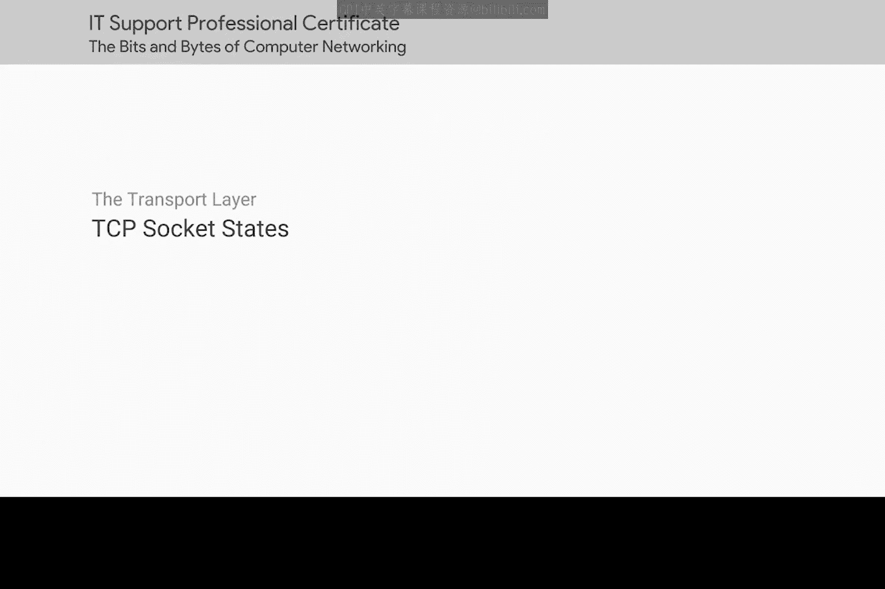

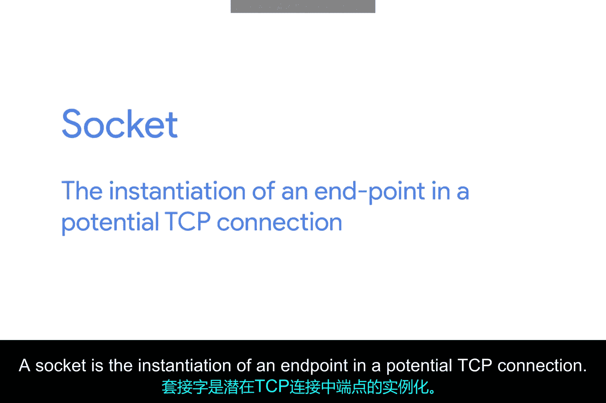

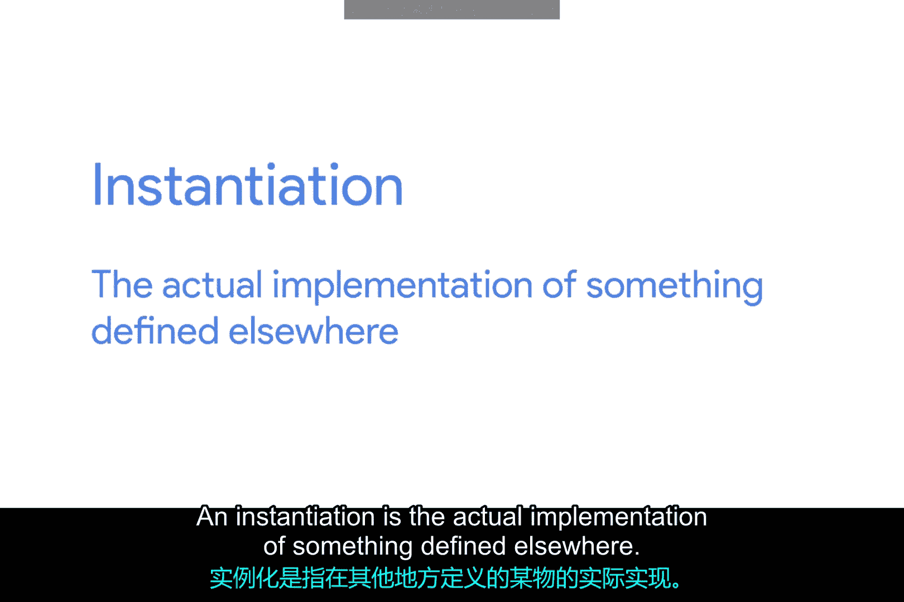

在本节课中，我们将学习TCP套接字状态。理解这些状态对于诊断网络连接问题至关重要。我们将逐一介绍最常见的几种状态，并解释它们通常在连接的哪一端出现。

## 概述

套接字是TCP连接中端点的实例化。实例化是指将其他地方定义的东西实际实现出来。TCP套接字需要实际的程序来实例化。

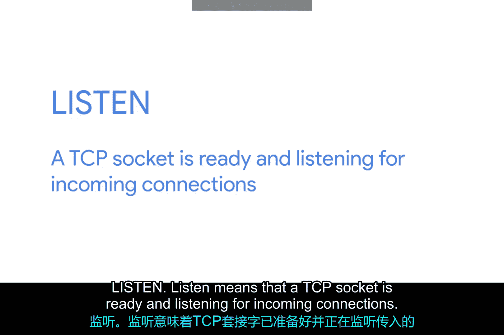

这与端口形成对比，端口更像是一个虚拟的描述性概念。换句话说，你可以向任何端口发送流量，但只有当有程序在该端口上打开了套接字时，你才会收到响应。

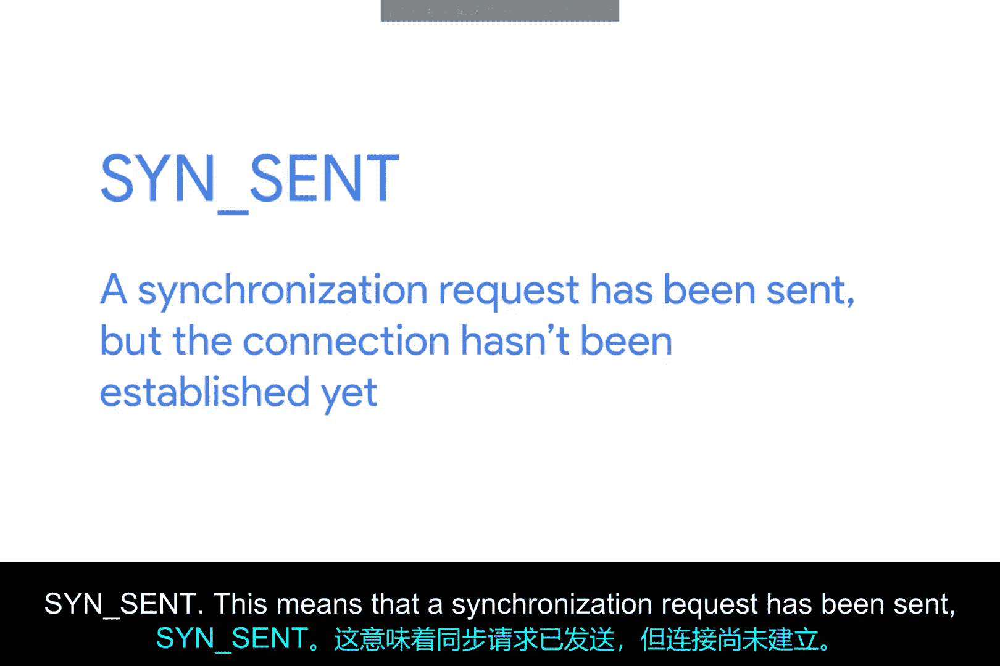

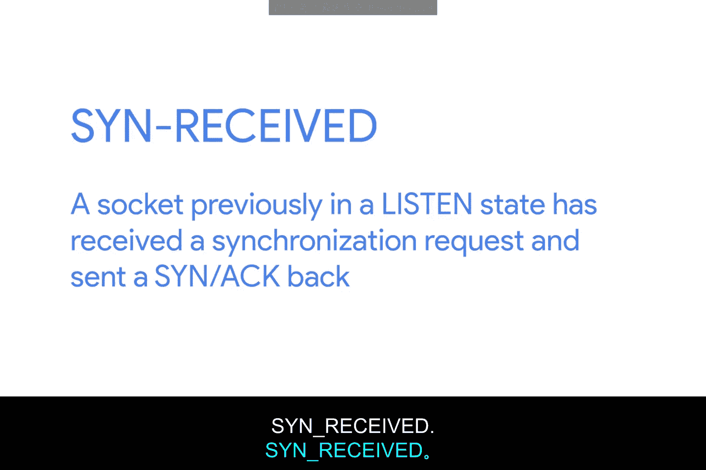

TCP套接字可以存在于多种状态中。理解这些状态的含义将帮助你，作为一名IT支持专家，排查网络连接问题。下面我们将介绍最常见的几种状态。

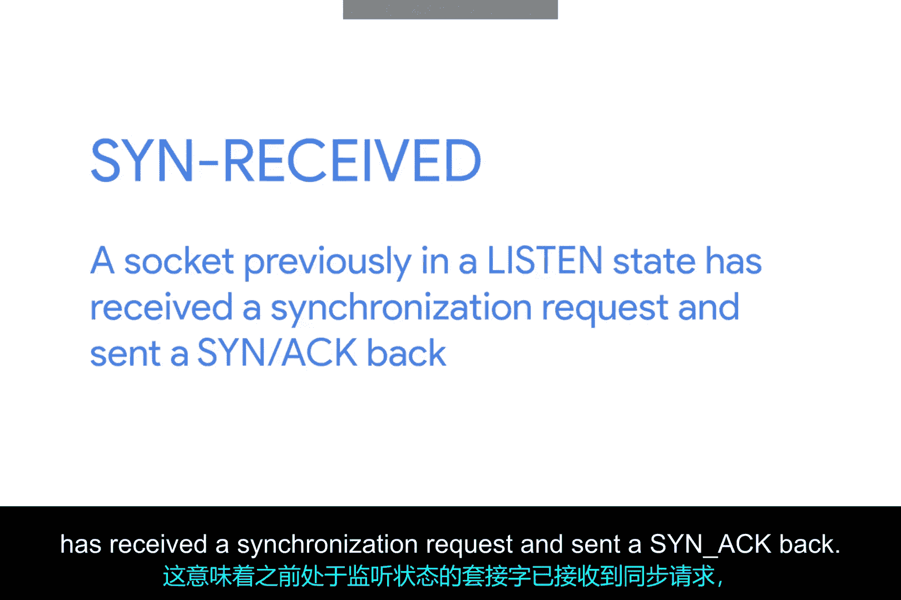

## 常见TCP套接字状态

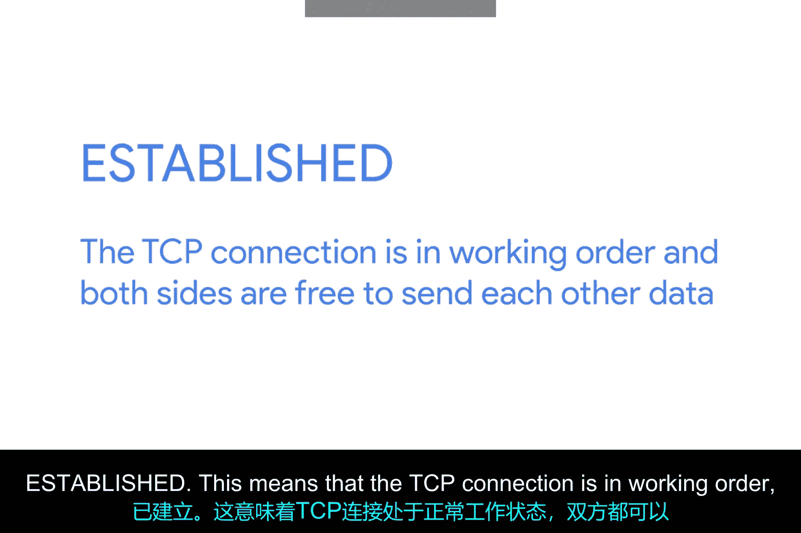

上一节我们介绍了套接字的基本概念，本节中我们来看看具体的TCP套接字状态。以下是几种最常见的状态及其含义：

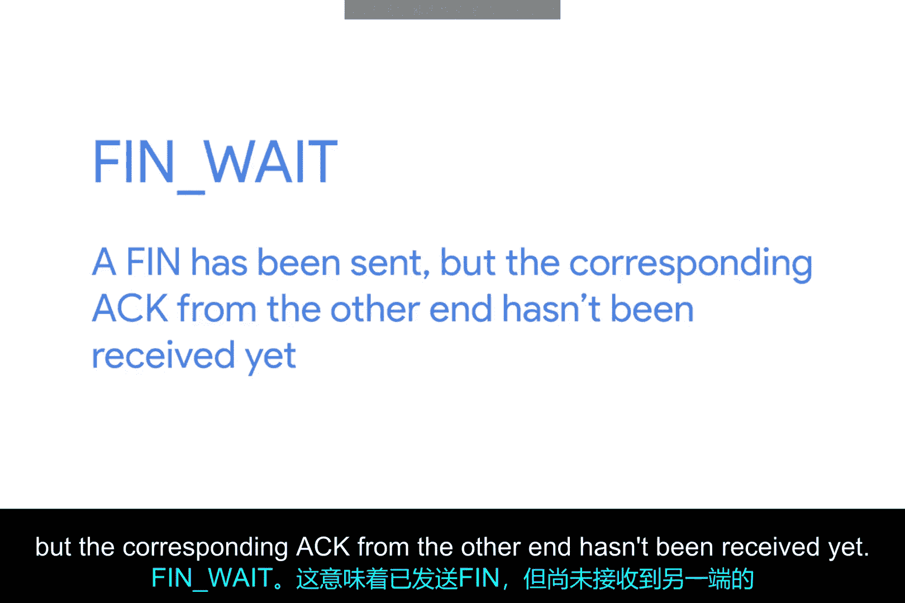

*   **LISTEN（监听）**：这意味着一个TCP套接字已准备就绪，正在监听传入的连接。你只会在服务器端看到此状态。
*   **SYN-SENT（同步已发送）**：这意味着已发送同步请求，但连接尚未建立。你只会在客户端看到此状态。
*   **SYN-RECEIVED（同步已接收）**：这意味着先前处于监听状态的套接字已收到同步请求，并已发回SYN-ACK，但尚未收到客户端的最终ACK。你只会在服务器端看到此状态。
*   **ESTABLISHED（已建立）**：这意味着TCP连接工作正常，双方都可以自由地相互发送数据。你会在连接的客户端和服务器端都看到此状态。这一点也适用于后面所有的套接字状态，请记住。
*   **FIN-WAIT（结束等待）**：这意味着已发送FIN，但尚未收到另一端的相应ACK。
*   **CLOSE-WAIT（关闭等待）**：这意味着连接已在TCP层关闭，但打开套接字的应用程序尚未释放其对套接字的控制。
*   **CLOSED（已关闭）**：这意味着连接已完全终止，无法再进行任何通信。

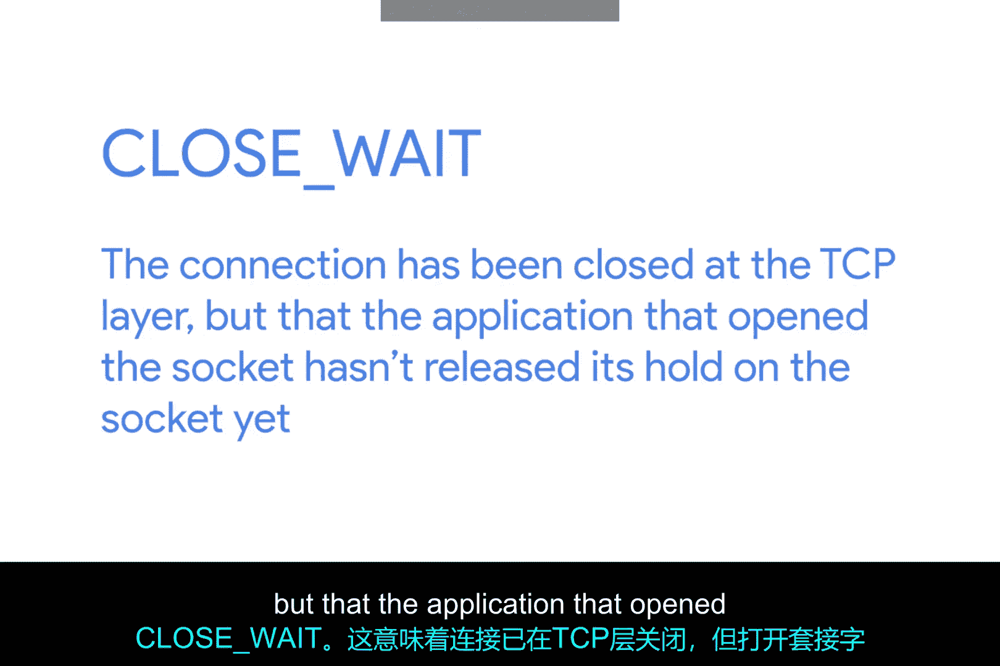

## 注意事项与总结

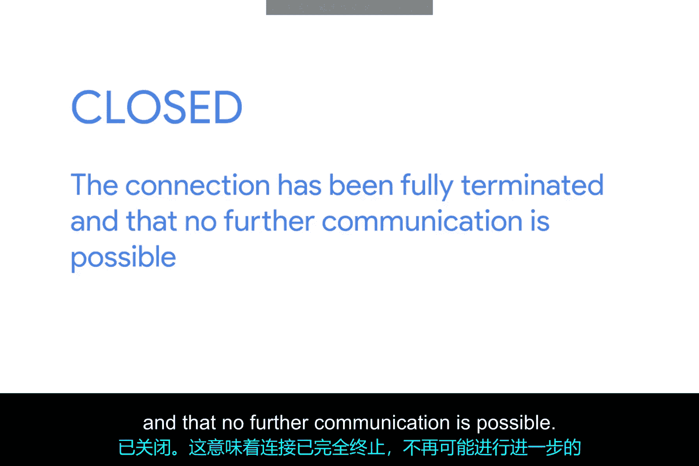

除了上述状态外，还存在其他TCP套接字状态。此外，套接字状态及其名称可能因操作系统而异。这是因为它们存在于TCP本身定义的范围之外。

TCP作为一种协议，其使用方式是通用的，因为每个使用TCP协议的设备都必须以完全相同的方式进行通信才能成功。然而，在操作系统层面如何描述套接字的状态则没有那么统一。

本节课中我们一起学习了TCP套接字的各种状态，从监听、建立连接到最终关闭。当在TCP层进行故障排除时，请务必查阅你所使用系统的确切套接字状态定义。