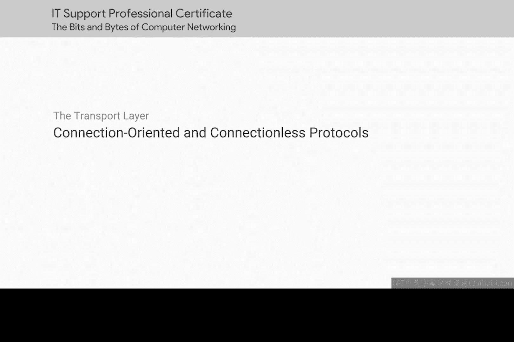
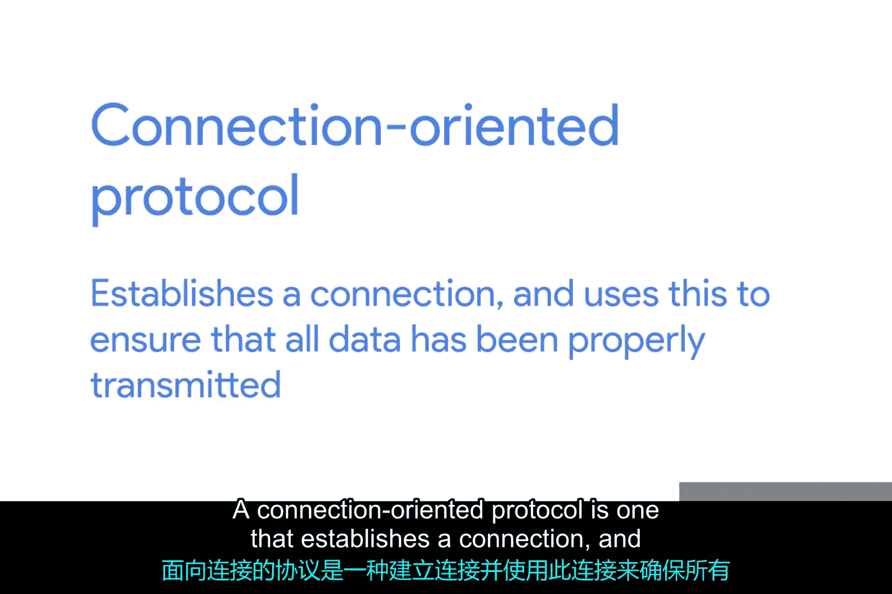
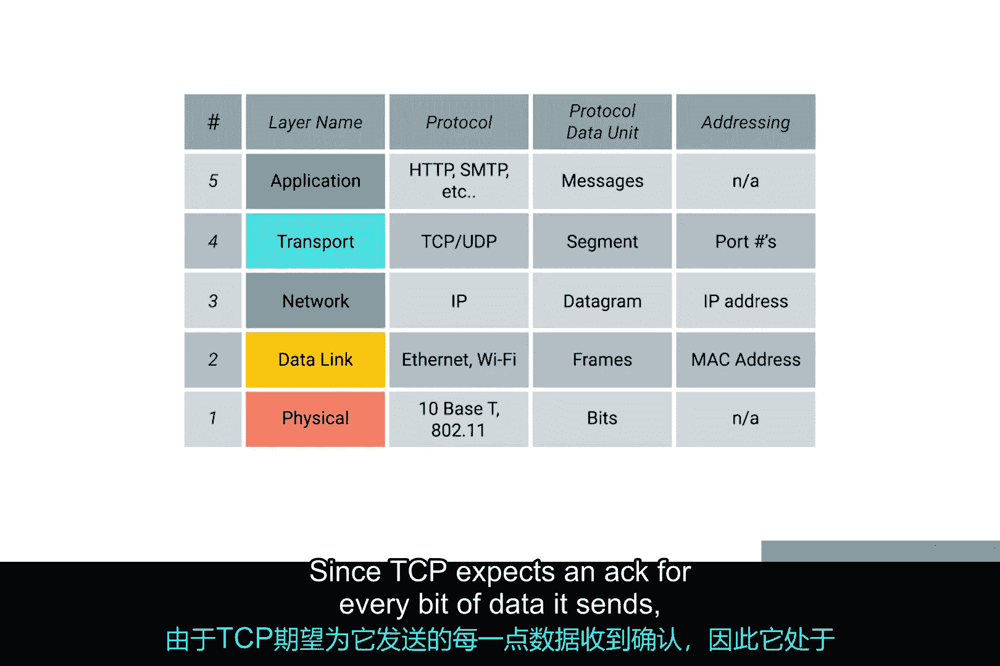
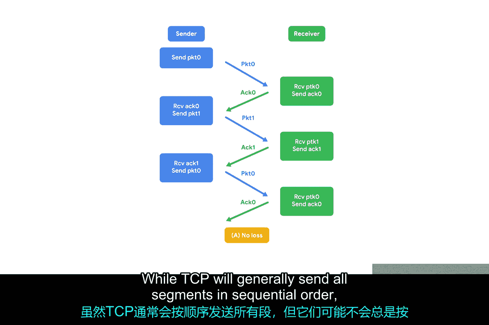
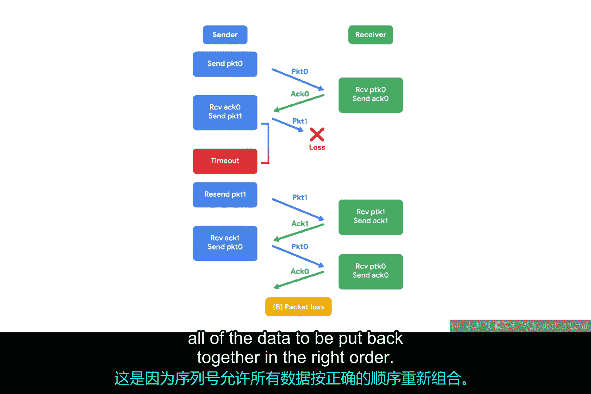

# 040：面向连接与无连接协议 🔗

在本节课中，我们将要学习传输层中两种核心的通信方式：面向连接的协议和无连接的协议。我们将重点探讨TCP和UDP的工作原理、它们的优缺点以及各自适用的场景。

## 概述

到目前为止，我们的讨论主要集中在TCP协议上。TCP是一种**面向连接的协议**。面向连接的协议会先建立连接，并利用这个连接来确保所有数据都被正确传输。

## 面向连接协议的工作原理

上一节我们提到了TCP是面向连接的，本节中我们来看看这种连接具体意味着什么。

在传输层，一个“连接”意味着发送的**每一个数据段**都需要得到确认。通过这种方式，连接的两端始终能确切知道哪些数据已经成功送达对方，而哪些没有。

面向连接协议之所以重要，是因为互联网环境复杂且繁忙，数据从A点传输到B点的过程中可能出现各种问题。

以下是数据可能无法正确到达的一些原因：
*   **线路错误**：例如，物理层中同一电缆内相邻双绞线的串扰，就足以导致循环冗余校验失败，从而使整个数据帧被丢弃。
*   **网络拥塞**：纯粹的拥塞可能导致路由器为了转发更重要的流量而丢弃你的数据包。
*   **意外中断**：例如，施工公司切断了连接两个ISP的光缆。

像TCP这样的面向连接协议，通过建立连接和持续的**确认**流来防范这些问题。

## TCP如何确保可靠性

我们的网络模型中较低层的协议（如IP和以太网）确实使用校验和来确保接收数据的正确性。但你是否注意到，我们从未讨论过重新发送未通过校验的数据？这是因为这完全由传输层协议决定。

在IP或以太网层面，如果校验失败，所有数据都会被直接丢弃。是否重发这些数据，则由TCP来决定。

由于TCP期望为它发送的每一位数据都收到确认（ACK），因此它最清楚哪些数据成功送达，并能在需要时决定重发一个数据段。

这也是序列号如此重要的另一个原因。虽然TCP通常会按顺序发送所有数据段，但它们到达时可能并不总是有序的。

如果某些数据段由于底层错误需要重发，那么它们即使稍微乱序到达也没关系。这是因为**序列号**允许将所有数据按照正确的顺序重新组装起来，这非常方便。

## 无连接协议的引入

现在，你可能已经意识到，像TCP这样的面向连接协议存在很多**开销**。你必须建立连接，必须发送持续的确认流，最后还必须拆除连接，所有这些都产生了大量的额外流量。

虽然这些流量很重要，但只有在你**绝对必须**确保数据到达目的地时，它才真正有用。

你可以将此与**无连接协议**进行对比。其中最常见的是**UDP**，即用户数据报协议。与TCP不同，UDP不依赖于连接，甚至不支持“确认”这个概念。

使用UDP时，你只需设置一个目标端口并发送数据包。

## UDP的应用场景

这对于那些不是超级重要的消息非常有用。UDP的一个典型例子是**流媒体视频**。

我们可以想象每个UDP数据报就是视频的一帧。为了获得最佳观看体验，你可能希望每一帧都能送达观众，但即使中途丢失了几帧，视频仍然基本可看，除非丢失了大量帧。

通过摒弃TCP的所有开销，你实际上可能能够用UDP传输更高质量的视频。这是因为你可以将更多可用带宽节省下来用于实际的数据传输，而不是耗费在建立连接和确认已送达数据段的开销上。

## 总结

本节课中我们一起学习了传输层的两种核心协议。**TCP**作为一种面向连接的协议，通过建立连接、使用序列号和确认机制，提供了可靠的数据传输，但会引入额外开销。而**UDP**作为一种无连接的协议，不建立连接、不进行确认，传输速度更快、开销更小，适用于对实时性要求高、可容忍少量数据丢失的应用，如视频流媒体。理解两者的区别有助于我们在不同场景下选择合适的传输协议。