# 041：防火墙 🔥

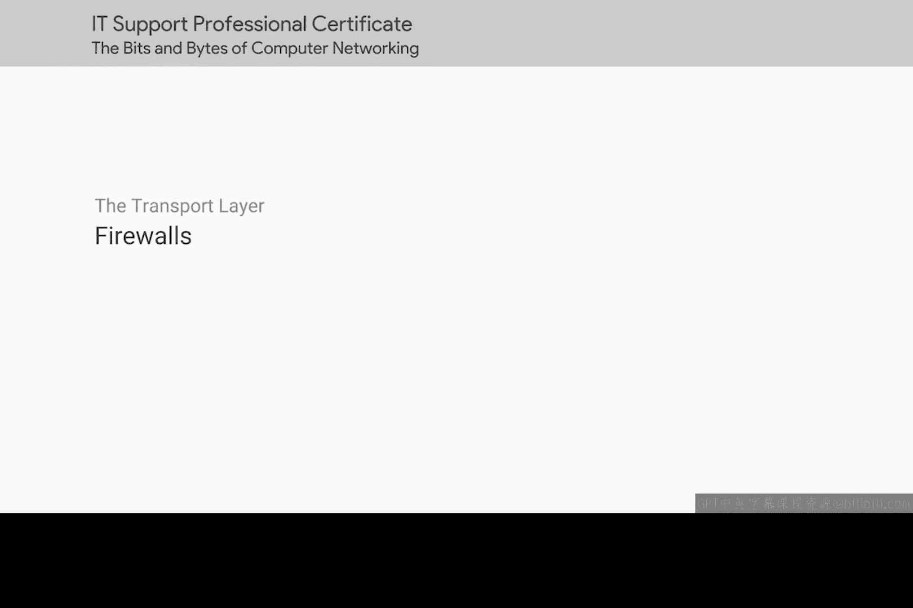

在本节课中，我们将要学习网络安全中的一个核心设备——防火墙。我们将了解防火墙的基本概念、它在网络中的工作层次，以及它如何通过控制网络流量来保护我们的系统和数据安全。

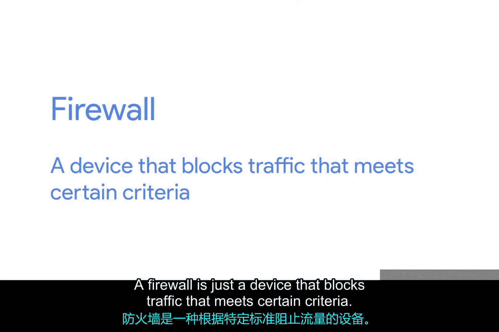

---

你知道我们还没提到哪个你很可能非常熟悉的网络设备吗？那就是防火墙。防火墙是一种能够根据特定规则阻止网络流量的设备。

防火墙是保障网络安全的关键概念，因为它是阻止不想要的流量进入网络的主要手段。

## 防火墙的工作层次

上一节我们介绍了防火墙的基本定义，本节中我们来看看防火墙可以在哪些网络层次上工作。

防火墙实际上可以在网络的不同层次上运行。有些防火墙能够检查应用层流量，而有些则主要处理IP地址范围的封禁。

我们将防火墙放在这里讨论，是因为它们最常用于传输层。在传输层运行的防火墙通常具有一种配置，使其能够阻止发往某些端口的流量，同时允许发往其他端口的流量通过。

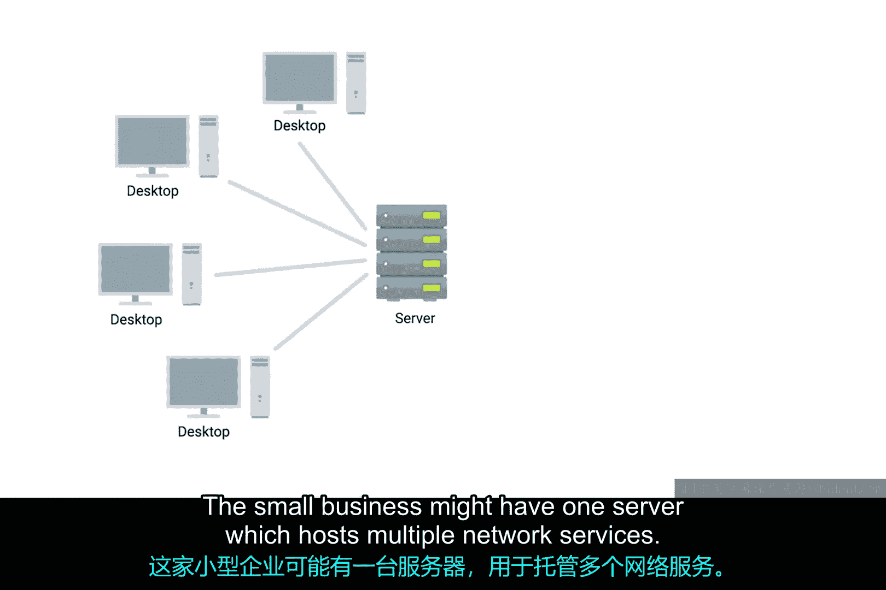

## 防火墙配置实例

为了理解防火墙如何工作，让我们设想一个简单的小型企业网络场景。这家公司可能有一台服务器，同时承载多项网络服务。

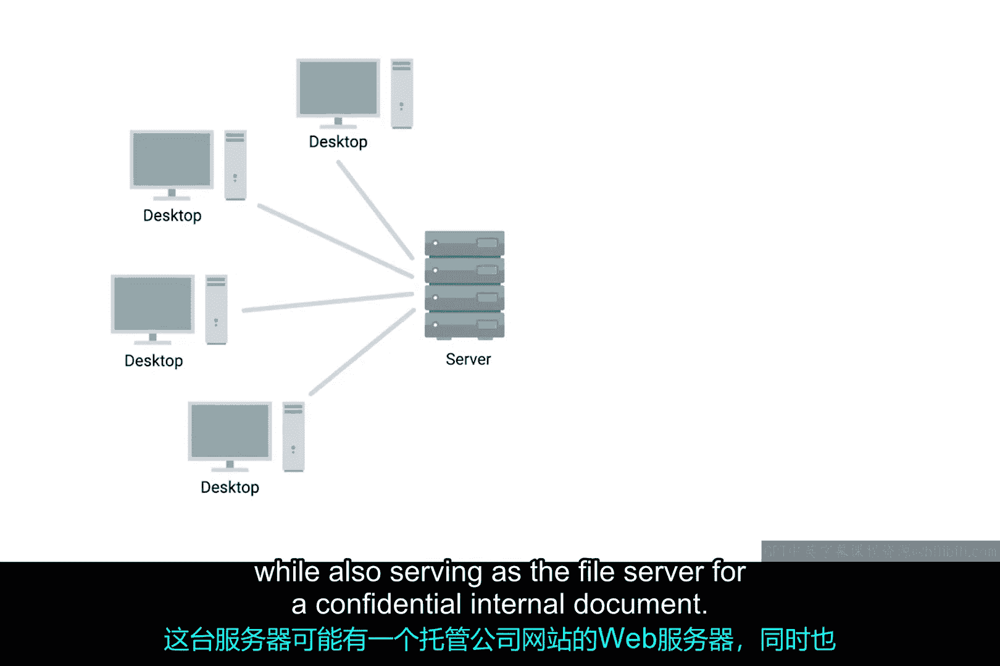

这台服务器可能既托管着公司的网站（作为Web服务器），又作为内部机密文档的文件服务器。

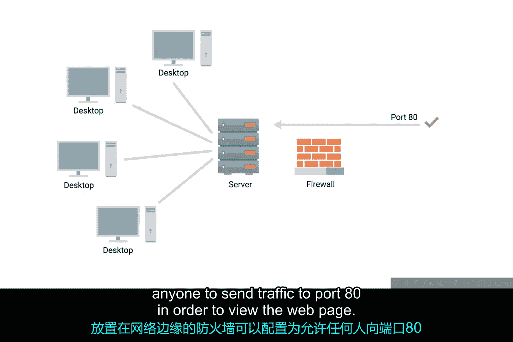

在这种情况下，部署在网络边界的防火墙可以这样配置：允许任何人向**端口80**发送流量以访问网页。

同时，它可以阻止所有外部IP地址访问任何其他端口。这样，局域网外的任何人都无法访问文件服务器。

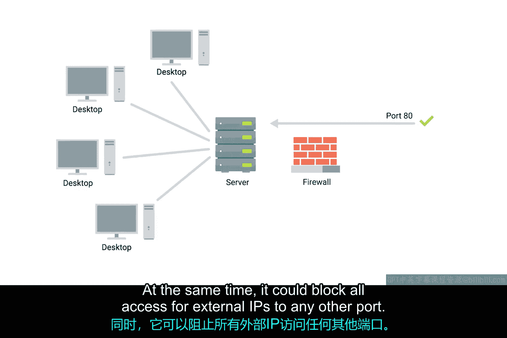

## 防火墙的实现形式

了解了防火墙的基本配置后，我们来看看防火墙可以以哪些形式存在。

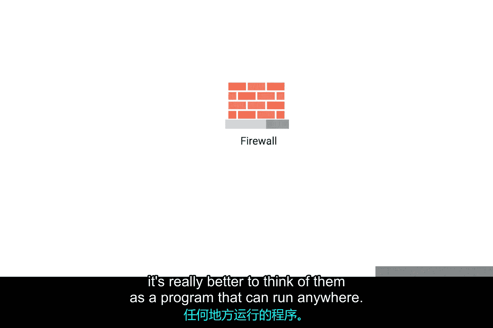

防火墙有时是独立的网络设备。但更好的理解方式是，将其视为一个可以在任何地方运行的程序。

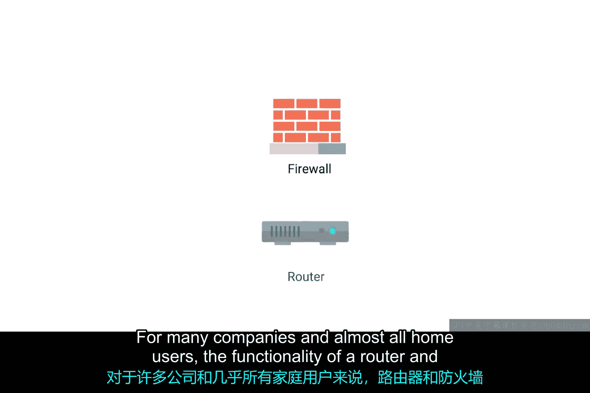

对于许多公司和几乎所有的家庭用户来说，路由器和防火墙的功能是由同一个设备完成的。

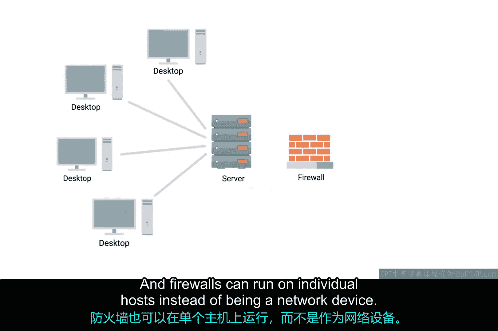

此外，防火墙也可以运行在单个主机上，而不仅仅是作为网络设备存在。所有主流的现代操作系统都内置了防火墙功能。

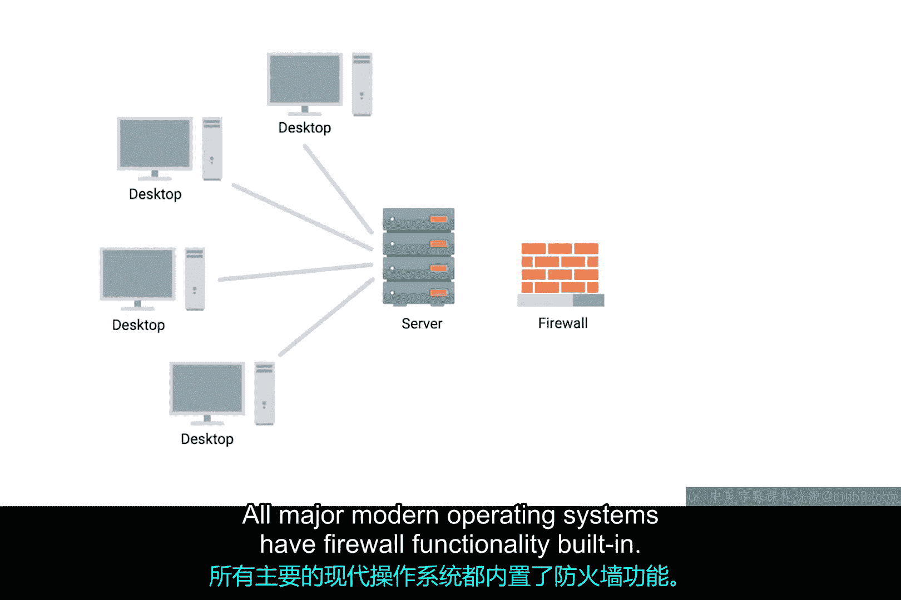

这样一来，在主机层面也可以执行对特定端口（从而对特定服务）的流量阻止或允许操作。

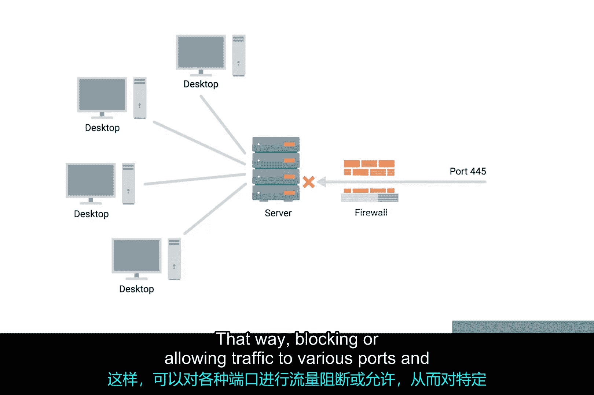

---

本节课中我们一起学习了防火墙。我们了解到防火墙是一种根据规则过滤流量的安全设备，它最常用于传输层，通过控制端口访问来保护网络。防火墙既可以是独立设备，也可以集成在路由器中，或是作为软件运行在单个主机操作系统上。它是构建网络安全防线的基础工具。