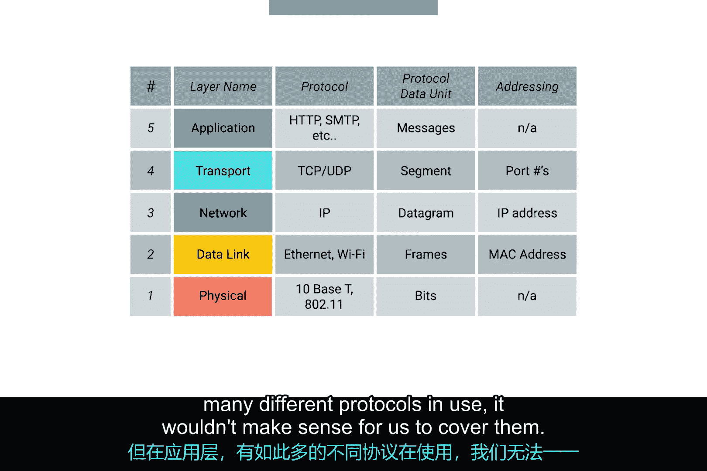

# 042：应用层详解 🖥️

在本节课中，我们将要学习计算机网络模型的最后一层——应用层。我们将了解应用程序如何利用之前各层建立的基础设施来发送和接收数据。

## 概述

在前面的课程中，我们已经学习了网络模型的多个层面。在物理层，我们了解了计算机如何处理电信号或光信号，以便通过线缆进行通信。在数据链路层，我们探讨了单个计算机如何使用以太网协议相互寻址和发送数据。在网络层，我们讨论了计算机和路由器如何使用IP协议在不同网络间通信。在上节课中，我们学习了传输层如何确保数据被正确的应用程序接收和发送。

现在，我们终于可以讨论实际的应用程序如何利用应用层来发送和接收数据。

## 应用层数据载荷

与其他所有层一样，TCP数据段包含一个通用的数据部分。正如你可能猜到的，这个**载荷（payload）** 部分实际上是应用程序想要相互发送的任何数据的全部内容。

以下是几种常见的数据载荷类型：
*   如果网络浏览器正在连接网络服务器，这可以是一个网页的内容。
*   如果你的PlayStation上的Netflix应用正在连接Netflix服务器，这可以是流媒体视频内容。
*   这可以是你的文字处理软件发送给打印机的文档内容，以及许多其他类型的数据。

## 应用层协议多样性

应用层使用的协议非常多，且种类繁多。相比之下，在其他层，主流协议相对集中。

以下是各层主要协议的对比：
*   在数据链路层，最常见的协议是以太网（Ethernet）。需要指出的是，无线技术在该层确实使用其他协议，我们将在未来的模块中介绍。
*   在网络层，IP协议无处不在。
*   在传输层，TCP和UDP覆盖了大多数用例。

但在应用层，有太多不同的协议在使用，我们无法一一涵盖。

## 协议标准化的重要性

尽管如此，关于应用层协议，你可以记住一个核心概念：**它们在不同类型的应用程序中仍然是标准化的**。

让我们以网络服务器和网络浏览器为例进行更深入的探讨。有很多不同的网络浏览器，你可能在使用Chrome、Internet Explorer、Safari等等。它们都需要使用相同的协议进行通信。对于网络服务器也是如此。在这种情况下，网络浏览器是**客户端（client）**，网络服务器是**服务器（server）**。

最流行的网络服务器有Microsoft IIS、Apache和Nginx，但它们也都需要遵循相同的协议。这样就能确保无论你使用哪种浏览器，仍然能够与任何服务器通信。对于网络流量，应用层协议被称为**HTTP（超文本传输协议）**。所有这些不同的网络浏览器和网络服务器都必须使用相同的HTTP协议规范进行通信，以确保互操作性。

对于大多数其他类别的应用程序也是如此。你可能有很多FTP客户端可供选择，但它们都需要以相同的方式使用**FTP（文件传输协议）** 协议。

## 总结

本节课中，我们一起学习了计算机网络模型的顶层——应用层。我们了解到，应用层承载着应用程序想要交换的实际数据（载荷），并且尽管存在大量不同的应用（如各种浏览器、服务器、客户端），但它们都通过遵循统一的标准协议（如HTTP、FTP）来实现互操作性。这确保了网络世界的多样性与连通性得以共存。