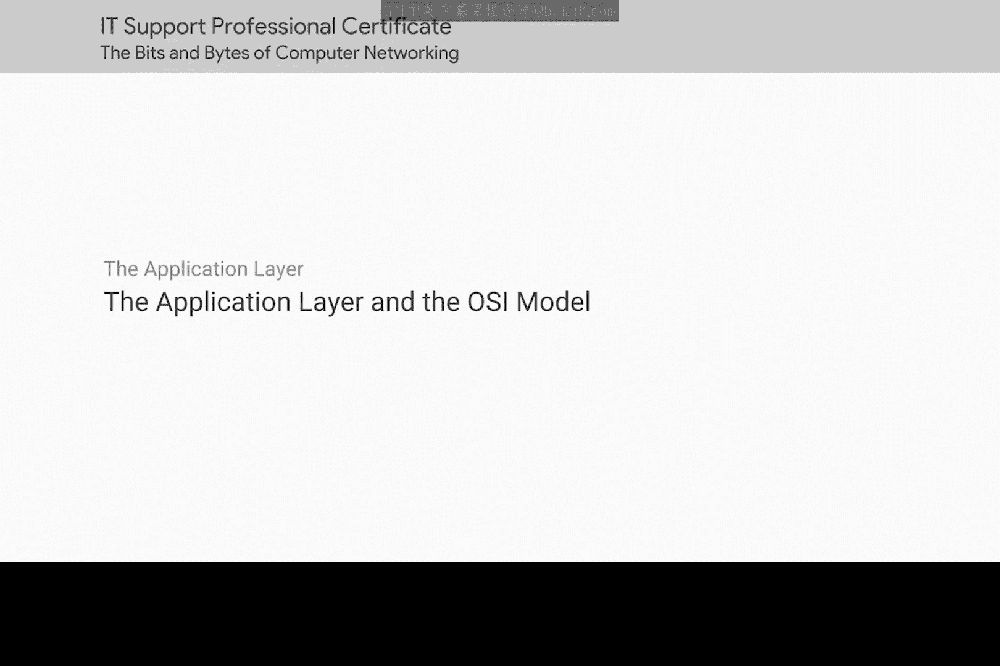
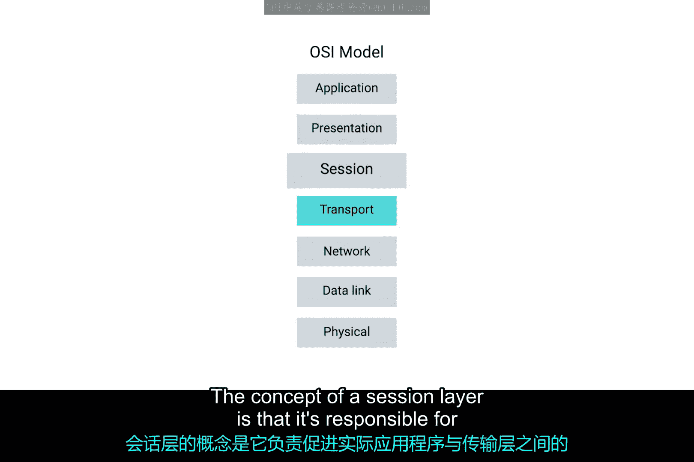
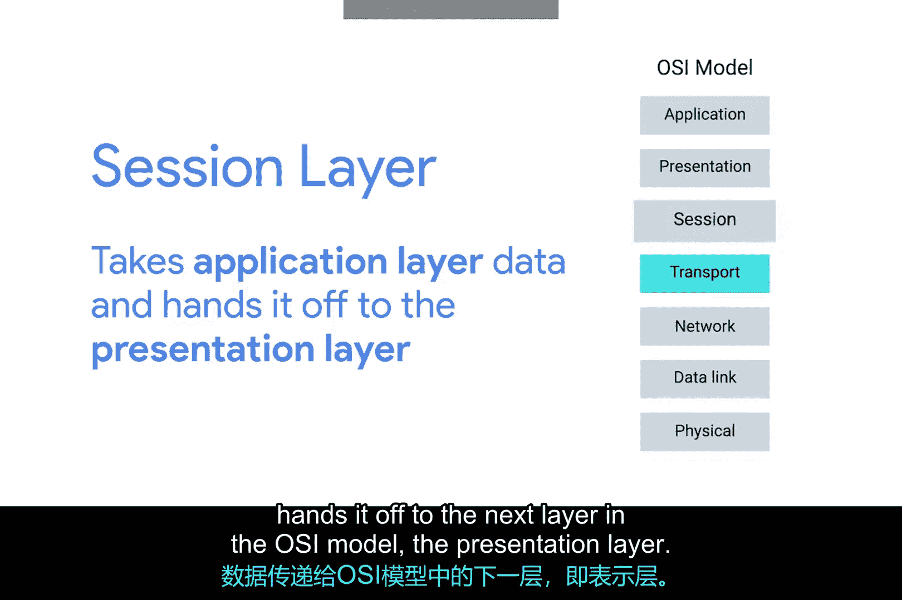
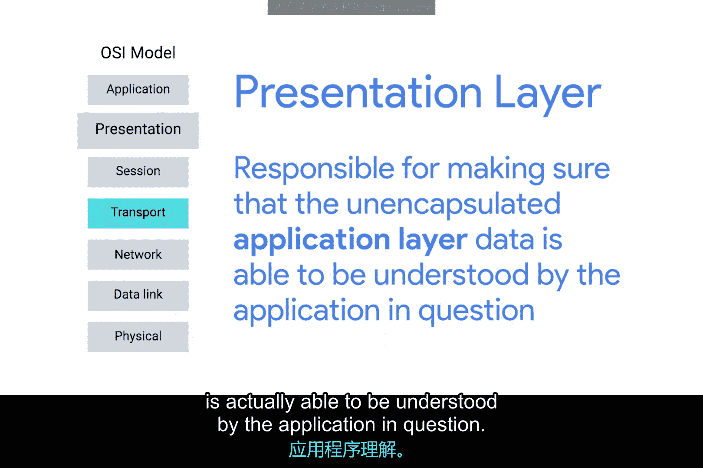
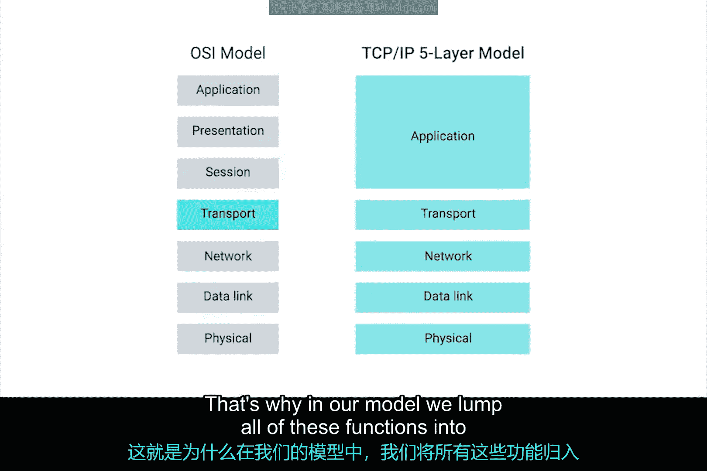
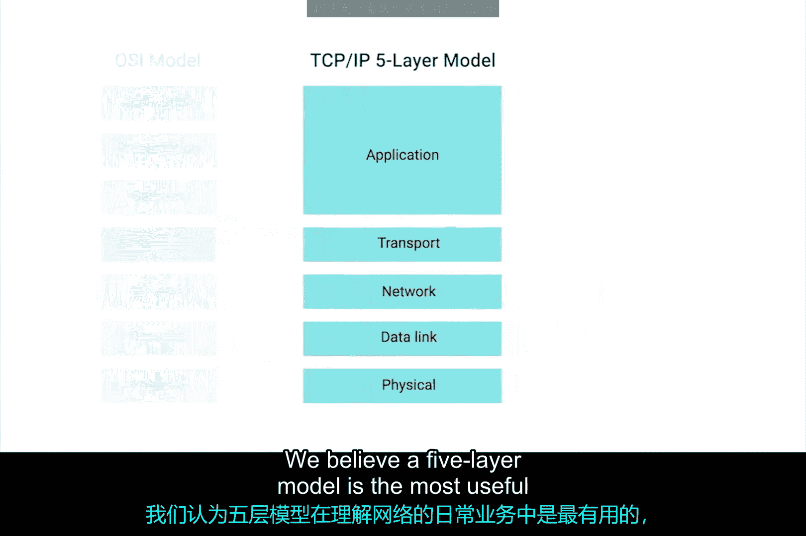
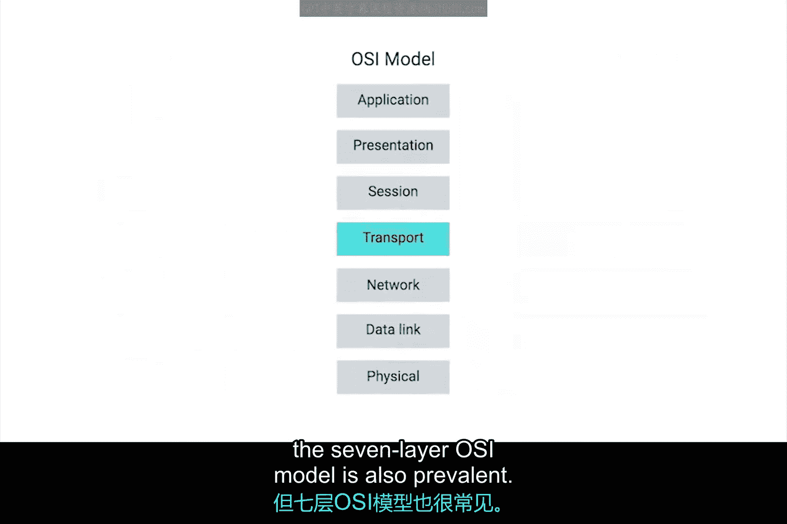

# 043：应用层与OSI模型 🧠

在本节课中，我们将要学习网络模型中的一个重要概念——OSI（开放系统互连）模型。我们将探讨它与我们一直使用的五层模型之间的关系，并理解为什么OSI模型在学术和认证领域如此重要。

## 网络模型的多样性

在开篇模块中，我们讨论了存在许多相互竞争的网络层模型。我们一直使用的是五层模型，但在你作为IT支持专家的职业生涯中，很可能会遇到各种其他模型。

以下是几种常见的模型变体：
*   有些模型可能将物理层和数据链路层合并为一层，只讨论四层。
*   但你可能还记得，我们在第一个模块的阅读材料中特别提到过一个特定的模型。

## 认识OSI七层模型 📊

这个模型就是OSI，即开放系统互连模型。理解这个模型对于掌握我们的五层模型至关重要，因为它是定义最严谨的模型。这意味着它经常被用于学术环境或各种网络认证机构。

OSI模型有七层，它在我们的传输层和应用层之间引入了两个额外的层。

## 会话层与表示层

上一节我们介绍了OSI模型的基本结构，本节中我们来看看新增的两个层具体负责什么。

**OSI模型的第五层是会话层。** 会话层的概念是，它负责促进实际应用程序和传输层之间的通信。它是操作系统的一部分，接收从下层解封装出来的应用层数据，并将其交给OSI模型中的下一层——表示层。

**表示层** 负责确保解封装后的应用层数据能够被目标应用程序真正理解。这是操作系统中处理数据加密或压缩的部分。

## 五层模型与七层模型的对比

虽然记住这些概念很重要，但你会注意到这里并没有发生任何新的封装过程。这就是为什么在我们的五层模型中，我们将所有这些功能都归入了应用层。

我们相信，对于理解网络日常运作而言，五层模型是最实用的。但七层OSI模型也同样普遍。

## 总结

本节课中我们一起学习了OSI七层模型及其与五层模型的区别。我们了解到OSI模型在会话层和表示层上做了更细致的划分，这有助于更精确地描述网络通信过程。掌握OSI模型的基础知识，是任何网络教育中不可或缺的一环。