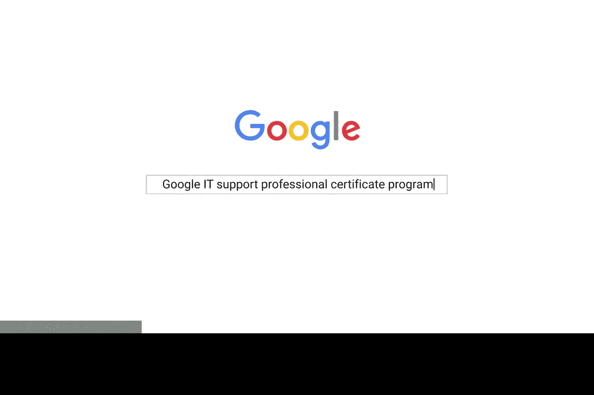

# 045：丹尼尔

## 概述
在本节中，我们将通过丹尼尔的故事，了解他如何在没有大学学位的情况下，通过在线课程成功转型进入IT支持领域。这个故事将展示自学、认证的价值以及职业发展的可能性。

## 故事内容

内布拉斯加州是一个美丽的州，它不仅风景优美，更代表了一种美好的心境。

我的未婚妻在内布拉斯加州的大岛市找到了她的第一份教学工作。我因此做出了从大学辍学并搬到大岛市的决定。

初到此地时，我发现没有大学学位很难找到工作。这个地区的许多人都会面临类似的困境。

最终，我在中央社区学院找到了一份夜间保安的工作。我感觉自己像是在进行一场艰苦的上坡战，仿佛无法在职业生涯中获得任何进展。

我一生都在与计算机打交道，这是我热爱的事情。

我的一位朋友当时正在参加一个IT培训项目，他建议我：“你应该搜索一下谷歌的IT支持专业课程。”

`搜索关键词：Google IT Support Professional Certificate`

看到这个课程后，我认为这是我可以做到的事情。

`行动：注册并开始学习谷歌IT支持专业课程`

我平均每周花费10到12小时学习，在五个月内完成了整个课程。完成课程的那一刻，我几乎热泪盈眶。

不久之后，我收到了一封关于中央社区学院IT团队职位空缺的电子邮件。当我们审阅丹尼尔的简历时，最引人注目的是他带来的谷歌认证资格。这确实使他在我们大多数其他候选人中脱颖而出。

我非常热爱我的新工作。我认为世界上最能证明自我价值的事情之一，就是意识到你帮助了别人。

令人难以置信的是，我可以说我正在做我热爱的事情，同时也有更多的时间与我爱的人在一起。

`结果：成功获得IT支持职位，实现工作与生活的平衡`

## 总结
本节课我们一起学习了丹尼尔的故事。他从没有学位的保安，通过在线学习获得谷歌IT支持认证，最终成功转型为IT支持专家。这个故事强调了持续学习、专业认证的重要性，以及它们如何为职业发展打开新的大门。