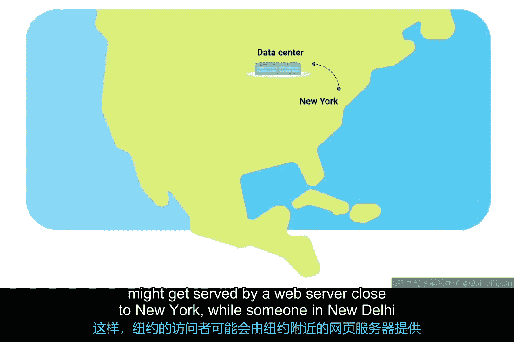
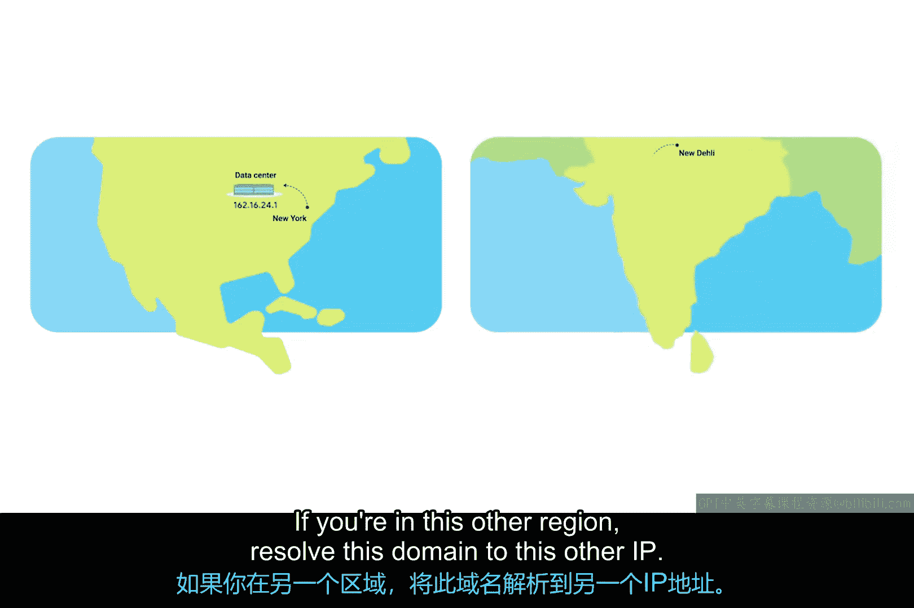

# 047：为何需要DNS 🌐

在本节课中，我们将要学习域名系统（DNS）的基本概念及其重要性。DNS是互联网的核心技术之一，它帮助我们将易于记忆的域名转换为计算机能够理解的IP地址。

## 计算机使用数字进行通信

在底层，所有计算机真正理解的只有**1**和**0**。对人类而言，阅读二进制数字并不容易，因此大多数二进制数字会以多种不同的形式表示。

在计算机网络领域尤其如此。请记住，一个IP地址本质上只是一个**32位二进制数**。但为了方便人类阅读，它通常被写成四个十进制数（即点分十进制形式）。

## 人类更擅长记忆文字

虽然记住`192.168.1.100`比记住一长串的1和0要容易，但当你需要记住不止几个地址时，这仍然不够好。想象一下，需要记住你访问的每个网站的IP地址四组数字，这通常不是人脑所擅长的。

人类更擅长记忆单词。这正是**域名系统（DNS）**发挥作用的地方。

## DNS：将域名解析为IP地址

DNS是一项全球性的、高度分布式的网络服务，它为你将字母组成的字符串解析成IP地址。

例如，你想查看一个天气预报网站。在浏览器中输入`www.weather.com`远比记住该网站的一个IP地址（例如`184.29.131.121`）要容易得多。

一个域名对应的IP地址可能因多种原因而随时改变。**域名**就是我们用来指代可以通过DNS解析的东西的术语。在我们刚才的例子中，`www.weather.com`就是域名，而它解析到的IP地址可能因各种因素而改变。

## DNS带来的灵活性

假设`weather.com`正在将他们的网络服务器迁移到一个新的数据中心。通过使用DNS，组织只需更改域名解析到的IP地址，最终用户甚至不会察觉。

因此，DNS不仅让人类更容易记住如何访问网站，还允许在后台进行管理变更，而无需最终用户改变他们的行为。试想一个你必须记住每个网站IP地址的世界，如果地址变了还得记住新的，那我们整天都在记忆数字了。

## DNS与全球网络性能

DNS对于当今互联网的运作至关重要，其重要性怎么强调都不为过。IP地址的解析结果可能因你所在的世界位置而异。

虽然大多数互联网通信以光速进行，但数据需要路由的距离越远，速度就会越慢。在几乎所有情况下，在地理位置相近的地点之间传输一定量的数据会更快。

如果你是一家全球性的网络公司，你会希望世界各地的人都能有良好的网站访问体验。因此，你不会将所有网络服务器放在一个地方，而是将它们分布在全球各地的数据中心。这样，在纽约访问网站的用户可能由靠近纽约的服务器提供服务，而在新德里的用户则由靠近新德里的服务器提供服务。

DNS再次帮助实现了这一功能。由于其全球性的结构，DNS允许组织根据用户所在区域进行决策：如果你在这个区域，就将域名解析到这个IP；如果你在另一个区域，就将域名解析到另一个IP。

## DNS的作用总结

DNS服务于多种目的，并且可能是IT支持专家需要理解的最重要的技术之一，以便有效地排查网络问题。

在本节课中，我们一起学习了DNS如何作为人类记忆与计算机数字世界之间的桥梁。我们了解到，DNS通过将易于记忆的域名（如`www.weather.com`）转换为IP地址（如`184.29.131.121`），极大地简化了网络访问。同时，DNS的分布式和灵活性特点，使得网站管理变更和全球负载均衡成为可能，而用户无需感知这些复杂的过程。理解DNS是解决许多网络连接问题的关键。