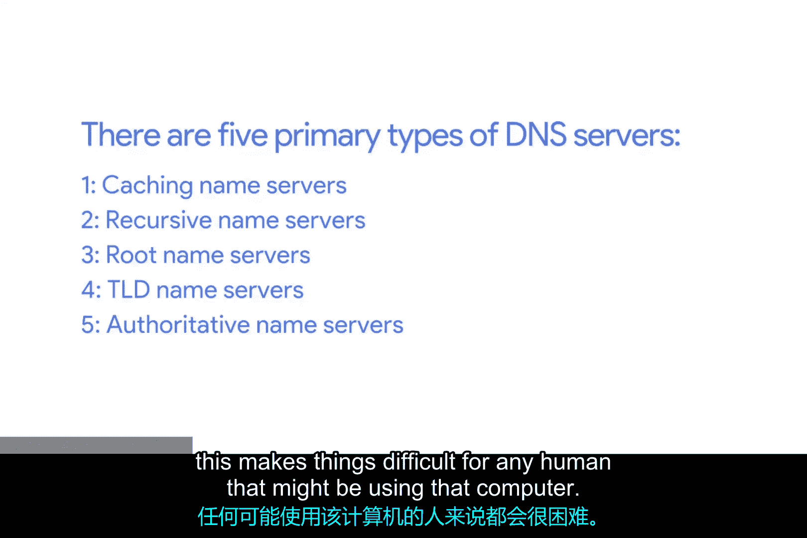
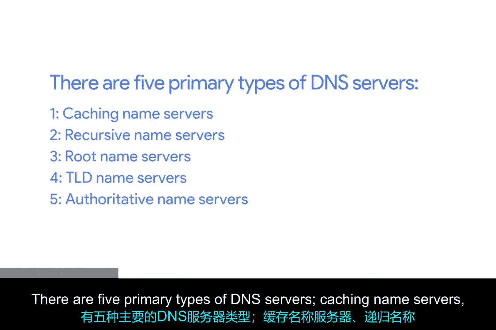
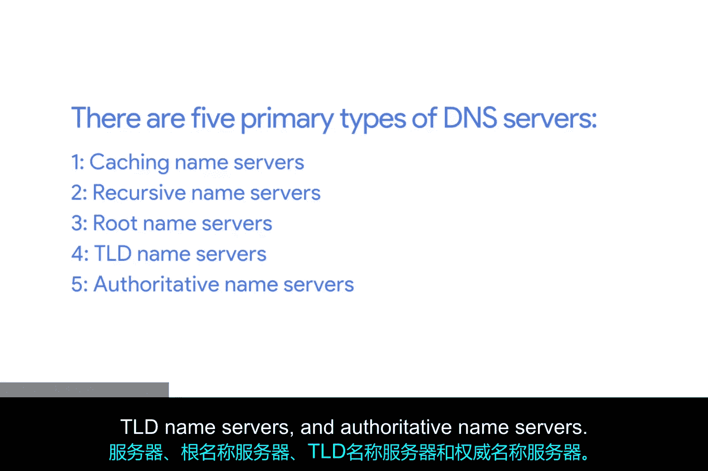
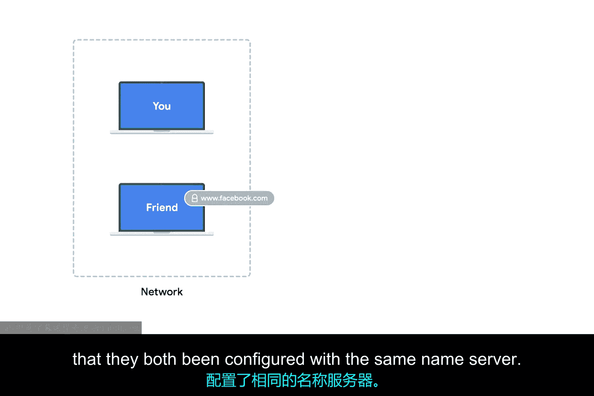
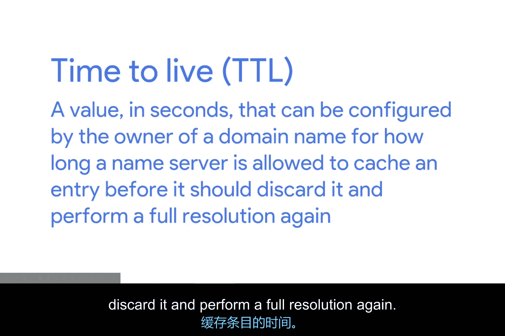
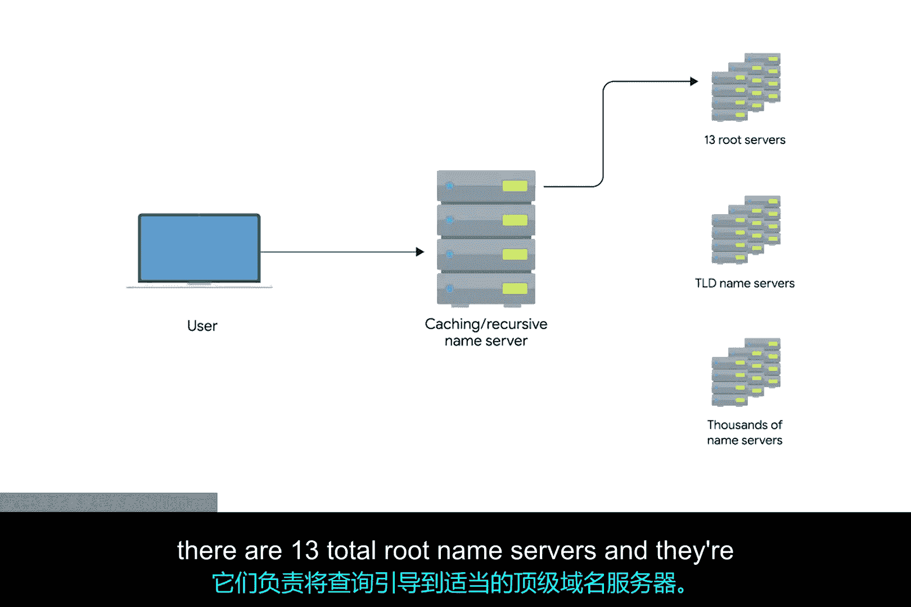
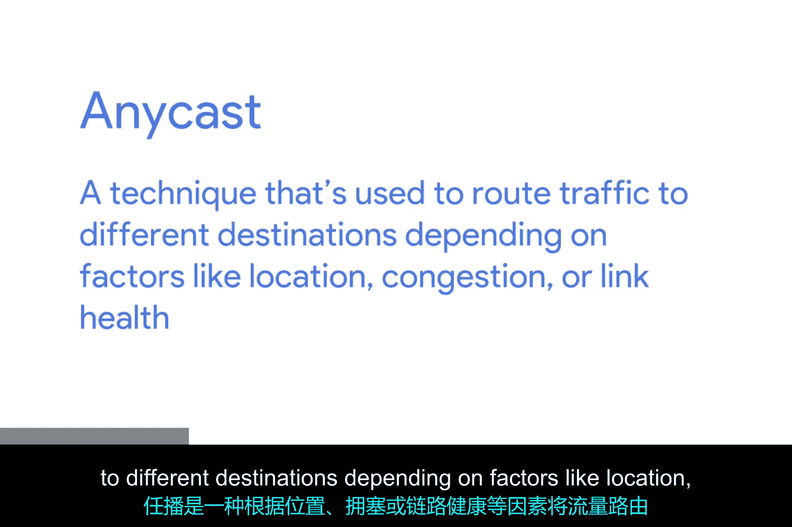
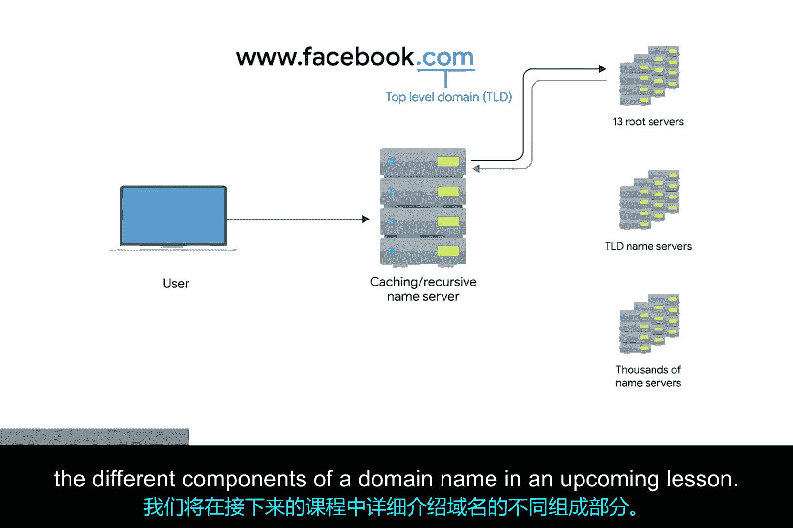
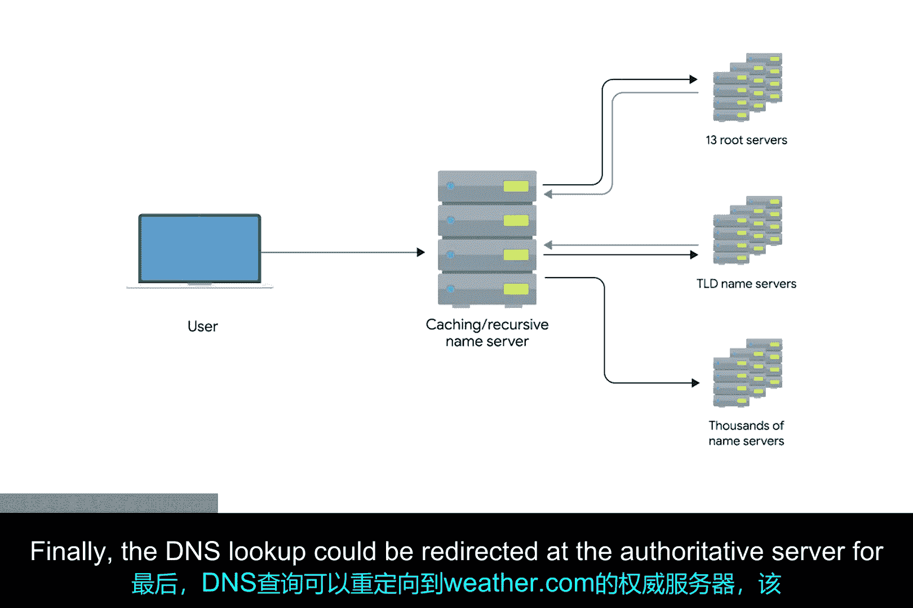
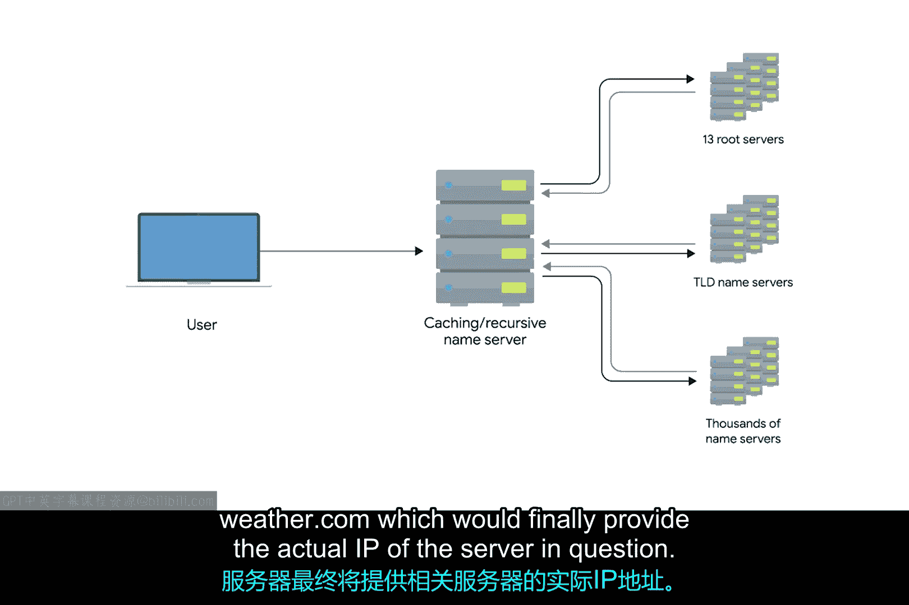

# 048：域名解析的多个步骤 🌐

在本节课中，我们将要学习域名系统（DNS）如何将人类可读的域名转换为计算机使用的IP地址。我们将详细解析DNS查询的完整过程，并了解其中涉及的各种服务器类型及其作用。

## DNS基础概念

DNS本质上是一个将域名转换为IP地址的系统。这是人类记忆和分类事物的方式与计算机处理事物的方式之间的桥梁。使用DNS将域名转换为IP地址的过程被称为**名称解析**。

## 网络节点的标准配置

上一节我们介绍了DNS的基本概念，本节中我们来看看计算机接入网络所需的配置。为了让计算机在现代网络中运行，必须配置若干项目。MAC地址是硬编码的，与特定硬件绑定。但除此之外，主机的**IP地址**、**子网掩码**和**网关**也必须专门配置。**DNS服务器**是现代标准网络配置的第四项，也是最后一项。这四项通常是主机按预期方式在网络中运行所必须配置的。

需要指出的是，即使没有配置DNS或DNS服务器，计算机也能正常运行。但正如上一课视频所述，这会给使用该计算机的人带来不便。

## DNS服务器的五种主要类型

以下是DNS系统中涉及的五种主要服务器类型：

*   **缓存名称服务器**
*   **递归名称服务器**
*   **根名称服务器**
*   **顶级域名（TLD）名称服务器**
*   **权威名称服务器**

需要强调的是，任何给定的DNS服务器都可以同时承担其中多个角色。

## 缓存与递归名称服务器

缓存和递归名称服务器通常由互联网服务提供商（ISP）或您的本地网络提供。它们的作用是在一定时间内存储域名查询结果。

为了防止每次建立新的TCP连接时都执行完整的域名解析，您的ISP或本地网络通常会提供缓存名称服务器。大多数缓存名称服务器同时也是递归名称服务器。递归名称服务器负责执行完整的DNS解析请求。

在大多数情况下，您的本地名称服务器会同时承担这两种职责。但名称服务器也有可能只负责缓存或只负责递归查询。

## 解析过程示例

让我们通过一个例子来更好地解释其工作原理。假设您和您的朋友连接到同一个网络，并且都想访问 `www.facebook.com`。

您的朋友在浏览器中输入 `www.facebook.com`，这意味着他的计算机需要知道 `www.facebook.com` 的IP地址才能建立连接。由于你们的计算机在同一网络，它们通常配置了相同的名称服务器。

因此，您朋友的计算机向名称服务器询问 `www.facebook.com` 的IP地址，而名称服务器此时并不知道。于是，该名称服务器执行一次完整的递归解析来查找 `www.facebook.com` 的正确IP地址。这个过程涉及多个步骤，我们稍后会详细说明。

解析出的IP地址随后被发送给您朋友的计算机，并**本地缓存在名称服务器中**。

几分钟后，您也在浏览器中输入 `www.facebook.com`。同样，您的计算机需要知道该域名的IP地址。于是您的计算机询问它配置的本地名称服务器（与您朋友的计算机刚才询问的是同一个）。

由于域名 `www.facebook.com` 刚刚被查询过，本地名称服务器仍然缓存着解析出的IP地址，因此无需执行完整查询就能将该IP地址返回给您的计算机。**这就是同一服务器如何充当缓存服务器的过程**。

## 生存时间（TTL）

全球DNS系统中的所有域名都有一个**TTL（生存时间）**。这是一个以秒为单位的值，可由域名所有者配置，用于规定名称服务器在丢弃缓存条目并再次执行完整解析之前，允许缓存该条目的时间长度。

几年前，这些TTL值通常非常长，有时长达一整天或更久。这是因为当时互联网的总体可用带宽要少得多，网络管理员不希望因频繁执行完整的DNS查询而浪费宝贵的带宽。

随着互联网的发展和提速，大多数域名的TTL已缩短到几分钟到几小时不等。但需要注意的是，有时您仍会遇到TTL非常长的域名。这意味着DNS记录的更改可能需要长达整个TTL的时间才能被整个互联网知晓。

## 完整的递归解析过程

现在，让我们看看当您的本地递归服务器需要执行完整的递归解析时会发生什么。

第一步总是联系**根名称服务器**。全球共有13个根名称服务器，它们负责将查询引导至相应的TLD名称服务器。过去，这13个根服务器分布在特定的地理区域，但如今，它们主要通过**任播**技术在全球范围内分布。

**任播**是一种根据位置、拥塞或链路健康状况等因素，将流量路由到不同目的地的技术。使用任播时，计算机可以向特定IP发送数据报，但根据某些因素，该数据报可能被路由到多个不同实际目的地中的一个。这也说明，实际上早已不止13台物理根名称服务器，更好的理解是，它们是13个提供根名称查询服务的权威机构。

根服务器会用一个应被查询的**TLD名称服务器**的地址来响应DNS查询。TLD代表**顶级域名**，是分层DNS名称解析系统的顶层。TLD是任何域名的最后一部分。再次以 `www.facebook.com` 为例，`.com` 部分应被视为TLD。我们将在后续课程中更详细地介绍域名的不同组成部分。

对于每个存在的TLD，都有一个TLD名称服务器。但就像根服务器一样，这并不意味着每个TLD只有一台物理服务器。它很可能是负责每个TLD的、可通过任播访问的全球分布式服务器集群。

TLD名称服务器会再次以重定向响应，这次是告知执行名称查询的计算机应联系哪个**权威名称服务器**。

权威名称服务器负责域名的最后两部分，这是单个组织可能负责DNS查询的解析级别。以 `www.weather.com` 为例，TLD名称服务器会将查询指向 `weather.com` 的权威服务器，该服务器很可能由运营该网站的组织——天气频道本身控制。

最终，DNS查询被重定向到 `weather.com` 的权威服务器，该服务器最终会提供目标服务器的实际IP地址。

## 分层系统的重要性

这种严格的分层结构对互联网的稳定性至关重要。确保所有完整的DNS解析都经过严格监管和控制的一系列查询步骤以获得正确响应，是防止恶意方重定向流量的最佳方法。您的计算机会盲目地将流量发送到被告知的任何IP地址，因此，通过使用像DNS这样由受信任实体控制的分层系统，我们可以更好地确保DNS查询响应的准确性。

现在您已经了解了其中涉及的众多步骤，应该就能理解我们为何信任本地名称服务器来缓存DNS查询了。这是为了避免为每个TCP连接都执行完整的查询路径。事实上，从手机到台式机，您的本地计算机通常也有自己的临时DNS缓存，这样它甚至无需为每个TCP连接都去打扰其本地名称服务器。

## 总结

本节课中我们一起学习了域名系统（DNS）的核心工作原理。我们了解到，DNS通过一个包含缓存、递归、根、TLD和权威服务器的分层系统，将域名转换为IP地址。本地缓存和TTL机制极大地提高了查询效率，而严格的分层结构则保障了互联网的稳定与安全。理解这些步骤是掌握网络基础支持的关键。