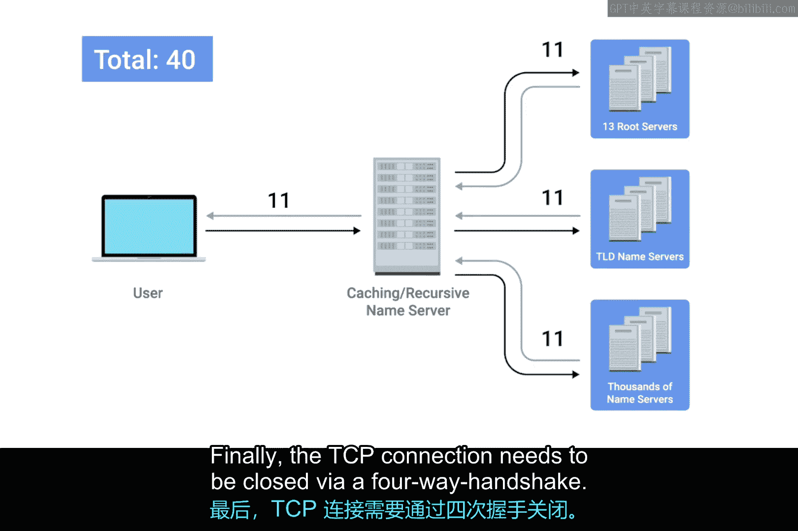
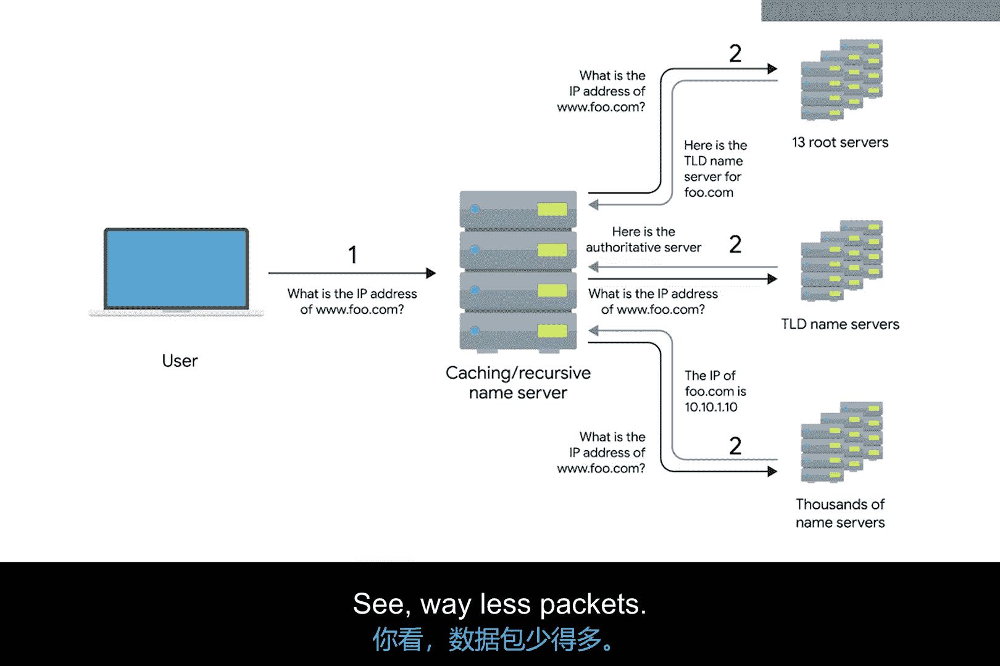

# 049：DNS与UDP 🖥️🔍

在本节课中，我们将要学习域名系统（DNS）为何以及如何主要使用用户数据报协议（UDP）作为其传输层协议，而不是传输控制协议（TCP）。我们将通过对比两种协议在DNS查询过程中的数据包数量，来理解UDP在特定场景下的优势。

## 概述

DNS是应用层服务的一个典型例子，它使用UDP而非TCP作为传输层协议。这主要基于几个简单的原因。上一节我们介绍了TCP和UDP的基本区别，本节中我们来看看这些区别如何影响DNS的工作方式。

## UDP与TCP的核心区别

TCP和UDP之间最大的区别在于，UDP是**无连接**的。这意味着通信前无需建立连接，通信后也无需断开连接。

**公式表示：**
`UDP = 无连接`
`TCP = 面向连接（三次握手 + 四次挥手）`

因此，总体需要传输的流量要少得多。一个单一的DNS请求及其响应通常可以放入一个UDP数据报中，这使其成为无连接协议的理想选择。

## 为何DNS使用UDP？

DNS可能会产生大量流量。虽然DNS条目会缓存在本地机器和缓存名称服务器上，但如果需要处理完整的域名解析过程，涉及的流量就会显著增加。

为了直观理解，让我们看看如果通过TCP进行完整的DNS查找会是怎样的情景。

以下是使用TCP进行完整递归DNS查询所需的步骤和数据包数量：

1.  **建立连接**：请求主机向本地名称服务器（端口53）发送SYN包，服务器回复SYN-ACK，主机再回复ACK完成三次握手。**（3个包）**
2.  **发送请求**：主机发送实际的DNS查询请求：“我需要 `foo.com` 的IP地址”。**（1个包）**
3.  **确认请求**：名称服务器回复ACK确认收到请求。**（1个包，累计5个）**
4.  **查询根服务器**：本地缓存服务器没有记录，需向根服务器查询 `.com` 顶级域的负责服务器。这需要新一轮的三次握手、请求、确认、响应和确认。**（11个包，累计16个）**
5.  **查询TLD服务器**：递归名称服务器重复上述过程，向 `.com` TLD服务器查询权威名称服务器。**（11个包，累计27个）**
6.  **查询权威服务器**：递归名称服务器再次重复过程，向权威名称服务器查询 `foo.com` 的实际IP地址。**（11个包，累计38个）**
7.  **返回结果**：本地名称服务器将IP地址返回给最初的主机，主机发送ACK确认。**（2个包，累计40个）**
8.  **关闭连接**：通过四次挥手关闭TCP连接。**（4个包，累计44个）**

最终，通过TCP完成一次完整的递归DNS请求至少需要 **44个数据包**。

## 使用UDP的DNS查询过程

现在，让我们看看使用UDP进行同样的查询会是怎样的情况。预告一下：所需的数据包少得多。

以下是使用UDP进行DNS查询的步骤：

1.  原始计算机向其本地名称服务器（端口53）发送一个UDP数据包，请求 `foo.com` 的IP地址。**（1个包）**
2.  本地名称服务器作为递归服务器，向根服务器发送一个UDP数据包。
3.  根服务器回复一个包含正确TLD名称服务器的响应。**（累计3个包）**
4.  递归名称服务器向TLD服务器发送一个数据包。
5.  TLD服务器回复一个包含正确权威名称服务器的响应。**（累计5个包）**
6.  递归名称服务器向权威名称服务器发送最终请求。
7.  权威名称服务器回复一个包含 `foo.com` IP地址的响应。**（累计7个包）**
8.  最后，本地名称服务器将 `foo.com` 的IP地址回复给最初发出请求的DNS解析器。**（累计8个包）**

最终，通过UDP完成同样的查询仅需要 **8个数据包**，数量远少于TCP。

## 错误恢复机制

你可能会想，UDP本身没有错误恢复机制，这该如何处理？答案很简单：如果DNS解析器没有收到响应，它就直接**再次询问**。

基本上，TCP在传输层提供的功能，由DNS在应用层以最简单的方式实现了。DNS服务器只需要关心响应传入的查询，而DNS解析器只需要执行查询，并在失败时重复操作。这充分展示了DNS和UDP的简洁性。

## 例外情况：DNS over TCP

需要指出的是，**DNS over TCP** 确实存在，并且也在广泛使用。

随着网络变得越来越复杂，并非所有DNS查询响应都能放入单个UDP数据报中。在这种情况下，DNS名称服务器会回复一个数据包，说明响应太大。然后，DNS客户端将建立TCP连接来执行查询。

## 总结

本节课中我们一起学习了DNS主要使用UDP协议的原因。通过对比可以看到，TCP的连接管理（握手和挥手）带来了巨大的开销，而对于DNS这样简单、频繁的查询-响应服务，这种开销是不必要的。UDP的无连接特性使其成为DNS的理想选择，极大地减少了完成查询所需的数据包数量，提升了效率。同时，我们也了解到在响应数据过大等特殊情况下，DNS也会使用TCP作为后备方案。这完美地解释了为什么在拥有TCP这样可靠的协议之外，我们还需要UDP这样的协议。