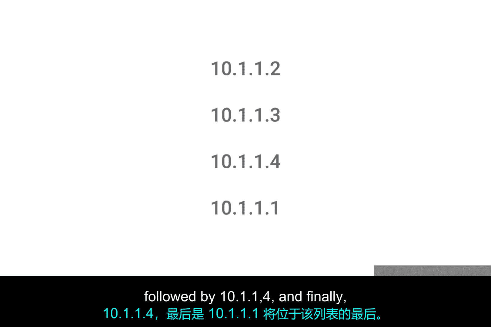

# 051：DNS资源记录类型详解 🧩

在本节课中，我们将要学习DNS（域名系统）中几种核心的资源记录类型。DNS是IT支持专家排查网络问题时必须掌握的关键技术之一。理解不同的资源记录类型，有助于我们了解域名如何解析到IP地址、如何实现负载均衡以及如何为特定服务（如邮件）进行定向。

上一节我们介绍了DNS的基本工作原理，本节中我们来看看DNS在实际操作中依赖的各种资源记录类型。

## 核心资源记录类型

DNS通过一系列已定义的资源记录类型来运作，这些类型允许进行不同种类的DNS解析。虽然存在数十种不同的记录类型，但许多仅用于非常特殊的目的。以下我们将介绍最基础的几种。

### A记录

最常见的资源记录称为**A记录**。A记录用于将某个域名指向一个特定的IPv4 IP地址。

在之前对DNS的讨论中，我们假设DNS解析器请求的是域名的A记录。在最基本的用法中，一个域名可以配置一个A记录。但一个域名也可以拥有多个A记录。

这允许使用一种称为**DNS轮询**的技术，以便在多个IP地址之间平衡流量。轮询是一种按顺序逐个遍历列表中项目的概念，目的是确保列表中被选中的每个条目获得大致相等的平衡。

以下是DNS轮询的工作流程示例：

1.  假设我们负责域名 `www.microsoft.com`。为了在多个服务器间平衡流量，我们可以在权威名称服务器上为该域名配置4个A记录，对应IP地址：`10.1.1.1`、`10.1.1.2`、`10.1.1.3` 和 `10.1.1.4`。
2.  当DNS解析器首次查找 `www.microsoft.com` 时，它会按配置顺序收到全部四个IP地址：首先是 `10.1.1.1`，然后是 `10.1.1.2`，接着是 `10.1.1.3`，最后是 `10.1.1.4`。解析计算机会尝试使用第一个条目 `10.1.1.1`，但也知道其他三个地址，以防连接失败。
3.  下一台计算机执行相同的DNS查找时，同样会收到全部四个IP地址，但顺序会发生变化：第一个条目变为 `10.1.1.2`，然后是 `10.1.1.3`、`10.1.1.4`，最后是 `10.1.1.1`。
4.  这种模式会在每次DNS解析尝试中持续，循环遍历所有已配置的A记录，从而在这些IP地址之间平衡流量。

这就是DNS轮询逻辑的基本工作原理。

### AAAA记录

另一种越来越流行的资源记录类型是**AAAA记录**（四A记录）。AAAA记录与A记录非常相似，区别在于它返回的是IPv6地址，而不是IPv4地址。我们将在未来的模块中详细介绍IPv6。

### CNAME记录

**CNAME记录**也非常常见。CNAME记录用于将流量从一个域名重定向到另一个域名。

例如，假设微软的Web服务器运行在 `www.microsoft.com`。他们希望确保用户直接在浏览器中输入 `microsoft.com` 也能被正确重定向。通过为 `microsoft.com` 配置一个解析到 `www.microsoft.com` 的CNAME记录，解析客户端就会知道需要再次尝试解析 `www.microsoft.com`，然后使用第二次解析返回的IP地址。

CNAME记录非常有用，因为它确保你只需在一个地方更改服务器的规范IP地址。实际上，CNAME就是“规范名称”的缩写。

对比两种实现方式：
*   **方式一（使用A记录）**：为 `microsoft.com` 和 `www.microsoft.com` 分别设置相同的A记录。这可以工作，但如果底层IP地址发生变化，就需要在两个地方（两个域名的A记录）进行修改。
*   **方式二（使用CNAME记录）**：设置一个CNAME记录，将 `microsoft.com` 指向 `www.microsoft.com`。这样，你只需更改 `www.microsoft.com` 的A记录，就能确保指向这两个域名的客户端都能获得新的IP地址。

对于只有两条记录的情况，这可能看起来区别不大，但对于在网络上拥有复杂存在的大型公司，可能会有数十个此类重定向。始终只有一个“真相来源”会更容易管理。

### MX记录

另一个重要的资源记录类型是**MX记录**。MX代表“邮件交换”，该记录用于将电子邮件传递到正确的服务器。

许多公司在不同的机器上运行其Web服务器和邮件服务器，这些机器拥有不同的IP地址。因此，MX记录可以轻松确保电子邮件被递送到公司的邮件服务器，而其他流量（如Web流量）则被递送到其Web服务器。

### SRV记录

与MX记录非常相似的一种记录类型是**SRV记录**。SRV代表“服务记录”，用于定义各种特定服务的位置。

它的用途与MX资源记录类型完全相同，但有一个区别：MX记录仅用于邮件服务，而SRV记录可以定义为返回许多不同服务类型的详细信息。例如，SRV记录通常用于返回像CalDAV（日历和日程安排服务）这类服务的记录。

### TXT记录

**TXT记录**类型很有趣。TXT代表“文本”，最初设计仅用于将一些描述性文本与域名关联，供人类阅读。其想法是，你可以留下便条或消息，让人们发现和阅读，以了解更多关于你网络的任意细节。

但随着互联网及其上运行的服务变得越来越复杂，TXT记录越来越多地用于传递供其他计算机处理的额外数据。由于TXT记录有一个完全自由格式的字段，聪明的工程师已经找到了利用它来传递DNS等系统原本未打算传递的数据的方法。这非常巧妙，对吧？

TXT记录通常用于向你委托其他组织处理的域名服务传达配置偏好。例如，TXT记录通常用于向“电子邮件即服务”提供商（即为你处理电子邮件递送的公司）传递额外信息。

## 其他记录类型

还有许多其他常用的DNS资源记录类型，例如**NS记录**或**SOA记录**，它们用于定义关于DNS区域的权威信息。我们将在未来的视频中更详细地介绍DNS区域，敬请关注。

本节课中我们一起学习了DNS的核心资源记录类型，包括用于IPv4地址解析的A记录、用于IPv6的AAAA记录、用于域名重定向的CNAME记录、用于邮件路由的MX记录、用于定义通用服务位置的SRV记录，以及用途灵活的TXT记录。理解这些记录类型是掌握DNS管理和网络故障排除的基础。