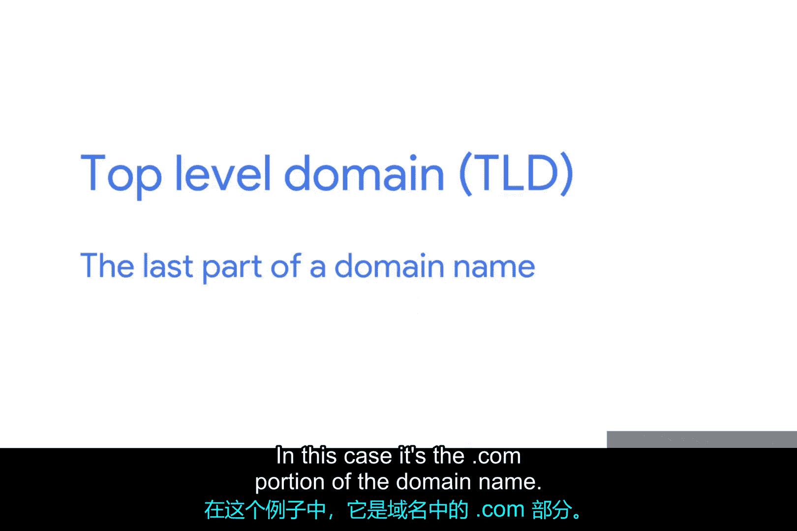
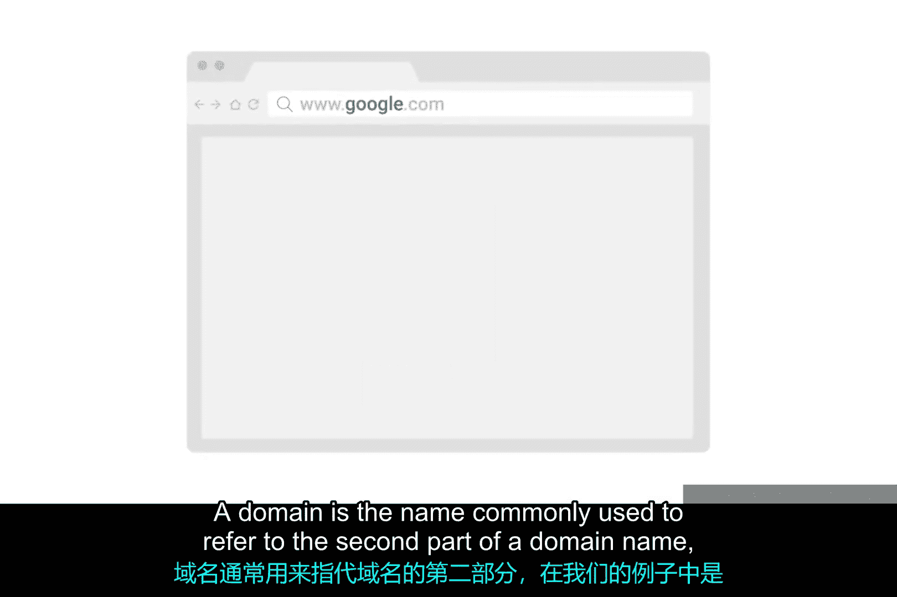
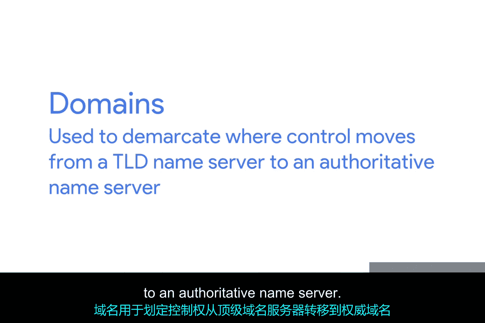
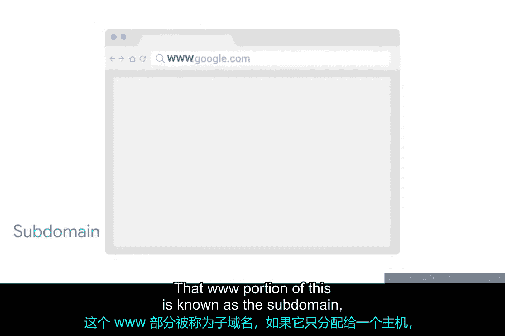
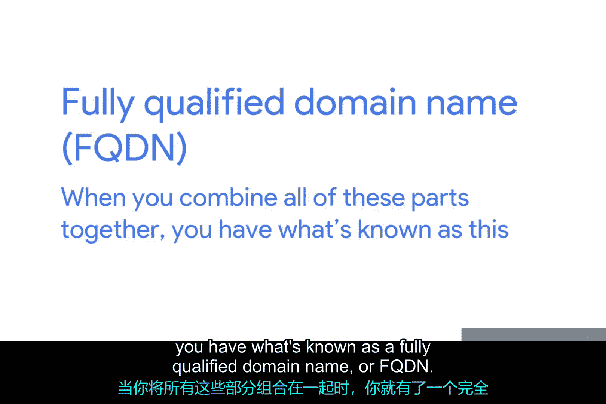
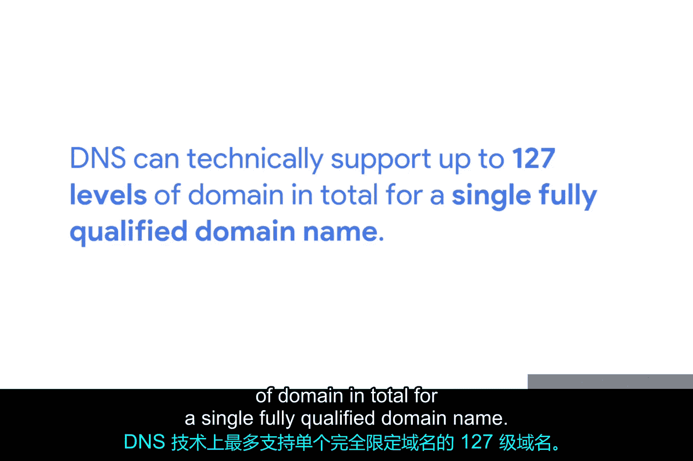

# 052：域名的结构 🌐

在本节课中，我们将要学习域名系统（DNS）中域名的基本结构。域名是互联网上定位网站的关键，理解其组成部分对于IT支持工作至关重要。我们将详细拆解一个域名的三个主要部分，并解释它们各自的作用。

---

任何给定的域名都包含三个主要部分，每个部分都服务于特定的目的。

我们以域名 `www.google.com` 为例。这三个部分很容易识别，因为它们之间都用句点分隔。它们分别是 `www`、`google` 和 `com`。

## 顶级域名（TLD）🏷️

上一节我们介绍了域名的整体结构，本节中我们来看看域名的最后一部分。

域名的最后一部分被称为**顶级域名**或**TLD**。在我们的例子中，它就是域名中的 `.com` 部分。

可用的顶级域名数量是有限制的，尽管近年来这个数量增长了很多。

以下是常见的顶级域名类型：
*   **通用顶级域名**：你可能已经很熟悉了，例如 `.com`、`.net`、`.edu` 等。
*   **国家和地区顶级域名**：你可能也见过一些特定国家或地区的顶级域名，例如代表德国的 `.de` 或代表中国的 `.cn`。

由于互联网的发展，许多最初定义的顶级域名已经变得非常拥挤。因此，如今出现了许多个性化的顶级域名，从 `.museum` 到 `.pizza` 应有尽有。

顶级域名的管理和定义由一个名为 **ICANN** 的非营利组织负责，全称是互联网名称与数字地址分配机构。ICANN 是 IANA 的姊妹组织，它们共同帮助定义和控制全球 IP 地址空间以及全球 DNS 系统。

## 二级域名（域名）🔑

了解了顶级域名后，我们接下来看看域名的核心部分。

**域名**通常用来指代域名的第二部分，在我们的例子中就是 `google`。域名用于划分控制权从 TLD 名称服务器转移到权威名称服务器的界限。这通常由 ICANN 之外的独立组织或个人控制。

以下是关于二级域名的关键点：
*   任何个人或公司都可以注册和选择域名。
*   但它们都必须以预定义的某个顶级域名结尾。

## 子域名（主机名）🏠

最后，我们来探讨域名的第三部分。

`www` 这部分被称为**子域名**。如果它被分配给单一的主机，有时也被称为**主机名**。

当你把所有部分组合在一起时，就得到了所谓的**完全限定域名**或 **FQDN**。虽然向注册商正式注册域名需要付费，但任何控制着这样一个已注册域名的人都可以自由选择和分配子域名。

**注册商**只是一家与 ICANN 有协议、可以销售未注册域名的公司。我们将在未来的模块中更多地讨论如何处理注册商。

从技术上讲，你可以拥有很多子域名。例如，`host.sub.sub.subdomain.domain.com` 可能是完全有效的，尽管你很少看到有这么多层级的完全限定域名。DNS 在技术上最多支持一个完全限定域名有 **127** 个层级。

## 域名规范限制 ⚠️

除了层级限制，域名在指定方式上还有其他一些限制。

以下是主要的规范限制：
*   每个独立的部分（如 `www`、`google`）长度不能超过 **63** 个字符。
*   一个完整的 FQDN 总长度被限制在 **255** 个字符以内。

---

本节课中我们一起学习了域名的完整结构。我们了解到一个完全限定域名由**顶级域名**、**二级域名**和**子域名**三部分组成，并认识了管理它们的组织 ICANN 以及相关的长度与层级限制。理解这些是掌握 DNS 工作原理和进行网络故障排查的基础。