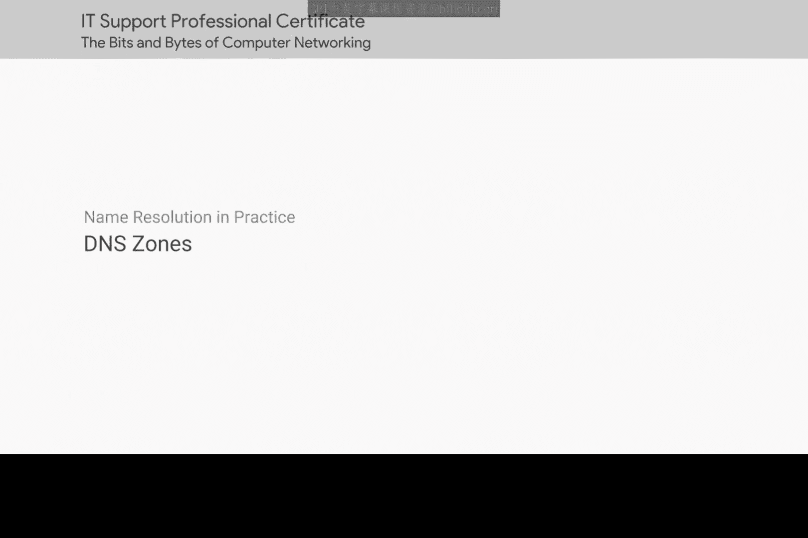
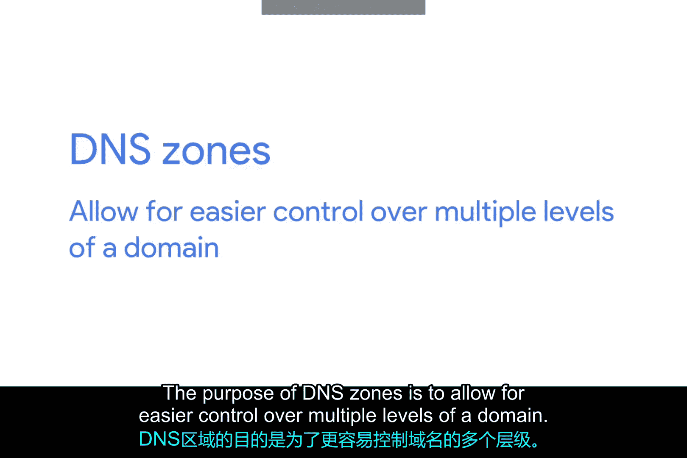
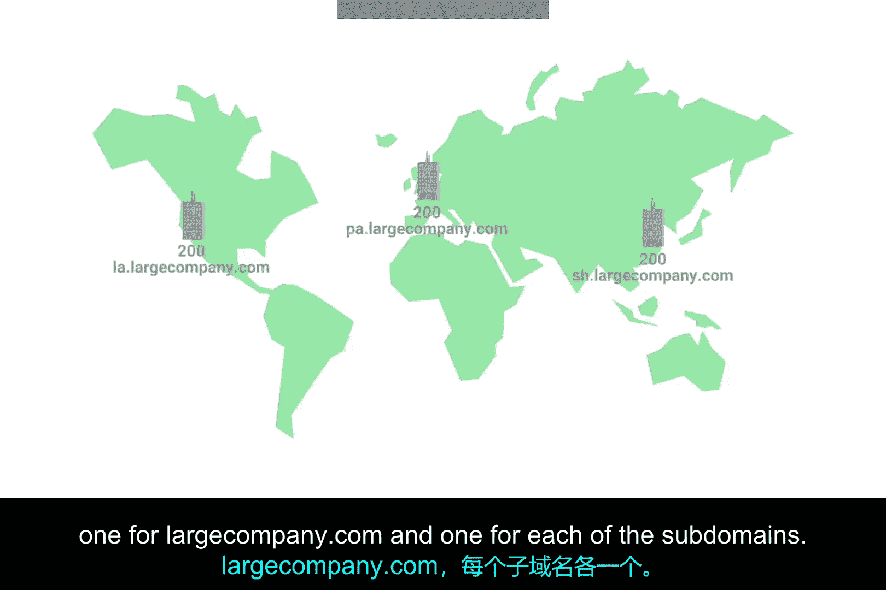
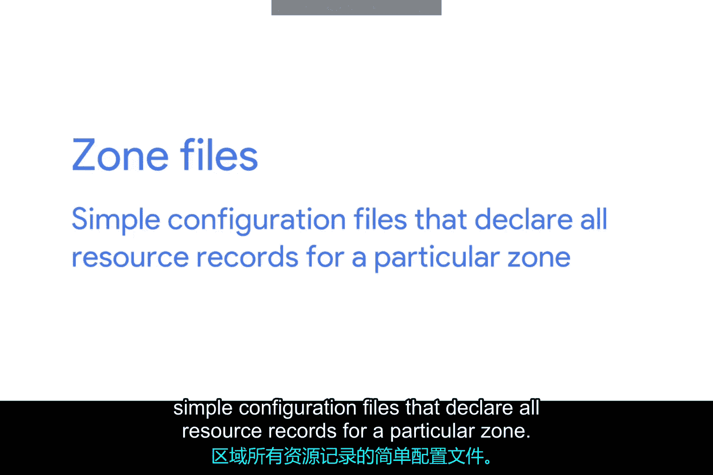
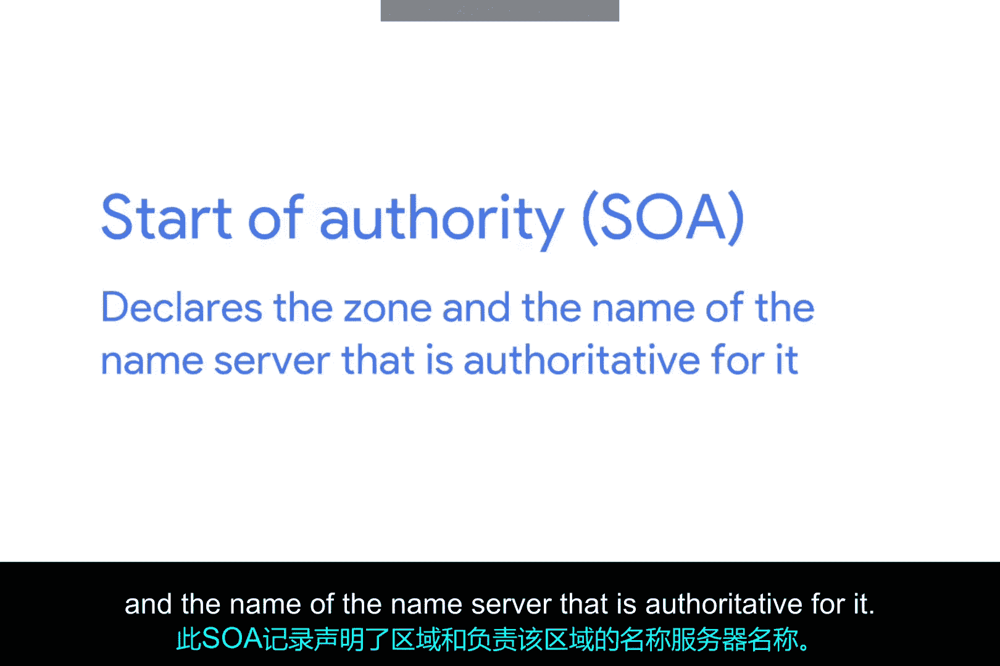
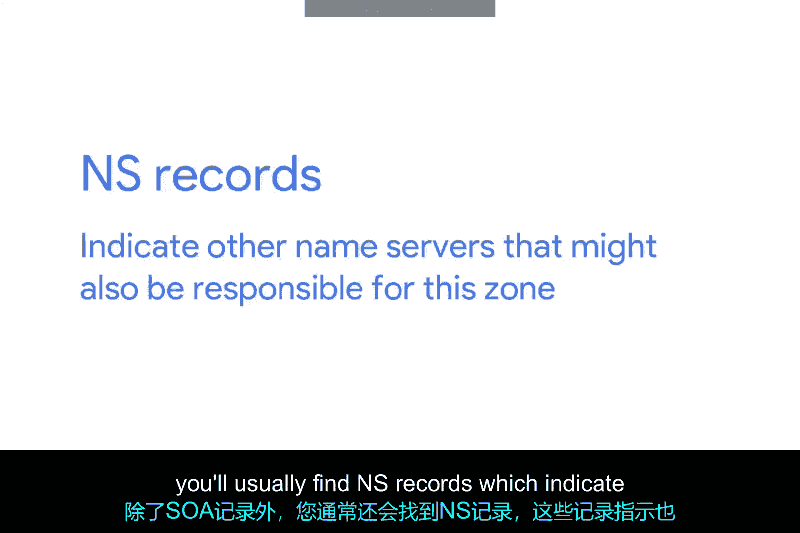

# 053：DNS区域 🌐

在本节课中，我们将要学习DNS区域的概念。DNS区域是DNS层次结构中的一个重要部分，它允许网络管理员更轻松地管理域名下的多个层级和资源记录。我们将探讨DNS区域的定义、作用、配置方式以及相关的资源记录类型。

---

上一节我们介绍了权威名称服务器负责响应特定域名的解析请求。本节中我们来看看DNS区域的具体概念和作用。

权威名称服务器不仅负责响应域名解析请求，还负责管理一个特定的DNS区域。DNS区域是一个层次化的概念。我们之前介绍的根名称服务器负责根区域。每个顶级域名服务器负责其特定TLD的区域。而我们所说的权威名称服务器则负责其下更细粒度的区域。根名称服务器和TLD名称服务器实际上也是权威名称服务器，只是它们负责的区域是特殊情况。

需要指出的是，区域之间不重叠。例如，负责 `.co` 顶级域名的TLD名称服务器的管理权限并不涵盖 `google.com` 域名。相反，其权限止于负责 `google.com` 的权威服务器。

DNS区域的目的是允许更轻松地控制域名的多个层级。

---

随着单个域中资源记录数量的增加，管理所有记录会变得更加麻烦。网络管理员可以通过将其配置拆分为多个区域来缓解这个问题。

让我们想象一家拥有 `largecompany.com` 域名的大型公司。这家公司在洛杉矶、巴黎和上海设有办事处。假设每个办事处大约有200人，每人都有自己的台式电脑。如果全部配置为单个区域，则需要跟踪600条A记录。

该公司可以采取的做法是将每个办事处置于自己的区域中。这样，我们可以有 `la.largecompany.com`、`pa.largecompany.com` 和 `sh.largecompany.com` 作为子域，每个子域都有自己的DNS区域。现在，这个设置总共需要四个权威名称服务器：一个用于 `largecompany.com`，另外三个分别用于每个子域。

---

区域通过所谓的区域文件进行配置。区域文件是简单的配置文件，用于声明特定区域的所有资源记录。

以下是区域文件必须包含的内容：
*   一个SOA（起始授权机构）资源记录声明。此SOA记录声明了区域以及对其具有权威性的名称服务器的名称。

除了SOA记录，您通常还会找到NS记录。NS记录指示可能也负责此区域的其他名称服务器。

---

为了简单起见，我们在讨论负责某个区域的服务器时，一直使用单数形式。但实际上，无论是在根级别、TLD级别还是域级别，通常都会涉及多台具有自己FQDN和IP地址的物理服务器。对于DNS这样重要的服务，部署多台服务器是很常见的。原因在于，如果一台服务器出现问题或遭受硬件故障，您始终可以依赖其他服务器来处理DNS流量。

除了SOA和NS记录，您还会找到我们已经介绍过的其他部分或全部资源记录类型，例如A记录、AAAA记录和CNAME记录，以及该区域所提供记录的默认TTL值等配置。

就像子域可以深入很多层一样，区域也可以配置为多层结构。但就像子域一样，很少看到超过几层的区域。

有时您还会看到所谓的反向查找区域文件。这些文件允许DNS解析器查询一个IP地址，并获取与之关联的FQDN。这些文件与区域文件相同，区别在于，您会发现其中主要是PTR（指针）资源记录声明，而不是将名称解析为IP的A记录和AAAA记录。正如您可能猜到的，PTR记录将IP地址解析为名称。

---

本节课中我们一起学习了DNS区域。我们了解到DNS区域是DNS层次化管理的关键，它通过将大型域划分为更小的、更易管理的部分来简化网络管理。区域文件是配置这些区域的核心，其中包含SOA、NS、A、PTR等各种资源记录。理解区域的概念对于管理复杂的网络环境和确保DNS服务的可靠性至关重要。