# 054：DHCP概述 🖧

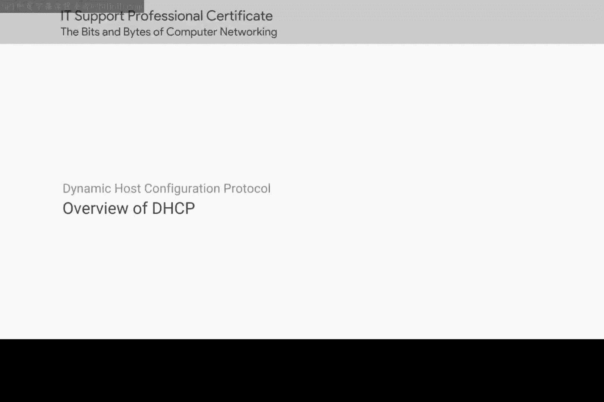

在本节课中，我们将学习动态主机配置协议（DHCP）。DHCP是网络管理中一个至关重要的协议，它能自动为网络上的设备分配IP地址和其他网络配置信息，从而极大地简化了网络管理员的工作。

## 网络配置的挑战

管理网络上的主机可能是一项艰巨且耗时的任务。在现代基于TCP/IP的网络中，每台计算机至少需要配置四样东西：一个IP地址、本地网络的子网掩码、一个主网关和一个名称服务器。单独来看，这四样东西似乎不多，但当您需要在数百台机器上配置它们时，就会变得非常繁琐。

在这四样东西中，有三样在网络上的每个节点上很可能都是相同的：子网掩码、主网关和DNS服务器。但最后一项——IP地址，在网络上的每个节点上都必须不同。这可能需要大量复杂的配置工作。

## DHCP的引入

这正是DHCP（动态主机配置协议）发挥作用的地方。DHCP是IT支持专家在排除网络故障时必须了解的关键知识。

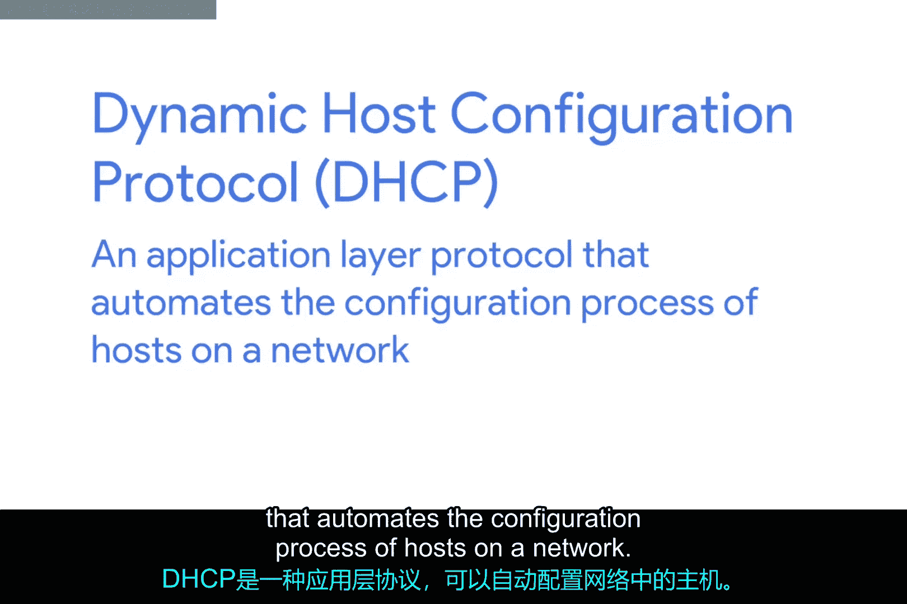

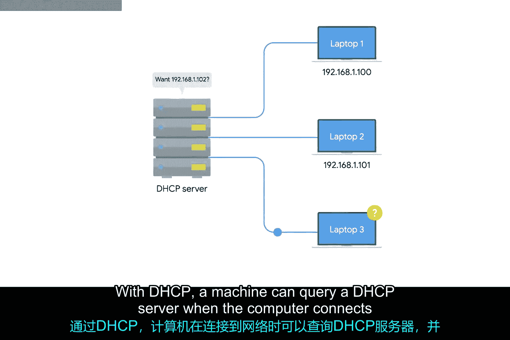

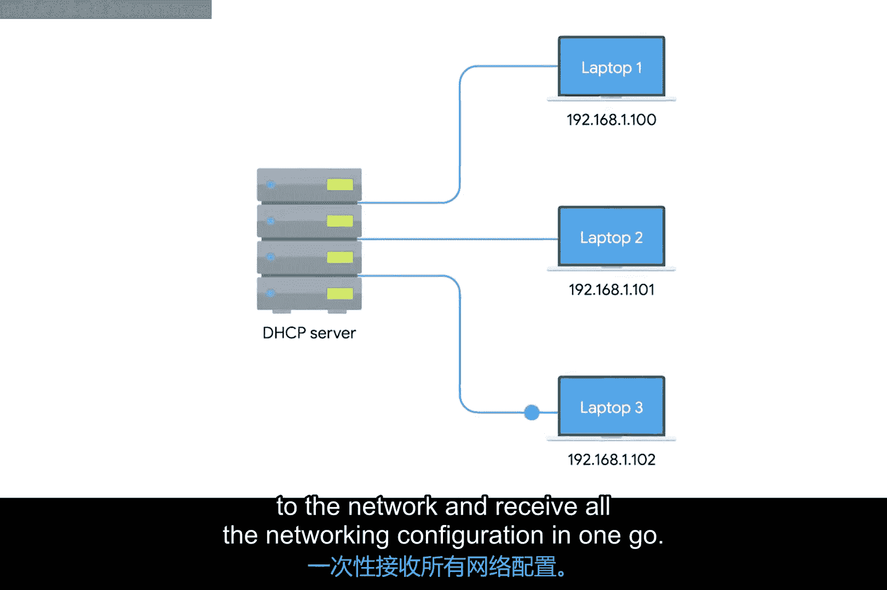

DHCP是一个应用层协议，它自动化了网络上主机的配置过程。有了DHCP，计算机在连接到网络时可以向DHCP服务器查询，并一次性接收所有网络配置信息。

DHCP不仅减少了在单个网络上配置大量网络设备的管理开销，还有助于解决必须为哪台机器分配哪个IP地址的问题。

## 静态IP与动态IP

网络上的每台计算机都需要一个IP地址来进行通信，但其中很少有计算机需要一个众所周知的IP地址。

对于网络上的服务器或网络设备（如您的网关路由器），一个静态且已知的IP地址非常重要。例如，网络上的设备需要始终知道其网关的IP地址。如果本地DNS服务器出现故障，网络管理员仍然需要通过其IP地址连接到其中一些设备。如果没有为DNS服务器配置静态IP，就很难连接到它以诊断任何故障问题。

但对于一堆客户端设备，如台式机、笔记本电脑甚至手机，真正重要的是它们拥有正确网络上的一个IP地址，具体是哪个IP地址则不那么重要。

## DHCP的运作方式

使用DHCP，您可以配置一个为这些客户端设备预留的IP地址范围。这确保了这些设备中的任何一个都可以在需要时获得一个IP地址，同时解决了必须维护网络上每个节点及其对应IP地址列表的问题。

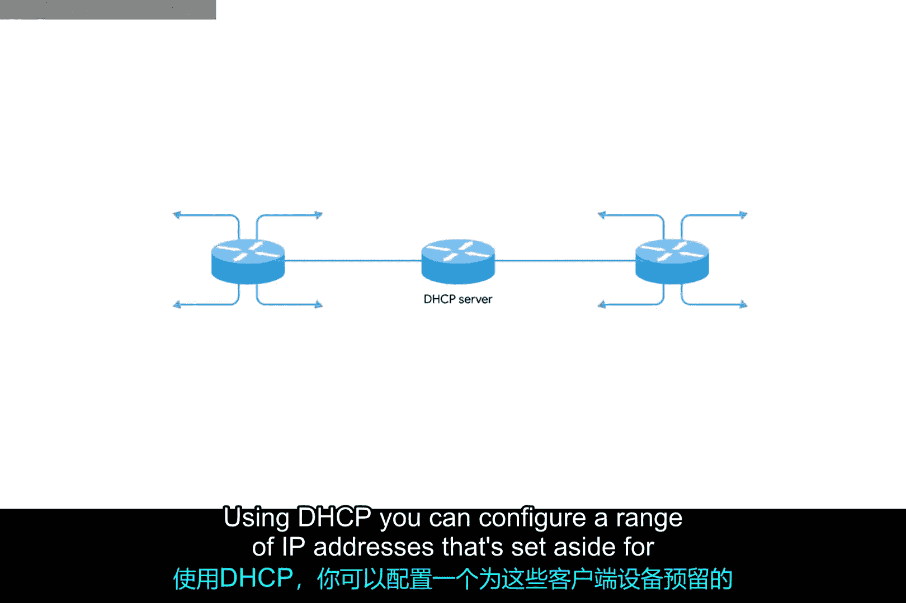

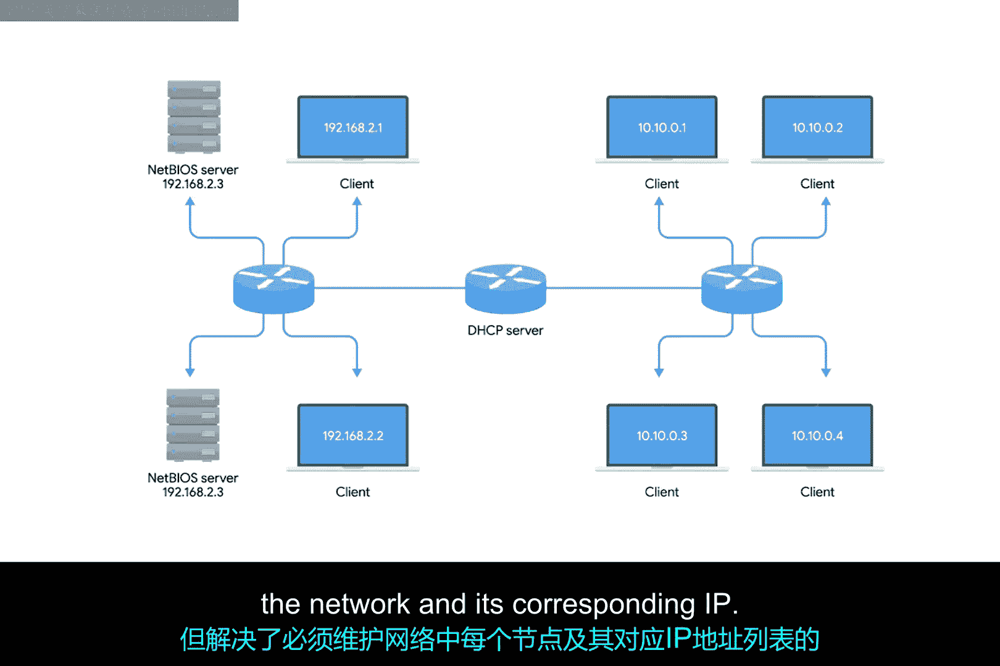

以下是DHCP可以运作的几种标准方式：

### 动态分配

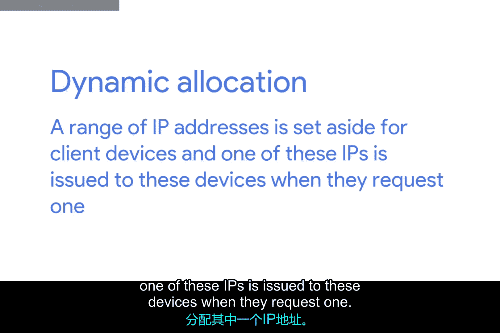

DHCP动态分配是最常见的方式，其运作方式正如我们刚才所描述的：为客户端设备预留一个IP地址范围，当这些设备请求时，将其中一个IP地址分配给它们。

在动态分配下，计算机的IP地址几乎每次连接到网络时都可能不同。

### 自动分配

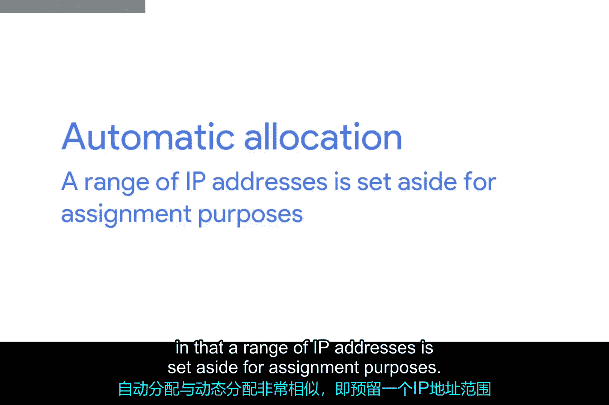

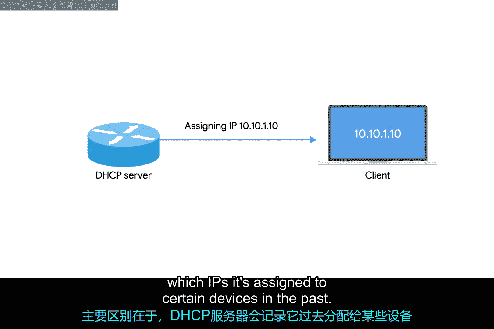

自动分配与动态分配非常相似，也是预留一个IP地址范围用于分配。主要区别在于，DHCP服务器被要求记录过去它曾将哪些IP地址分配给了哪些设备。

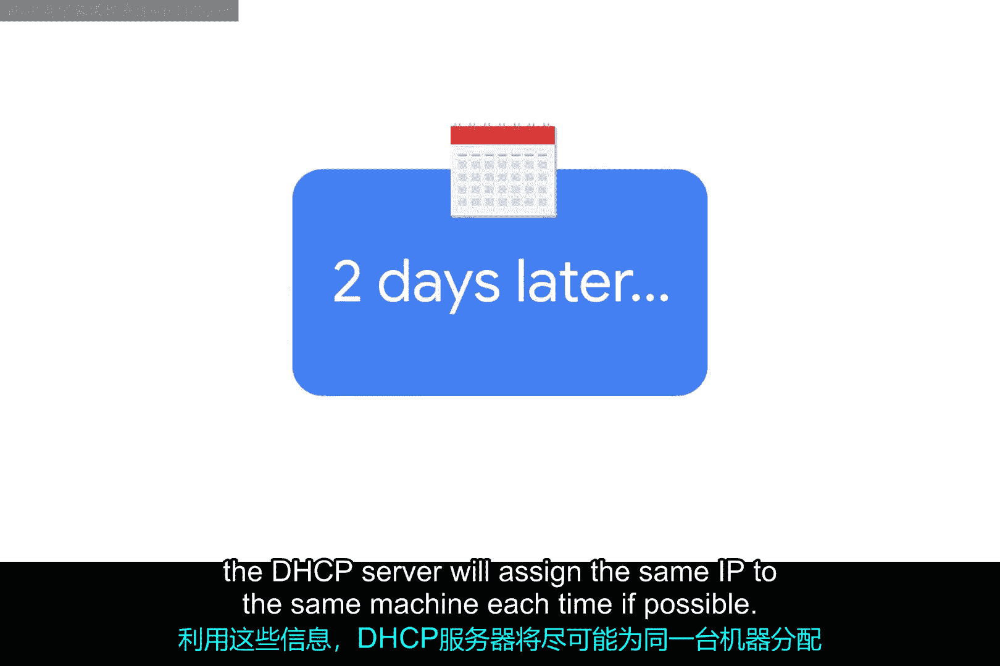

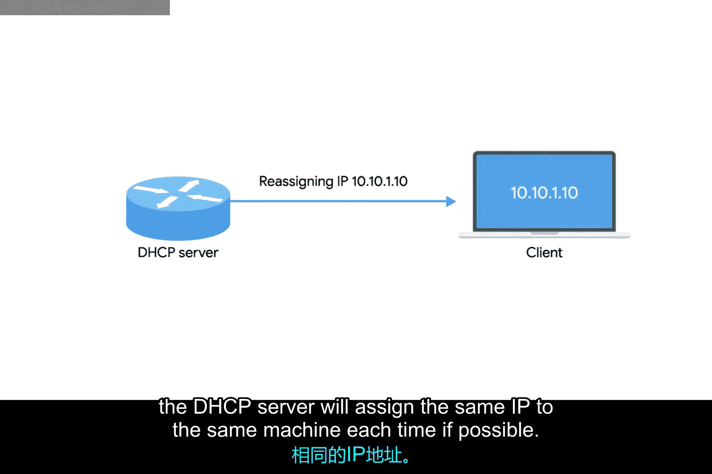

利用这些信息，DHCP服务器在可能的情况下，每次都会将相同的IP地址分配给同一台机器。

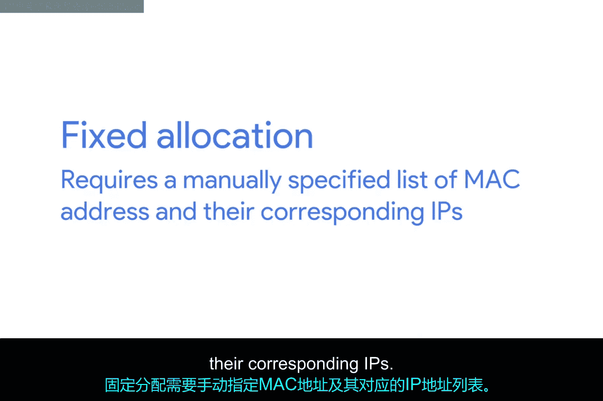

### 固定分配

最后，还有一种称为固定分配的方式。固定分配需要一个手动指定的MAC地址及其对应IP的列表。

当计算机请求IP时，DHCP服务器会在表中查找其MAC地址，并分配与该MAC地址对应的IP。如果未找到MAC地址，DHCP服务器可能会回退到自动或动态分配，或者可能完全拒绝分配IP。这可以作为一种安全措施，确保只有那些MAC地址已在DHCP服务器上专门配置过的设备才能获得IP并在网络上通信。

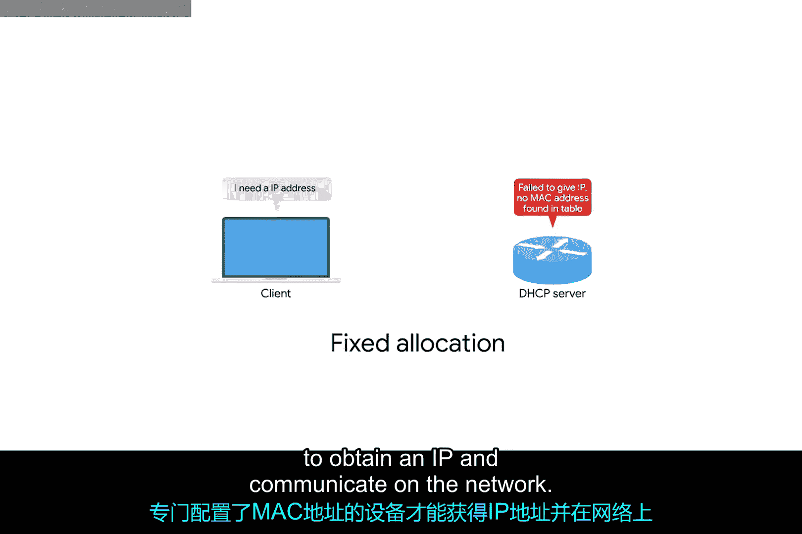

## DHCP的扩展功能

值得注意的是，DHCP发现可用于配置我们在此处提及的更多内容。除了IP地址和主网关等，您还可以使用DHCP来分配诸如NTP服务器之类的东西。NTP代表网络时间协议，用于保持网络上所有计算机的时间同步。我们将在后续课程中更详细地介绍，但现在只需知道DHCP可以用于比IP、子网掩码、网关和DNS服务器更多的东西。

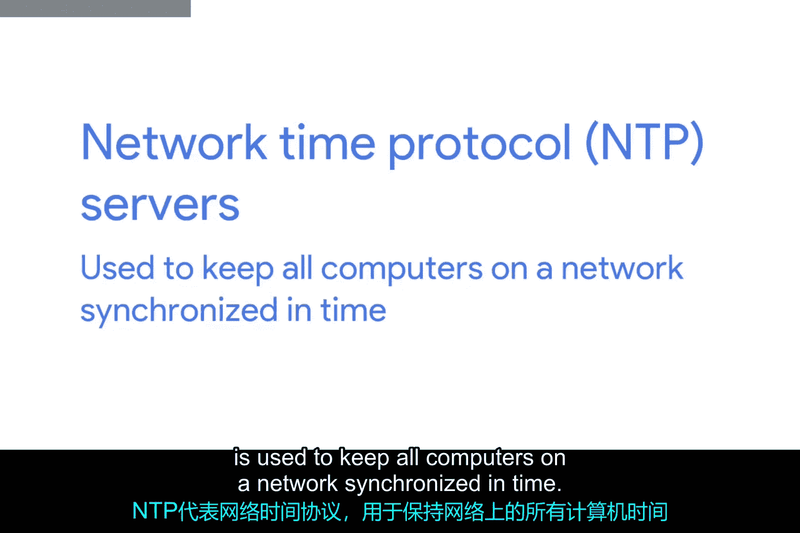

## 总结

本节课中，我们一起学习了动态主机配置协议（DHCP）。我们了解了手动配置网络设备的挑战，以及DHCP如何通过自动分配IP地址、子网掩码、网关和DNS服务器信息来简化这一过程。我们还探讨了DHCP的三种主要分配方式：动态分配、自动分配和固定分配，并简要提及了DHCP的其他功能，如分配NTP服务器。掌握DHCP对于有效管理和排除网络故障至关重要。