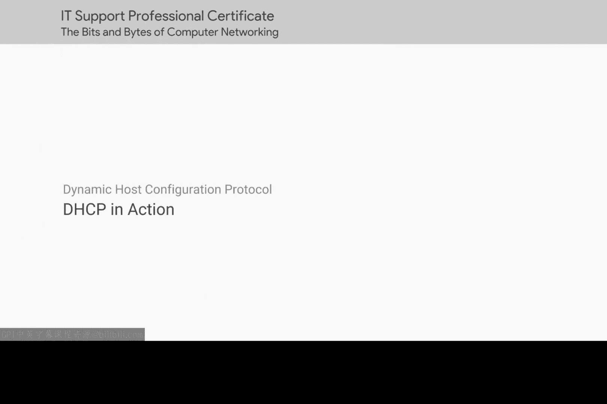
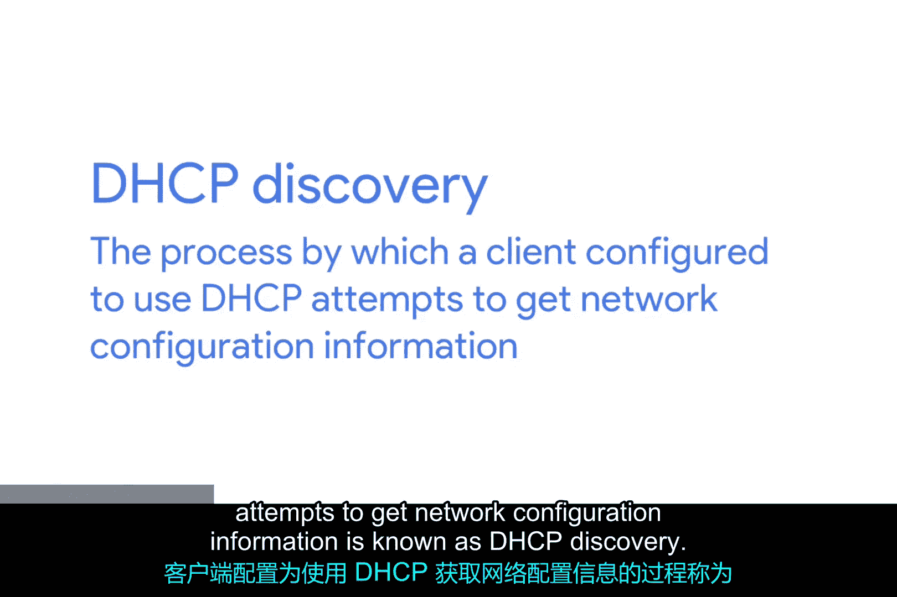
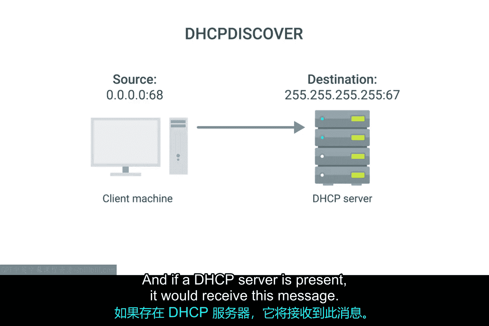
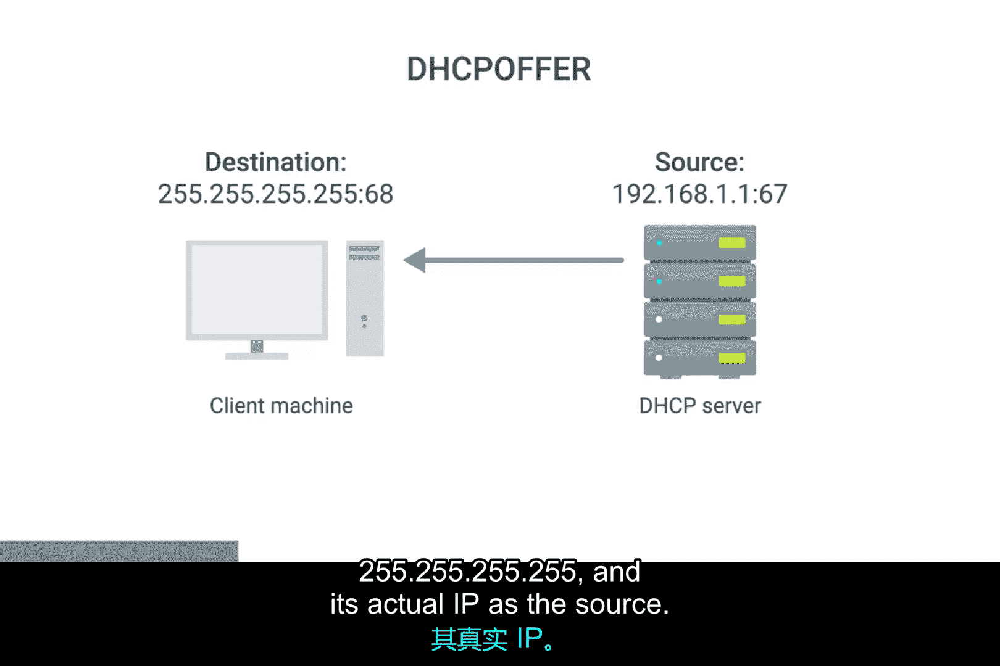
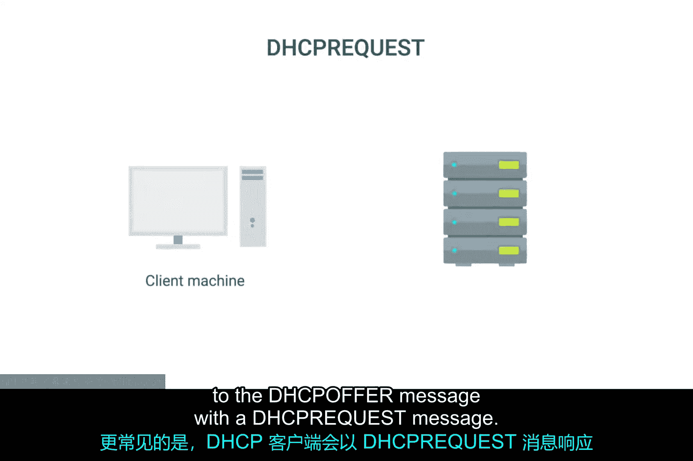
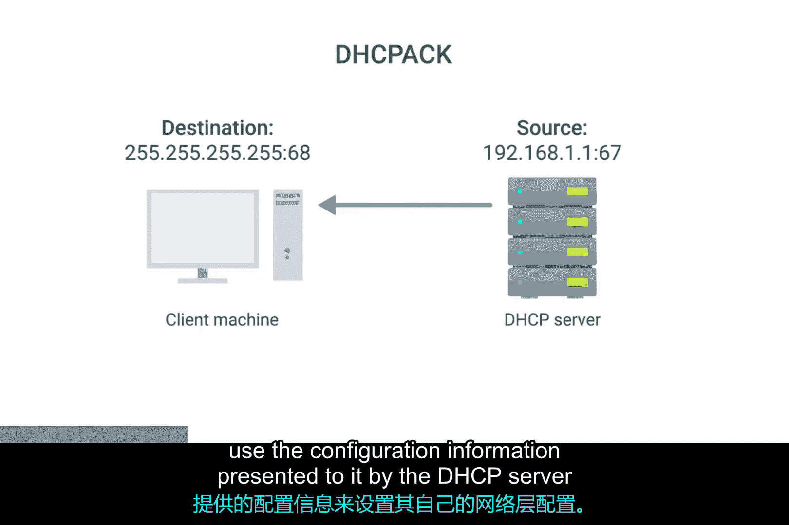

# 055：DHCP实战详解 🌐

在本节课中，我们将深入探讨DHCP（动态主机配置协议）的实际工作流程。DHCP是一种应用层协议，这意味着它依赖于传输层、网络层、数据链路层和物理层来运行。但你可能已经注意到，DHCP的核心目的正是帮助配置网络层本身。本节将详细解析DHCP如何在网络层配置尚未就绪的情况下完成通信。

## DHCP发现过程概述

DHCP发现过程是客户端获取网络配置信息的关键步骤。整个过程包含四个主要阶段，我们将逐一进行解析。

以下是DHCP发现过程的四个步骤：

1.  **服务器发现**：DHCP客户端向网络发送DHCP发现消息。
2.  **IP地址提供**：DHCP服务器响应，提供一个可用的IP地址。
3.  **IP地址请求**：客户端接受提供的IP地址，并向服务器发送请求。
4.  **请求确认**：服务器确认请求，完成IP地址分配。

## 第一步：服务器发现

上一节我们概述了DHCP的四个步骤，本节中我们来看看第一步——服务器发现的具体细节。

由于客户端机器没有IP地址，也不知道DHCP服务器的IP地址，因此它会构造一个特殊的广播消息，即DHCP发现消息。DHCP协议在UDP端口67上监听，而DHCP发现消息总是从UDP端口68发出。

因此，DHCP发现消息被封装在一个目标端口为67、源端口为68的UDP数据报中。这个UDP数据报又被封装在一个目标IP为`255.255.255.255`（广播地址）、源IP为`0.0.0.0`的IP数据报内。这条广播消息会被发送到局域网上的每一个节点，如果存在DHCP服务器，它就会收到这条消息。

## 第二步：IP地址提供

在服务器发现之后，DHCP服务器会检查自身的配置，并决定向客户端提供哪个IP地址（如果有的话）。这个决定取决于服务器是配置为动态分配、自动分配还是固定地址分配。

服务器的响应会以DHCP提供消息的形式发送。该消息的目标端口是68，源端口是67，目标IP是广播地址`255.255.255.255`，源IP则是DHCP服务器自身的实际IP地址。

由于DHCP提供消息也是广播，它会到达网络上的每一台机器。原始客户端会识别出这条消息是发给自己的，因为DHCP提供消息中包含一个指定了发送DHCP发现消息的客户端MAC地址的字段。客户端机器随后会处理这条DHCP提供消息，查看服务器提供了哪个IP地址。

## 第三步：IP地址请求

在收到IP地址提供后，客户端通常会接受这个提议。从技术上讲，DHCP客户端可以拒绝这个提议。例如，同一网络上可能运行着多个DHCP服务器，客户端可能被配置为只接受特定范围内的IP地址，但这种情况比较少见。

更常见的情况是，DHCP客户端会用一条DHCP请求消息来回应DHCP提供消息。这条消息本质上是在说：“是的，我想接受你提供给我的IP地址。”由于IP地址尚未被正式分配，这条消息的源IP仍然是`0.0.0.0`，目标IP仍然是广播地址`255.255.255.255`。

## 第四步：请求确认

最后，DHCP服务器收到DHCP请求消息，并用一条DHCP确认消息进行响应。这条消息同样发送到广播IP`255.255.255.255`，源IP对应DHCP服务器的实际IP地址。

同样，客户端会通过消息字段中包含的自身MAC地址来识别这条消息是发给自己的。此时，客户端计算机的网络协议栈就可以使用DHCP服务器提供的配置信息来设置自己的网络层配置了。

## DHCP租约与生命周期

至此，作为DHCP客户端的计算机应该已经获得了在其所连接网络上完全运行所需的所有信息。所有这些配置被称为**DHCP租约**，因为它包含一个过期时间。

一个DHCP租约可能持续数天，也可能只有很短的时间。一旦租约到期，DHCP客户端就需要通过重新执行整个DHCP发现过程来协商一个新的租约。客户端也可以向DHCP服务器释放其租约，这通常在它断开网络连接时进行。这将允许DHCP服务器将分配出去的IP地址返回到其可用IP地址池中。

## 总结

本节课中，我们一起学习了DHCP协议的实际工作流程。我们详细解析了DHCP发现的四个步骤：服务器发现、IP地址提供、IP地址请求和请求确认。我们还了解了DHCP租约的概念及其生命周期管理。掌握DHCP的工作原理，对于理解和维护网络自动配置至关重要。