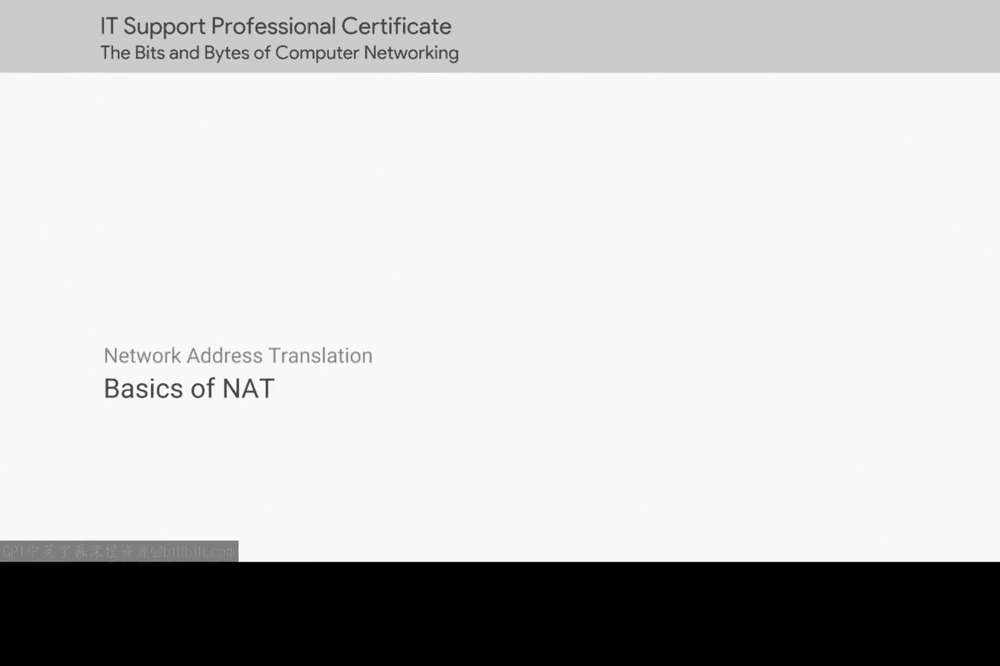
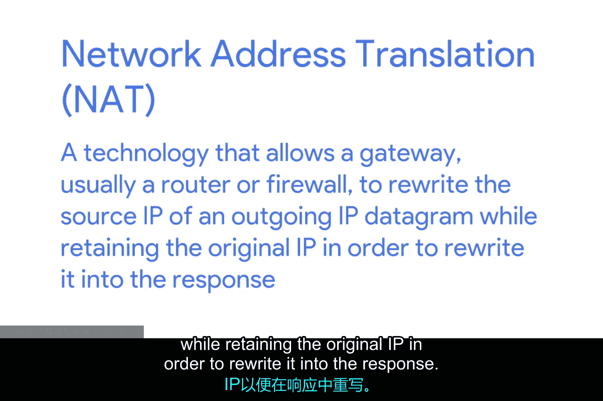
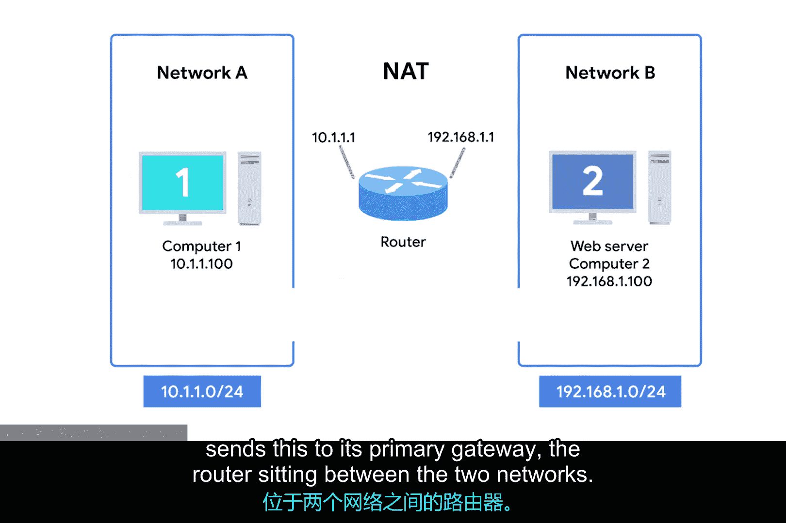
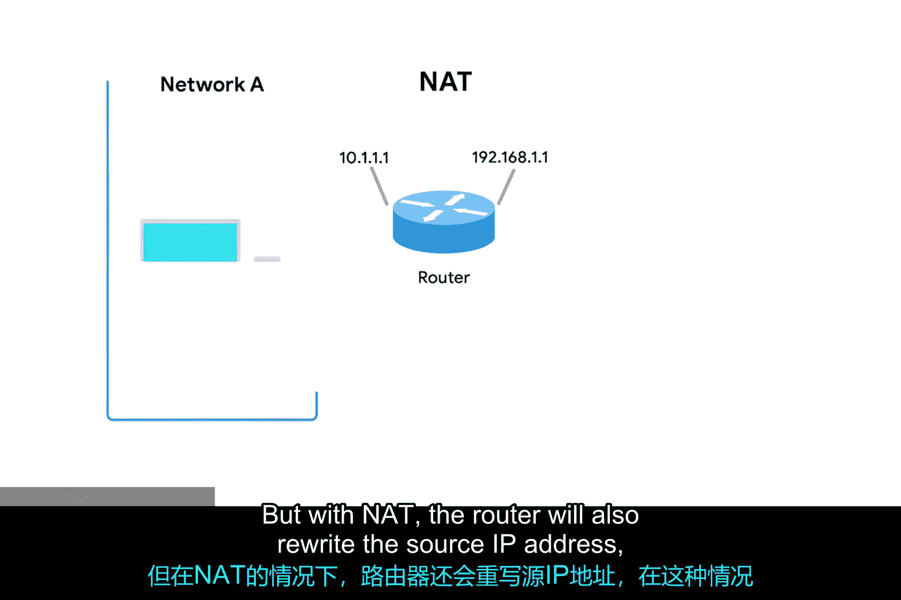
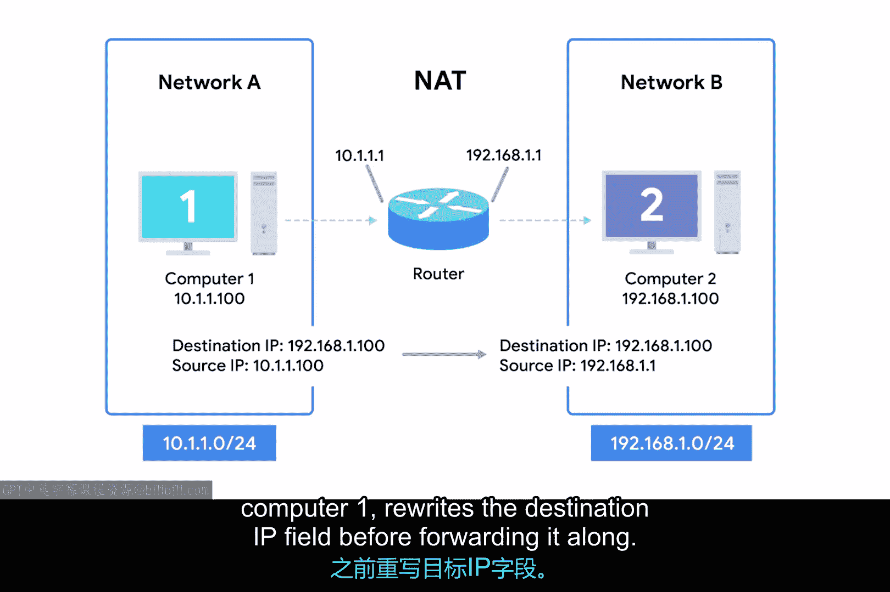

# 056：NAT基础 🧭

在本节课中，我们将要学习网络地址转换（NAT）的基本概念和工作原理。NAT是一种重要的网络技术，它不仅能帮助节约IP地址资源，还能为内部网络提供一层安全保护。我们将通过简单的例子，了解NAT如何运作，以及它在实际网络环境中的应用。

---

## 什么是NAT？ 🔄

上一节我们介绍了DHCP和DNS等协议，本节中我们来看看NAT。与DNS和DHCP这类定义明确的标准协议不同，网络地址转换（NAT）更像是一种技术，而非一个严格的标准。

这意味着，我们本节课讨论的内容可能比其他主题更偏向于高层概念。不同的操作系统和网络硬件厂商对NAT的具体实现方式各不相同，但其达成的目标概念是基本一致的。

网络地址转换，顾名思义，就是将一个IP地址转换成另一个IP地址。

## 为何需要NAT？ 🛡️

以下是实施NAT的几个主要原因：

*   **安全防护**：NAT可以隐藏内部网络设备的真实IP地址。
*   **节约IPv4地址空间**：NAT有助于缓解有限的公共IPv4地址资源紧张的问题。我们将在本节课稍后部分讨论NAT与IPv4地址空间的关系。

现在，让我们先聚焦于NAT本身的工作原理，以及它如何为网络提供额外的安全措施。

## NAT如何工作？ ⚙️

在最基本的层面上，NAT是一种允许网关（通常是路由器或防火墙）重写出站IP数据报源IP地址的技术。网关会保留原始IP地址，以便在收到响应时能正确地将数据重写并转发回原始设备。

为了更好地解释这一点，我们来看一个简单的NAT示例。

假设我们有两个网络：
*   **网络A**：使用 `10.1.1.0/24` 地址空间。
*   **网络B**：使用 `192.168.1.0/24` 地址空间。

在这两个网络之间有一台路由器，它在网络A的接口IP是 `10.1.1.1`，在网络B的接口IP是 `192.168.1.1`。

现在，我们在这些网络上放置两台计算机：
*   **计算机1** 在网络A上，IP地址为 `10.1.1.100`。
*   **计算机2** 在网络B上，IP地址为 `192.168.1.100`。

计算机1希望与计算机2上的一个Web服务器通信，因此它在所有网络层构建了适当的数据包，并将其发送到它的主网关，即位于两个网络之间的路由器。

## NAT的处理过程 📦

到目前为止，这很像我们之前的许多示例。但在本例中，路由器被配置为对所有出站数据包执行NAT。

通常情况下，路由器会检查IP数据报的内容，将生存时间（TTL）减1，重新计算校验和，然后在网络层转发其余数据而不做改动。

但是，在启用NAT的情况下，路由器还会**重写源IP地址**。在本例中，源IP地址被改写为路由器在网络B上的IP地址，即 `192.168.1.1`。

当数据报到达计算机2时，看起来它像是源自路由器，而不是计算机1。

现在，计算机2构建其响应数据包并将其发送回路由器。路由器知道这个流量实际上是发送给计算机1的，因此在转发之前，它会**重写目的IP字段**。

## IP伪装与安全 🎭

在这个例子中，NAT所做的是向计算机2隐藏计算机1的IP地址。这被称为 **IP伪装**。

IP伪装是一个重要的安全概念。这里最基本的概念是：如果外部设备不知道你计算机的IP地址，它们就无法与之建立连接。

通过使用我们刚刚描述的方式，我们实际上可以在网络A上拥有数百台计算机。对于外部世界（网络B）来说，它们所有的IP地址都被路由器转换成了路由器自己的IP地址。整个网络A的地址空间都受到了保护并且不可见。这被称为 **一对多NAT**。如今，你在许多局域网中都能看到它的应用。

---

本节课中我们一起学习了网络地址转换（NAT）的基础知识。我们了解到NAT是一种将私有IP地址转换为公共IP地址（或反之）的技术，它不仅能有效节约宝贵的IPv4地址资源，还能通过IP伪装为内部网络设备提供一层重要的安全屏障。理解NAT是掌握现代网络，尤其是局域网与互联网如何交互的关键一步。