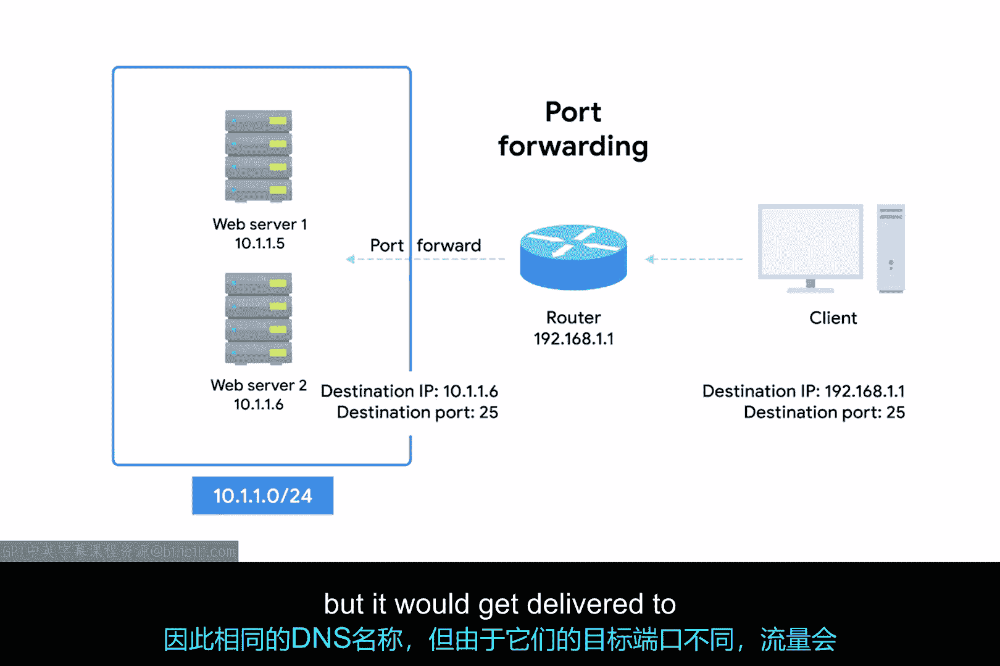
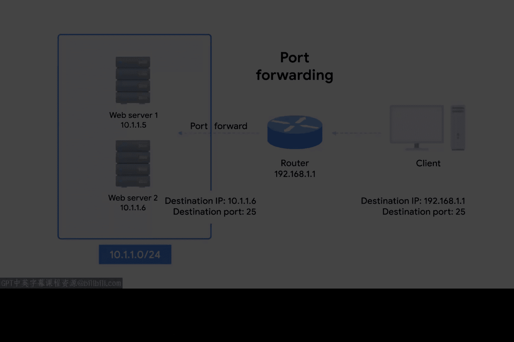

# 057：NAT与传输层

在本节课中，我们将要学习网络地址转换在传输层的工作原理。我们将探讨当数据包从内部网络发往外部网络时，路由器如何管理复杂的连接映射，特别是当多个内部设备共享一个外部IP地址时。我们将重点介绍两种关键技术：端口保持和端口转发。

## 概述

网络层的NAT相对容易理解，一个IP地址通过一个设备（通常是路由器）被转换为另一个IP地址。但在传输层，情况会变得更加复杂，需要运用多种额外技术来确保一切正常工作。

## 端口保持技术

上一节我们介绍了网络层NAT的基本概念，本节中我们来看看传输层如何处理多对一的连接映射。我们曾讨论过成百上千台计算机如何通过NAT将其出站流量转换为单个IP地址。当流量是出站时，这很容易理解，但一旦涉及返回流量，情况就变得复杂一些。

我们现在可能有数百个响应都指向同一个IP地址，而位于该IP地址的路由器需要弄清楚哪些响应应该发送给哪台计算机。

以下是实现这一点的最简单方法——端口保持：

*   **原理**：端口保持是一种技术，即客户端选择的源端口与路由器使用的端口保持一致。
*   **端口选择**：请记住，出站连接会从临时端口（即49152到65535范围内的端口）中随机选择一个源端口。
*   **工作流程**：在最简单的设置中，配置了NAT出站流量的路由器会记录这个源端口是什么，并用它将流量引导回正确的计算机。

让我们通过一个例子来理解这个过程：

1.  假设一台IP地址为`10.1.1.100`的设备想要建立一个出站连接，操作系统的网络协议栈为此连接选择了端口`51300`。
2.  当这个出站连接到达路由器时，路由器执行网络地址转换，将其自身的IP地址放入IP数据报的源地址字段。
3.  但是，它保持TCP数据报中的源端口不变，并将此数据（内部IP与端口号的映射）存储在内部的一个表中。
4.  现在，当流量返回到路由器的`51300`端口时，它就知道这些流量需要被转发回IP地址`10.1.1.100`。

尽管临时端口的范围很大，但网络上的两台不同计算机仍有可能在同一时间选择相同的源端口。当这种情况发生时，路由器通常会随机选择一个未使用的端口来代替。

## 端口转发技术

关于NAT和传输层的另一个重要概念是端口转发。端口转发是一种可以配置特定目标端口，使其流量总是被传递到特定内部节点的技术。这种技术允许完全的IP伪装，同时仍能让服务响应传入的流量。

让我们再次使用我们的网络`10.1.1.0/24`来演示这一点。

假设有一台配置了IP地址为`10.1.1.5`的Web服务器。通过端口转发，外界甚至无需知道这个内部IP。潜在的Web客户端只需要知道路由器的外部IP，假设是`192.168.1.1`。

任何指向`192.168.1.1`的`80`端口的流量都会自动被转发到`10.1.1.5`。响应流量中的源IP会被重写，看起来像是路由器的外部IP。

这种技术不仅允许IP伪装，还简化了外部用户与同一组织运行的众多服务交互的方式。

让我们设想一家公司，它同时拥有一台Web服务器和一台邮件服务器，都需要对外界可访问，但它们运行在不同IP地址的不同服务器上。假设Web服务器的IP是`10.1.1.5`，邮件服务器的IP是`10.1.1.6`。

通过端口转发，访问这两种服务的流量都可以指向同一个外部IP（以及同一个DNS域名），但由于目标端口不同（例如Web用80，邮件用25或587），流量会被传递到完全不同的内部服务器。

## 总结

本节课中我们一起学习了NAT在传输层的运作机制。我们了解到，当多台内部设备共享一个外部IP时，路由器通过**端口保持**技术跟踪内部设备的源端口，以正确地将返回流量定向。同时，通过**端口转发**技术，路由器可以根据目标端口号，将外部对单一IP的访问请求精确地分发到内部不同的服务器上。这两种技术共同确保了在IP地址转换和共享的情况下，网络通信依然能够准确、高效地进行。