# 058：NAT、不可路由地址空间与IPv4的局限 🌐

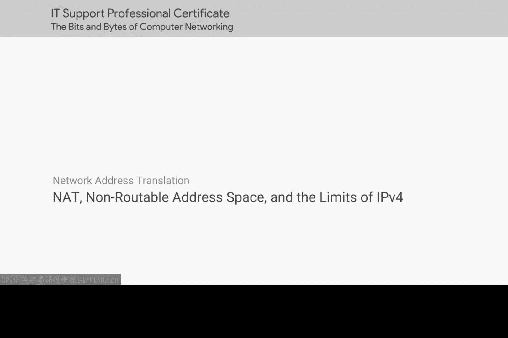

在本节课中，我们将要学习IPv4地址耗尽这一重大挑战，以及网络地址转换（NAT）和不可路由地址空间如何作为关键的临时解决方案。我们将了解全球IP地址的分配机制，并探讨IPv4的局限性。

## 全球IP地址的分配与耗尽

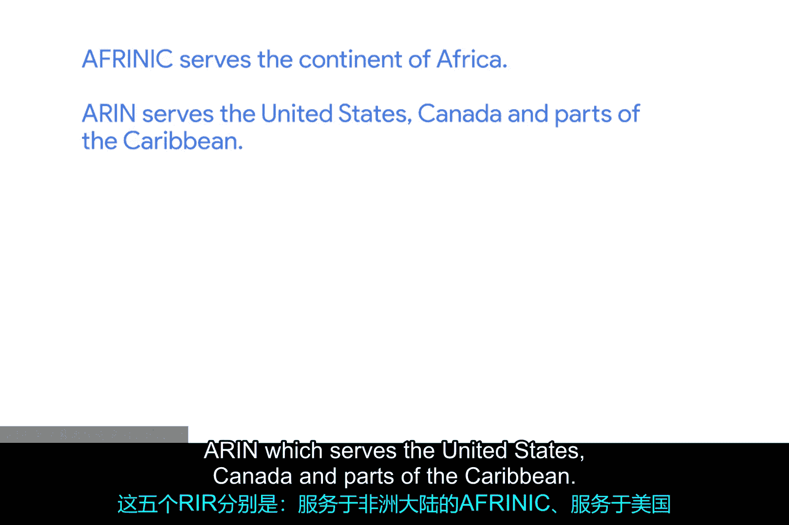

自1988年以来，互联网号码分配机构（IANA）一直负责分配IP地址。在此期间，互联网以惊人的速度扩张。长久以来，人们预测42亿个可能的IPv4地址将被耗尽，而如今这一情况几乎已成现实。

一段时间以来，IANA的主要职责是向五个区域互联网注册管理机构（RIRs）分配地址块。这五个RIR分别是：
*   **AFRINIC**：服务于非洲大陆。
*   **ARIN**：服务于美国、加拿大和部分加勒比地区。
*   **APNIC**：负责亚洲大部分地区、澳大利亚、新西兰和太平洋岛国。
*   **LACNIC**：覆盖中美洲、南美洲以及ARIN未覆盖的加勒比地区。
*   **RIPE NCC**：服务于欧洲、俄罗斯、中东和中亚部分地区。

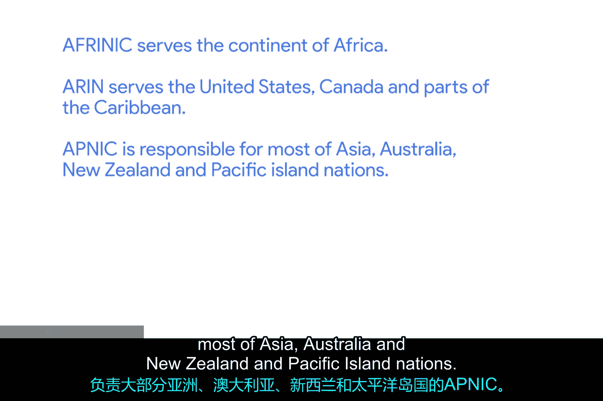

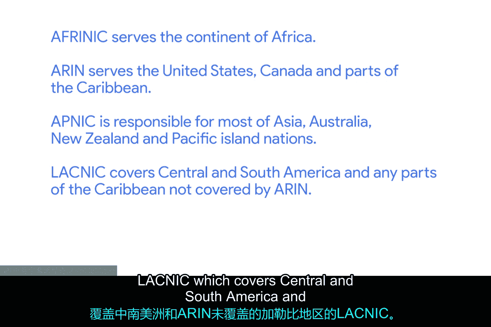

这五个RIR负责向其地理区域内的组织分配IP地址块，而其中大多数RIR的地址已经耗尽。2011年2月3日，IANA将最后未分配的/8网络块分配给了各个RIR。

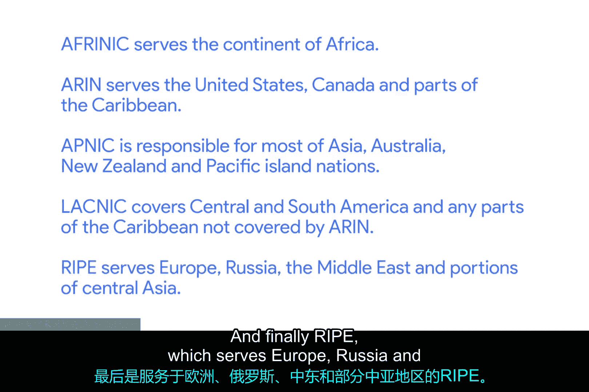

以下是各RIR地址耗尽的时间线：
*   2011年4月，APNIC的地址耗尽。
*   2012年9月，RIPE NCC紧随其后。
*   2014年6月，LACNIC的分配地址耗尽。
*   2015年9月，ARIN也宣告地址耗尽。
*   只有AFRINIC尚存部分地址，但预计也将在2018年耗尽。

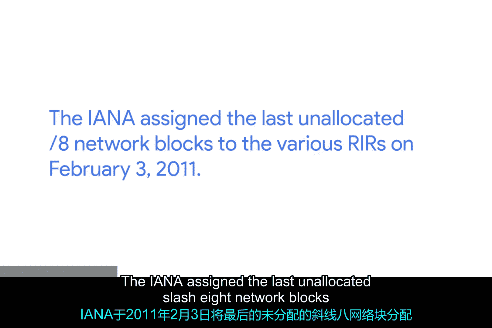

维基百科有一篇关于IPv4地址耗尽及其时间线的优秀文章，视频后的阅读材料中附有其链接。

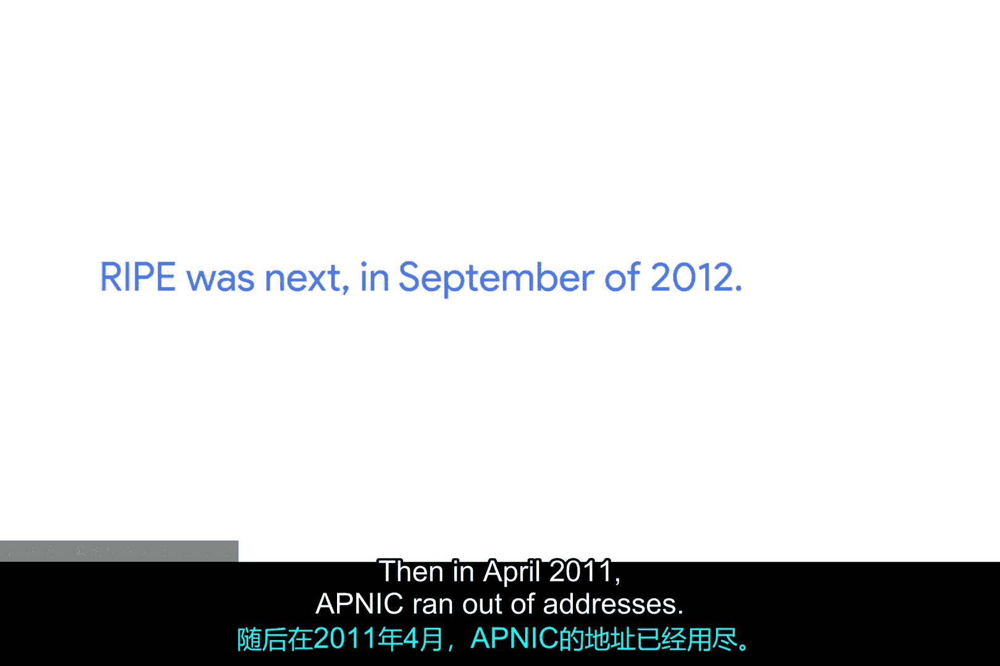

## IPv4的局限与临时解决方案

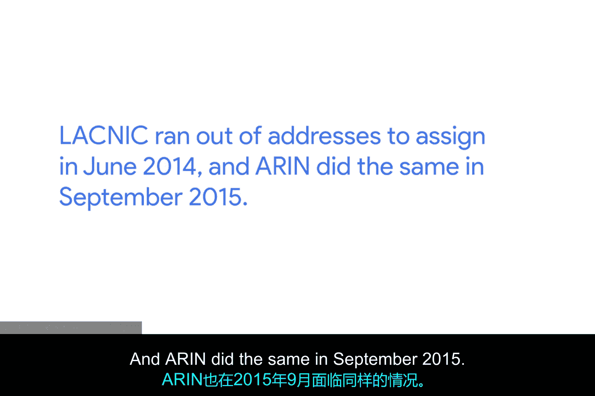

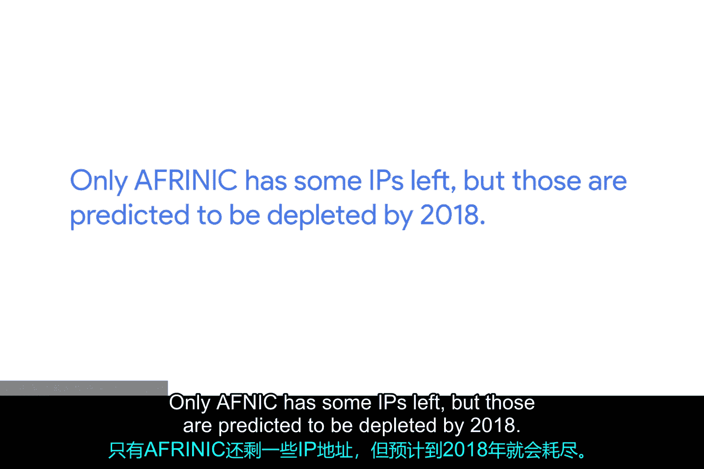

这无疑是互联网面临的一场重大危机。IPv6最终将解决这些问题，我们将在本课程后续部分详细讨论。但在全球范围内实施IPv6尚需时日。目前，我们希望互联网继续发展，希望更多人和设备能够接入，但在没有IP地址可分配的情况下，需要一个变通方案。

好消息是，你已经了解了这个变通方案的主要组成部分：**NAT**和**不可路由地址空间**。

上一节我们看到了IPv4地址的枯竭，本节中我们来看看如何利用现有资源维持网络增长。

不可路由地址空间在RFC 1918中定义，包含几个任何人都可以使用的IP地址范围。由于互联网路由器不会将流量转发到这些地址，因此内部网络可以无限量地使用不可路由地址空间。这意味着当人们使用这些地址空间时，永远不会发生全局性的IP地址冲突。

以下是RFC 1918定义的私有地址范围：
*   `10.0.0.0` - `10.255.255.255` (10.0.0.0/8)
*   `172.16.0.0` - `172.31.255.255` (172.16.0.0/12)
*   `192.168.0.0` - `192.168.255.255` (192.168.0.0/16)

如今，不可路由地址空间之所以能广泛使用，主要得益于NAT等技术。通过NAT，你可以让成百上千台设备使用不可路由地址空间，却只需一个公共IP地址。所有这些计算机仍然可以向互联网发送和接收流量。

你只需要一个IPv4地址，通过NAT，拥有该IP地址的路由器就可以代表其背后的大量计算机。其核心原理是**地址转换**。当内网设备（使用私有IP，如`192.168.1.10`）访问外网时，NAT路由器会将其私有IP和端口号替换为路由器的公共IP和一个新的端口号，并将这个映射关系记录在NAT转换表中。当外部响应返回时，路由器再根据转换表将数据包转发回正确的内网设备。

这不是一个完美的解决方案，但在IPv6更广泛可用之前，不可路由地址空间和NAT技术必须承担起支撑互联网继续发展的重任。

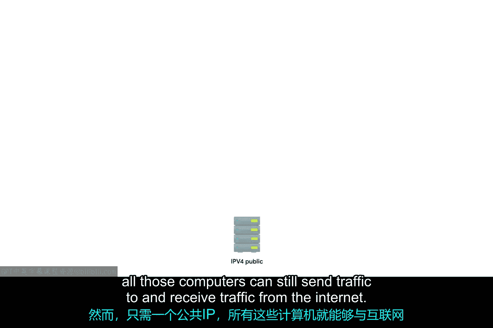

## 总结

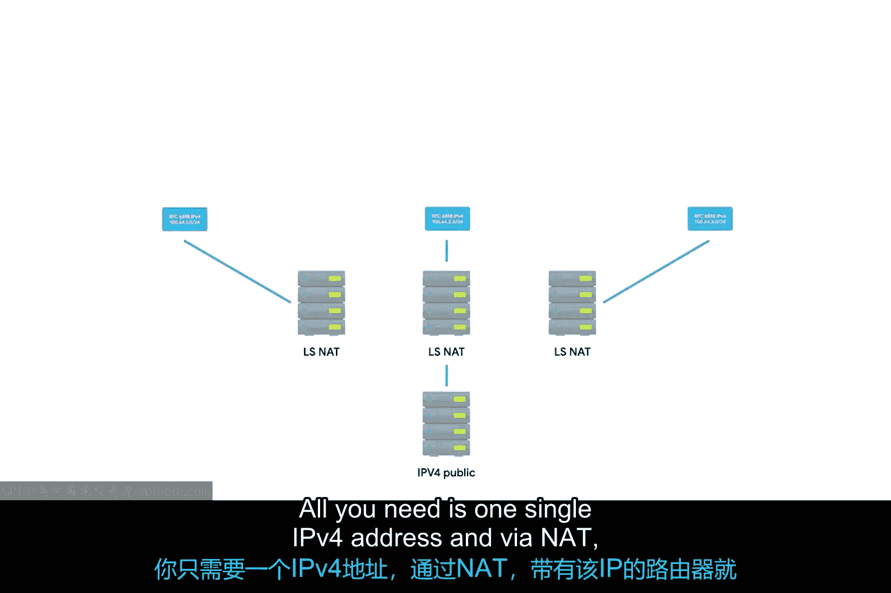

本节课中我们一起学习了IPv4地址的分配与耗尽危机，了解了全球五大区域互联网注册管理机构的角色及其地址耗尽的时间线。面对这一局限，我们深入探讨了关键的临时解决方案：**不可路由地址空间（RFC 1918）** 和**网络地址转换（NAT）**。正是这两项技术，使得我们能够在公共IPv4地址极度稀缺的情况下，继续连接海量的设备到互联网，为向IPv6的最终过渡赢得了宝贵时间。